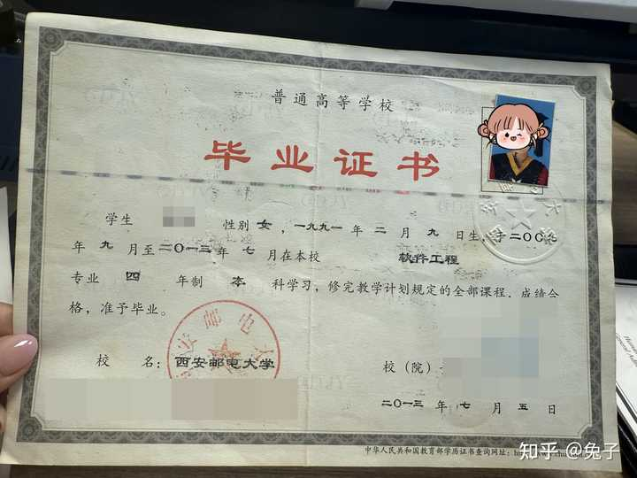
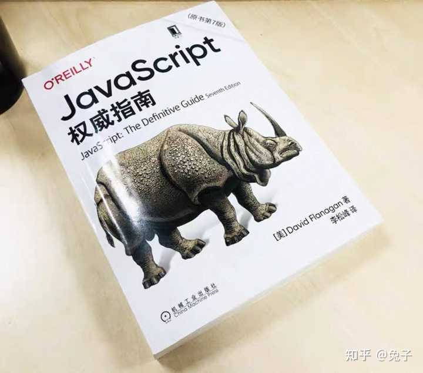
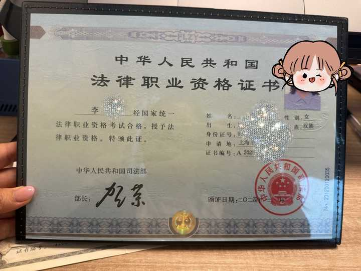
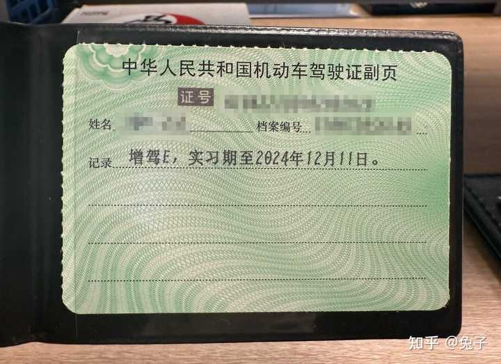
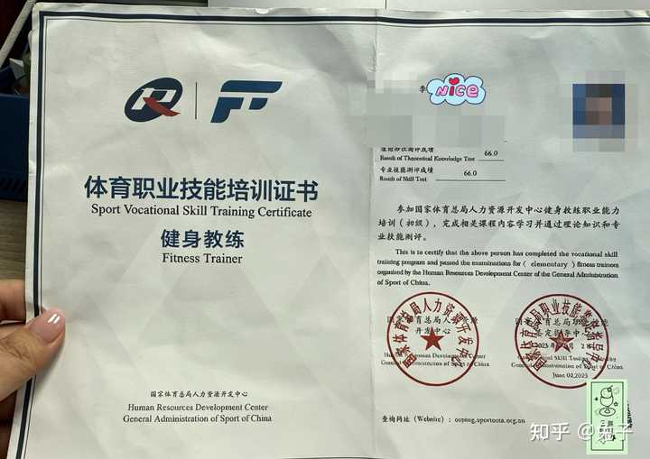
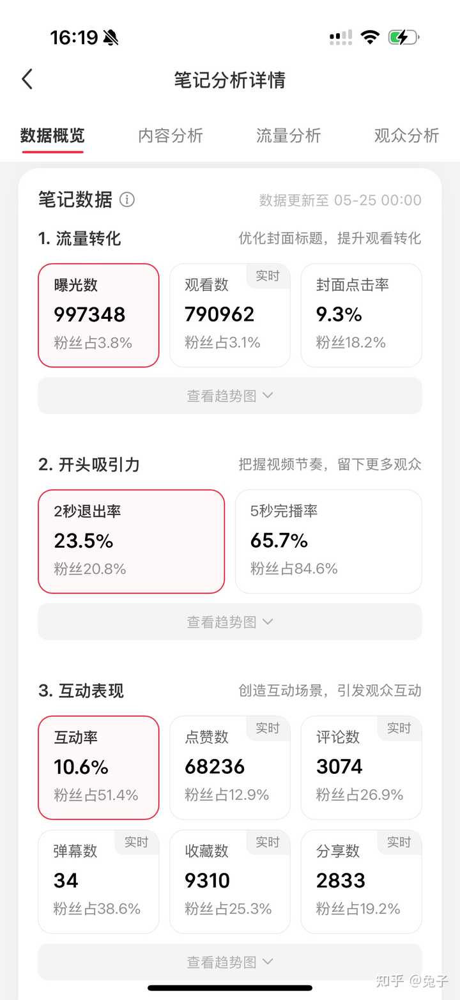
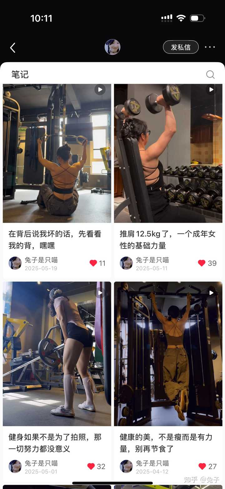

> 作者：兔子　|　赞同 236　|　评论 102　|　[原文](https://www.zhihu.com/question/2043990660999542252/answer/2075586959305715935)

35 岁，程序员，销售，健身教练，律师助理，实习律师，最后到执业律师。

把这些职业排成一排，你会怎么想？毫无关联？东一榔头西一棒子？

这篇写给自己转行的这三年，也写给 30 岁出头，在职业焦虑里反复纠结的同龄人。如果你也在问"还来得及吗"，我的故事，可以作为参考。

故事，得从十多年前说起。

## 第一节·一个程序员的十年

2009 年 6 月，高考结束，我报了计算机系。

2013 年 7 月，顺利毕业，进互联网公司，做前端程序员。

此后整整九年。2013 到 2022，我在各个 IT 公司之间辗转，写代码。朝 9 晚 11，改需求，上版本，追线上 bug——这是大多数人印象里的"程序员"，也是我生活的全部。

如果不出意外，我大概会一直这样写下去。写到头发稀疏，写到 35 岁被送进"优化名单"。

> 但那九年，我连"意外"都没有。

做程序员的这几年，一直觉得自己飘着。没有学习动力，没有目标。同事开需求会吵得激烈，我脑袋空空，不明白他们到底在吵什么——上个班而已，至于吗？

每天机械地上下班，完成任务。没有思想，没有追求，不在乎 KPI。工作了半年，对面同事叫什么名字我都不知道。

业绩不好，裁员了。无所谓。拿着补偿金，去下一家继续发呆，像一个没有情绪的空心人。

那本《JavaScript 权威指南》，是入职第一家公司的时候领导送的。十年后我转行，那本书才只翻到第二章。

## 第二节·困惑，与一场法考

2022 年 4 月，因疫情（那段没有饭吃的痛苦回忆又袭击我的大脑了😭），被困在上海，哪都去不了。

人一旦闲下来，就容易想一些"多余"的东西。

我窝在家里刷热搜，刷到很多新闻：关于虐待小动物的，关于社会事件的，关于各种校园事件的。一系列以我朴素的价值观，无法理解的新闻。

我开始困惑。脑子里冒出一堆疑

问：秩序？法律？道德？边界？

我是执行力特别高的那种人。脑子里有了❓号，就想知道答案。

于是开始搜索各种知识，开始注意法律条文，到最后开始学习。好像脑子里有问号的时候，人就会去思考、去学习。那段出不了门的日子，除了抢菜，就是啃法律。

2022 年 6 月，能出门了。立马去拍了证件照。因为政策原因，2018 年入学的非法本，也具备报考资格，所以顺利报名法考。

> 为什么要考这个证？

一开始我并没有转行做律师的想法。报名原因很简单：习惯用考证来检验学习成果，效率和质量都会高一点。

说白了，就是一次"用考试检验学习"的自查。就像有人用笔记验证自己读懂了一本书，我用考试验证自己学会了一门知识。

既然报了名，就得认真对待。我执行力高嘛，就在网上找了免费的视频教程和刷题软件，开始学习了，说做就做。

也照常上班写代码，一边写代码一边戴着耳机听视频，累了就去洗手间坐在马桶上刷会题。下班，继续刷题。周末，也全窝在图书馆。所以其实学习的一大动力就是好奇心。

> 爱与不爱，其实很明显。

那本《JavaScript 权威指南》，工作了十年，才翻到第二章。法考，5 个月，学完了十几本书，8 门课。

> 兴趣和好奇心，是最好的老师。

## 第三节·差一分，与一次"曲线自救"

2022 年 9 月，法考客观题，顺利通过。

原定 10 月的主观题，因为疫情延期到了 23 年3月份左右。多出来的备考时间，又给了我一次补强。

> 但更大的"补强"，来自一次意外。

备考主观题的过程中，公司业务缩减，裁员。刚好，我又在名单上。因祸得福——拿到补偿金，干脆全职备考。

2023 年 3 月，延期的第一次主观题考试。

结果：差 1 分。

就差 1 分。

我盯着成绩单看了很久。然后想明白一件事：我应该缺乏基础的法律思维。

> 找到问题，解决问题就好了。

没有选择"再来一年"。换了一个策略——直接去律所，做销售。

理由很朴素：想在实务里了解真正的法律，想通过与律师、客户的交流，提升自己的法律思维。纸上得来终觉浅，那就去一线。

我做的是电话销售。主观题考的是什么？表达观点，总结信息。那还有什么比打电话接收法律咨询更练这个的？

做了3 个月销售，考试临近 2 个月辞职，全职备考 2 个月。文章后边会具体分享这 3 个月——说实话，那是我进步最快的一段时间，是第一次感觉自己社会化了。

2023 年 9 月，第二次主观题，顺利通过。

等法律资格证的那段时间，正好有空档。因为一直有健身习惯，又花了一个月考了健身教练证，顺便考了摩托车 E 证。

这里多说一句。

如果有一段时间觉得没有信心，或者遇到不顺心的事——比如裁员——可以试试去参加各种考试。难的、简单的、有趣的，都行。

这是很好的提升自信和缓解焦虑的方式，性价比极高，甚至能直接变💰。比如空档期顺手考的健身教练证，后来，也可以直接变💰。

## 第四节·0 offer：市场告诉你，你的过去毫无用处

拿到法律从业资格证后，我开始投简历，找实习律师的岗位。

为什么是实习律师？因为申请律师执照，要在律所实习满一年——硬条件，必须先把一年的实习律师做满，才能申请执业。

问题来了：我不是法学本科出身，也没有法律行业的从业背景。

结果，两个月，简历投出去一大圈——0 offer。

> 0 个。一个都没有。

在互联网时代，一个做了多年的程序员、通过了被公认为最难之一的考试，却连一份实习律师的面试邀约都拿不到。

那种落差，比被裁员还难受。裁员是业务缩减。而 0 offer，是市场在告诉你：你的过去，毫无用处。

怎么办？曲线自救。就又去做了一段时间的销售。

## 几条碎话

如果你问我转行路上最大的感悟是什么，我想说的不是坚持——这些词太大，也太空。我想说的，是两件很小的事。

第一件：走不通的路，别死磕。

找不到实习律师，我就转身去做销售。认识律师，接触案子，攒下资源，做自媒体拍视频做账号。回头看，实习律师的机会不是"找"到的，是"等"到的。与法本竞争没有优势，但可以发挥自己的优势。用自己的优势去参与竞争，得到机会。弱化自己的不足。

不死磕一扇关着的门，先去推旁边那扇开着的。

第二件：考不过的试，别怀疑自己。

法考差 1 分那年，我没有关在房间里刷题。换了个策略：去一线，去实战，直接面对真实的当事人、真实的案子。书本上背三遍记不住的法条，在真实案件里用一次，就刻进骨头里了。

考试没过，不代表不行。可以换一种学习方法。

## 第五节·电话销售：第一天上午，我连话都说不出来

2023 年左右，网推所盛行。很容易地，我去了排名靠前的网推所，做销售。

考核标准很简单粗暴：前 7 天，必须邀约 3 个人到所，否则走人。前两个月，业绩做到 10 万以上，才能转正。

第一天进岗位，是一个小妹妹带我。她告诉我打电话的流程和注意事项，然后组长给了我一个电话名单。

我坐在她旁边，甚至没有自己的工位。名单上面只有电话号码——名字、性别、诉求，通通没有。

开始打电话。结果，每一次对面接通，我就心跳加速，无法沟通。原以为很简单的电话销售，其实根本不简单。

第一天上午，所有接通的电话，卡壳的时候都是旁边的小妹妹把电话拿过去，帮我沟通的。

午休，一起吃饭。她又教了我一些电话沟通的方法。

然后我跟她说：下午，如果我再卡壳，请你不要帮我。卡就卡了。只要对面不挂电话，我就不挂电话。

> 只要对面不挂，我就不挂，想要进步的时候就必须逼自己。

小妹妹说，可以。但她也说，如果我约不到客户，她可以把自己约来的客户挂在我名下，让我先通过 7 天试岗期。因为试岗期的名单都是被淘汰过很多遍的，只有通过试岗，律所才会给最新最优质的名单。让我不要压力太大。

今天写这篇文章的时候，我仍然想感谢这个小妹妹。她是我转行后的第一位老师。

下午，继续打。还是卡壳，但我没有主动挂电话，也没有让别人帮我。

第二天，还是用第一天的办法——只要对面不挂，我就不挂。慢慢开始有了一些简单的沟通。

第二天下午，有一个阿姨接通了电话。不是法律问题，但她好像生活不太开心，一直跟我讲话。我也很认真地陪她聊。

于是，我在第二天，完成了第一通完整的、有来有往的有效沟通。

> 那一刻，我有点信心了。

第三天早上，我很有信心地打电话，甚至有点迫不及待地打电话。下午，顺利约到了客户。

后来的几天都很顺利。7 天的考核，通过了。

## 第六节·公海里捞出的第一单

不到第 7 天，律所给我开通了后台系统，有新的数据资源了。

刚入职，新资源比较少。没有新资源的时候，我就主动在系统里搜索难度比较大的电话去打。

律所给销售用的后台系统，有一个概念，叫"公海"。

公海，就是别人打过的、无效的数据，被丢进去的地方。但这些数据带着标注信息：大概的纠纷，沟通情况，比如"难缠"，比如"客户爱骂人"。

我挑的全是难度最大的，骂人最狠的那一类。故意练自己。

很快，别人骂我，跟我说难听的话，我都习惯了，不再影响情绪。打多了之后，我总结出一个规律：

> 先加量，再加质。

一连几天，都在打公海里的电话。

过了一周，我从公海里捞到一个有效数据——1 年前的。

打电话过去。接电话的是一个阿姨，她说那个纠纷已经解决了。

我正准备挂电话。阿姨又说：她现在有一个新的事情，儿子跟女朋友的经济纠纷。

聊了之后，我加了联系方式。阿姨说，她已经找了社区的人，社区约了双方家长先去调解。

结果调解当天，对方说话很难听，基本快打起来了。社区的人就告诉阿姨，对方太过分了，让她走法律程序。

阿姨当天直接给我打电话，到律所现场，签约了。

这是做销售的第一单。也是我从公海里捞出来的第一单。

签完单子，组长还请我喝了奶茶。

转行后遇到的同事都很好，会帮助我，鼓励我。真的很感谢他们。

做销售那段时间，幸亏有同事的鼓励和帮助，压力没有想象中那么大。但真正让我蜕变的，是克服了对陌生人开口的恐惧。一旦跨过去，就如鱼得水了。

程序员的优势也开始发挥作用——我会复盘，会统计。第一通接通的有效电话，复盘；第一个邀约到所的客户，复盘；第一次签约，复盘。每一次进步，都拆开来看。

数据也要做统计分析。打 200 个电话，一定会签约 1 到 3 个客户，这是规律。后来连打 300 个电话、打了 3 天也没到所，我就知道——不是我的问题，是名单的数据有问题。不死磕，直接找组长换新名单，数据是不会骗人的。

## 第七节·算法+勤奋：第二个月，我的邀约量超过了组长

因为第一单是公海里的数据签的，根据律所给销售分配资源的算法，很快就给了我一些优质数据。

连着签了好几个单子。每签一单，组长都会请喝奶茶🥤。试用期也顺利通过了。

第二个月，我的业绩不是最多的，但我的邀约量比组长还多一个。

> 为什么？

因为电话销售，更多考核的是邀约量，我经常能从公海里捞到有效数据，并邀约到所。邀约量达标，就会优先获得优质数据。第二个月，我的数据也都很好，月底也顺利签单了。

到第二个月，我就基本掌握了电话销售这个岗位。什么样的电话，我都从容应对。有时候同事跟客户吵起来了，我也会把电话拿过来再沟通一下。我经常"捡漏"——别人放弃的数据，我认为有价值，然后跟踪、成交。

邀约量提升，签约量就上来了，自然会有成交，那么收入也就自然上来了。

这份短暂的电话销售工作，是我从程序员转行做律师的一个很重要的节点。后来我做实习律师的时候，跟法院各个部门打电话也非常顺畅，打通率和沟通效率都特别高，别的同事打不通的电话，或者外地的法院只能通过电话解决问题的时候，我也都可以很顺利地沟通并解决。

很多技能，都是靠"量"磨出来的。

> 先有量，才有质。这句话，我到现在都认。

## 第八节·两个女人的泪，和我的辞职

> 那我是什么时候决定放弃这份工作的？

第三个月的一大早，我接到一位女士的电话。

她读初中的女儿，跟同学发生了纠纷。对方的父母，执意要起诉自己的女儿。

我约她到所里来谈。

她带着女儿一起来面谈。那位妈妈，双手一直在发抖，眼里有泪光。

对方的父母约她当天下午 1 点去谈判，时间地点已经发给她。她来律所的时候是上午 11 点——她一个人不敢去谈判，她也不能接受对方真的起诉自己的女儿，让女儿将来出现在法庭上，所以需要找一位律师陪她一起去谈判。

那一个月，我的业绩还差 2 万。

报价的时候，我看得出来，不管我报价多少，她都会付费。

但最后，我还是按照律所规定的最低标准，报了价。

签完合同。

下午，突然下起暴雨，律师堵在路上了。那位妈妈已经到了约好的商场，打电话问我：律师怎么还没来？

我说堵车了，不要着急，先到商场找个地方休息，律师马上就到。

然后，她就开始在电话里骂我。骂得非常难听，但这个时候别人在电话里骂我已经不能影响我的情绪了，我能理智地解决问题。

也或许我能理解。一个妈妈想保护女儿的心情。

所以我全程都在安慰她，并安抚她的情绪，然后告诉她怎么做。

最后，律师赶到，跟对方家长谈好了，签了协议。晚上，这个妈妈在群里发了一段很长的文字，感谢我们所有人。

第二天早上，上班。我直接去找领导辞职了。

领导有点不开心。他说这个月的业绩指标他已经报上去了，我要辞职的话，他就垫底了。他说我"背刺"了他。

其实，我也想多赚点钱。可是我不能接受自己会有"趁人之危想赚钱"的时候。

那天，我看出那个妈妈的急切和恐惧。那几秒钟的犹豫，让我决定辞职。

> 并不想被任何东西裹挟，任何东西都不能左右我的选择。

当我意识到，为了 2 万块的业绩，我已经开始犹豫的时候，我就决定——马上离开。

## 第九节·健身房：一场"曲线自救"

辞职之后，我没有继续在律所工作

也许是因为，仅仅 2 万块就能让我犹豫——我的内心不够坚定，不够有自己的想法，会被业绩绑架——所以我认为那个时候的我不够格去做一个真正的律师。

因为空档期顺便考了健身教练证书，加上自己也有运动的习惯，我就去健身房做了教练。

健身房这段，可以说是我转行路上最舒服的一段时光了。

> 为什么？

因为那三个月的销售经验没有白费：我有运动习惯，有教练证书，我具备销售的能力——又跟健身房的店长学习了一些销售流程和上课经验。

很快，就有了自己的客户。第二个月，约课基本全约满了，月薪过万。

所以，销售是一份可以复用、不挑行业的技能。

健身房的工作时间是下午 1 点到晚上 10 点，所以上午的时间我都在读书学习。下午上课，没有课就自己训练。

这半年，我一边健身，一边学习，一边赚钱，一边思考自己未来的执业规划。有时候下课也会跟各行各业的会员在健身房聊聊天。

那段时间很轻松，也很安逸。但我知道，我迟早要走的。

## 第十节·账号，一个隐藏的身份

在健身房做教练的过程中，我开始尝试拍短视频，做账号。

一开始做的是健身账号，顺便记录自己的健身轨迹。

这个健身账号，后来变成了我的一个"名片"：既可以在网上接到健身客户，也可以很容易地找到健身房教练的工作。包括最后到律所实习，也是因为自己有账号，才拿到实习律师的机会。

在做实习律师的一年半时间里，我又开通了一个法律相关的视频账号，累计粉丝 5 万，做自媒体也是一个特别好的提升自己的渠道，后边再单独分享。

通过不断的提升自己，最后找到了真正的自己。

在健身房工作了大概 6 个多月。第 6 个月的时候，我刷到一家律所在找实习律师，联系后，各方面都合适，就去上班了。

这次的岗位，是实习律师。

> 但说实话，实习律师的路，依然不太顺利，下篇继续讲。

## 结语

从 2009 年高考填报志愿，到 2023 年正式拿到法律从业资格，这中间隔了 14 年。从2023年再到执业律师又隔了3年的时间。

我走了一条所有人都不理解的路：程序员，销售，健身教练，最后才是律师。

很多人问，为什么要绕这么大的弯子？

我从来不觉得那是弯子。反而是这些路：电话，让我学会了怎么跟人说话；公海，让我学会了怎么在无效数据里挖金；健身房，让我知道了什么叫"低谷不摆烂"；账号，让我明白了一个人的能力是可以"积累"和"复利"的。

对于35岁的我来说，律师已经不是一个职业了，而是一种解决方式。程序员也是解决方式，健身教练也是解决方式。不同的问题不同的解决方式。

32 岁转行，很多人觉得迟。

但我想，晚不晚，不是看年龄，而是看你想明白没想明白——你想明白自己为什么要走这条路，并且敢不敢把第一通电话打完。

> 我的答案是：晚不晚，敢把第一通电话打完，就不晚。

全文完，下篇见～
