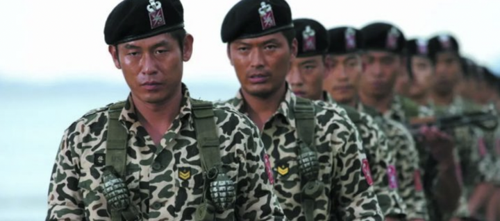
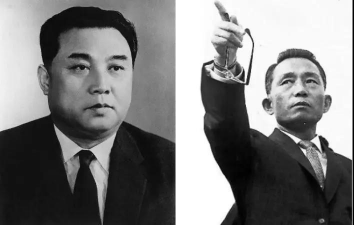
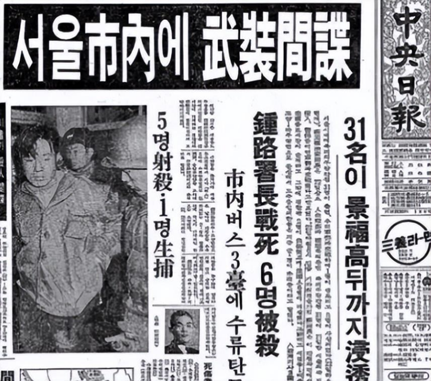
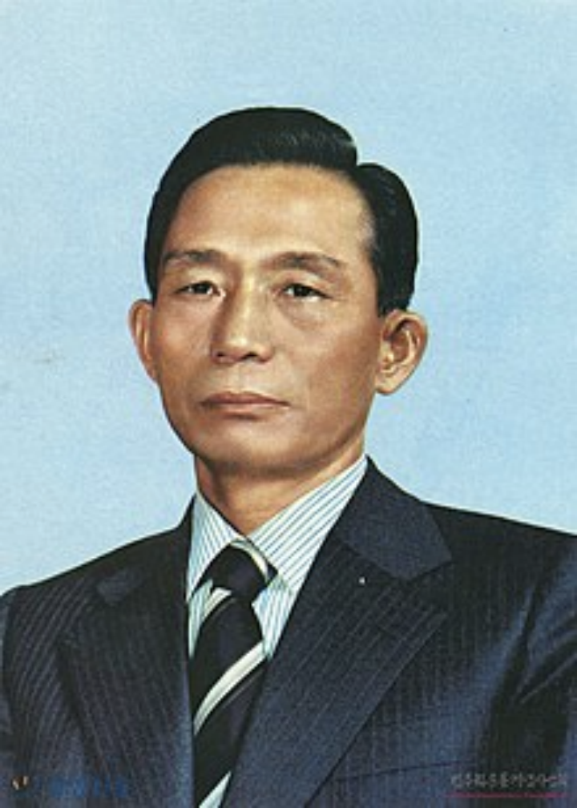
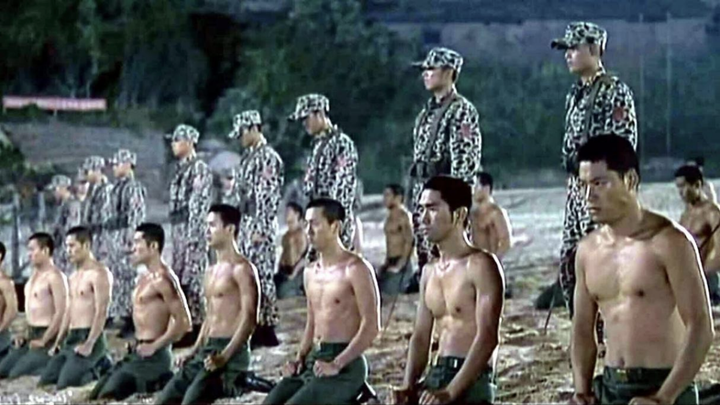
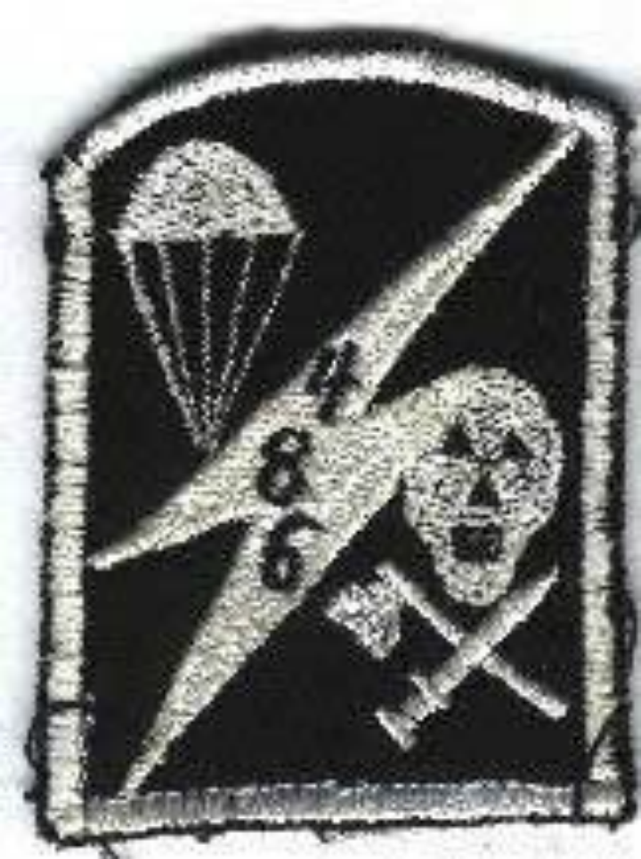

> 作者：玛卡巴卡的皮卡　|　赞同 4122　|　评论 66　|　[原文](https://www.zhihu.com/question/40802894/answer/3346779804)

韩国的「 684 」死囚特遣队，乘着公交车，直接攻入首尔，向总统复仇。

他们被骗去刺杀金日成，不仅无功，还差点被灭口。

于是他们调转枪口，准备干掉自家总统，震惊全国。

23 个人，一路过关斩将，冲过了韩国军队的重重封锁。

轻而易举击毙了 12 个人，己方无一人伤亡。

可见，这支部队的战斗力，恐怖如斯。

最终，他们一路杀到了距青瓦台 8 公里的地方。

被改编为电影《实尾岛》

**1 神秘任务**

1968 年 4 月。

韩国总统朴正熙，找到中情局，下达了一项秘密任务。

整个过程骂骂咧咧，全是「C 语言」，含妈量极高。

为啥呢？

这事儿，跟他们同母异父的「好兄弟」朝鲜有关。

三个月前，朴正熙刚被「好兄弟」偷了水晶。

一个 31 人的特种部队，摸到青瓦台门口，差点，就把他的头提回去给金日成当夜壶了。

金日成 VS 朴正熙

要不是被及时发现，韩国历史早就被改写了。

虽然这个部队最终被全歼，但韩国死伤了上百人。

叔可忍，婶不可忍。

朴老大那叫一个气啊，牙都快咬碎了。

为了这事儿，他三个月都没睡好觉。

思前想后，终于做了个重大决定。

正所谓，滴水之恩，当涌泉相报。

君子报仇，就在今宵。

他打算，给金日成也来一波大的。

不就是刺杀吗？

跟谁不会似的！

「去，你们也整个部队，把金日成弄死！」

「部队人数不能多也不能少，就得 31 个！」

「要秘密进行，不能让任何无关人员知道！」

朴老大连名字都想好了，行动计划叫「獾作战」，部队叫「684 部队」。

朴正熙

背后还有美帝爸爸的情报系统打辅助，几乎万无一失。

仿佛分分钟，就能把金日成的人头提回来。

可没想到，任务的第一步，就出了问题。

故事的走向，跟朴老大预想的完全不一样。

此时的朴老大还没意识到，他这不是在报仇，而是在给自己挖坟。

这个部队，将会成为他这辈子都不敢提起的噩梦。

**2 「复仇者联盟」**

朴正熙又名高木正雄，毕业于日本陆军士官学校，深受日本军国主义文化影响。

他主政的韩国，还是军政府时代，独裁玩得那叫一个炉火纯青。

中情局，实际上就是朴老大直属的特务机构，跟东厂差不多性质。

这帮人，你喊他们搞点破坏还行。

要让他们训练一支特种部队，基本属于白日做梦。

因此，这个任务，又经历了一层外包，落到了韩国空军部头上。

空军部长接到任务，头都快要愁秃了。

理想很丰满，现实很骨感。

这事儿，说起来简单，做起来难度系数直接爆表。

这种「敢死队」任务，对士兵能力要求那不是一般的高。

可当时的韩国部队，比朝鲜可差远了。

朝鲜军队训练有素，韩国士兵连军姿都站不利索。

就这条件，上哪捞 31 个这么牛逼的兵去？

但老大交代的任务，又不能不完成。

那咋办呢？

思前想后，空军部出了个离谱到突破天际的损招——拐骗。

于是，当时就出现了非常魔幻的一幕。

任务的负责人，跑到各个地方，去忽悠，画饼。

费了老鼻子劲，才从部队和情报部门，抠出来几个精英。

又从民间连蒙带骗，找到了几个素质还不错的青年壮丁。

但人家不肯来咋办呢？

空军部的操作，那可真是 HR 离职——不干人事了。

他们直接把其中 7 个人，绑架了过来！

就问你 6 不 6，骚不骚？

别急，更骚的操作，还在后面。

尽管他们这么努力，但还是只绑到了十几个合适的。

还差一大截指标，上哪找去呢？

著名思想教育家艾跃进曾经说过：

在这个世界上，有两个地方是培养男人的地方，一个是军队，一个是监狱。

于是，他们又费尽心思，从监狱里，捞了十几个囚犯。

这才终于凑齐了 31 个人。

这些人，成分十分复杂。

有军人，有平民，有罪犯，有三教九流的从业者，有流浪汉。

甚至，还不乏一些地痞流氓和死刑犯。

空军部画的饼，那也是相当的大：

月薪 600 美元，军人晋升，平民优待，犯人赦免。

事成之后，还会有额外奖励。

既能报效祖国，又能功成名就，走上人生巅峰。

你就说你心动不心动吧？

就连被绑架过来的小伙子，心都砰砰了几下。

就这样，31 人以这种奇葩的方式，「被自愿」入伍，组成了「复仇者联盟」。

他们将被安排到仁川附近的实尾岛，进行训练。

这时，小伙子们，还在回味长官画的大饼。

殊不知，前方等待他们的，将会是地狱。

一上岛，大家就傻眼了。

**3 实尾岛**

31 个小伙子，满怀希望地踏上了实尾岛。

上岛第一天，就得知了一个让他们崩溃的消息。

负责训练的队长金淳雄，告诉他们：

「你们的任务目标，是刺杀金日成。」

大家你看看我，我看看你，除了难以置信，就是充满抗拒。

刺杀朝鲜领导人？

这不纯纯送命呢吗！

你当我们傻呢？

不干不干，我们要退票，回家！

金队拿起枪，对着大伙儿脚下的地面就是一顿突突。

「今天，你们从也得从，不从也得从！」

「从踏上岛那一刻，你们的户籍就被我们注销了，想回都回不去。」

好家伙，没有撤退可言！

队员们这才反应过来，这 TMD 纯纯是上了贼船啊！

6-1 并上 4+1，都没你们这么不讲武德！

果然，要论无耻，还得是韩国政府。

被逼无奈，队员们只好签下生死状，断绝和家人的一切联系，老老实实训练。

金队当然是得意洋洋。

可这个不要脸到家的操作，已经埋下了致命隐患。

不过那都是以后的事儿。

除了金队外，岛上还有 50 多名军人。

其中有 31 名，都是教官。

没错，教官的数量，跟「684」队员数量是一样的。

一个队员配一个教官，一对一训练。

相关剧照，非实拍

练得不好的话，教官会被「连坐」，一起受罚。

另外 20 多个人，负责监督整个训练过程。

至于训练内容，用一个词来形容就是：变态。

十分变态！

在战术训练中，要做到 100% 一枪毙命，10 米内要用飞刀准确扎瞎眼睛。

你是不是想说，就这？我上我也行。

别急。

野外生存和意志力训练的部分，那才真是魔鬼。

他们被要求生吃毒蛇、青蛙、老鼠，喝自己的尿。

基本上，就是要人均贝爷水准。

此外还有，脑袋按进粪水中，木棍烫皮肤，和尸体同床共枕，喝用人骨浸泡的酒等等。

总之，怎么变态怎么来。

做不到位咋办呢？

那就等着挨打，往死里打。

而且采用的是末位淘汰制，31 人被分成三组，表现最差的整组挨打，教官也跟着一起受罚。

体能训练有了，政治教育也得跟上。

他们每天，都被各种爱国主义教育洗脑。

每天都要喊着「干掉金日成」的口号，雄赳赳气昂昂地开始训练，整得跟传销似的。

而且，队长还一再给他们灌输「为了国家，命都可以不要」的思想。

「如果你们被俘，一定要引爆身上的炸弹，和敌人同归于尽。」（这句很重要，后面会考）

在重重洗脑之下，「684 部队」的每个队员，都跟打了鸡血似的。

684 部队臂章

他们已经成了杀人机器，不完成任务，誓不罢休。

就这么一支部队，干掉金日成，那不是分分钟的事情？

看着训练成果，金队很满意，空军部和中情局都很高兴。

可事实证明，他们高兴得太早了。

就在这时，意外发生了。

**4 逃离实尾岛**

前面我们说过，教官会跟着学员一起受罚。

在这种制度下，教官对学员那是一点都不心慈手软。

只要练不死，就往死里练。

队员们几乎每天，都在挑战身体极限，在死亡的边缘疯狂试探。

俗话说，常在河边走，哪有不湿鞋。

没过多久，就有人在训练时出现意外，摔死了。

虽然经过洗脑，暂时将队员们安抚住了。

可不久之后，就有了第二个，第三个……

前前后后，光是训练过程中，就有 5 个人丧生。

剩下的 26 个人，活得战战兢兢。

谁也不敢保证，下一个死的会不会是自己。

其中有 2 个人，实在扛不住了，决定逃跑。

他们趁着船只运送补给的时候，绕过看守，躲到了船上。

然后开着船，逃到了附近另一个小岛。

这俩人在加入「684 部队」之前，本来就是小混混。

信仰崩塌以后，更是完全丢弃了道德底线。

他们闯进岛上的民宅，强暴了一名女医生。

由于他们的逃跑过程十分草率，很快就被发现，并被金队带人追上。

两人劫持女医生当人质，企图威胁金队。

正常来说，劫匪劫持人质，是最有效的自保方式。

但他们俩，显然严重低估了韩国政府的无耻程度。

金队的反应，直接把俩人干蒙了。

「谈判是不可能谈判的，有本事你就把她杀了！」

意思很明确，人质死不死，我不 care。

但你们俩，我今天抓定了。

这俩货做梦也没想到，对方竟然丧心病狂到这种地步。

挟持人质要挟的如意算盘，刚拿出来，就被金队砸得稀碎。

他们哪里知道，这个部队的一切，那可都是「SSS 级」的保密。

对于上面来说，牺牲一个平民，根本不算个事儿。

俩人实在受不了，崩溃了。

一个当场自杀，另一个束手就擒。

此时，剩余的队员们肯定不会料到，这一幕，将来还会发生在他们自己身上。

被抓回去的那个逃兵，当着所有人的面，被打成重伤，不治身亡。

剩下的 24 个人，再也没人敢有逃跑的念头。

经历过魔鬼特训后，他们已经成了真正意义上的特种兵。

激动人心的时刻到了。

接下来，就是去朝鲜，刺杀金日成！

**5 利剑出鞘，然后回鞘**

实尾岛上的训练，非常有成效。

转眼来到了 1968 年 11 月。

此时，「684」的 24 名欧巴们，已经成了充满爱国热情的杀人机器。

他们满脑子想的都是：干掉金日成。

这成了他们唯一的生存价值。

金队带着 24 人，转移到了离朝鲜更近的白翎岛。

万事俱备，只等着利剑出鞘了。

按计划，他们将乘坐热气球，飞到平壤上空。

美帝爸爸早就用侦察机，帮他们把地形摸熟了，现在队员们人手一份地图。

欧巴们跃跃欲试。

只要上头一声令下，他们立马就冲到平壤，咔嚓了金日成。

可就在这时，上头传来了一个，让大家集体懵逼的命令。

「行动取消，回去待命！」

？？？

欧巴们懵了。

金队也是丈二和尚——摸不着头脑。

这也不能怪金队，因为以他的级别，还没资格知道真相。

事实上，这个时候，南北形势已经发生了惊天大逆转。

此时的朴正熙和金日成，已经冰释前嫌。

大家眉来眼去，正打算握手言和。

这个时候再报仇，去朝鲜捅两刀，显然不合适。

于是，刺杀计划只能暂时搁置。

欧巴们很快就又被送回了实尾岛。

刚拔出的刀，又被硬生生塞回了鞘。

如果故事就到这，还算不错。

大不了，队伍直接解散，大家当做啥都没发生过。

但在「不要脸」这件事情上，他们总能刷新纪录。

此时，「684」的欧巴们，已经完全被洗脑。

在他们眼里，不干掉金日成，活着就没啥意思。

一开始，他们都以为，这个刺杀任务只是暂缓。

心想着，再等等，很快就会有新指令下达。

可没想到，这一等，就是 3 年。

每个人心里都憋着火，天天问：啥时候去干金日成？

等到的答复永远都是——没有答复。

更让他们不爽的是，岛上的伙食还越来越差。

原本经常来的补给船，现在半个月才来一次。

岛上的供给基本中断，伙食越来越差，天天只能吃面食，一点肉和蔬菜都没有。

冬天时候，连最基本的取暖燃料都不供应。

那惨状，比起之前的魔鬼训练，好不到哪里去。

24 名敢死队员，在绝望和孤寂中，艰难地等候。

陆陆续续有人提出不干了，要退伍。

但所有的提议，都石沉大海，没有回复。

大家的不满越攒越多，已经接近爆炸的边缘。

直到 1971 年，一个震惊所有人的消息，传了出来。

**6 「杀无赦」**

其实，任务取消的时候，「684 部队」就可以原地解散了。

但为啥还一直留着呢？
