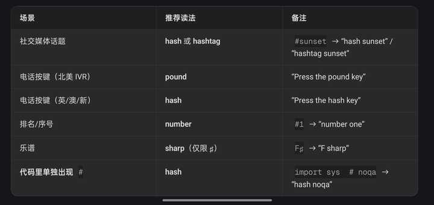
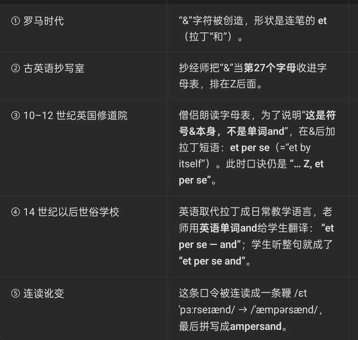

> 作者：英语大叔　|　赞同 1266　|　评论 88　|　[原文](https://www.zhihu.com/question/1961932091664098284/answer/1976007257503332132)

读代码时，# 永远读“hash”最不会错；电话语音才说“pound”（北美） ，英国/澳新 说 “hash”。⚠️C# 的“C sharp”读音只在指代这门编程语言本身的场景使用，其他凡是在代码里、字符串里、配置项里单独出现 # 符号的，一律回到字符名“hash”。

~ 波浪线 tilde

\` 反引号 backtick

• 项目符号 bullet

· 中点 middle dot

' 单引号 single quote

" 双引号 double quote

’ 撇号 prime /praɪm/，apostrophe /əˈpɑːstrəfi/ 来自希腊语意为“省略符号”，Japanese: アポストロフィ（阿波斯多菲）。

! 感叹号 exclamation mark / exclamation point

? 问号 question mark

@ at符号 at / at sign

\# 井号 pound sign（拨号）；hash / hashtag（话题）；number sign（排名）；sharp（编程语言如C#） 。注意，乐谱C♯ 中是的 ♯（升号），感谢评论指正。C# → “C sharp”，是微软定的商标读音。

$ 美元符号 dollar sign

% 百分号 percent sign

^ 脱字符/光标标识 caret / hat 源自拉丁语 "caret”，意为 "它缺少" 。

& 和号 ampersand / and ，ampersand源自拉丁文中的一个短语"et per se and"，意思是"and（和）" （更正：et 是拉丁原文，“&”形状就是连笔的 et（拉丁“和”）；“et per se and” 只是英童学习的混血口诀，后来又成了ampersand 是这句口诀被误听误读后的英语产物，已和拉丁语无关。）

| 管道符 pipe / vertical bar

\* 星号 asterisk / star 源自古希腊语"asteriskos"，意思是"小星"。

\- 连字符/短横线 hyphen / dash / minus sign（负号场景） hyphen来自希腊语hyphen，hypo,下面，hen,一。

– 短破折号 en dash（用于范围如2010–2020）

— 长破折号 em dash 源自古斯堪的纳维亚语"daska"（意为拍打、猛击），16世纪发展出标点符号"-"的用法，源自"打"断句子的概念。

\_ 下划线 underscore / low dash

\+ 加号 plus sign

\- 减号 / 负号，minus sign（作减法时）；negative sign（表示负数时，如 -5 读作 "negative five"）。

\= 等号 equals sign

( ) 圆括号 parentheses（复数）；left/right parenthesis（单数） 源自希腊语，原词为παρένθεσις (parénthesis)，由"παρά" (para)表示"旁边"，加上"ἐνθέω" (entheō)表示"插入"组成。

\[ \] 方括号 brackets / square brackets；left/right bracket 支架，Brackets一词源自法语braguette，意为"小裤子"，后来演变为指示是用来支撑或固定其他物体的一种结构或装置。

{ } 花括号 curly braces；left/right curly brace 来自拉丁词bracchia, 手臂。词源同brief, 短的。原指两手合抱，表支持义，后指箍子，括号等。

<> 尖括号/小于大于号 angle brackets（尖括号）；less-than sign / greater-than sign（数学符号）

/ 正斜杠 slash / forward slash 原意为"切开"或"劈开"

\\ 反斜杠 backslash

（空格） 空格 space

, 逗号 comma

. 句号 period（美式）/ full stop（英式） 希腊语的periodus，意思是“周期”，“循环”，后来指时期，阶段，经期，句号等。

: 冒号 colon 拉丁语的“colon”指诗的一部分，源于希腊语“kōlon”，意为诗节的分段。

; 分号 semicolon 诗节的中段

… 省略号 ellipsis 源于希腊语"elleipein"，意思是缺失或省略。

§ 章节号 section sign

√ 开根号 square root / radical sign 根，基础；激进分子；\[物化\] 原子团；\[数\] 根数，free radical自由基。radish 莱菔子，(又称大菜；一种红皮的小萝卜)

✓ 勾号/对号 check mark / tick

× 叉号 X / ex / X mark / cross / cross mark

○ 圈号 circle / O / O mark

※ 参考标记 reference mark（英语中常用asterisk替代）

‰ 千分号 per mille sign （mille /ˈmil/，拉丁语数词，表示“一千”，对应英文的 “thousand”）

‱ 万分号 per ten thousand sign

± 正负号 plus-minus sign

≠ 不等号 not equal to

≈ 约等号 approximately equal to

≤ 小于等于 less-than or equal to

≥ 大于等于 greater-than or equal to

× 乘号 multiplication sign / times

÷ 除号 division sign

∞ 无穷号 infinity

∑ 求和号 summation / sigma 原意是希腊字母表中的第十八个字母，音标为/s/. 在数学中，sigma表示Σ，用于表示求和。

∫ 积分号 integral （整体的，in-,不，非，-teg,接触，即没有接触过的，整体的。）

° 度符号 degree sign（角度、温度）

′ 角分/英尺 prime / foot

″ 角秒/英寸 double prime / inch

€ 欧元符号 euro sign

£ 英镑符号 pound sterling （中古英语 sterre,银币，银便士，字面意思为星星，可能因诺曼人所铸造的硬币上曾出现过星星状图案而得名。）

¥ 日元/人民币符号 yen sign / yuan sign "Yen" 这个词在英语中通常指的是强烈的渴望或欲望。这个词的词源可以追溯到中文，特别是广东话中的“yin1”（瘾），日本的货币单位“円”（yen），这个含义与词源故事无关，而是直接从日语中借用的。

¢ 美分符号 cent sign

™ 商标符号 trademark sign

® 注册商标 registered sign

© 版权符号 copyright sign

№ 号码符 numero sign

← 左箭头 leftwards arrow

→ 右箭头 rightwards arrow

↑ 上箭头 upwards arrow

↓ 下箭头 downwards arrow

\---

11.25补充

1\. 数学与逻辑符号

≡ 恒等于/全等于 identical to

∝ 正比于 proportional to

∆ / Δ 增量/三角形 increment / Delta (大写)

∂ 偏微分符号 partial derivative

∇ 奈布拉算子/微分算子/劈形算符 nabla /del。nabla纳布拉琴，因符号形状与这种古乐器相似。del是delta的缩写，因符号形似倒置的希腊字母Δ。

¬ 非 logical not

∧ 与 logical and

∨ 或 logical or

⊕ 异或 XOR / circled plus，XOR是Exclusive OR的缩写，是一种逻辑运算。你可以把它理解为“**不相同才为真**”的规则。

∅ 空集 empty set

∈ 属于 element of

∪ 并集 union

∩ 交集 intersection

∴ 所以 therefore

∵ 因为 because

‖ 平行于 parallel to

⊥ 垂直于 perpendicular to

2\. 货币符号

₹ 印度卢比 Indian rupee sign

₿ 比特币 Bitcoin sign

₽ 俄罗斯卢布 Russian ruble sign

₩ 韩元 Korean won sign

₺ 土耳其里拉 Turkish lira sign

3\. 标点与格式符号

« » 双角引号 guillemets / angle quotes。guillemets，French, from diminutive of Guillaume William (perhaps a printer's name)

‹ › 单角引号 single guillemets

¶ 段落符号 pilcrow

† ‡ 剑标 dagger and double dagger (用于脚注)

␣ 空白符号 open box / space symbol (用于图示)

4\. 音标与语音符号

ˈ 主重音 primary stress

ˌ 次重音 secondary stress

ː 长音符号 long vowel mark

5\. 编程与计算机专用符号

&& 逻辑与 logical and (编程中，如C/Java)

|| 逻辑或 logical or (编程中，如C/Java)

\-> 箭头 arrow (用于指针、Lambda表达式)

\=> 胖箭头 fat arrow (用于Lambda表达式)

// 双斜杠 double slash (用于单行注释)

/\* ... \*/ 注释块 comment block

#! 释伴 shebang (脚本开头)

% 百分号/模运算符 percent sign / modulo (编程中)

~ 家目录 home directory (在路径中，如 ~/Documents)

6\. 其他特殊符号

♯ 升号 music sharp sign (与#不同字符)

♭ 降号 music flat sign

♮ 还原号 music natural sign

★ 实心星 star

☆ 空心星 star

♀ 女性符号 female sign

♂ 男性符号 male sign

⏎ 回车符号 return key symbol

---

再次补充

**1\. 逻辑与集合符号**

∄ 不存在量词 There does not exist

∀ 全称量词 For all

∃ 存在量词 There exists

⊂ 真子集 Subset

⊆ 子集 Subset or equal

⊃ 真超集 Superset

⊇ 超集 Superset or equal

⊄ 非子集 Not a subset

⊅ 非超集 Not a superset

**数学关系与运算符号**

∏ 乘积符号（大写 Pi） Product

∐ 余积符号 Coproduct

∠ 角符号 Angle

∡ 有度量单位的角 Measured angle

∢ 球面角 Spherical angle

∥ 平行 Parallel

∦ 不平行 Not parallel

**等价与近似符号**

≅ 全等 Congruent to

≃ 渐近等于 Asymptotically equal to

≈ 约等于 Approximately equal to

≢ 不全等于 Not identical to

≡ 恒等于/全等于 Identical to

∼ 相似于 Similar to

≪ 远小于 Much less than

≫ 远大于 Much greater than

**2\. 箭头符号**

↔ 左右箭头 Left-right arrow

↗ 东北箭头 North-east arrow

↘ 东南箭头 South-east arrow

↖ 西北箭头 North-west arrow

↙ 西南箭头 South-west arrow

⇐ 向左双箭头 Leftwards double arrow

⇒ 向右双箭头 Rightwards double arrow

⇔ 左右双箭头 Left-right double arrow

↵ 回车箭头 Downwards arrow with corner leftwards

**3\. 单位与特殊符号**

Ω 欧姆符号 Ohm sign

℧ 姆欧（倒欧姆） Mho

K 开尔文符号 Kelvin sign

℃ 摄氏度 Celsius

℉ 华氏度 Fahrenheit

℠ 服务标志 Service mark

℡ 电话符号（老式） Telephone sign

**4\. 其他符号**

☞ 手指符号（古代批注用） Manicule

❧ 印刷花纹 Hedera / Fleuron

☙ 反向旋转花卉心形项目符号 Reversed rotated floral heart bullet

※ 参考标记（日文常用） Reference mark

⁂ 三星符号（用于分段） Asterism

---

再再次补充

**1\. 高阶数学符号**

∮ 闭合路径积分 Contour integral（用于复数分析等领域的路径积分）

∯ 闭合曲面积分 Surface integral（表示穿过闭合曲面的通量）

∰ 闭合体积积分 Volume integral（表示对体积分的积分）

∇² 拉普拉斯算子 Laplacian（用于描述标量场的二阶微分算子）

⊗ 张量积 Tensor product（用于表示张量乘积）

⊙ 哈达玛积 Hadamard product（表示矩阵或张量的逐元素乘法）

⟂ 正交 Orthogonal（表示垂直或无关）

⟨ ⟩ 内积 Inner product（也称为点积，或在量子力学中称为bra-ket符号）

**2\. 逻辑与类型理论符号**

⊢ 推导符 Turnstile（表示在逻辑系统或类型系统中可从前提推导出结论）

⊣ 左伴随 Left adjunction（在范畴论中表示左伴随关系）

⟹ 逻辑蕴含 Logical implication（表示“如果...那么...”的逻辑连接词）

⟺ 逻辑等价 Logical equivalence（表示“当且仅当”的逻辑连接词）

⊥ 底类型/假 Bottom type / Falsum（逻辑中表示假，类型论中表示无实例的类型）

⊤ 顶类型/真 Top type / Verum（逻辑中表示真，类型论中表示所有类型的超类型）

λ 拉姆达 Lambda（用于Lambda演算和匿名函数）

Λ 大写拉姆达 Capital Lambda（有时用于表示宏或高阶类型系统）

**3\. 编程语言专用符号**

:: C++/Rust/Haskell 作用域解析 / 类型声明（用于访问命名空间、类成员或声明类型）

.. Rust/Python/Julia 范围构造（用于生成一个区间序列，如1..10）

... JavaScript/TypeScript/C 展开运算符 / 可变参数（用于展开数组或表示函数可变参数）

<- Haskell/PureScript 赋值箭头（在某些函数式语言中用于绑定值或模式匹配）

<$> Haskell fmap运算符（函子的映射操作，相当于高阶函数map）

<\*> Haskell 应用函子运算符（将函数应用于函子中的值）

\>>= Haskell 绑定运算符（单子的绑定操作，用于顺序计算）

<> Haskell/HTML 空幺半群 / 标签括号（在Haskell中表示中性元素，在HTML中为标签括号）

:::= 形式语言 语法定义符号（在形式文法中用于定义产生式规则）

@@ Python 类装饰器（用于将装饰器应用于类）

**5\. 更多货币符号**

₦ 尼日利亚奈拉 Nigerian Naira（尼日利亚的官方货币）

₱ 菲律宾比索 Philippine Peso（菲律宾的官方货币）

₴ 乌克兰格里夫纳 Ukrainian Hryvnia（乌克兰的官方货币）

₸ 哈萨克斯坦坚戈 Kazakhstani Tenge（哈萨克斯坦的官方货币）

₮ 蒙古图格里克 Mongolian Tugrik（蒙古的官方货币）

₢ 巴西克鲁塞罗（旧） Brazilian Cruzeiro（巴西曾使用的旧货币）

₯ 希腊德拉克马（旧） Greek Drachma（希腊在加入欧元区前的旧货币）

**6\. 古籍/印刷符号**

☜ 左手指 Left-pointing index（古籍中用于在页边表示注释的标记）

☝ 上手指 Up-pointing index（古籍中用于指向正文上方的标记）

☟ 下手指 Down-pointing index（古籍中用于指向正文下方的标记）

❦ 花纹装饰 Fleuron（用作章节分隔或装饰的印刷花纹变体）

❀ 花卉装饰 Floral ornament（类似Fleuron的花卉状装饰符号）

❡ 反向常春藤 Reversed hedera（用于段落分割的印刷符号）

**7\. 箭头与几何符号**

⟸ 长双左箭头 Long leftwards double arrow（表示从左来的逻辑蕴含或赋值）

⟹ 长双右箭头 Long rightwards double arrow（表示向右的逻辑蕴含或推导）

⟺ 长双左右箭头 Long left-right double arrow（表示逻辑等价或双向推导）

↶ 逆时针箭头 Anticlockwise top semicircle arrow（表示逆时针方向旋转）

↷ 顺时针箭头 Clockwise top semicircle arrow（表示顺时针方向旋转）

↺ 逆时针圆箭头 Anticlockwise open circle arrow（表示无限循环或刷新）

↻ 顺时针圆箭头 Clockwise open circle arrow（表示无限循环或刷新）

⤴ 右上弯箭头 Arrow pointing rightwards then curving upwards（表示向上或返回）

⤵ 右下弯箭头 Arrow pointing rightwards then curving downwards（表示向下或进入）

**8\. 单位与科学符号**

Å 埃 Ångström（长度单位，等于10的负10次方米，常用于原子尺度）

ℓ 升 Script small L（升的单位符号，用于表示体积）

Ⅎ 倒F Turned capital F（偶尔用于表示反函数，但非常罕见）

ℶ 贝斯数 Beth number（集合论中用于表示特定无穷集合基数的一系列数）

ℵ 阿列夫数 Aleph number（集合论中用于表示无穷集合基数的一系列数）
