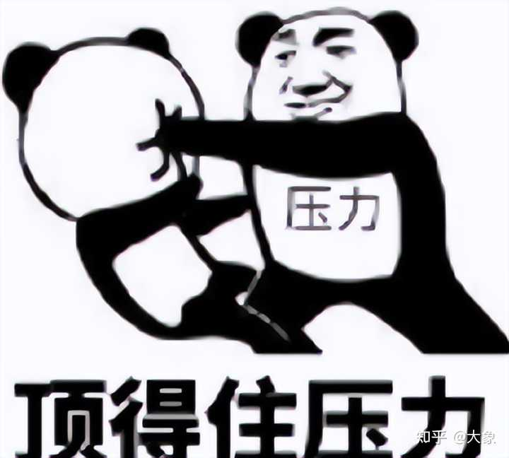
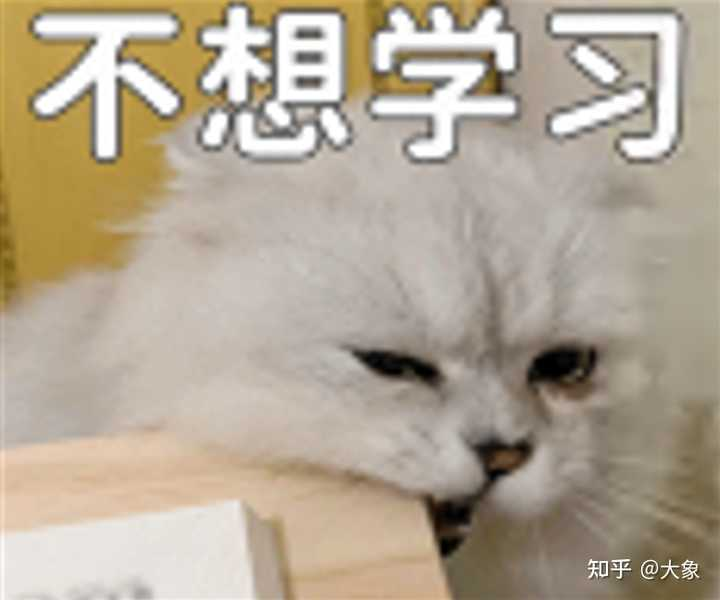

> 作者：大象　|　赞同 11192　|　评论 494　|　[原文](https://www.zhihu.com/question/593093174/answer/1973809244261357333)

我本科毕业满世界旅游了两年才回来考的研，巨嗨皮的两年。还记得第一站准备去安徽，当时我妈帮我收拾行李，我自己则换了一身新衣服在小区里面瞎溜达。

快吃饭的时候我爸出来找我，他看到我坐在一个长椅上，一副非常非常沮丧的样子。

这很罕见，说实话我爸看我长这么大，一直都特别乐观开朗，怎么会在即将开启自己的 gap year 时候，忽然开始emo了？！属实有点诡异。

我爸走过来，很小心的问：怎么了儿子，这么难过的样子？

我：哦，老爸，你坐下来，我慢慢和你说。

我爸坐下了。

我接着说：**因为刚我坐下才发现，这椅子才刷过漆，还没干。**

我爸：你个小兔崽...噢不是...这很好。所以你没有emo是吧，那我来给你点emo话题。话说你旅游的时候，以前的朋友同学都陆陆续续结婚了，会不会让你很迷茫很有一种压力感紧迫感。

我：**他们只是陆陆续续结婚了，又不是陆陆续续过上好日子了**，所以我实在是压不了一点力紧不了一点迫。

我爸：这很好，赔我衣服先。

当时很多朋友都很奇怪我好好地为啥要gap两年啊，为什么不去工作？为什么不趁着年轻好好努力？正常人谁会这么糟蹋时间啊！

这里我要很郑重的说一下，首先我很爱国，其次我很爱国，最后为啥在中国不努力就好像犯法一样？

我舒舒服服享受两年人生不行吗？！

问大家一个问题啊，你有多久没有好好睡一觉了？就是那种不为任何事担忧，特别平静、幸福地沉进温暖的被窝里。像小时候那样——赖在沙发上看动画片，爸妈轻声催着：“不早啦，快睡吧。”

然后你带着一丝不情愿，却又安稳地躺下，把脸埋进刚被太阳晒过的被子里。那股阳光的味道，干燥、暖和，像把整个下午的晴朗都藏进了梦乡。

明天要交的树叶标本、巷口小超市的雪糕、周末和小伙伴约定去的河滩……这些零碎的思绪，像漂在溪流上的花瓣，在渐浓的睡意里轻轻打着旋。

朦胧中，仿佛有一只手伸过来，替你掖了掖肩头的被角。是梦吗？你分不清。风拂过窗帘，窗外偶尔响起的自行车铃，越来越远，越来越模糊。

而你，终于很沉、很沉地，睡去了。

**这就是我gap两年的最大意义所在。那两年，几乎每个晚上的睡眠都是如此香甜，现在回想起来，真的很深刻的感觉到人穷极一生追求的其实一开始就有了。**

所以我的旅游更像是旅居，遇到喜欢的城市，干脆就踏踏实实的住上十天半个月。

印象比较深刻的是在信阳，整整待了一个多月。酒店的附近有条小河，河水很干净，每天下午都有三三两两的人在钓鱼，当然里面每次也都有我。

有个大叔也经常来钓鱼，他觉得我这个年龄的小伙子怎么会有闲工夫每天都来钓鱼，这很奇怪。

我那会每天还带本心理学的书瞎看着玩，好像是格里格的《心理学与生活》。这就给大叔一个很好搭话由头，他特意把钓位移到我这边，然后假装漫不经心的问：小伙子，还研究心理学啊？这玩意儿有用没？

我：相当有用，看人是一看一个准。

大叔：不可能吧？！那你看看我现在在想啥呢？

我：**你想刁难我。**

大叔愣了半晌，然后大为赞叹：果然是心理学，看人心理真TM太准了。

这大叔有个十一二岁的儿子，周末也会跟过来一起玩，超级调皮。本来我就老是空军，这孩子在旁边瞎吵乱闹的，更是让我一条毛鱼都上不了钩。

我感觉这么皮的小孩在学校里一定经常被老师收拾。但是小孩却很不服气的反驳我，他说他们班的班主任不止一次的在班里表示，这个班除了他，其他同学都是屎。

我很无语的看着他：这很好，所以你就是那根棍子吗？

大叔听了哈哈大笑，他让自己这皮儿子不要再在旁边捣蛋了，正好趁这个机会，学习上有啥不会的问问这位空军大哥哥啊。

小孩瘪着嘴抗拒聊任何跟学习相关的事，他觉得学校里教的东西一点用都没有。比如负数，这个到底有啥意义，空军大哥哥钓鱼最少也是零条鱼，再怎么钓也不可能钓负数鱼的啊。

这很好，本空少只能详细的跟他计算一下今天的鱼获。上午10点过来到下午4点，成功证明了这条河里今天没有鱼，鱼获为0。4点零5分，大叔过来钓鱼，半分钟钓上来两条，证明这条河里在4点以后会刷新出两条鱼。

4点10分，鄙人收到家父的微信，问我今天有没有钓到鱼？于是不堪受辱的我向大叔借了一条鱼摆拍，但是一个不小心又让这条鱼脱钩跳回河里了，于是鱼获变为-1。

请问负数有没有意义？

小孩不说话了，但是他又不想就这么认输，又开始跟我掰扯起了语文：大哥哥，我还有个问题，我们为啥要学论语啊，又什么三十而立四十而不惑，又什么朝闻道夕死可矣，我不喜欢，感觉一点都不霸气，就是一个文弱老头在自说自话。

这很好。所以你真以为，在礼崩乐坏、弱肉强食的春秋乱世，一个只讲仁爱的老书生能安然周游列国？真相是，孔子本身就是当世顶级的战力威慑。他身长九尺，箭无虚发，驾战车如履平地。

所以三十而立的本意是三十个人才配让我站起来打，四十而不惑的本意是要是有四十个人，我打起来丝毫不带犹豫的。

朝闻道夕死可矣，这个就更狠了，早上打听到去你家的路，到晚上你就可以死了。

小孩这会儿已经听呆了。他觉得好像哪里有点不对，但又一下子说不上来具体哪里不对，只能后悔自己上课没好好听老师讲课，所以现在才会被人各种忽悠。

我揉了揉小孩脑袋，建议他有条件的话还是要好好学习，毕竟学习不是唯一的出路，但一定是最平坦的一条路。

那天临走的时候我把鱼竿啥的都送给了小孩，小孩高兴的手舞足蹈，天哪自己以后也有机会过来钓鱼当空军了。然后他拎起金光闪闪的鱼钩问我这是不是纯金的，是不是特别特别贵？

我：是不是纯金我不太清楚，反正我试过，吸铁石能吸得住这个小鱼钩。

小孩：噢，那到底是不是特别特别贵啊，大哥哥？

我很笃定地说：**是很贵，毕竟物以吸为贵。**

离开信阳后，我取道郑州直飞昆明。不得不说，真想好好玩的话，还是得来这种旅游城市，而且你也不用担心没有玩伴，太多可以组团的背包客了。

当时我打算去漂流，一起组团的小哥说漂流没啥意思，还不如玩漂流沿途放的呲水枪，投币对下面漂流船呲水，嘎嘎好玩。

我：有点意思，不过建议你专挑没买雨衣的呲水，让他后悔没买雨衣，但你不要呲带雨衣的，让他后悔买雨衣。

小哥愣了一下，反应过来后疯狂对我点赞。

晚上大家一起聚餐和啤酒吃烧烤，这小哥跑我旁边来，偷偷指着斜对面的一个女生跟我说：大象，我暗恋她很久了，这次好不容易一起旅游出来，你觉得我要不要找个机会表白一下啊？

我：稍等，我先问你另外一个问题，宫崎骏这个人你知道不？

小哥不知道我的用意，但还是老老实实的回答：知道啊，做动漫电影的，很厉害。

我：这很好，宫崎骏说过一句很有道理的话——其实你的暗恋挺明显的，之所以没有被戳穿，是因为对方不喜欢你。

小哥：这......可恶，不要让我遇到这个姓宫的，不然我非打死他。

这很不妙，我有一种感觉，宫崎骏你要有麻烦了，但不会很麻烦。

过了好一会，小哥吨吨吨猛喝了一大罐啤酒，恨恨地说：其实宫崎骏的电影也很一般。

当然了，跟一群人一起玩肯定也不可能全是开心的事，毕竟这世上夹生的人也不少。我是属于不太能喝酒的人，所以喝了几口啤酒后就安心地在一边听大伙吹牛。

然后就有个脑子有点大病的人，非要跑过来和我拼酒，还TM说什么这是酒局里面的人情世故，更是酒局里面的高情商。

我当场就不爽了，人情世故是吧，高情商是吧，那TM你就看不出我现在相当不爽吗？？噢，你看不出来啊，那你人情世故个der啊。什么？你看得出来？那TM你就是摆明要欺负我是吧？

说实话这脑子有病哥真的是我见过的容量最大的铅笔盒了，装那么多笔他就真的一点都不累。

这里跟大家说一个与别人交往时保护自己的一个王牌操作：**说话时一定要敢于陷入冷场、陷入尴尬；敢于停顿、敢于沉默、敢于等待、敢于不给别人面子。说白了，你要敢于让别人不自在，要允许自己不是好人，你才能接受别人不是好人。这就是对自己最好的保护。**

有病哥眼看着我根本就不吃他要夏季吧拼酒的那一套，只能讪讪的拿起自己的酒准备回自己座位，临走时实在不甘心，于是就DISS我说我穿的衣服好老气，他爸爸也有一件一样的。

我：这很好。**你要叫爸爸就直接叫，不用铺垫。**

聚餐的最后，很多小伙伴起哄让我聊聊怎么就敢放弃应届生身份，直接gap嗨皮两年。

其实答案很简单。

我们这一代人，仿佛生来就是为了燃烧与奠基。社会大运转体系将我们视为无尽的薪柴与砖石，用房贷与消费点燃我们最炽热的年华，待火光熄灭，便期待我们悄然成灰。

牛马这个词绝对不是自嘲。我问你们，为什么被打只要还手就是互殴?

理解不了是吧，我来解释一下。如果是你家的两个小孩打架，你一定会搞清楚是非曲直，但如果是牛圈的两头牛打架，你肯定是拿着棍子两个一起打，因为你要的是牛圈的安静。

所以如果有机会有条件的话，真的建议花一些时间，不一定非要一年两年的啊，哪怕一个星期呢，给自己彻底放个假。

因为，**身上焦虑跟戾气都是被亏待出来的，而情绪稳定、安全感这些东西则一定需要很多很多的快乐才能滋养出来。**

