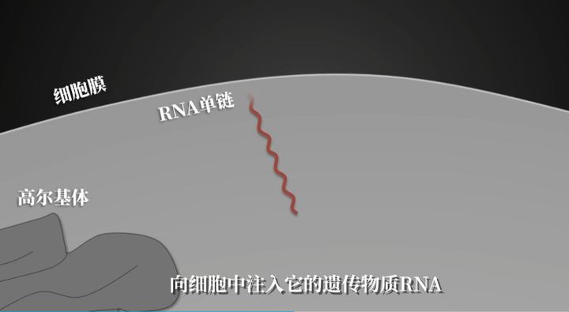
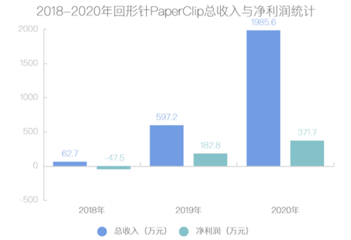
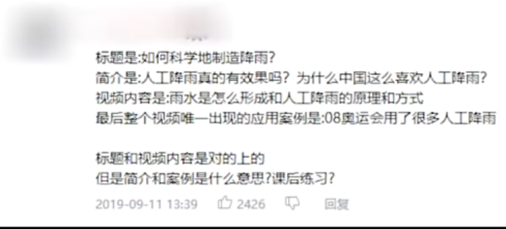
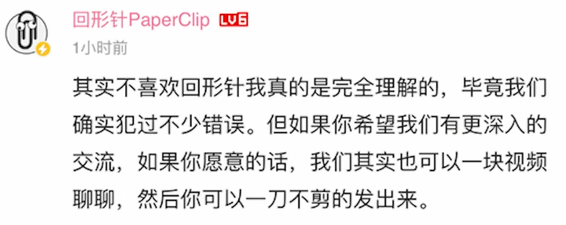

> 作者：玛卡巴卡的皮卡　|　赞同 142　|　评论 7　|　[原文](https://www.zhihu.com/question/392446752/answer/117542949860)

「巴西雨林要是没了，就全赖中国人吃香喝辣。

连中国食盐，都是奸商」。

你敢想象，这些荒诞的结论，是一个科普大 V 的「杰作」？

表面上，他们是官方背书的最受欢迎博主。

背地里，他们给高大上的视频里，塞了无数私货。

直到一场骂战，揭露了他们的真面目！

一个团队，可谓是行走的 50 万图鉴。

**1 突如其来的封号**

2021 年 7 月 14 号，一个让无数科普爱好者心碎的日子。

那一天，著名科普大 V「回形针」，突然被全网封杀了。

消息一出，就像在平静的湖面上扔了块大石头，瞬间激起千层浪。

「回形针」的粉丝们，一个个都懵了，心里那叫一个难受，简直不敢相信自己的眼睛。

「回形针」，号称「当代生活的百科全书」。

三年多来，他们生产了约 200 条科普短视频。

从《如何做一根懂事的路灯？》《如何为十三亿人调度列车？》；

到《原子弹制造指南》《造假币为什么这么难？》。

他们总能在几分钟的时间里，把晦涩的知识，以清晰易懂的方式普及给大众。

那动画、那分镜、那讲解，简直让人欲罢不能。

虽然是在科普严肃知识，可看着一点也不无聊。

而「回形针」的高光时刻，还得是 2020 年。

这一年，疫情肆虐，人心惶惶。

就在这个时候，「回形针」站了出来。

他们制作了一期名为《关于新冠肺炎的一切》的视频。

（科普新冠肺炎的视频截图）

这期视频，简直就是及时雨，解答了大家心中的各种疑惑。

从病毒的起源到传播途径，从预防措施到治疗方法，讲得那叫一个透彻。

单单这一个视频，播放量就破亿了！

直接让「回形针」涨粉数百万，一跃成为当年 B 站的「百大 up 主」。

「回形针」的创始人吴松磊，也荣登当年的福布斯 30 岁以下精英榜，那可是相当牛掰了！

央视还专门为「回形针」做过报道，各种赞美之词溢于言表。

不少政府机构也纷纷向「回形针」抛出橄榄枝，希望进行合作。

那时候的吴松磊，简直就是站在了人生的巅峰，风光无限。

公司规模也是越来越大，上百号人，一个个都是精英中的精英。

除了科普视频，吴松磊还推出了「干燥工厂」和「基本操作」等实体产品和交互学习产品。

这架势，仿佛要打造一个全方位的知识帝国。

可以说，「回形针」的前途一片大好。

可谁也没想到，他们已经是悬崖边上扭秧歌——好日子快到头了！

可就在大家以为，吴松磊会继续高歌猛进，创造更多辉煌的时候，噩耗传来了。

「回形针」毫无征兆地，突然就消失在了人们的视野中。

他，被封杀了。

而这一切，都源于一场骂战。

**2 一条评论引发的对线**

让我们把时间拨回 2020 年的最后一天。

2020 年 12 月 31 日，「回形针」发布了视频：《2020 年「回形针」赚了多少钱》。

这是从 2018 年「回形针」成立以来，吴松磊和团队每年一次的传统节目。

2020 年，「回形针」总共花了 1613.9 万，其中 900 万都砸在了人力成本上。

（「回形针」收入统计）

短短一年时间，「回形针」的团队就从 20 人扩张到了 55 人！

而 2020 年的营收，更是达到了 2019 年的三倍之多。

这发展速度，简直是一日千里！

而且，扩张的势头还没停下来。

毕竟，新项目「基本操作」和「干燥工厂」才刚刚起步。

新的一年，还得招兵买马，大干一场！

吴松磊已经租下了同楼层的其他办公室，现在公司最多可以容纳 150 多号人。

在视频下方的评论区，粉丝们纷纷留言，祝贺「回形针」越做越好。

这感觉，就像是看着自家孩子出息了，心里美滋滋的！

然而，就在这个「回形针」粉丝们喜大普奔的日子里，却突然跑出来一个唱反调的。

一个叫「赛雷话金」的 B 站 UP 主，发了一条评论：

「今天看到这玩意，我默默吞下了半瓶维生素 B6。」

维生素 B6，一般是用来止吐的。

这句话，就是不带脏字地，把「回形针」给骂了。

这一句话，可算是捅了马蜂窝了。

眼看喜欢的 up 主被攻击，「回形针」的粉丝们坐不住了，纷纷回怼赛雷。

「看到人家赚钱开始酸了？」

「想蹭热度想疯了吧，『回形针』也是你能碰瓷的？」

蝙蝠身上插鸡毛——你当自己什么鸟？

要知道，B 站可是「回形针」的主阵地，坐拥近 300 万粉丝。

属于是一人一口唾沫，都能把赛雷淹死的程度。

而赛雷的账号，只有可怜巴巴的 8 万粉丝，连人家的零头都不到。

就这样，一场 8 万粉博主和 300 万粉博主的互联网对线，拉开了帷幕。

**38 万 VS.300** 万

赛雷也是个狠人，面对铺天盖地的指责和谩骂，完全没在怕的。

2021 年 1 月 24 号，他发布了视频《补充那些「回形针」没说出来的知识点》。

以这段视频，直接和「回形针」的粉丝正面硬刚！

视频里，赛雷把「回形针」以前视频里的那些「小失误」一个个拎出来，摆事实讲道理。

在《为什么中国食盐只能由国家垄断》中，「回形针」说：

「中国食盐由于垄断经营，国家每年都能获取近 10 倍的暴利。」

却不提中国的食盐价廉物美，灾难时期也能稳定供应，不涨价。

《如何科学的制造降雨》中，「回形针」举的唯一例子，是中国为了奥运会期间不要下雨，提前发射降温弹。

试图引导观众认为中国的人工降雨是面子工程，毫无作用。

（《如何科学的制造降雨》评论区截图）

《如何科学离婚》中，「回形针」对普法博主「罗翔说刑法」的视频进行恶意剪辑。

在评论区早就有人指出错误的情况下，「回形针」一直没有回应。

直到一年后，「罗翔说刑法」入驻 B 站时，他们才进行道歉。

连罗老师都敢碰瓷，真是电线杆上绑鸡毛——好大的掸（胆）子

视频的最后，赛雷做出了自己的总结：

「回形针」明显就是个夹带私货，别有用心的歪屁股货色！

这视频一出，立马就炸了锅，这场骂战也直接冲上了热搜！

不少百万粉丝的大 V，都转发了这条视频。

这下子，各大平台的评论区里，吵翻了天。

「回形针」的粉丝说，赛雷的视频是过度解读，他不过是一个蹭热度的小丑罢了。

支持赛雷的人则说，「回形针」的视频就是选择性表达，有意想带偏观众。

「回形针」的粉丝说，「回形针」出过上百期视频，赛雷却紧盯着几个小失误，无视「回形针」为科普所做的贡献。

支持赛雷的人则说，夹带私货的科普视频和毒教材一样可怕。

到了后来，双方甚至互称对方为「二极管」「恨国党」「民族主义者」……

眼看舆论愈演愈烈，「回形针」率先作出了回应。

要知道，当时的「回形针」，刚被 B 站评为「2020 年度百大 UP 主」，那可是站在流量顶端的男人！

这时候要是任由舆论发酵，搞不好要刚拿百大就凉凉啊！

于是，吴松磊赶紧跟赛雷联系，说希望跟他深入交流一下，消除一下彼此之间的误解。

赛雷也同意以当面交流的形式好好聊聊。

可是，这事儿吧，都过了几天，双方也没聊出个所以然来。

至于为啥没聊成，是因为双方都各执一词，谁也不让谁。

「回形针」这边说，他们想跟「赛雷话金」好好谈谈，还打算把过程拍成视频；

但「赛雷话金」态度不好，不愿意配合，这事儿就黄了。

赛雷这边呢，则说是「回形针」不愿意接受他的直播交流形式；

而且，吴松磊说话还阴阳怪气的，这谁受得了？

最后，坐在一块聊聊的事儿，就这么不了了之了。

双方各自发了个解释视频，就当是给这事儿画了个句号。

但你以为这就完了？

其实，赛雷还在暗中憋着大招。
