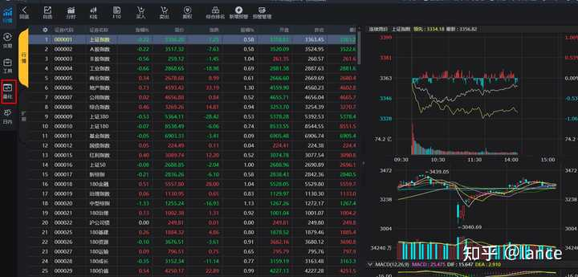
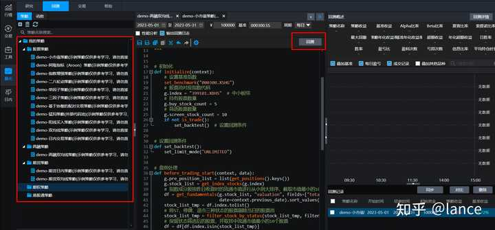
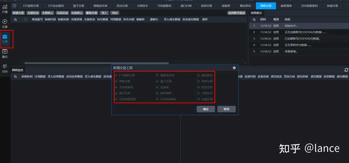
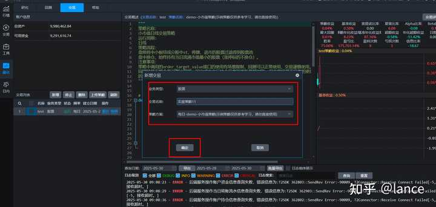
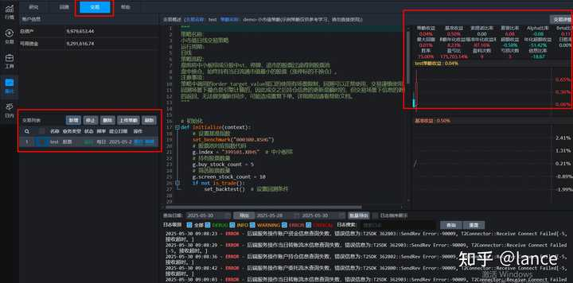
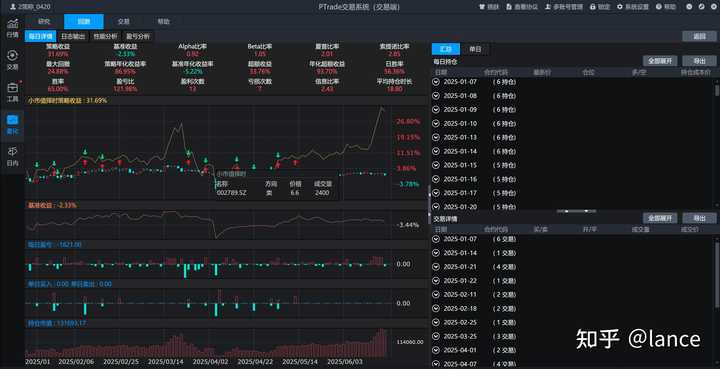
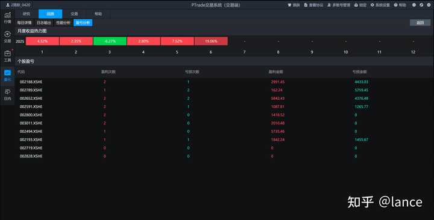

> 作者：lance　|　赞同 311　|　评论 50　|　[原文](https://www.zhihu.com/question/1910764019284943055/answer/1920782424893289139)

散户可以用量化，基本没有门槛，主流的量化软件就是ptrade和qmt

量化交易作为一种基于数学模型、海量数据处理和计算机技术的投资策略，现在市场上量化交易越来越多，我们总抱怨量化就像一把镰刀，无形的来收割我们散户群体。

## **1、量化交易的优势在哪儿？**

-   消除情绪干扰，避免贪婪、恐惧等人性弱点导致的非理性决策
-   海量数据处理和分析能力，能结合行业、估值、周期、舆情、基本面等综合评分精选个股和择时买卖
-   高频交易，交易的响应速度达到毫秒级甚至微妙级
-   24小时自动化执行，解放双手，安心上班
-   风险管理，动态止盈止损，动态调整仓位
-   捕捉套利机会，比如可转债套利、etf套利、期现套利等

## **2、怎么开启个人量化交易之路？**

只需要两步就可以，申请量化交易软件和使用量化交易软件

### **（1）申请量化交易软件**

在证券公司申请使用量化交易软件（PTrade或QMT），都是免费申请和使用的，大概2-3天申请下来，然后下载软件并登录使用

我以PTrade为例

行情菜单栏：



量化菜单栏：



### **（2）使用量化交易软件**

我们可以使用软件自带集成的策略工具，也是免费的，完全不需要编程，策略工具有：etf套利、可转债套利、篮子交易、网格交易、盘口扫单、追涨停等等

如下图：



### **（2.1）用量化策略进行交易**

对于编程小白来说，有完整的策略例子和文档可供参考，实在不会代码，可以使用AI来辅助编写，我测试过了，完全能正常运行AI的策略。

我们需要在回测中，完善自己策略，然后进行实盘交易，关闭电脑，策略24小时在云端服务器运行

进行回测：


新建实盘交易：



实盘交易运行中：



以上就是个人投资者进行量化交易的路径，其实非常简单，而且完全免费，只是大多数人还不知道，觉得门槛高，大家早用早享受

## **有那些量化策略能挣钱？**

下面是小市值择时的ptrade版本，可以直接在ptrade上回测和实盘交易

小市值的核心就是股票池中选择市值最小的并且基本面没太大问题的股票，这类股票价格波动大，有较大的价值发现空间；涨多了调出股票池，跌到止损线止损卖出，持仓数量不足则买入，来实现小波段高抛低吸。

通过择时和风控策略来实现控制回撤。

回测数据(2015.1.1-2025.6.19)如下：





\*回测数据只作测试用，不代表未来实际收益

### **1、策略初始化配置**

定义了可交易日、目标持仓股票数、个股止损比例、空仓时持有的货币基金等

```
g.index = "399101.SZ"  #中小板综
g.adjust_num = True #是否动态调整持仓数量
g.trading_signal = True # 是否为可交易日
g.etf = '511880.SS' # 银华日利
g.stock_num = 4 # 目标持仓股票数
g.run_stoploss = True # 是否执行止损
g.stoploss_strategy = 3 # 止损策略：1个股止损、2市场止损、3联合策略
g.stoploss_limit = 0.07 # 个股止损比例
```

### **1.1、盘前处理**

记录持仓股昨天涨停情况

```
# 盘前处理
def before_trading_start(context, data):
    g.hold_list = []
    g.limitup_stocks = []
    pre_date = context.previous_date.strftime('%Y%m%d')
    print('pre_date---------------')
    print(pre_date)
    # 更新当前持仓列表
    for position in list(context.portfolio.positions.keys()):
        g.hold_list.append(position)
    # 若有持仓，则记录昨日涨停股票
    print('g.hold_list-----------------')
    print(g.hold_list)
    if len(g.hold_list) != 0:
        df = get_price(g.hold_list, end_date=pre_date, frequency='1d',
                       fields=['close', 'open', 'high_limit'], count=1)
        df = df[df['close'] == df['high_limit']]
        g.yesterday_HL_list = list(df.index)
        print("昨天持仓涨停股票--------------")
        print(g.yesterday_HL_list)
    else:

        g.yesterday_HL_list = []
```

### **2、选股逻辑**

结合基本面和行情选股

（1）剔除停牌、ST、退市的股票

```
# 将ST、停牌、退市三种状态的股票剔除当日的股票池
final_list = df.index.tolist()
final_list = filter_st_status(final_list)
final_list = filter_halt_status(final_list)
final_list = filter_deli_status(final_list)

def filter_st_status(stocks_list):
    filter_stocks = []
    # 判断证券是否为ST、停牌或者退市
    st_status = get_stock_status(stocks_list, 'ST')
    # 将不是ST的证券筛选出来
    for i in stocks_list:
        if st_status[i] is not True:
            filter_stocks.append(i)
    return filter_stocks

def filter_halt_status(stocks_list):
    filter_stocks = []
    # 判断证券是否为ST、停牌或者退市
    HALT_status = get_stock_status(stocks_list, 'HALT')
    # 将不是ST的证券筛选出来
    for i in stocks_list:
        if HALT_status[i] is not True:
            filter_stocks.append(i)
    return filter_stocks

def filter_deli_status(stocks_list):
    filter_stocks = []
    # 判断证券是否为ST、停牌或者退市
    DELISTING_status = get_stock_status(stocks_list, 'DELISTING')
    # 将不是ST的证券筛选出来
    for i in stocks_list:
        if DELISTING_status[i] is not True:
            filter_stocks.append(i)
    return filter_stocks
```

（2）筛选基本面良好的股票

市值在3-1000亿，母公司净利润与公司净利润都为正，营收不低于1亿

```
stock_list = get_index_stocks(g.index)
# 指数成分股按昨日收盘时的流通市值进行从小到大排序，截取市值最小的10个标的进行股票状态筛选（考虑回测速度）
subDf = get_fundamentals(stock_list, "income_statement", fields=["net_profit", "np_parent_company_owners", "operating_revenue"],
                      date=context.previous_date)
subDf = subDf[(subDf["net_profit"] > 0) & (subDf["np_parent_company_owners"] > 0) & (subDf["operating_revenue"] > 100000000)]
stock_list_tmp = subDf.index.tolist()
df = get_fundamentals(stock_list_tmp, "valuation", fields=["total_value"],
                      date=context.previous_date)
df = df[(df["total_value"] > 300000000) & (df["total_value"] < 100000000000)]
df = df.sort_values(by="total_value", ascending=True)
```

（3）根据大盘均线来动态调整股票池数量

通过大盘10日均线与最新收盘价的差值来代表市场的温度，200以上，表示价格显著高于均线，市场过热，减少持仓数量；-200以下，表示价格显著低于均线，市场超跌，增加持仓数量

```
# 获取MA函数
def get_ma(close_array, num):
    ma = close_array[-num:].mean()
    return round(ma, 2)

def adjust_stock_num(context):
    ma_para = 10
    # PTrade获取指数数据
    h = get_history(ma_para, frequency="1d", field="close", security_list="399101.SZ")

    close_data = h['close']
    ma10 = get_ma(close_data, ma_para)
    # 数据完整性校验
    if close_data is None or len(close_data) < ma_para:
        log.error('获取指数数据失败，使用默认持仓数4')
        return 4

    diff = close_data[-1] - ma10
    print('diff--------------')
    print(diff)
    if diff >= 500:
        result = 3
    elif 200 <= diff < 500:
        result = 3
    elif -200 <= diff < 200:
        result = 4
    elif -500 <= diff < -200:
        result = 5
    else:
        result = 6
    return result
```

（4）1，4月空仓，规避风险

```
    if month in g.pass_months:
        return False
    else:
        return True
```

### **3、调仓逻辑**

每周固定时间调仓，在调仓之前进行止盈止损，当收益翻倍时止盈，当价格跌破止损线时止损

（1）止盈止损

```
if g.run_stoploss:
        current_positions = context.portfolio.positions

        # 个股止盈与止损（策略1或3）
        if g.stoploss_strategy in [1, 3]:
            for stock in list(current_positions.keys()):
                pos = get_position(stock)
                if pos.enable_amount <= 0:
                    log.info("股票 {} 持仓可用数量为0，跳过止盈止损".format(stock))
                    continue
                price = pos.last_sale_price
                avg_cost = pos.cost_basis
                # 当收益翻倍时止盈
                if price >= avg_cost * 2:
                    log.info("股票 {} 收益翻倍，准备止盈".format(stock))
                    if can_trade(context, stock, "sell") and close_position(context, stock):
                        log.info("股票 {} 成功止盈卖出".format(stock))
                    else:
                        log.info("股票 {} 止盈下单失败".format(stock))
                # 当价格跌破止损线时止损
                elif price < avg_cost * (1 - g.stoploss_limit):
                    log.info("股票 {} 跌破止损线，准备止损".format(stock))
                    if can_trade(context, stock, "sell") and close_position(context, stock):
                        log.info("股票 {} 成功止损卖出".format(stock))
                        # g.reason_to_sell[stock] = 'stoploss'
                    else:
                        log.info("股票 {} 止损下单失败".format(stock))
```

（2）动态调仓

选择市值最小的股票放在目标股票池，剔除持仓中不在目标股票池的股票并卖出，买入新进目标股票池的股票，达到目标持仓数量

```
g.target_list = get_stock_list(context)[:g.stock_num]
     log.info("调仓目标股票列表: {}--------------------".format(g.target_list))

     sell_list = [stock for stock in g.hold_list if (stock not in g.target_list) and (stock not in g.yesterday_HL_list)]
     hold_list = [stock for stock in g.hold_list if (stock in g.target_list) or (stock in g.yesterday_HL_list)]
     log.info("待卖出股票: {}----------------".format(sell_list))
     log.info("保留持仓: {}------------------".format(hold_list))

     positions = list(context.portfolio.positions.keys())
     for stock in sell_list:
         if stock in positions:
            pos = get_position(stock)
            if pos.enable_amount > 0:
                 close_position(context, stock)
             else:
                 log.info("股票 {} 当前无可卖数量--------------".format(stock))
      buy_list = [stock for stock in g.target_list if stock not in g.hold_list]
      sleep(30)
      buy_security(context, buy_list, len(buy_list))
```

（3）买卖时校验边界情况

不能卖：停牌、不在持仓中、持仓数量为0

不能买：停牌、已持仓

```
    halt_status = get_stock_status([security], 'HALT')
    pos = get_position(security)
    positions = list(context.portfolio.positions.keys())
    if action == "sell":
        if halt_status[security] is True:
            log.info("无法执行卖出操作：股票 {} 停牌中------------".format(security))
            return False
        if security not in positions:
            log.info("无法执行卖出操作：股票 {} 不在持仓中-------------".format(security))
            return False
        if pos.enable_amount <= 0:
            log.info("无法执行卖出操作：股票 {} 持仓可用数量为0-----------------".format(security))
            return False
        return True
    elif action == "buy":
        if halt_status[security] is True:
            log.info("无法执行买入操作：股票 {} 停牌中---------------".format(security))
            return False
        # 如果已持有，则不执行买入操作（策略规定：只在空仓时买入ETF或首次进场）
        if security in positions and pos.amount > 0:
            log.info("无法执行买入操作：股票 {} 已持仓------------------".format(security))
            return False
        return True
    else:
        log.info("未知交易操作: {}--------------------".format(action))
        return False
```

小市值择时策略现在依然有效，用的人比较多，容量有限。
