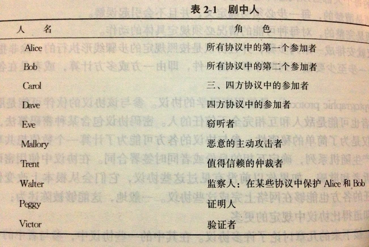
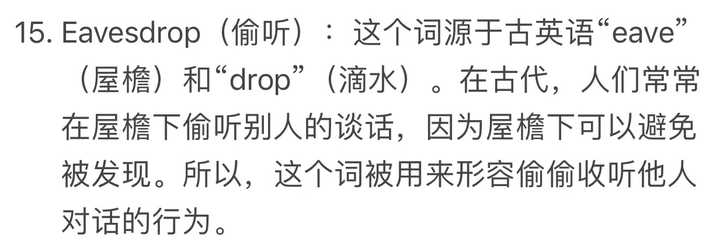

> 作者：一袋米要扛几楼　|　赞同 1054　|　评论 38　|　[原文](https://www.zhihu.com/question/21088829/answer/3589838120)

看到化学界用meth-、eth-、prop-来表达甲乙丙，我作为通信领域工作人员也忍不住分享一个只在通信技术里使用的人员代号系统。

爱丽丝（Alice）与鲍伯（Bob），只要他们俩出现，爱丽丝都需要把一条讯息传送给鲍伯。

Alice和Bob最早出现在1978年2月，由Rivest、Shamir和Adleman三人在网页链接{《Communications of the ACM》}发表的论文《一种实现数字签名和公钥密码系统的方法》（A Method for Obtaining Digital Signatures and Public-key Cryptosystems）中。在这篇论文中首次使用了Alice和Bob来描述方案，因此1978年2月成为了Alice和Bob的生日。

一般Alice代表发送方，Bob是接收方，他们俩是出场率最高的。

C和D则代表第三和第四 ，虽然通信系统中存在需要三方和四方通信的场景，但是一般都可以被简化成两方之间的模型老讨论，所以Carol和Dave出场机会不多，甚至Carol有时也会用Charlie的名字出现。

出场率仅次于Alice和Bob的是跳过C、D的Eve，她是作为一个窃听者的角色出现的，她拥有偷听的技术，但非常有操守，不会中途篡改传送的讯息。

在量子密码学中，伊夫也可以指环境（environment）。

Eve名字来源是eavesdrop，这个词在英文中的起源也很有意思，我贴在下面了。

接下来就是Mallory，他跟Eve不一样，他是一位恶意攻击者（malicious attacker），Mallory会篡改传送的讯息。对付Mallory所需的信息安全技术比对Eve的高出很多。有时亦会叫作马文（Marvin）或马利特（Mallet）。

剩下的则是各自扮演不同角色的NPC。

艾萨克（Isaac） 是互联网服务提供者 (ISP)。

伊凡（Ivan） 是发行人，使用于商业密码学中。

贾斯汀（Justin） 是司法（justice）机关。

马提尔达（Matilda） 是一位商人（merchant），用于电子商务。

奥斯卡（Oscar） 是敌人，通常与马洛里一样。

帕特（Pat）或佩吉（Peggy） 是证明者（prover），维克托（Victor）是验证者（verifier）。两人会证实一项事件是否有实际进行，多使用于零知识证明。

普特（Plod或Officer Plod） 是执法官员。名称来自伊妮·布来敦所著的儿童文学《诺弟》（Noddy）中的角色“普特先生”。

史蒂夫（Steve） 代指隐写术（Steganography）。

特伦特（Trent） 是一位可信赖的仲裁人（trusted arbitrator），中立的第三者，根据存在的协议而判断。

特鲁迪（Trudy） 是侵入者（intruder），等同马洛里。

沃特（Walter） 是看守人（warden）。根据已存在的协议而保护爱丽丝和鲍伯。

佐伊（Zoe） 通常是一个安全协议中的最后参与者。
