> 作者：菜狗逆向　|　赞同 3　|　评论 0　|　[原文](https://zhuanlan.zhihu.com/p/603724812)

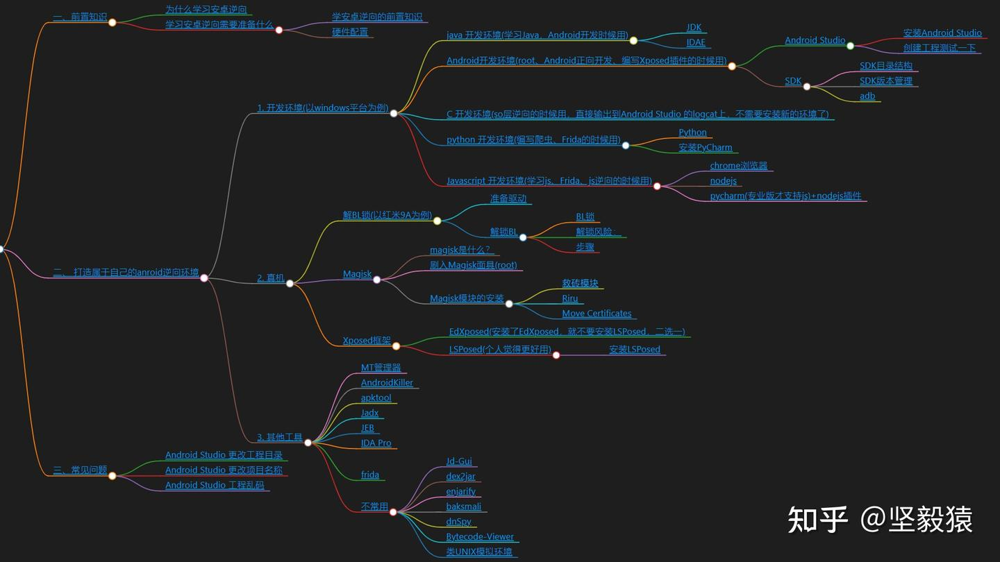

> **本公众号分享的所有技术仅用于学习交流，请勿用于其他非法活动，如果错漏，欢迎留言指正**
>
> 《Android软件安全与逆向分析》丰生强
>
> 《 Android应用安全防护和逆向分析》姜维

## **Android逆向前期准备**

## **一、前置知识**

### **为什么学习安卓逆向**

1.  学习研究

-   去广告
-   破解内购
-   自动化

-   臧航准备网自动登陆
-   车智赢自动登陆
-   大姨妈自动登陆
-   京东价格监控
-   酒仙网自动登陆，预约茅台
-   大商天狗自动登陆，预约茅台
-   司小宝自动登陆

-   刷播放量

-   刷B站完播率，批量注册B站账号

-   获取评论

-   抓取得物的推荐区的评论
-   抓取抖音评论

-   根据关键词搜索商品

-   识货搜索型号，获取到尺码和价格
-   唯品会搜索商品
-   知乎搜索

-   ......

### **学习安卓逆向需要准备什么**

### **学安卓逆向的前置知识**

-   逆向分为：安卓逆向，win逆向

-   逆功能：破解内购道具，去广告等等
-   逆协议：比如，某APP注册的时候有一个`Sign`的加密。这时候app逆向`逆的是协议`(让爬虫爬到app的数据) 需要学习的内容：

1.  环境搭建：

-   java开发环境
-   Android开发环境
-   c开发环境
-   python开发环境
-   JavaScript开发环境
-   真机(解BL锁，刷Magisk，装Xpose)
-   其他工具

1.  Android应用开发：

-   java：基础语法，面向对象、接口，反射机制等。各类常见加密算法的java层实现和破解方法
-   四大组件( activity,service,provider,broadcast)，界面控件，消息事件处理、网络通信等

1.  java层逆向：

-   回编译(AndroidKiller)
-   smali汇编
-   静态逆向分析(jadx)
-   动态调试(jeb、AndroidStudio）
-   java层的反调试与反反调试

1.  native层逆向：

-   `C`语言：数据类型，语法糖，指针，常见加密算法native层实现。
-   NDK开发(linux下的`so`类似win下的`dll`)
-   ARM汇编(寄存器，指令码，立即值，常量)。
-   静态分析、动态调试(双IDA调试)。
-   native层中反调试与反反调试
-   unicorn/unidbg

1.  HOOK与注入技术框架:

-   xposed(java、Android Studio)
-   Frida(python、JavaScript、pycharm)
-   特征检测与绕过
-   沙箱

1.  APP协议分析(抓包)

-   hHTTP/S、TCP、Websocket详解
-   各种反抓包原理及破解方法

1.  加壳与脱壳

-   ollvm

1.  定制rom

-   Android源码编译
-   root检测绕过
-   @Todo

### **硬件配置**

-   电脑: 主流电脑配置即可，内存尽量大，主频尽可能高

-   如果有条件的话，电脑安装虚拟机装linux系统

-   手机: 安卓手机

-   如果有条件上谷歌的亲儿子(nexus或者pixel)，国产的手机推荐红米9A(经济实惠，缺点就是cpu是arm 32的，未来无法调试arm64的程序，入门足够了)

-   暂时没有真机可以先用模拟器一段时间

-   夜神模拟器(最新支持Android 9)、雷电模拟器、逍遥模拟器
-   但尽量还是使用真机，安卓模拟器存在兼容性的问题，有些app无法在模拟器上运行，因为模拟器是基于x86的架构，而有些app只认v7或者v8架构的cpu。

## **二、 打造属于自己的anroid逆向环境**

### **1\. 开发环境(以windows平台为例)**

-   开发系统可以是Win10、linux(kali)、mac

### **java 开发环境(学习Java，Android开发时候用)**

### **JDK**

-   **JRE**，（ Java Runtime Envrionment ），Java 运行时环境。

-   含JVM和运行必备的类库。
-   电脑上想要运行java程序，就必须安装JRE。

-   **JDK**，（ Java Development Kit ），Java开发工具。

-   含**JRE** 和 开发必备的工具(编译工具javac.exe 和 运行工具java.exe)
-   想要开发Java应用程序，就必须安装JDK。

> JDK下载地址： [https://www.oracle.com/java/technologies/downloads/#jdk18-windows](https://www.oracle.com/java/technologies/downloads/#jdk18-windows)

-   jdk-19\_windows-x64\_bin.exe 必须去安装 否则无法运行依赖Java环境的软件或者工具

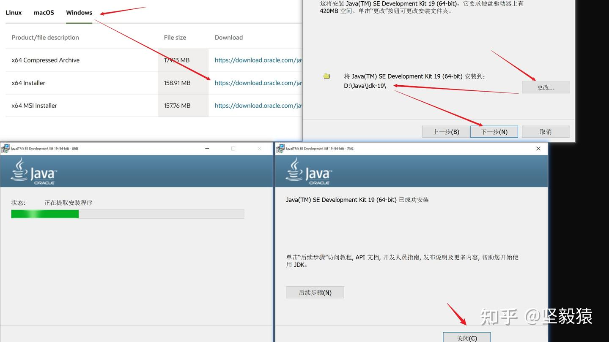

-   配置环境变量

-   **JAVA\_HOME**：jdk安装的目录
-   **CLASSPATH**：`.;%JAVA_HOME%\lib;%JAVA_HOME%\lib\tools.jar`(注意前面是有一个点的)
-   **path**：添加`%JAVA_HOME%\bin`

-   验证配置环境变量是否生效：打开cmd，输入`java --version`，`javac`

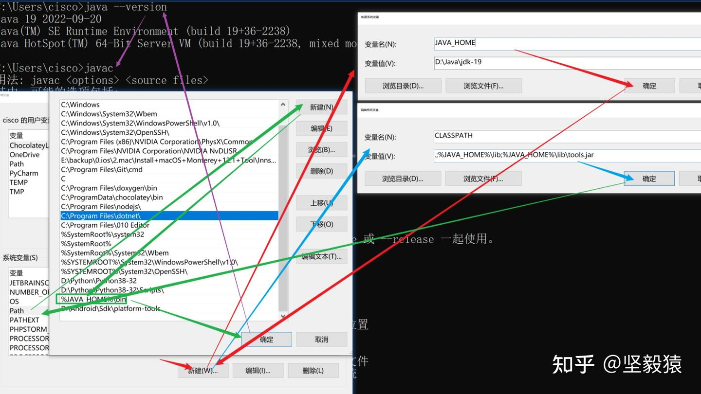

### **IDAE**

> 下载地址： [https://www.jetbrains.com/idea/download/#section=windows](https://www.jetbrains.com/idea/download/#section=windows)

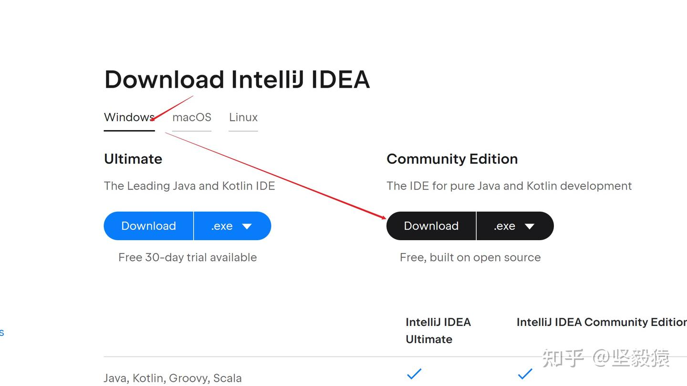

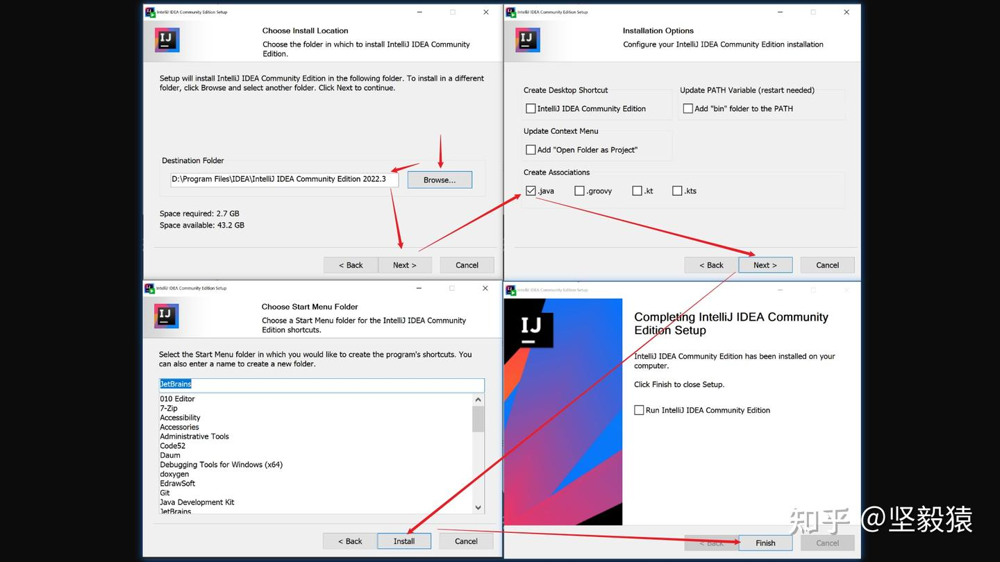

### **Android开发环境(root、Android正向开发、编写Xposed插件的时候用)**

### **Android Studio**

### **安装Android Studio**

> 下载地址： [https://developer.android.google.cn/studio/](https://developer.android.google.cn/studio/)

-   \==要安装Android studio首先要配置好jdk环境==

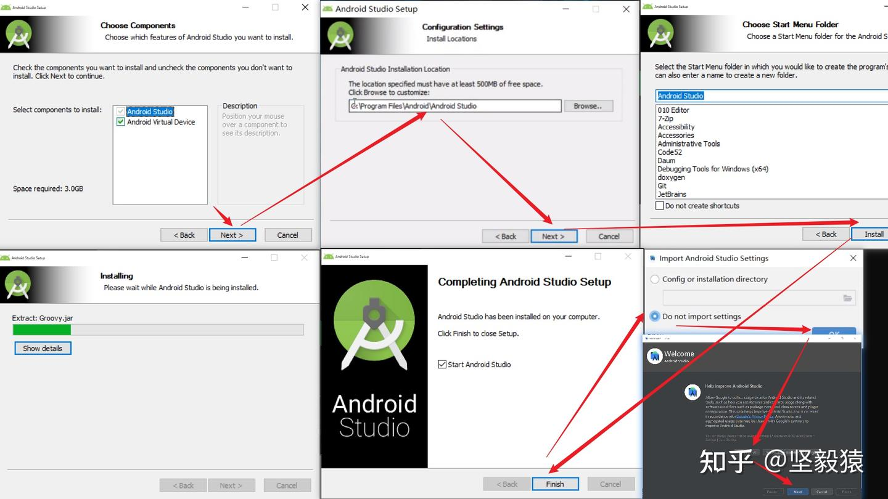

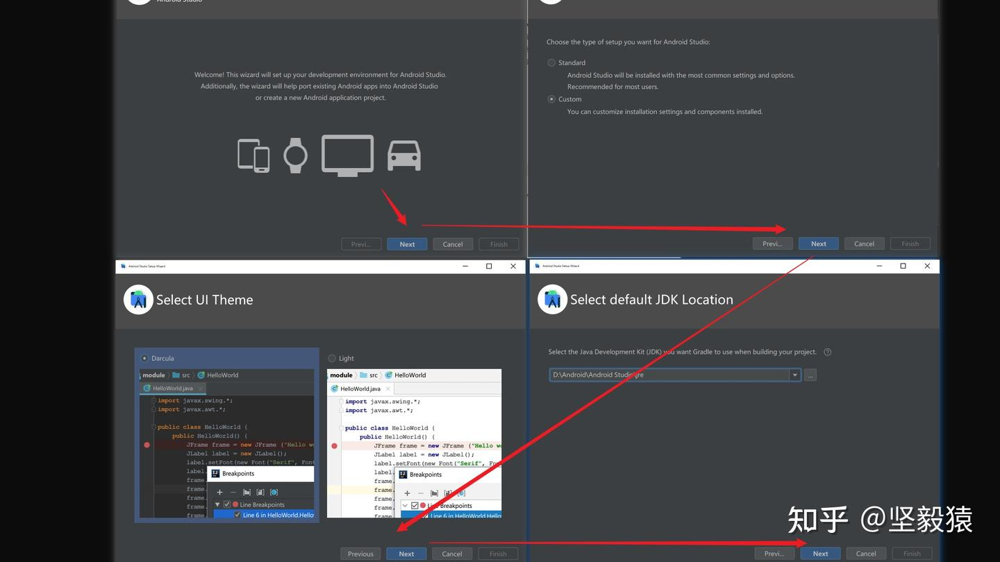

-   安装Android studio的过程中会下载SDK

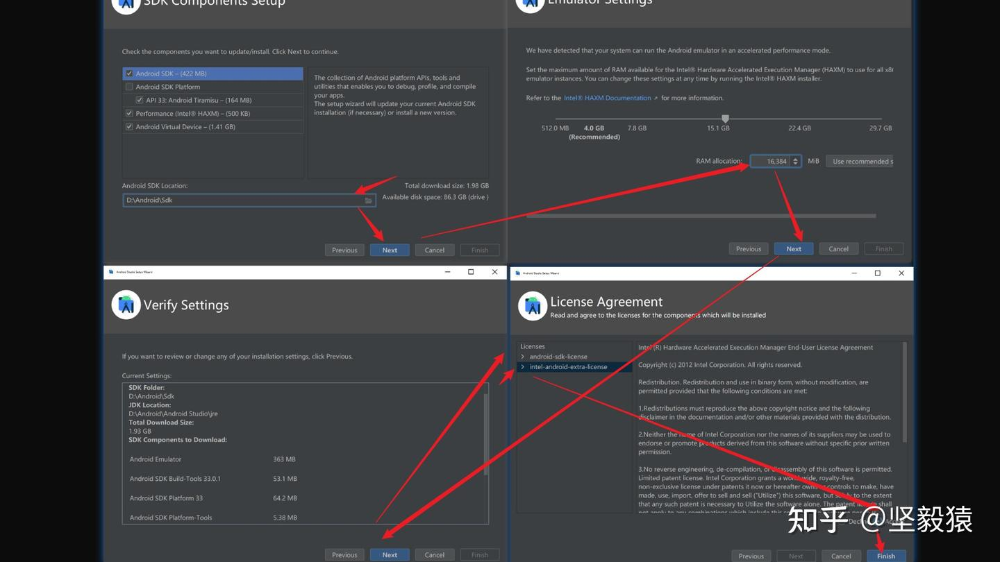

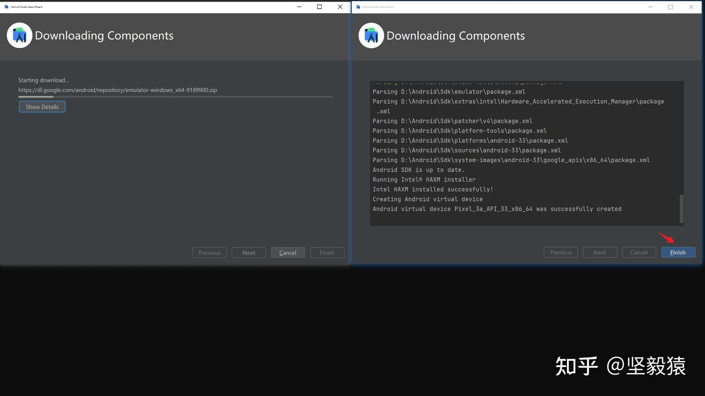

### **创建工程测试一下**

-   MininumSDK先保持默认，后续有需要可以手动修改`minSdkVersion`的字段

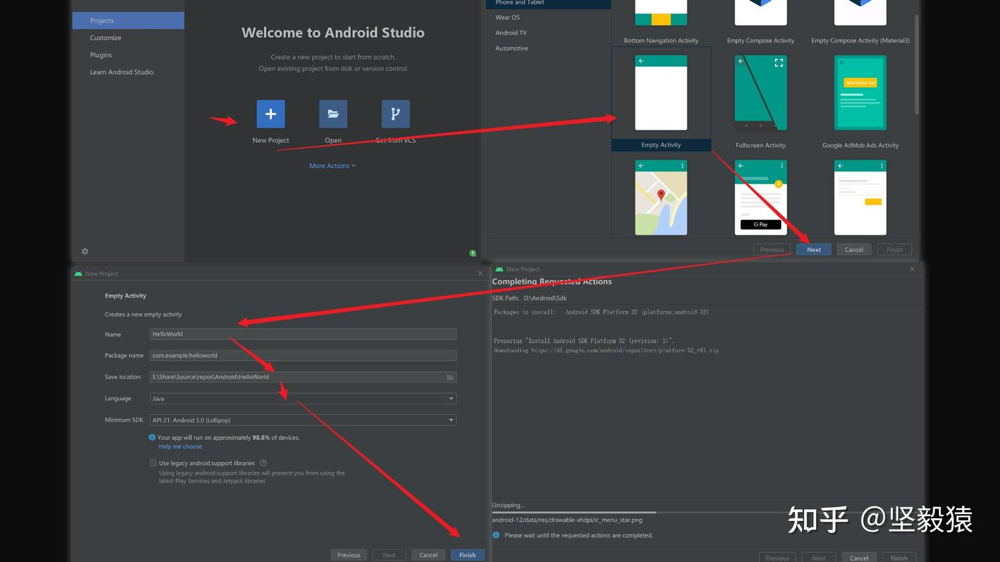

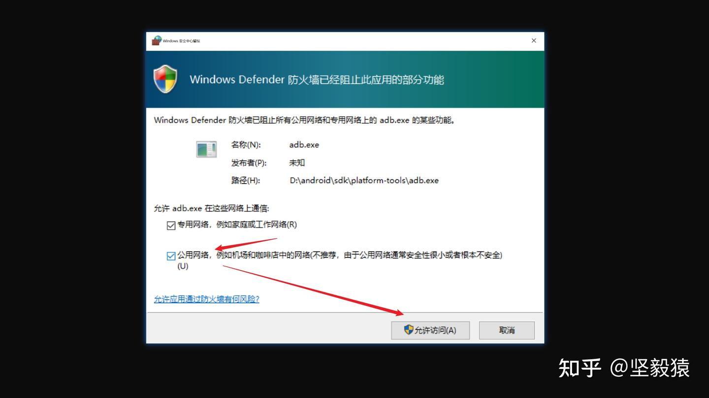

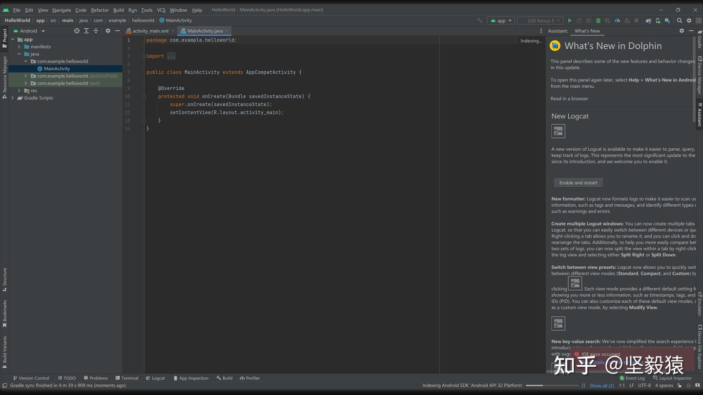

-   #坑/逆向/app逆向/AndroidStudio/模拟器 `HAXM`的插件只支持`Intel`的cpu，只有安装这个插件才可以运行Android Studio 自带的模拟器。该插件不支持`AMD`的cpu(AMD的cpu只能使用Genymotion模拟器，首先需要安装virtualBox虚拟机，然后再安装Genymotion模拟器，有需要请自行百度)。

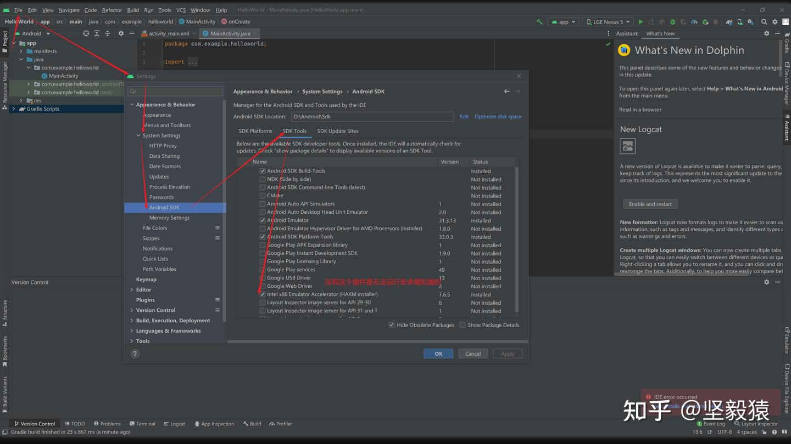

-   选择对应的设备，运行

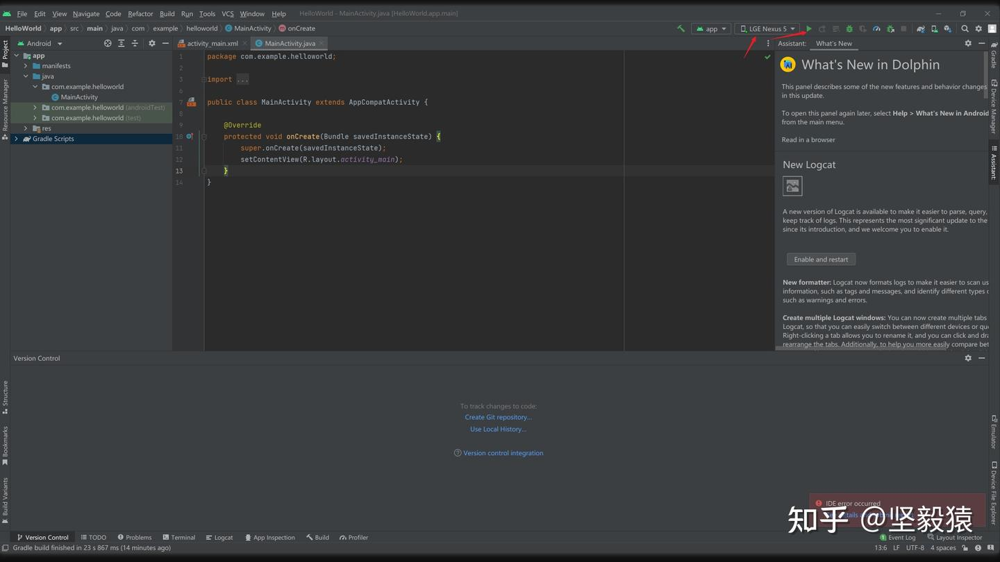

-   电脑实时显示手机画面，用电脑的鼠标和键盘控制手机

> QtScrcpy : [https://gitee.com/Barryda/QtScrcpy](https://gitee.com/Barryda/QtScrcpy)

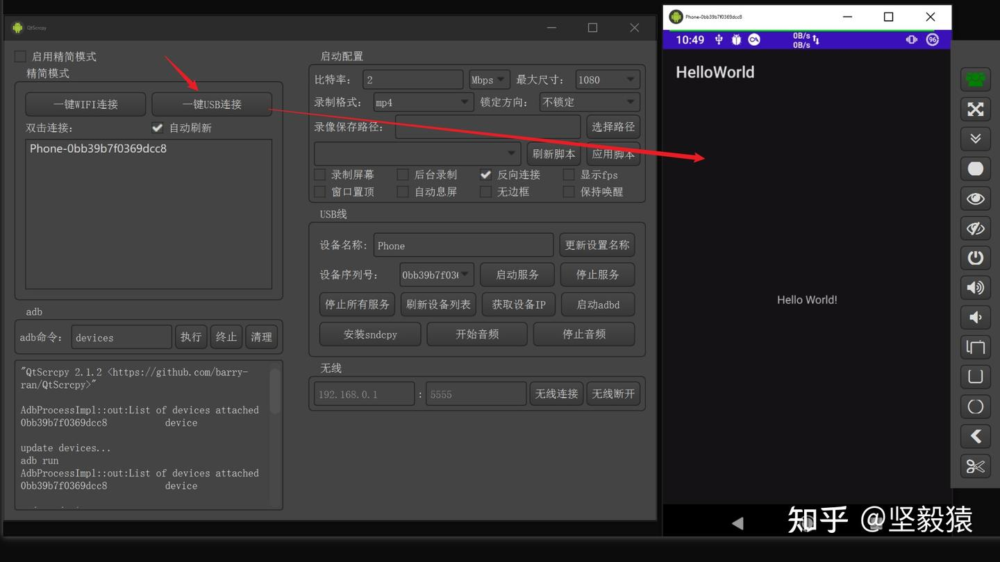

### **SDK**

-   SDK（software development kit）软件开发工具包。被软件开发工程师用于为特定的软件包、软件框架、硬件平台、操作系统等建立应用软件的开发工具的集合。因此，Android SDK 指的是Android专属的软件开发工具包。

### **SDK目录结构**

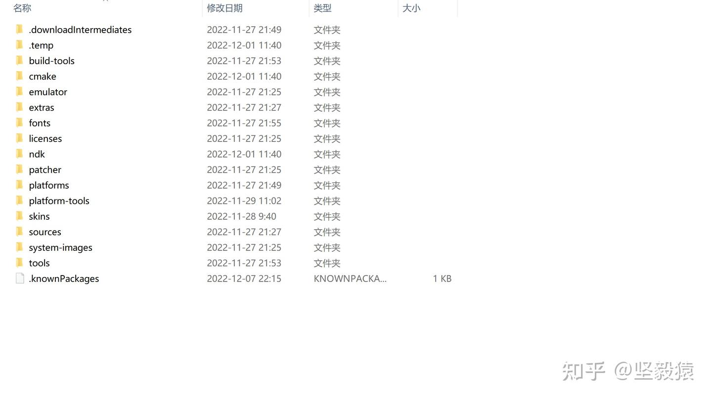

1.  `.downloadlntermediates`：看名字，像是下载文件时的临时目录
2.  `.temp`：下载文件时的临时目录
3.  `build tools`：

-   编译工具目录这里保存着一些Android开发常用的工具，例如adb、aidl等等。

-   `aidl.exe`：把.aidl 接口转换成java接口
-   `dexdump.exe` (逆向调试工具) : dump devlik中间代码
-   `aapt.exe`（Android Asset Packaging Tool）：编译应用程序的资源文件（包括AndroidManifest.xml和你的Activities的xml文件），生成R.java文件，这样你就可以从你的java代码中引用资源。
-   `dx.bat`(编译脚本)：将.class中间代码转化为dvlik中间代码,所有经过java编译的生成.class文件都需要此工具进行转换,最后打包进apk文件中。

-   当创建Android项目(构建项目)的时候会用到这个包。在创建项目的时候如果没有此包会报错。(随着SDK版本的迭代，编译工具也会有相应新版本，建议使用最新的编译工具)

1.  `cmake`：Android SDK 的 CMake 的默认版本是3.10.2。Cmake是用来makefile的一个工具，读入所有源文件之后，自动生成makefile。
2.  `emulator`：这里存放的是一些安卓模拟器
3.  `extras`：该文件下存放了Google提供的USB驱动，Intel提供的硬件加速附件工具包。(后期存放了Android Support兼容包，使用兼容包版本时最好与SDK版本保持一致)
4.  `fonts`：存放一些字体文件
5.  `licenses`：market\_licensing作为AndroidMarket版权保护组件，一般发布付费应用到电子市场可以用它来反盗版。
6.  `ndk`：ndk（Native Development Kit）跟sdk差不多的，是它也是一个开发工具包。可以让开发者在 Android 应用中使用 C 和 C++ 代码。
7.  `patcher`：增量更新，用于更新记录。
8.  `platforms`

-   里面是根据APILevel划分的SDK版本/平台，这个文件夹是SDK里面最重要的文件(每个平台的SDK真正的文件)
-   以Android6.0为例，进入后有一个android-23的文件夹，android-23进入后是Android6.0 SDK的主要文件

-   data：保存着一些系统资源，
-   skins：Android模拟器的皮肤，
-   templates：是工程创建的默认模板，
-   android.jar：是该版本的主要framework文件。

1.  `platform-tools`：

-   该文件夹下放了Android平台的相关开发和调试工具,比如`adb.exe`、`sqlite3.exe`等。
-   这里和platforms目录中tools文件夹有些重复，主要是从android2.3开始这些工具被划分为通用了。

1.  `skins`：Android模拟器的皮肤
2.  `source`：这个文件夹下面存放的是Android的源代码。
3.  `system-images`：存放的是创建Android虚拟机时的镜像文件(已经编译好的镜像文件,模拟器可以直接加载)。从android-14开始将模拟器镜像文件整理在这里(原来放在platforms下)
4.  `tools`：

-   这个文件夹下存放了大量Android开发、调试的工具。包括测试、调试、第三方工具。模拟器、数据管理工具等。

-   `ddms`：用于启动Android调试工具，
-   `logcat`：屏幕截图和文件管理器，
-   `draw9patch`：绘制android平台的可缩放png图片的工具，
-   `monkeyrunner`：是一个不错的压力测试应用，模拟用户随机按键，
-   `mksdcard`：模拟器SD映像的创建工具，
-   `emulator`：Android SDK模拟器主程序，不过从android 1.5开始，需要输入合适的参数才能启动模拟器，
-   `traceview`：作为android平台上重要的调试工具。

1.  `.knownPackages`：未知

### **SDK版本管理**

-   通过SDK Manager查看Android系统对应的SDK版本，根据手机Android系统的版本下载对应版本的SDK，多个版本用`SDK Manager`管理。

1.  方式1

-   Android SDK Manager已经内置于Android Studio中，可以使用Android Studio中的Android SDK Manager。

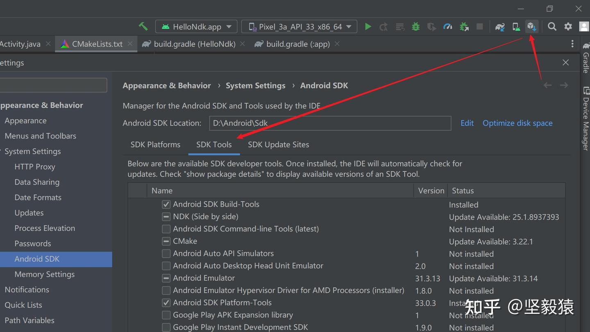

1.  方式2

-   也可以使用SDK自带的Android SDK Manager，如果SDK缺失`Android SDK Manager`，可以去下面网站下载`SDK Tools`： [https://www.androiddevtools.cn/](https://www.androiddevtools.cn/)

-   \===只把SDK Manager.exe拷贝到自己的SDK下，会发现SDK Manager.exe打不开，黑框一闪而过===。
-   对比两个SDK可以发现：与后面新下载的SDK相比，安装Android studio时下载的SDK多了一个`emulator`文件夹是从后面新下载的SDK的tools拆分出来的

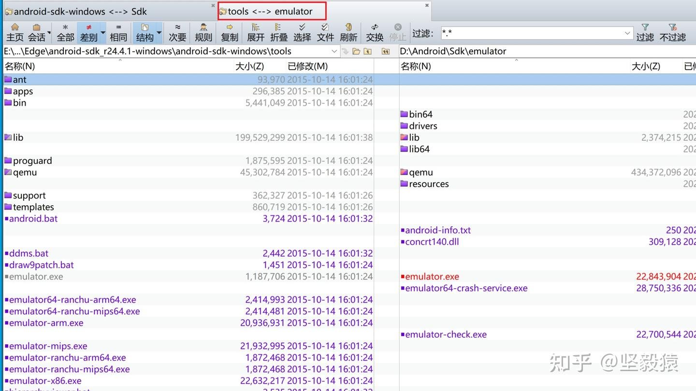

-   而且tools文件里边还缺少了很多重要文件，有的被放到别的文件夹，有的直接被删除了，比如`ddms.bat` 、draw9patch.bat等这些重要的工具。

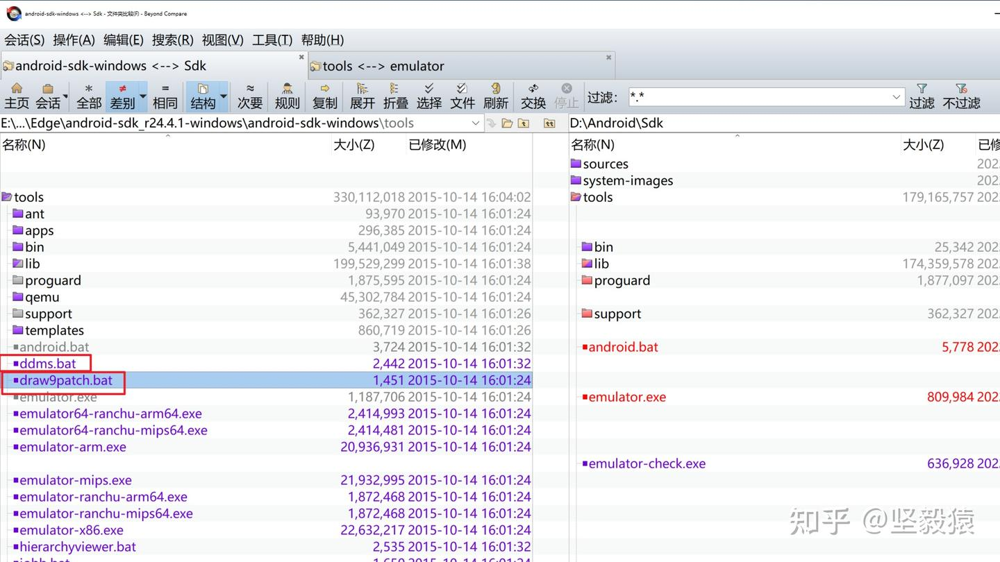

-   解决办法：用后面新下载的SDK的`tools`文件夹替换自己的SDK的`tools`文件夹 (作者亲测这一步不可省略，不然后面解决了环境变量，SDK Manager.exe也还是会闪退。)，再尝试打开一下`SDK Manager.exe`，发现还是闪退！

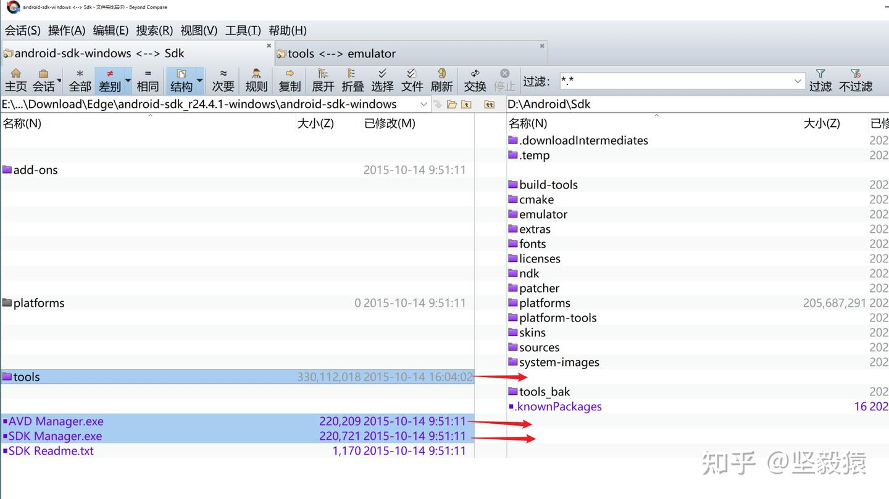

-   原因是：SDK Manager.exe 通过调用 `android-sdk-windows\tools\lib\find_java.bat` 确认 java.exe 的路径。

-   调用`android-sdk-windows\tools\lib\find_java.bat`就提示找不到jdk，但环境变量是没问题的。
-   解决办法：只能重新卸载jdk，重启电脑后，重新安装jdk

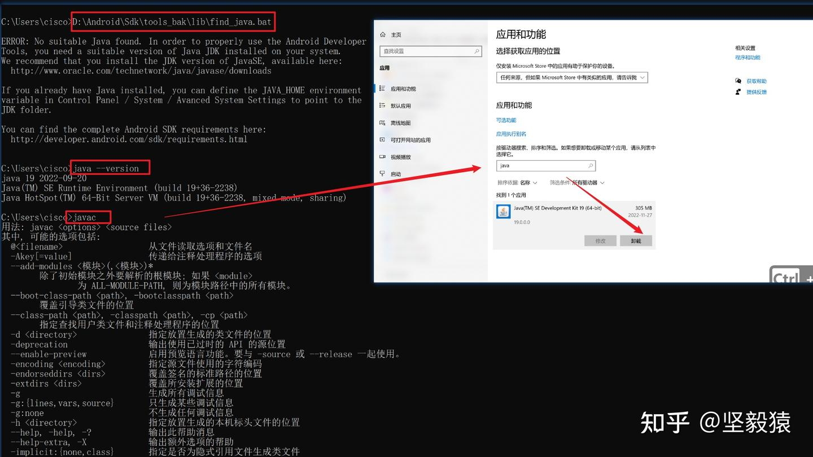

-   现在`SDK Manager.exe`可以运行成功了，`ddms` 也没问题

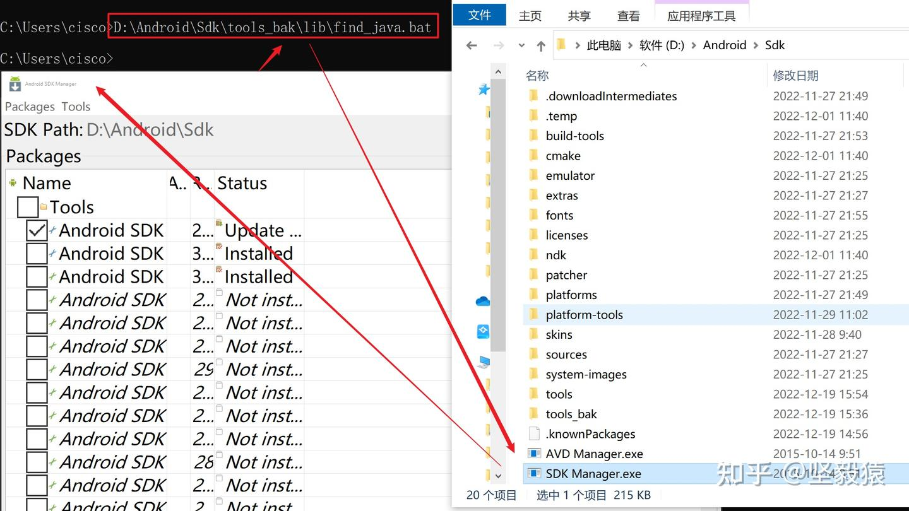

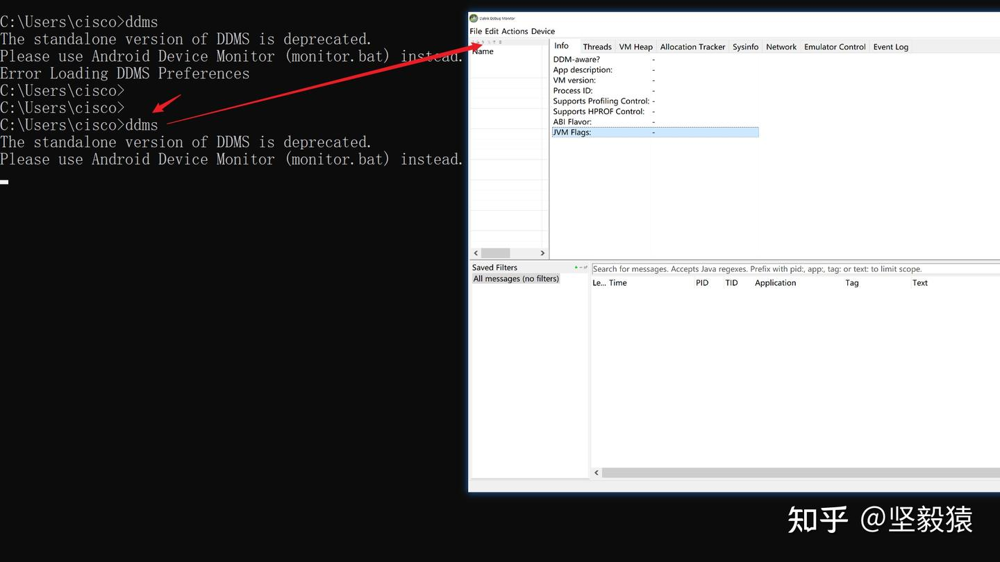

1.  建议安装的Packages

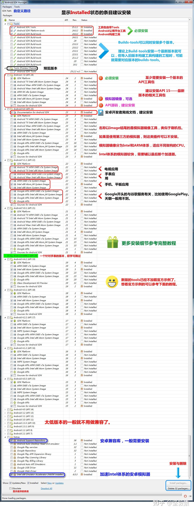

### **adb**

Adb(android debug bridge)：android调试桥是一个用于管理 android 终端(或者模拟器)状态的工具。

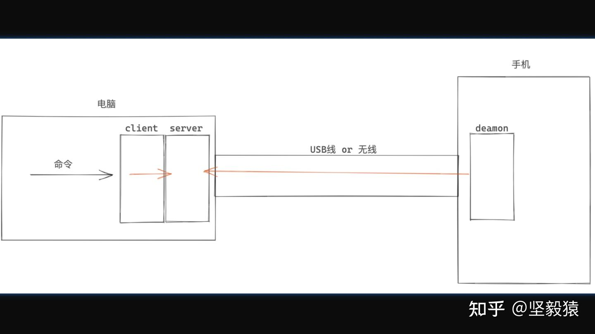

1.  adb和 SDK的关系

-   SDK内置了adb。SDK的`platform-tools`目录下包含通用工具，比如`adb`、和aapt、aidl、dx等文件

1.  adb的配置

-   把`SDK`目录下的`platform-tools`文件夹的路径添加到系统变量`Path`中去

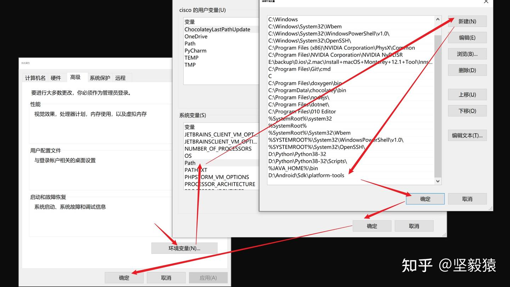

-   打开cmd，输入`adb`，验证环境变量是否设置成功

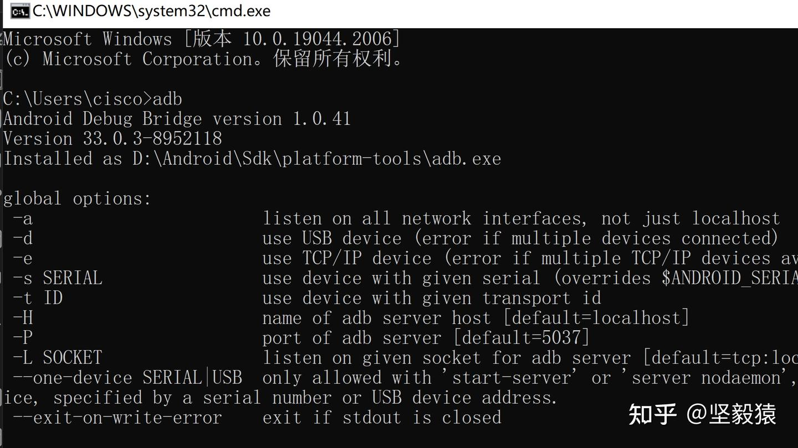

1.  adb devices连接不上安卓设备

-   打开设备管理器-便携设备-属性-记录`VID`和`PID`
-   查找文件夹`.android`，在该文件夹下找到文件`adb_usb.ini`，如果找不到可以新建一个,在`adb_usb.ini`文件里添加设备的`VID`和`PID`
-   打开cmd，输入`adb kill-server|adb start-server|adb devices`重启adb

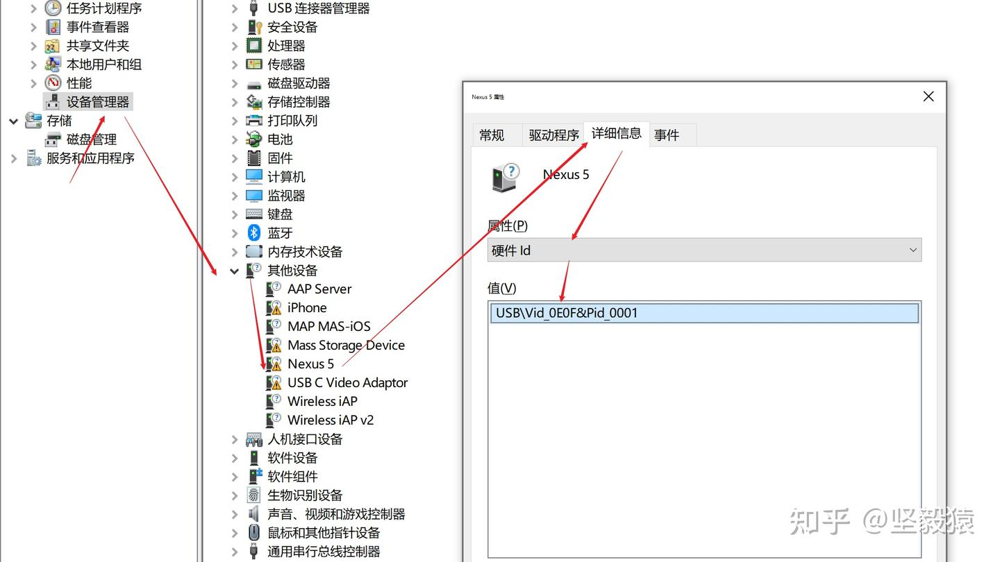

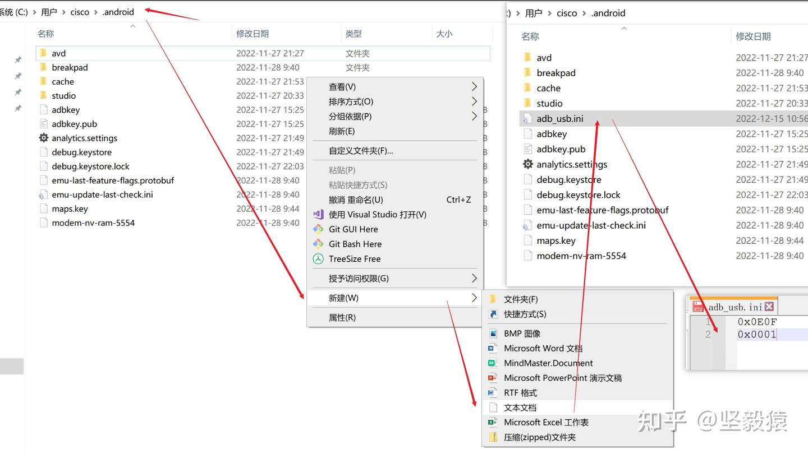

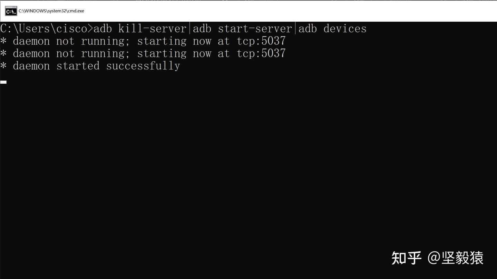

-   若如上还不能解决问题，就需要检查一下pc端的adb的版本。

-   若pc端的adb版本使用`1.0.31`或者`1.0.32`的版本，当连接android6.0版本之后的手机经常会出现adb命令不通情况。
-   建议把pc端的adb版本升级到`1.0.36`及其以后的版本。
-   方法是：下载新的adb包，替换android.sdk/platfrom-tools下面的`adb.exe`、`AdbWinApi.dll`、`AdbWinUsbApi.dll`三个文件，执行`adb start-server` #坑/逆向/app逆向/adb adb devices没有显示设备::如果还是不能解决问题，==重启电脑可以解决99%的问题 ==

1.  WiFi ADB

-   应用场景：

-   平常一般都是直接通过 USB 线或者 Type C线的方式连接，来完成日常的开发和调试种开发模式。
-   当电脑的 USB 口比较少，有多台手机的时候，线束比较杂乱，不够优雅。这时候可以使用adb WiFi 调试模式。 a. 方式1：通过adb打开

-   通过以下几个步骤即可完成（开始这些配置之前先确保你的 adb 环境是配置好的）：

1.  确保 Android 手机和电脑连接的是同一局域网的 WiFi；

1.  通过 USB 线连接 Android 手机(首次连接需要usb数据线)；

1.  执行以下命令

```
C:\Users\cisco>adb devices
List of devices attached
KBVO8******S8TYT        device
0bb39******9dcc8        device

# 注意: 如果有多个手机连接在电脑上，需要用 -s "serial_number" 参数指定目标手机
# 设置手机侦听端口 5555 上的 TCP/IP 连接：
C:\Users\cisco>adb -s 0bb39******9dcc8 tcpip 5555
restarting in TCP mode port: 5555    # 在命令行中看到 TCP mode port: 5555 就表示监听成功：

# 进入手机设置-wifi，查看手机所连接的网络的ip地址
# 通过 connect 命令和 IP 地址以及端口号连接到目标手机
C:\Users\cisco>adb connect 172.20.10.13:5555
connected to 172.20.10.13:5555       # 当看到 connected to xxx:5555 的提示语就表示连接成功

# 拔掉USB线，验证一下，看到如下提示语，说明已成功打开了adb WiFi
C:\Users\cisco>adb devices
List of devices attached
KBVO8******S8TYT        device
172.20.10.13:5555       device

# 输入adb命令操作设备，当有多个设备连接了电脑，导致adb无法识别操作具体哪台设备
C:\Users\cisco>adb shell
adb.exe: more than one device/emulator

# 执行命令adb -s 172.20.10.13:5555 shell，进入指定设备操作
C:\Users\cisco>adb shell
hammerhead:/ $ exit

# adb connect断开
C:\Users\cisco>adb disconnect
disconnected everything

C:\Users\cisco>adb devices
List of devices attached

# 结束adb服务
C:\Users\cisco>adb kill-server

C:\Users\cisco>adb devices
* daemon not running; starting now at tcp:5037
* daemon started successfully
List of devices attached
KBVO854LKBWS8TYT        device

# 通过 connect 命令和 IP 地址以及端口号重新连接到目标手机
C:\Users\cisco>adb connect 172.20.10.13:5555
connected to 172.20.10.13:5555
```

b. 方式2：通过 as的ADB WiFi Connect插件打开 - adb 无线连接每次都得经历那些步骤，有点繁琐，安装这个插件直接在 Android Studio 中直接鼠标点点的快速方式来完成 -

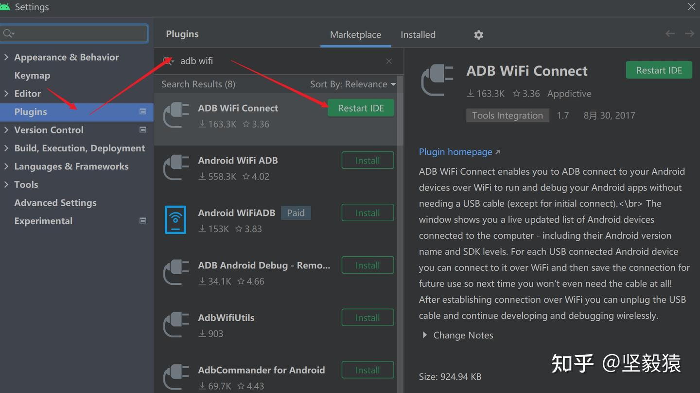

c. 方式3：通过ADB WiFi(app)打开

-   ADB WiFi(com.rair.adbwifi) - 5.1.5 - 应用 - 酷安 ([http://coolapk.com](http://coolapk.com)):[https://www.coolapk.com/apk/com.rair.adbwifi#:~:text=%E6%89%93%E5%BC%80APP%EF%BC%8C%E7%82%B9%E5%87%BB%E7%95%8C%E9%9D%A2%E6%8F%90%E7%A4%BA%E4%B8%8A%E6%96%B9%E7%9A%84%E5%9B%BE%E6%A0%87%E5%90%AF%E5%8A%A8adb%20wifi%EF%BC%8C%E4%B8%8B%E6%96%B9%E5%B0%86%E4%BC%9A%E5%87%BA%E7%8E%B0adb,connect%20ip%3A5555%E5%91%BD%E4%BB%A4%E3%80%82](https://www.coolapk.com/apk/com.rair.adbwifi#:~:text=%E6%89%93%E5%BC%80APP%EF%BC%8C%E7%82%B9%E5%87%BB%E7%95%8C%E9%9D%A2%E6%8F%90%E7%A4%BA%E4%B8%8A%E6%96%B9%E7%9A%84%E5%9B%BE%E6%A0%87%E5%90%AF%E5%8A%A8adb%20wifi%EF%BC%8C%E4%B8%8B%E6%96%B9%E5%B0%86%E4%BC%9A%E5%87%BA%E7%8E%B0adb,connect%20ip%3A5555%E5%91%BD%E4%BB%A4%E3%80%82)
-   好处：

-   ADB WIFI可以帮助您在没有数据线的情况下，通过adb命令连接您的手机。(首次连接不需要usb数据线)
-   不用的时候关闭，省电一点？

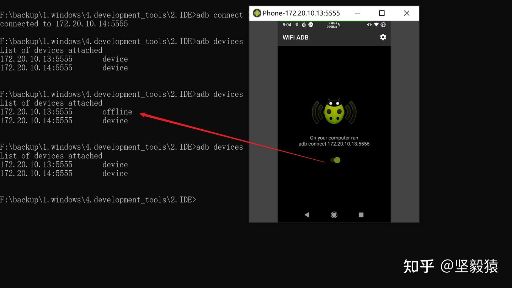

### **C 开发环境(so层逆向的时候用，直接输出到Android Studio 的logcat上，不需要安装新的环境了)**

-   vscode
-   vs2019
-   gcc

### **python 开发环境(编写爬虫、Frida的时候用)**

### **Python**

> **[https://www.python.org/downloads/](https://www.python.org/downloads/)**

-   建议安装**python3.8版**

-   如果你现在电脑上只安装了python3.9，也可以再安装一个python3.8，Python支持多版本共存。

-   把python添加到系统环境变量path里面
-   \-验证配置的环境变量是否生效：打开cmd，输入`python`

### **安装PyCharm**

> **[https://www.jetbrains.com/pycharm/download/#section=windows](https://www.jetbrains.com/pycharm/download/#section=windows)** 破解激活请百度

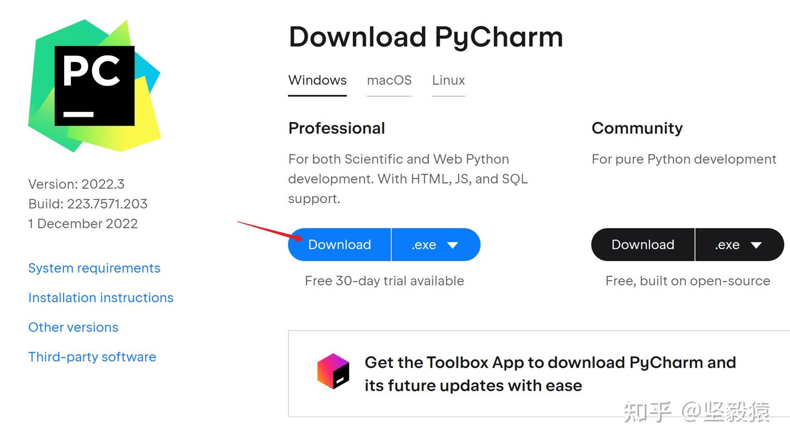

### **Javascript 开发环境(学习js、Frida、js逆向的时候用)**

### **chrome浏览器**

> **[https://www.google.cn/chrome/](https://www.google.cn/chrome/)**

### **nodejs**

> nodejs： **[https://nodejs.org/zh-cn/download/](https://nodejs.org/zh-cn/download/)**

-   下载安装nodejs

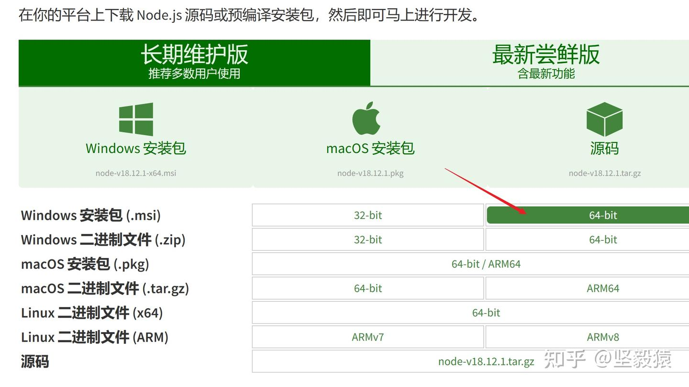

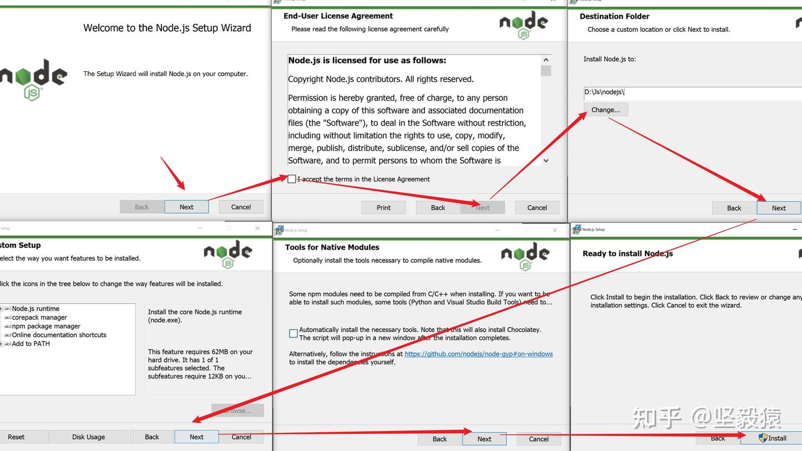

-   配置node系统环境变量

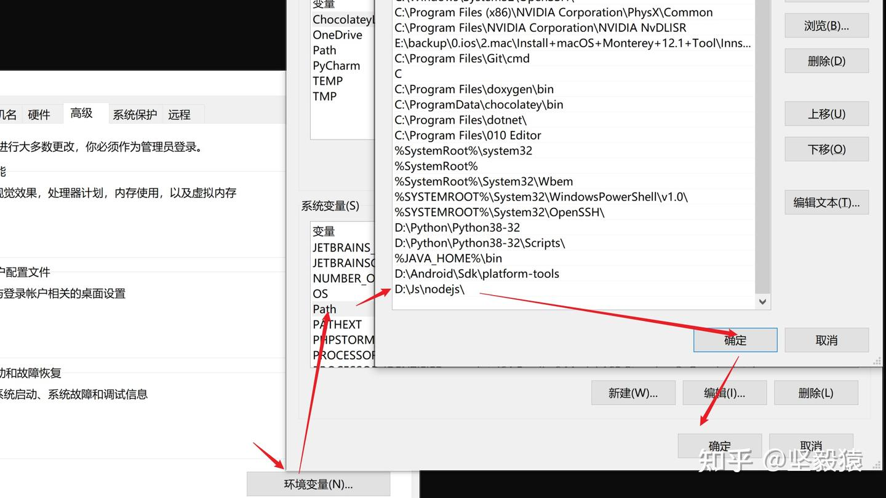

-   验证配置的环境变量是否生效：打开cmd，输入`node --version`

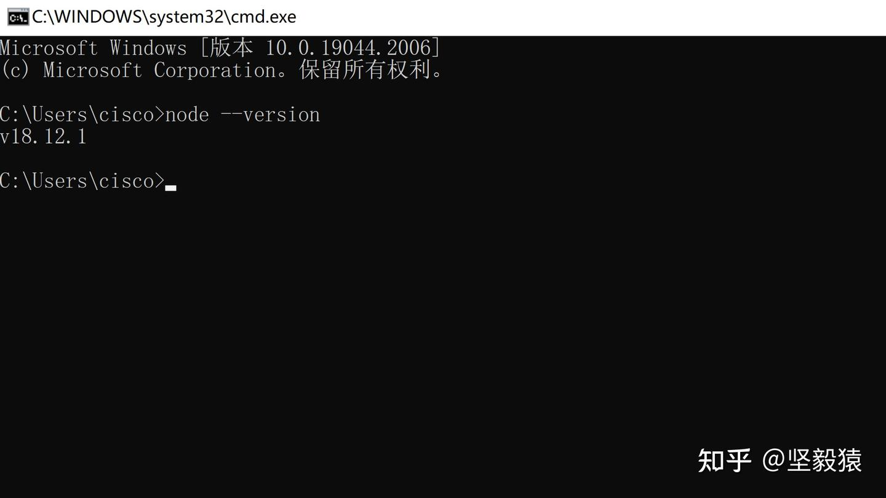

### **pycharm(专业版才支持js)+nodejs插件**

-   安装插件

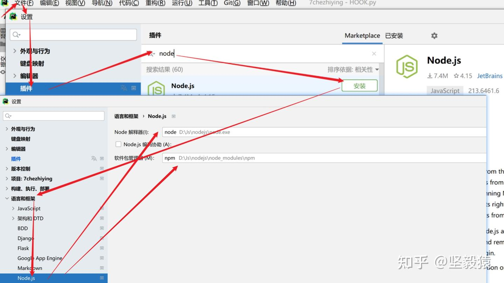

#坑/python/pycharm : 安装插件记得点`应用` 才会生效

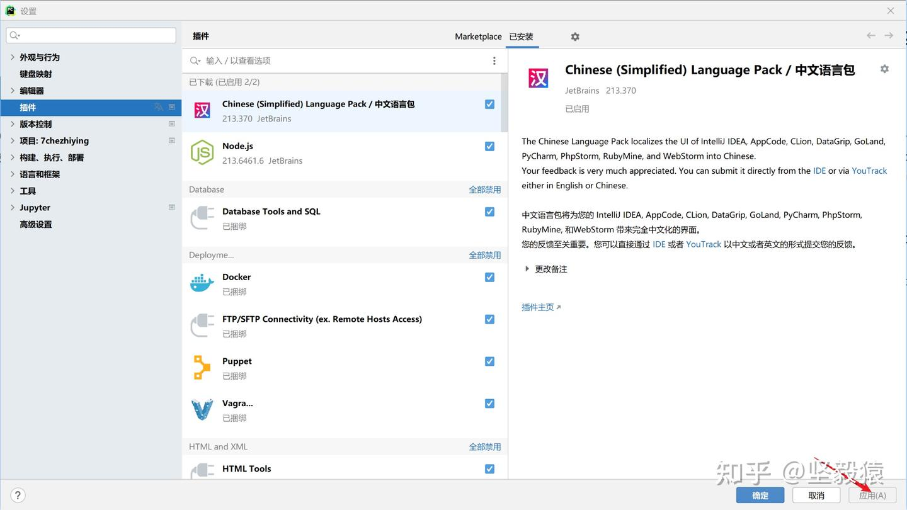

-   编辑配置

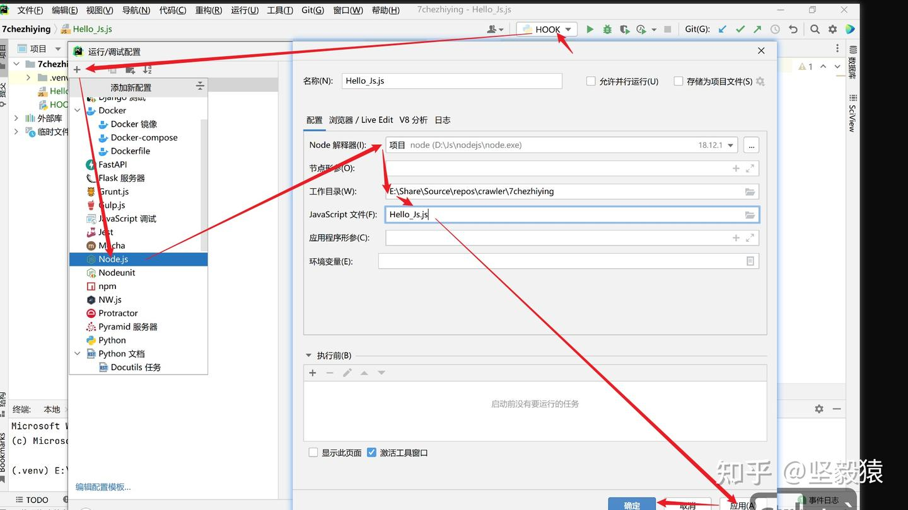

-   运行js代码测试一下

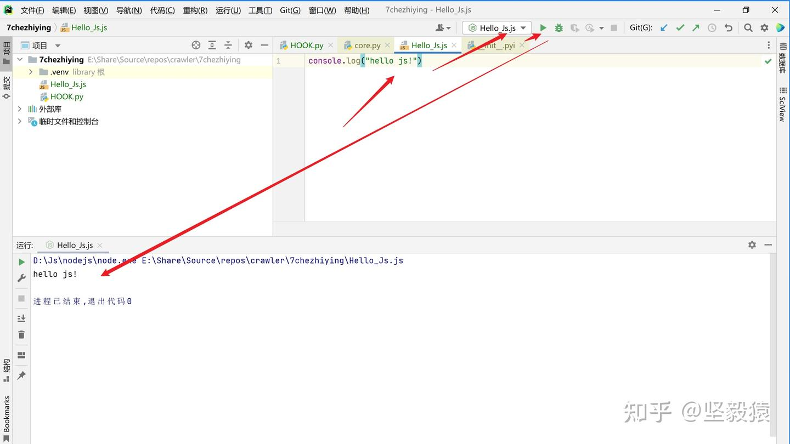

### **2\. 真机**

-   红米9A、nexus 5x、pixel 3
-   \==如果这步实在搞不了，淘宝30块搞定==

### **解BL锁(以红米9A为例)**

### **准备驱动**

> 小米手机服务支持-小米商城 ([http://mi.com](http://mi.com)):[https://www.mi.com/c/service/download/index.html](https://www.mi.com/c/service/download/index.html)

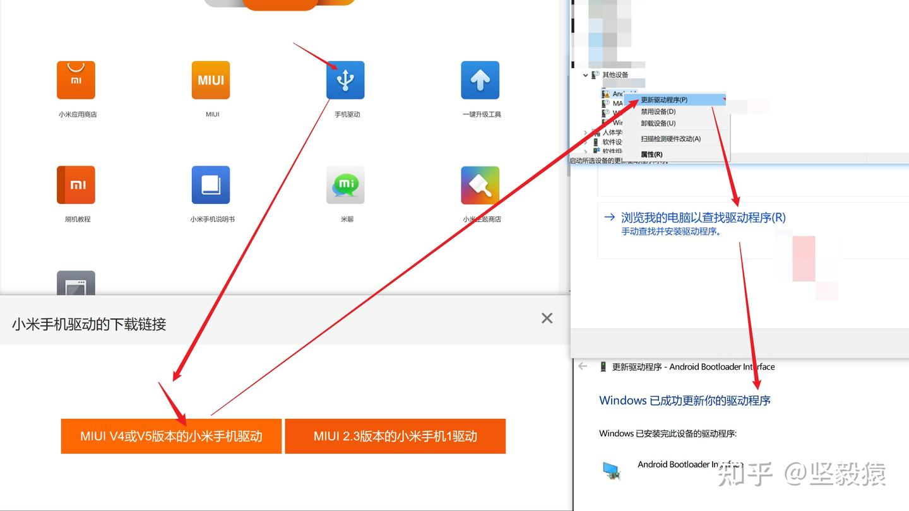

### **解锁BL**

### **BL锁**

-   BL是`bootloader`的简称 就是开机引导程序 ，Bootloader锁，主要是在引导过程中对系统签名，内核签名及Recovery签名进行检验，如果签名不一致，即终止引导。
-   它是限制用户刷第三方ROM和第三方recovery以及限制root的“锁”(我们所说的“解锁”就是他)，锁住recovery和fastboot不会被其他东西随意刷机和篡改。
-   bl未解开状态下无法root也无法刷第三方ROM。因为刷第三方ROM就必须先要刷入第三方REC。

### **解锁风险：**

1.  解锁设备将允许修改系统重要组件，并有可能在一定程度上导致设备受损；
2.  解锁后部分对系统安全性依赖高的功能和服务，比如：查找手机、增值服务等将失效；
3.  解锁后由于刷机导致的硬件故障，小米售后维修网点可以按非保修处理，并按普通的保外软件维修进行收费。

### **步骤**

1.  解bl锁会清除手机(恢复出厂设置)所有数据，记得提前备份好！！！

-   解锁首先要绑定的你的小米账号，点击【绑定账号和设备】(这个有的账号要绑定后三天才能解锁，有的绑定后马上就能解锁，具体以自己的情况为准)。
-   打开【设置】，【我的设备】里点击【全部参数】，连续点击【MIUI版本】几次，直到出现【你已处于开发者模式】提示。
-   【更多设置】里点击【开发者选项】，点击【设备解锁状态】。（2015年之后的小米设备才会加锁，之前的并没有。）

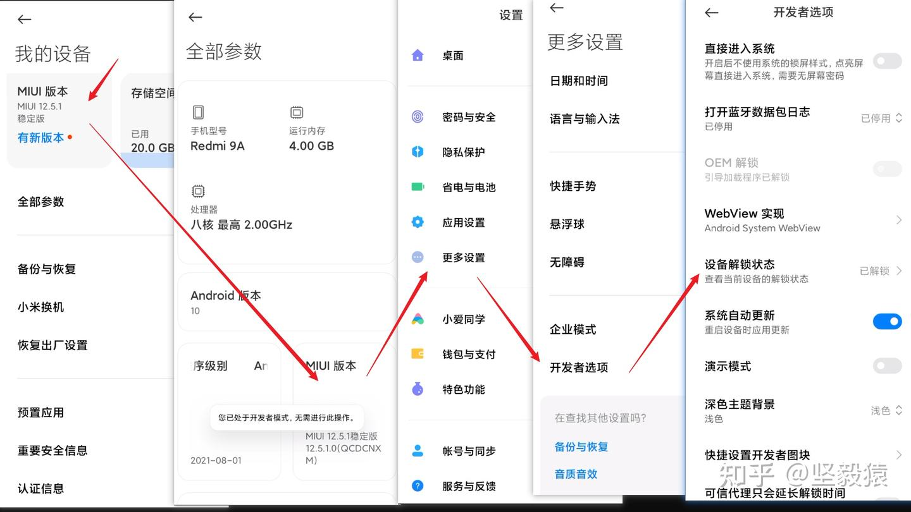

#坑/逆向/app逆向/root/小米: 解BL锁这里不要重复绑定，否则会重新计时重新等7天


1.  运行解锁工具

> 解锁工具：**[https://www.miui.com/unlock/index.html)](https://www.miui.com/unlock/index.html)**

-   还得再次登录自己的小米账号。

1.  当前显示没有连接手机，需要进入fastboot模式。

-   在关机状态下同时按住`音量减键`和`电源键`，直到出现FASTBOOT界面，进入fastboot。此时用数据线连接手机和电脑。
-   连接好后电脑会出现【已连接手机】，点击【解锁】。
-   解锁完成，会自动重启手机。

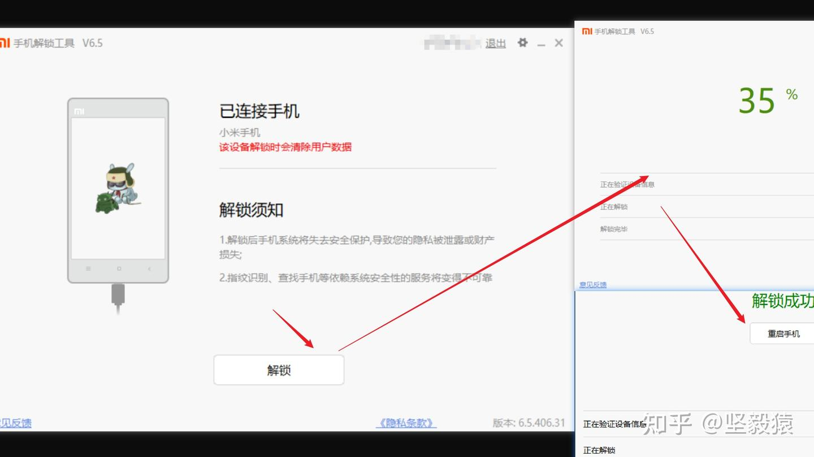

### **Magisk**

### **magisk是什么？**

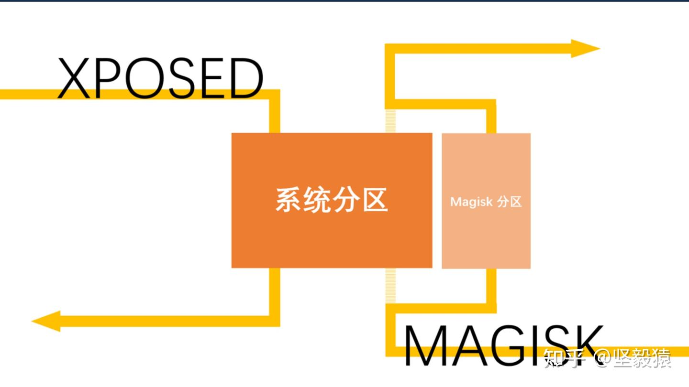

-   对 Android 生态而言，`自定义`和`稳定性`长久以来似乎都是`鱼与熊掌不可兼得`，直到Magisk的横空出世。

-   它是由`topjohnwu`打造的开源框架软件，可以在修改系统功能的同时不会对系统本身造成破坏，但是Magisk更普遍的用途是作为获取和管理Root权限的工具。(在`SuperSU`销声匿迹之后，`Magisk`自然而然就成为了当前Android社区用来获取`root`权限的主流方式)

-   在一些用户眼里，`Magisk`与另一款名 `Xposed`的神器有着高度的相似性，部分群体当中甚至还存在着`Magisk 框架`这样的说法。

-   二者的工作机制都是`拦截`。`Xposed` 通过劫持 Android 系统的 `zygote` 进程来加载自定义功能，这就像是半路截杀，在应用运行之前就已经将我们需要的自定义内容强加在了系统进程当中。
-   Magisk则另辟蹊径，通过挂载一个与系统文件相隔离的文件系统来加载自定义内容，为系统分区打开了一个通往平行世界的入口，所有改动在那个世界(`Magisk 分区`)里发生，在必要的时候却又可以被认为是(从系统分区的角度而言)没有发生过。
-   得益于独特的挂载机制，使用 Magisk 时我们可以有针对性地隐藏 root，甚至暂时隐藏 Magisk 本身。当被挂载的Magisk分区`被隐藏`甚至`被取消挂载`时，原有系统分区的完整性丝毫未损，玩需要`root`验证的游戏、运行对设备认证状态有要求的应用甚至进行需要验证系统完整性的`OTA`更新都没有任何问题。

-   因此严格来说 Magisk 可以被看作是一种文件系统，这种文件系统通过巧妙的实现方式避开了对系统文件的直接修改，从稳定性上来看要优于以往任何一种系统框架，这也是当前它在玩机社区广受认可和好评的原因所在。
-   由于挂载系统的存在，也让 Magisk 拥有了多样的模块化生态系统。

-   Magisk既可以独立使用，只安装`面具模块`。也可以和`Xposed框架`结合起来使用，发掘更多的功能。理论上两者功能可以相互替代，但由于两者侧重点不同以及模块开发难度等原因，`Magisk更多用于对系统的修改，而Xposed更多用于对用户软件的修改`。

### **刷入Magisk面具(root)**

-   magisk刷入前提：

-   手机必须解BL锁
-   电脑具备ADB环境

1.  **下载对应手机型号对应版本的官方镜像**

-   pixel 3

-   对应版本的谷歌官方镜像： [https://developers.google.com/android/images#blueline](https://developers.google.com/android/images#blueline)
-   把boot.img放入手机

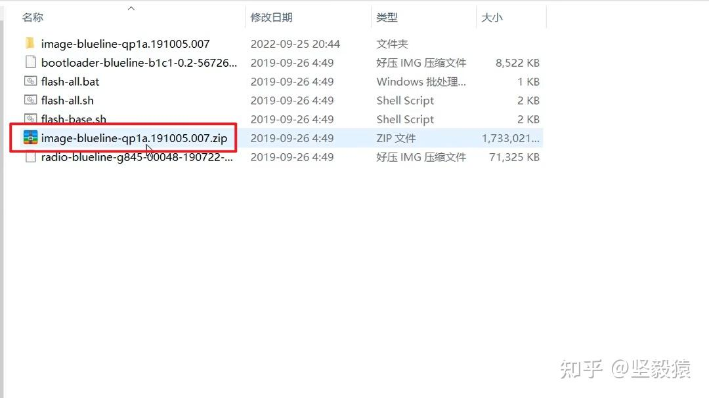

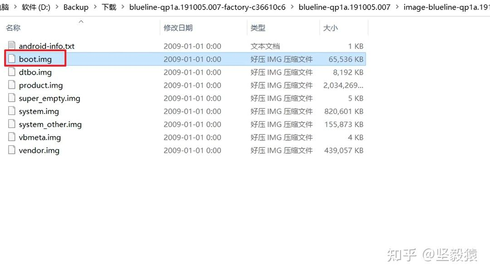

-   红米9A

-   下载卡刷包，然后解压，把boot.img文件提取出来，放到手机里面去

> Redmi 9系列稳定版官方ROM下载帖(1月24日更新): **[https://web.vip.miui.com/page/info/mio/mio/detail?postId=20980945&app\_version=dev.20051](https://web.vip.miui.com/page/info/mio/mio/detail?postId=20980945&app_version=dev.20051)**

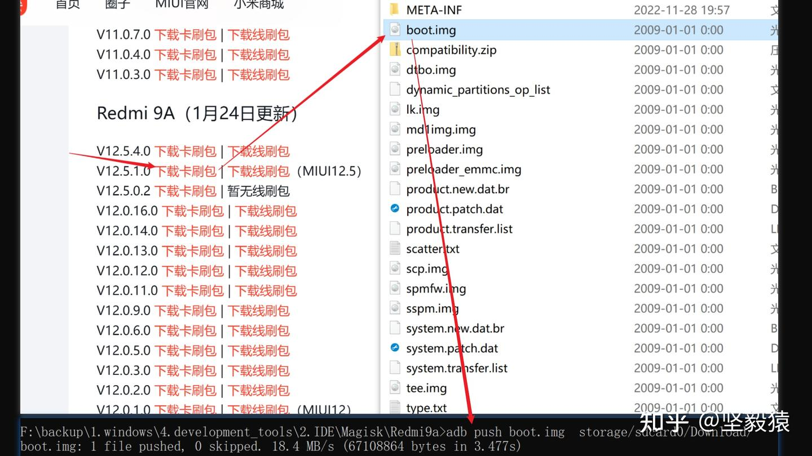

2\. \*\*下载安装Magisk Manager \*\* #坑/逆向/app逆向/Magisk : 用v23版本(Magisk Manager 的团队被谷歌收编了，23以后的版本去掉`模块在线安装`和`MagiskHide`(隐藏Magisk避免被检测)) #坑/逆向/app逆向/root/小米 : Redmi9a手机是联发科芯片，用v23的magisk修不出来的img有问题。需要用更新的版本(v23之后的版本)的magisk(修补boot.img的时候，不要勾选`选项-修补boot 镜像中的vbmeta`)。

> topjohnwu/Magisk: [https://github.com/topjohnwu/Magisk/releases/tag/v23.0](https://github.com/topjohnwu/Magisk/releases/tag/v23.0)

```
F:\backup\1.windows\4.development_tools\2.IDE\Magisk>adb install F:\backup\1.windows\4.development_tools\2.IDE\Magisk\Magisk-v25.2.apk
Performing Streamed Install
Success
```

1.  **安装Magisk Manager 后，点击安装，选择并修补，选择boot.img文件**

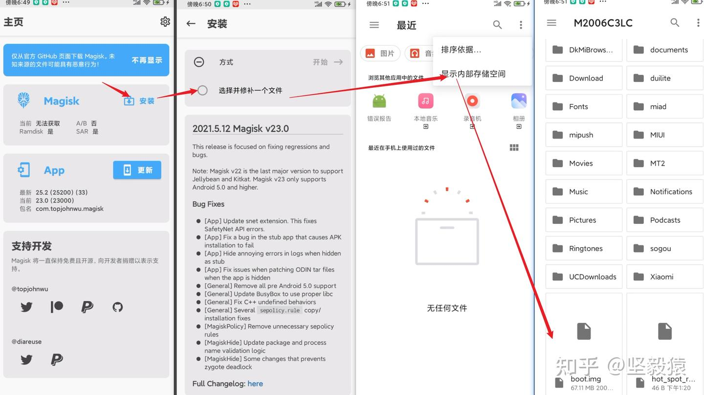

-   修补完成后会在Dowbload目录下生成.img文件，把这个文件从手机拷贝到电脑中

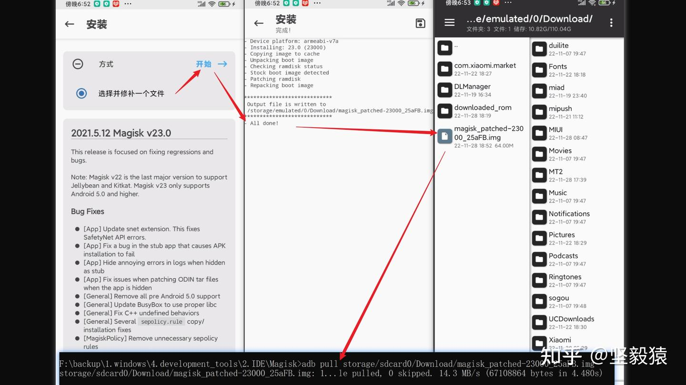

1.  **用adb的`fastboot.exe`工具把这个修后的`.img`文件刷入手机**

-   进入Fastboot：关机状态下，同时按住`音量-键`和电源键，进入`fastboot`模式，连接usb数据线
-   刷入`.img`文件，重启手机

```
D:\Android\Sdk\platform-tools>adb reboot fastboot
D:\Android\Sdk\platform-tools>fastboot flash boot F:\backup\1.windows\4.development_tools\2.IDE\Magisk\Redmi9a\magisk_patched-23000_25aFB.img
Sending 'boot' (65536 KB)                          OKAY [  1.528s]
Writing 'boot'                                     OKAY [  0.837s]
Finished. Total time: 2.387s
```

#坑/逆向/app逆向/root/小米 : fastboot之后开不了机，可以刷回原本的`boot.img`恢复。 5. **(高通的cpu才需要)进入 Magisk Manager，选择安装-直接安装，才能将临时 root 转换为永久 root。**

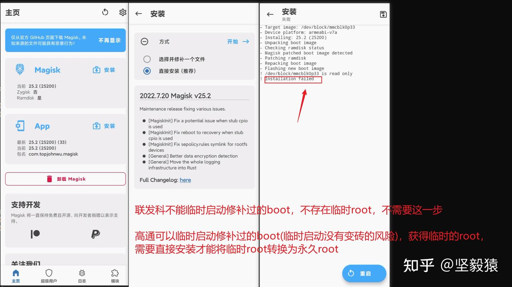

1.  **验证Magisk是否安装成功**

```
D:\Android\Sdk\platform-tools>adb shell
dandelion:/ $ su
dandelion:/ #       # 成功切换到root用户下，就说明已经root成功了
```

### **Magisk模块的安装**

### **救砖模块**

-   Magisk虽然会自动禁用不兼容的模块，但是偶尔也会抽风，装错模块导致设备无法开机，也是家常便饭。

-   在安装救砖模块后, 模块检测到设备没有正常开启且Magisk没有自动禁用异常模块时，模块会依次尝试着禁用单个模块，禁用所有模块，直至进入安全模式(对恶意模块无能为力，刷入后轻则功能异常，重则设备成砖，所以请尽量选择`开源以及知名作者`的模块)
-   救砖模块：自动禁用失败>禁用单个模块>禁用所有模块>进入安全模式>正常开机

-   安装过程

-   打开magisk-模块，从本地安装，选择救砖模块

> 救砖模块下载地址：**[Magisk模块-神仙自动救砖.zip - 『精品软件区』 - 吾爱破解 - LCG - LSG |安卓破解|病毒分析|www.52pojie.cn](https://www.52pojie.cn/thread-1600094-1-1.html)**

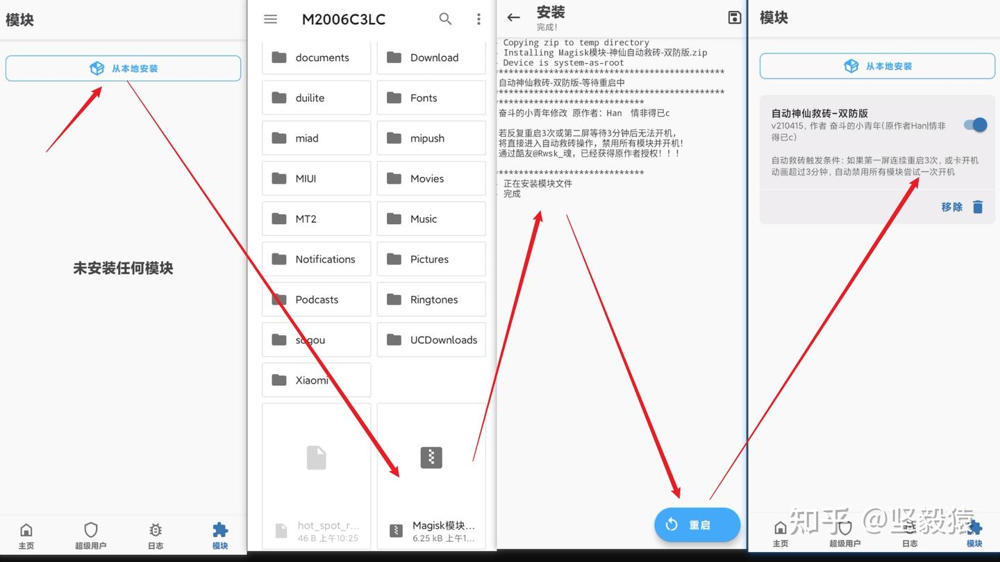

### **Riru**

-   Riru 并不是单独一个Magisk模块，而是由国内独立开发者 `Rikka` 开发的`一套`模块系列。Riru 神奇的地方在于，它部分地达成 `Xposed`那样的功能，能够自定义到一部分的应用。

-   Android 上所有正在运行的应用程序都是通过 Zygote 创造出来的，而 Riru 正是通过替换一个会被 zygote 进程加载的共享库，来达到劫持应用、让应用进程执行模块代码的目的。

-   那为什么到最后会变成`一套`模块呢？

-   是为了避免一群模块都去抢占那个要被替换的共享库，先派遣一个模块(也是 Riru Core 核心)去负责替换，再由那个核心模块提供 API 给其他模块，以让其他那些有需要模块都能正常工作、顺利生效。
-   从这样的原理看，想要使用 Riru 系列模块，`Riru Core` 是必须安装的，然后需要用户按照自己的需求安装 Riru 系列的其他模块。

-   安装过程

-   下载好后push到手机里面，选择本地安装，全部安装完之后再重启。
-   #坑/逆向/app逆向/Magisk ：Riru最新版本的不支持`RiruXposed`和`EdXposed`，要安装`Riru v25.4.4`

> Riru Core : **[https://github.com/RikkaApps/Riru/releases](https://github.com/RikkaApps/Riru/releases)**

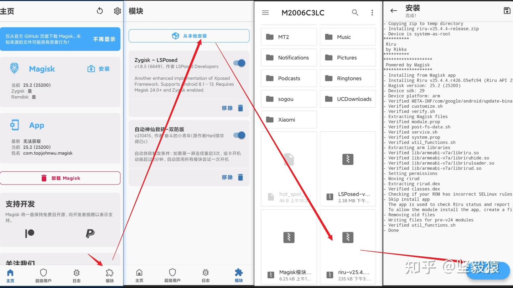

### **Move Certificates**

-   将用户证书移动到系统证书的根目录下(之后发布的`协议抓包`文章，再详细安装)

### **Xposed框架**

-   Xposed框架是一款可以在不修改APK的情况下影响程序运行(修改系统)的框架服务，基于它可以制作出许多功能强大的模块，且在功能不冲突的情况下同时运作。在这个框架下，我们可以加载很多插件App(模块)，这些插件App都有各自各种各样的功能。

### **EdXposed(安装了EdXposed，就不要安装LSPosed，二选一)**

-   EdXposed和Xposed底层的API没有差别
-   Xposed停止更新了(安卓10及其以后的版本不支持)，作者将该项目移交给了EdXpose继续维护
-   要装`EdXposed`必须先装Magisk模块：`Riru`

### **LSPosed(个人觉得更好用)**

-   `LSPosed`和EdXposed类似

-   `LSPosed`是Edxposed的一个分支，相比于 EdXposed，它精简了许多， 也要比后者流畅的多、省电的多。
-   Edxposed 面临着停更的风险，且稳定性欠佳，Lsposed 则可以保证长期更新，并会持续加入新的功能。
-   它并不是一个传统的Xposed管理器，它作为一个`Magisk模块`刷入设备运行，安装风险也比传统Xposed管理器小很多。
-   LSPosed继承了Xposed的模块仓库，仓库内模块都是开源模块,安全性有了保证。
-   LSPosed本身也与时俱进，使用了Material You设计语言，支持安卓12的Monet(莫奈)取色，更美观
-   模块可以针对单独软件开启稳定性更高：传统Xposed激活后会对所有应用生效，而LSPosed 激活后只对选中应用生效
-   不要为一个应用启用太多模块，会拖累应用的运行速度，偶尔也会产生意想不到的bug

### **安装LSPosed**

-   安装前，请确保你的手机满足以下条件

-   系统: Android 8.1-12
-   已安装`v21`以上版本的Magisk Manager
-   Riru 模块`23+`

1.  **在Magisk Manager 上安装 LSPosed 模块**

> LSPosed模块(Zygisk版)下载地址 : **[https://github.com/LSPosed/LSPosed/releases](https://github.com/LSPosed/LSPosed/releases)**

-   打开Magisk – 设置 – 开启 Zygisk，模块 – 从本地安装

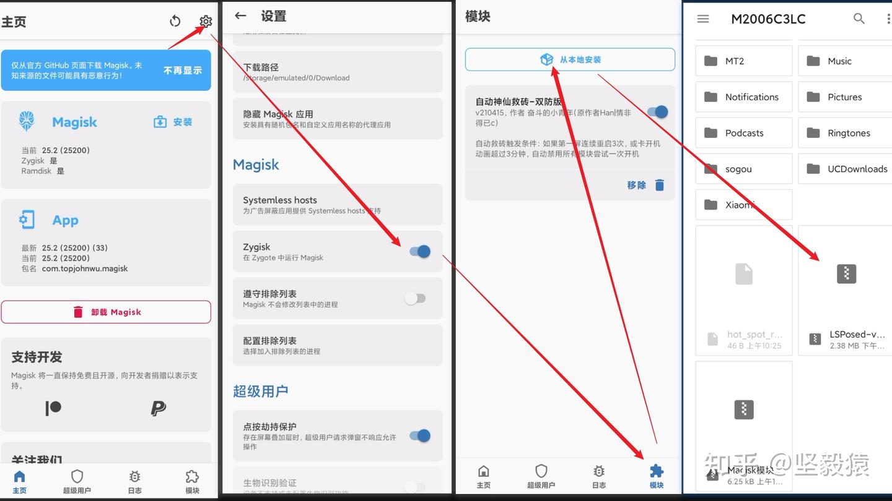

-   重启设备，桌面新增`LSPosed`的APP。打开显示“已激活”则成功刷入。

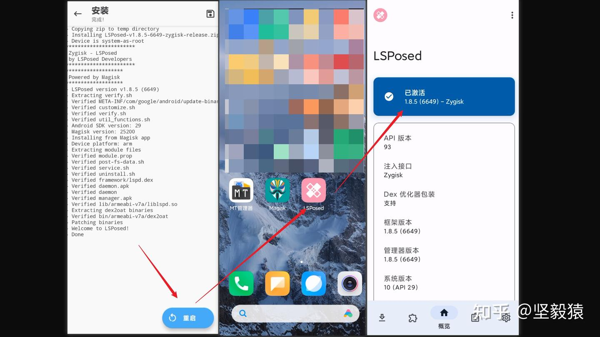

1.  **安装LSpose模块，激活LSPosed模块，选择作用域**

> **[GitHub - shatyuka/Zhiliao: 知乎去广告Xposed模块](https://github.com/shatyuka/Zhiliao)**

```
C:\Users\cisco>adb install F:\backup\1.windows\4.development_tools\2.IDE\LSPosed\Zhiliao_22.10.02.apk
Performing Streamed Install
Success
```

-   打开 LSPosed，点击 模块
-   找到需要激活的模块(这里以知了模块为例)
-   选择这个模块的作用域，比如知了模块的作用域就只有知乎
-   重启(可选，LSPosed 使用大部分模块不需要重启，有一部分可能需要)

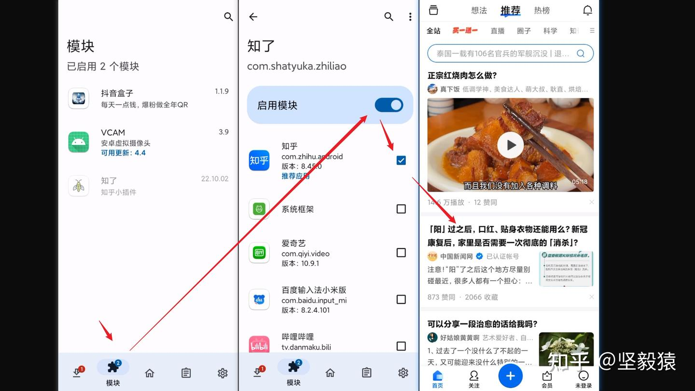

### **3\. 其他工具**

### **MT管理器**

-   MT管理器是安卓平台上的老牌经典神器，是一款功能强大的工具软件，拥有独具特色的双窗口文件管理和强大的APK编辑功能，让你可以在手机上高效地进行各种文件操作以及修改安卓软件。
-   APK编辑功能，主要有DEX编辑，ARSC编辑，XML编辑，APK签名、APK优化、APK共存、去除签名校验、RES资源混淆、RES反资源混淆、翻译模式等。

### **AndroidKiller**

> 下载地址：**[https://github.com/liaojack8/AndroidKiller](https://github.com/liaojack8/AndroidKiller)**

-   Android Killer 是一款可视化的安卓应用逆向工具，集Apk反编译、Apk打包、Apk签名，编码互转，ADB通信（应用安装-卸载-运行-设备文件管理）等特色功能于一身
-   支持logcat日志输出，语法高亮，基于关键字（支持单行代码或多行代码段）项目内搜索，可自定义外部工具；
-   吸收融汇多种工具功能与特点，打造一站式逆向工具操作体验，大大简化了安卓应用/游戏修改过程中各类繁琐工作。
-   搭配apktool使用

### **apktool**

> 下载地址： **[https://ibotpeaches.github.io/Apktool/](https://ibotpeaches.github.io/Apktool/)**

-   `dex,apk→>smali→java`

-   开源
-   反编译apk
-   支持修改后再打包
-   签名

### **Jadx**

> 下载地址: **[https://github.com/skylot/jadx/releases](https://github.com/skylot/jadx/releases)**

-   `dex,apk→>smali→java`
-   jadx是一款功能强大的反编译工具，可以通过点击代码进行跳转，除反编译外，提供的主要功能如下 a. 提供多种查找功能。
-   通过Navigation即可打开搜索功能，可以选择搜索指定的类，方法，属性，代码，文件，甚至是注释查看类变量或者方法使用情况 b.查看类,变量或者方法使用情况
-   直接选中对应的类、变量或者方法，然后点击右键选择`查找用例`即可 c. 反混淆功能
-   在打包发布一个apk之前都会对其代码进行混淆加密比如用无意义的短变量去重命名类、变量、方法，以免代码被轻易破解泄露。为了代码的易读性，可以对代码进行反混淆。 d. 添加注释
-   选中代码中对应的位置之后，点击右键选择`添加注释`即可 e. 反编译结果汇总
-   通过查看Sumary文件，可以了解反编译结果的汇总信息 f. 能针对.apk , .dex,.jar,.zip等格式的文件进行反编译。
-   Jadx `apk->smali->java`

-   开源，综合了apktool+jd-gui，耗时，无法修改、回编译(重新打包)

### **JEB**

-   JEB `dex,apk→>smali→java`

-   反编译能力极强，高容错，收费
-   [https://www.pnfsoftware.com/](https://www.pnfsoftware.com/)

### **IDA Pro**

> 下载地址: **[https://www.hex-rays.com/](https://www.hex-rays.com/)**

-   `so->arm->c`
-   `Natvie`反编译工具
-   当然不止`so`库 ，`DLL`同样可以反编译
-   强大，收费

### **frida**

-   HOOK使用

### **不常用**

### **Jd-Gui**

> 下载地址: **[https://github.com/java-decompiler/jd-gui](https://github.com/java-decompiler/jd-gui)**

-   `dex->jar→>java`
-   JD-GUI是一款功能强大的JAVA反编译工具，支持对整个Jar文件进行反编译，可以通过点击代码进行跳转

### **dex2jar**

> 下载地址: **[https://sourceforge.net/projects/dex2jar/files/](https://sourceforge.net/projects/dex2jar/files/)**

-   `dex->jar→>java`
-   将dex文件还原成为jar文件;
-   将dex文件还原成为smali文件;
-   其他一些命令行很少用
-   Dex2jar+jd-gui

-   反编译能力弱，抗干扰能力弱

### **enjarify**

> 下载地址: **[https://github.com/google/enjarify](https://github.com/google/enjarify)**

-   \-`dex->jar→>java`
-   可直接将apk文件还原成为jar文件，也可以和dex2jar一样，直接操作某个dex。这是Google出品的一个逆向分析工具，从反编译成jar包的流程来说，要比dex2jar方便得多

### **baksmali**

> 下载地址：**[https://bitbucket.org/JesusFreke/smali/downloads/](https://bitbucket.org/JesusFreke/smali/downloads/)**

-   baksmali `dex->smali`

### **dnSpy**

-   下载地址: **[https://github.com/dnSpy/dnSpy](https://github.com/dnSpy/dnSpy)**
-   dnSpy是一个调试器和.NET程序集编辑器。即使没有任何可用的源代码，您也可以使用它来编辑和调试程序集。主要特点: - 调试.NET和Unity程序集 - 编辑.NET和Unity程序集 - 明暗主题

### **Bytecode-Viewer**

编辑器

### **类UNIX模拟环境**

-   Linux和Cygwin

-   [http://www.cygwin.com/install.html](http://www.cygwin.com/install.html)
-   Cygwin是一个在windows平台上运行的类UNIX模拟环境

## **三、常见问题**

#坑/逆向/app逆向/AndroidStudio/工程项目 : 有时需要修改工程名字、移动工程目录，导入已有的工程 ，会出现各种问题

### **Android Studio 更改工程目录**

-   清理项目之前编译好的.class文件,重新编译文件。

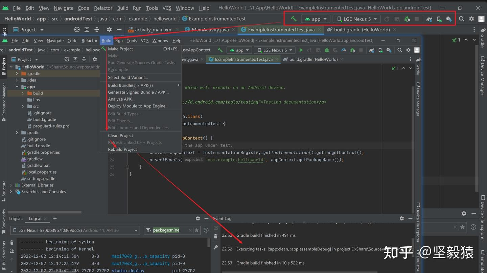

-   删除ide自动生成的一些文件 ：删除`.gradle`, `.idea` , `build` 三个文件夹。重新点击运行。

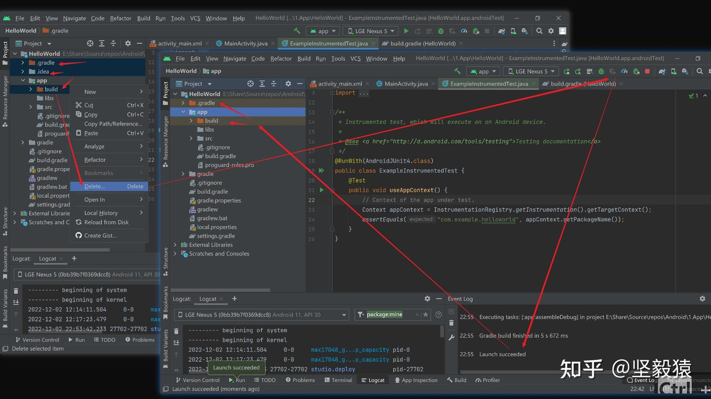

### **Android Studio 更改项目名称**

-   打开文件管理器直接修改的项目的文件夹名字，打开后发现项目名是变了，但是后面中括号里还有之前的项目名字。在Android Studio中再rename一下。

-   报错“Can’t rename root module”
-   解决办法：只需要修改settings.gradle中的 `rootProject.name = "NdK_Jin01"`改为 `rootProject.name = "HelloWorld"`

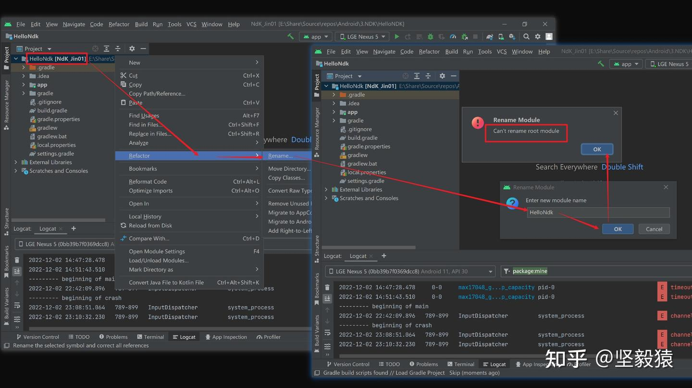

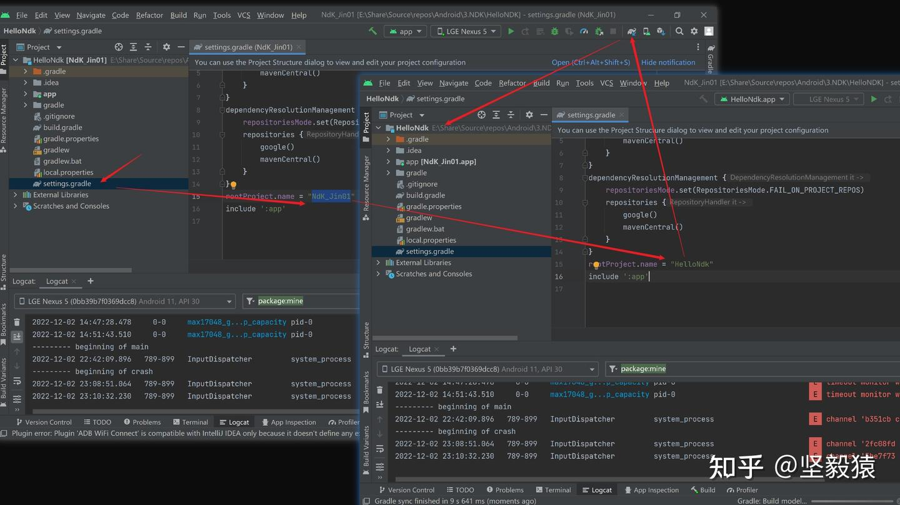

### **Android Studio 工程乱码**

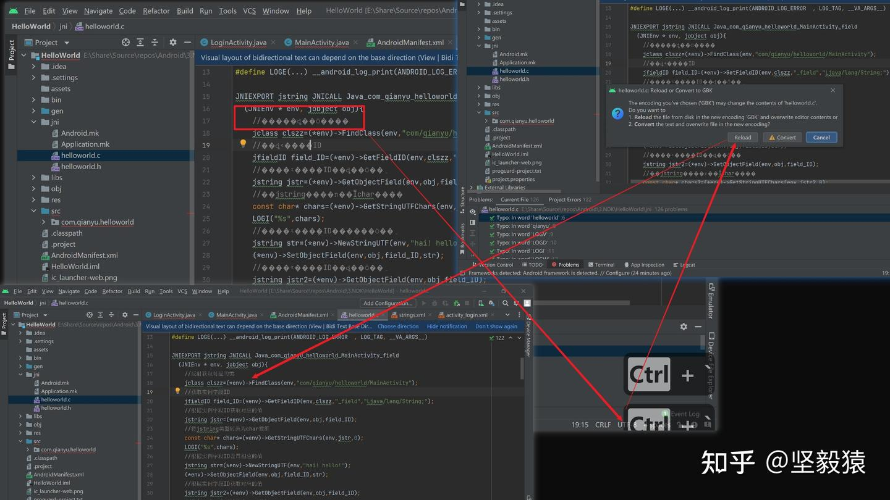
