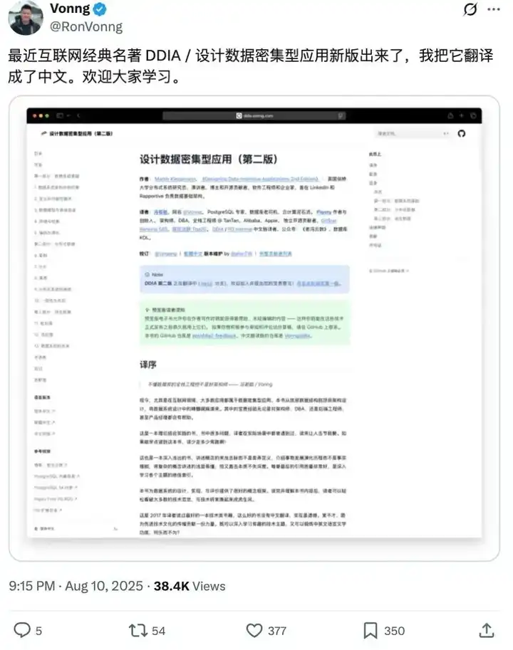

> 作者：CodeCrafter　|　赞同 1455　|　评论 48　|　[原文](https://www.zhihu.com/question/1964646819490428474/answer/1965731924887732311)

哥们，你这问题问到我心坎里了。

你说的那个“API调用侠”阶段，我不仅经历过，而且我敢说，我当“侠”的时间比很多人都长，段位也高那么一点点。毕竟我调的不是什么业务API，是各种算法模型API。当年在组里，我就是那个最会用 `sklearn`、`TensorFlow`、`PyTorch` 的仔。新出了什么模型，论文刚挂上arXiv，不出一个礼拜，我保证能把它在Kaggle上跑出分来。那时候我觉得自己牛逼坏了，算法嘛，不就是数学公式+调包+调参么，核心是理解模型原理，代码？实现逻辑的工具罢了，能跑通就行。

我当时的口头禅是：**Talk is cheap, show me the AUC.**

现在回想起来，那会儿的我，就像一个只会开自动挡豪车的人，对车里的发动机、变速箱、底盘悬挂一无所知。踩油门车会跑，踩刹车车会停，至于为什么有时候提速快，有时候过弯不稳，一概不知，只能归结于玄学，或者怪路不好。

直到有一次，我被现实狠狠地扇了一巴掌。

那是个推荐系统项目，要做一个实时的召回模块。模型不复杂，就是个矩阵分解的变种，用用户向量和物品向量做内积，找出Top K。理论上简单得不行。我用Python和NumPy刷刷刷就把原型写完了，小数据上跑得飞快，效果也好。我很得意，准备部署上线。

结果一上到生产环境，用上百万的用户和千万级的物品向量，一个请求过来，接口直接超时。当时我人就傻了。

我祭出了我所有的法宝：`cProfile` 跑一下，看看是哪个函数慢。结果发现，就是最核心的那个做内积排序的循环慢，没有任何可优化的Python层面的技巧。加机器？当时预算紧张，老板说先从技术上想想办法。换更快的算法？比如用LSH（局部敏感哈希）做近似？但业务要求是精确排序。

那几天我头都快挠秃了，天天加班到半夜，对着那段“完美”的代码发呆。它在逻辑上无懈可击，在算法复杂度上也已经最优，但它就是慢，慢得像头牛。

我们组里有个搞基础架构的大哥，看我愁眉苦脸的，飘过来瞄了一眼我的代码。他没说我代码写得烂，也没说我模型选得不好，就问了我一个问题：

“你这俩循环，谁在外谁在内，有啥讲究吗？”

我当时一愣，心想这不都一样吗？不都是 `m * n` 的计算量？我随口答：“没啥讲究，习惯这么写。”

大哥笑了笑，没多说，就给我发了个PDF，文件名是 `csapp.pdf`。他说：“你有空翻翻第五章第六章，讲存储层次结构和性能优化的，看完可能就明白了。”

那本书，就是你问题里提到的《深入理解计算机系统》（Computer Systems: A Programmer's Perspective），简称CS:APP。

说实话，我当时下载下来，看到满篇的C语言、汇编、二进制，我头都大了。我是个搞算法的，天天跟Python、Jupyter Notebook打交道，这玩意儿离我太远了。我觉得这大哥在忽悠我，杀鸡焉用牛刀。但死马当活马医，我就硬着头皮开始看。

刚开始，跟你看《代码大全》一样，什么二进制表示、寻址模式，我觉得都是计算机科班大一的课程，正确的废话。直到我看到第六章：**存储器层次结构**。

那一章，就像一道闪电，直接劈开了我的天灵盖。

我一直以为，内存就是一块巨大、平坦、速度均匀的存储空间。我从内存取一个数据，就跟从兜里掏个硬币一样，耗时是固定的。CS:APP告诉我，我错得离谱。

**CPU和主存之间，横亘着L1、L2、L3等多级高速缓存（Cache）。CPU读取数据，不是直接从主存拿，而是先看L1里有没有，没有再看L2，还没有再看L3，最后才去问主存要。而它们的速度，是天壤之别。从L1 Cache取数据，可能只需要几个时钟周期；从主存取，可能需要几百个。**

这他妈意味着什么？意味着我的代码如果能让CPU要的数据，总是在Cache里被找到（也就是所谓的缓存命中），那它的速度就会快得飞起。如果总是找不到，需要反复去主存里拿（缓存不命中），那就算算法再牛逼，也得慢成龟速。

然后，书里讲到了一个核心概念：**局部性原理**。

-   **时间局部性**：如果一个数据被访问了，那么它在不久的将来很可能再次被访问。
-   **空间局部性**：如果一个数据被访问了, 那么它邻近的数据很可能在不久的将来被访问。

看到这里，我脑子里“嗡”的一声。我立刻想到了我的那个双重循环。在Python的NumPy里（或者C/C++的数组），一个二维数组 `A[M][N]` 在内存里是按行优先（Row-Major）存储的。也就是说，`A[0][0]` 的旁边是 `A[0][1]`，然后是 `A[0][2]`，...，一直到 `A[0][N-1]`，然后才是 `A[1][0]`。

我的代码大概是这样写的（伪代码）：

```
# users: N x D, items: M x D
# 目标：为某个用户 user_vec (1 x D)，计算和所有 item 的相似度
scores = []
for i in range(M):  # 遍历所有 item
    score = 0
    for j in range(D): # 遍历向量维度
        score += user_vec[j] * items[i][j]
    scores.append(score)
```

看起来没毛病对吧？但让我们跟着CS:APP的视角，看看内存访问发生了什么。

外层循环 `i` 每次加一，我们访问的是 `items[i][j]`。当 `i` 从0变成1时，我们访问的内存地址从 `items[0]` 那一行的开头，直接跳到了 `items[1]` 那一行的开头。这两块内存在物理上可能离得很远。

而如果我把内外循环换一下呢？

```
# 假设我们换一种计算方式，虽然业务逻辑不同，但能说明访存问题
# 比如我们要累加所有 item 向量的每一维
col_sums = [0] * D
for j in range(D): # 先遍历维度
    for i in range(M): # 再遍历所有 item
        col_sums[j] += items[i][j]
```

在这个例子里，内层循环 `i` 从0到 `M-1`，访问的是 `items[0][j]`, `items[1][j]`, `items[2][j]`... 这是在内存里跳跃式访问！每次都要跨过一整行的长度。这叫**缓存灾难**。

而如果写成这样：

```
row_sums = [0] * M
for i in range(M): # 先遍历 item
    for j in range(D): # 再遍历维度
        row_sums[i] += items[i][j]
```

内层循环 `j` 从0到 `D-1`，访问的是 `items[i][0]`, `items[i][1]`, `items[i][2]`... 这在内存里是连续的！当CPU加载 `items[i][0]` 时，由于空间局部性，它会顺手把 `items[i][1]` 到 `items[i][k]` 这一整块（一个缓存行，Cache Line）都加载到高速缓存里。接下来几十次内层循环的读取，全都是缓存命中，速度快到飞起。

**这个瞬间，就是我的顿悟时刻。**

我没有立刻去改我那个推荐项目的代码（因为那个逻辑用NumPy的向量化操作 `items.dot(user_vec)` 才是正解，而NumPy的底层实现就是用C/Fortran写的，早就把这些优化到极致了）。但是，这个小小的循环交换，像一把钥匙，打开了我脑子里一扇全新的大门。

我不再把代码看作是逻辑的文本描述。**我开始把代码看作是给CPU和内存下达的一系列指令。** 我开始思考：我写的这行代码，翻译成机器指令后，它到底在让硬件做什么？它是在做密集的计算，还是在做大量的内存读写？数据在内存里是怎么布局的？我的访问模式是友好的，还是灾难性的？

**它具体是怎么提升我能力的？**

**1\. 我开始能解释以前很多“玄学”问题了。**

以前，我们经常会遇到一些怪事：同样是Pandas处理数据，有时候用 `iterrows` 巨慢，用 `apply` 稍快，用向量化操作飞快。为什么？以前我只知道结论，现在我能从底层解释。`iterrows` 每次生成一个Series，涉及大量的对象创建和内存拷贝，慢是必然的。`apply` 在某些情况下能调用C语言实现的快速路径，但也有开销。而向量化操作，直接把整个计算任务丢给了NumPy/Pandas的底层C引擎，这个引擎在设计时就充分考虑了缓存、SIMD（单指令多数据流）等硬件特性，它写的循环，比我们自己手写的Python循环不知道高到哪里去了。

如果你是做数据科学的，除了CSAPP，我强烈建议你精读 **Pandas官方文档里的《Enhancing Performance》** 这一章。里面详细解释了各种操作（Looping, `apply`, Cython, Numba, 向量化）的性能差异和底层原因。看完之后，你写Pandas代码的手感会完全不一样。

不过英文版读起来稍显吃力，所以向大家推荐Pandas官方文档中文版！

[太赞了！Pandas官方文档中文版PDF，免费开放下载！](https://mp.weixin.qq.com/s/nJgI7Gq05_kkBs7lXqXZEQ)

**如果你想知道工业界实战场景中是如何使用pandas的，那么可以看看这份**[字节内部Pandas操作手册.pdf](https://mp.weixin.qq.com/s/pEPFByQK-3lTkeYVTNC2vw)。这个手册里把常见的数据需求都拆成了清晰的场景，比如用户留存分析、广告点击率计算、日志时间序列处理，这些在大厂日常报表和分析里都会遇到。它是完完全全结合字节跳动自己的业务环境整理的，里面提到的坑和优化点，很多都是实战踩出来的经验。比如 groupby 聚合时如何避免内存暴涨，merge 拼表时怎么控制 join 的性能开销，这些内容在一般教程里是学不到的。读完之后，你会明显感觉自己写 Pandas 的思路更清晰，代码也更接近工程化标准。你照着这里的思路去写代码，不仅效率高，还能少走很多弯路。


**2\. 我的性能优化工具箱，从只有一把“算法复杂度”的锤子，变成了一整套手术刀。**

遇到性能瓶颈，我不再是两眼一抹黑，只会说“这个算法是O(n^2)的，太慢了”。我会有一套诊断流程：

**这是计算密集型（CPU-bound）还是I/O密集型（I/O-bound）？** 如果是前者，看能不能用更优的算法，或者用并行计算（多线程、多进程）。如果是后者，看是磁盘I/O还是网络I/O，数据读取有没有优化的空间。

**如果是CPU密集型，瓶颈在哪里？** 用profiler（比如 `py-spy`，它可以分析C扩展的耗时，比`cProfile`更强大）定位热点函数。

**热点函数能向量化吗？** 能不能把Python循环干掉，变成一个NumPy或Pandas的调用？

**如果不能向量化，数据结构和访问模式是什么样的？** 是不是像前面说的，存在大量的缓存不命中？有没有可能改变数据布局（比如行列转换）来优化？

**能不能用更快的工具？** 比如用Polars替换Pandas。Polars是用Rust写的，底层用了Apache Arrow内存格式，天生就是列式存储，对很多聚合查询的缓存命中率极高，而且它的查询引擎能做并行和查询优化。

后来我又做一个用户画像的项目，需要对一个巨大的DataFrame（几千万行，几百列）做大量的特征交叉和聚合。同事用Pandas写，跑了一晚上都没跑完。我接手后，没改一行逻辑，只是把 `pd.read_csv` 换成了 `pl.read_csv`，把一系列的 `groupby().agg()` 操作换成了Polars的等价语法。结果？20分钟搞定。这不是因为我比同事聪明，而是因为我知道，对于这种大规模的聚合查询，列式存储+并行计算的工具（Polars）相比于行式存储的Pandas，在内存访问模式上有着天然的、降维打击般的优势。这就是CS:APP教给我的思维方式。

**推荐大家看看Polars的用户手册**。别只把它当个API文档看。去读读它的设计理念，理解它为什么快。特别是它关于 **Lazy Execution（惰性求值）** 的部分，这又是一个能让你顿悟的强大思想。它允许你先构建一个完整的查询计划，然后由引擎去整体优化这个计划，比如把多个操作合并，减少不必要的内存分配和扫描。这和数据库的查询优化器思想一脉相承。


**3\. 面对烂代码，我从“厌恶”变成了“悲悯”，并且有了重构的勇气和章法。**

以前看到别人写的烂代码，心里就是一万个“草泥马”奔腾而过。现在再看到，我能分析出它“烂”在什么地方。哦，这里有个嵌套循环处理字符串，Python字符串是不可变对象，每次拼接都会创建新对象，内存开销巨大，应该用 `"".join()`。哦，那里用list做频繁的头部插入删除，这是O(n)的操作，应该用 `collections.deque`。

我的关注点从“代码风格真差”，转移到了“这段代码的执行效率和资源消耗模型是什么样的”。这让我提重构建议时，不再是空泛的“要优雅”，而是能给出明确的、有数据支撑的理由：“你这样写，会导致XXX次内存拷贝/缓存不命中，如果我们换成XXX写法，预计性能能提升N倍，我这里有个小脚本可以证明。”

这种有理有据的重构，才是有说服力的，也是能真正推动项目进步的。

**从CS:APP开始，我像是打通了任督二脉，开始对整个计算机世界产生了更宏大的兴趣。**

后来，我又陆续看了几本对我影响巨大的书。它们不是孤立的，而是和CS:APP的知识体系层层递进，构建了我现在的技术世界观。

**进阶期：《设计模式：可复用面向对象软件的基础》（GoF那本）**

这书我看了三遍。第一遍，当故事书看，哇，原来有这么多聪明的套路。第二遍，硬背，啥是单例，啥是工厂，啥是观察者。没啥用，写代码还是想不起来用。第三遍，是在我被各种屎山代码折磨，自己也制造了不少屎山之后。我不再去记“模式”，而是去理解每个模式背后要解决的**核心问题**。比如，工厂模式是为了**解耦对象的创建和使用**；策略模式是为了**封装可变的算法**，让它们可以互相替换。

当我意识到，**设计模式的本质，不是炫技，而是管理复杂性，控制变化。** 好的设计，就是把未来可能变化的部分和不变的部分隔离开，让你的系统在需求变更时，需要修改的代码范围最小。这对于算法工程师来说太重要了。今天模型要用GBDT，明天要换成神经网络，后天要加个规则模型。如果我用策略模式，把每个模型封装成一个独立的策略对象，那我的主流程代码就完全不用动，只需要新增一个策略，然后在配置文件里切换就行。这比写一堆 `if-else` 不知道优雅到哪里去了。

**瓶颈期：《设计数据密集型应用》（Designing Data-Intensive Applications, 简称DDIA）**

如果说CS:APP是单机性能优化的圣经，那DDIA就是分布式系统设计的圣经。作为一个算法/数据专家，你不可能只活在单机上。你的数据、你的模型，最终都要跑在由无数台机器构成的庞大系统里。

DDIA最让我震撼的，是它把所有看似高大上的技术——数据库、缓存、消息队列、批处理、流处理——全部打碎，然后用最底层的几个原则（可靠性、可伸缩性、可维护性）重新串联起来。我读完才明白，原来MySQL的B+树索引、Redis的持久化、Kafka的日志结构、Spark的容错机制，它们在设计上要解决的核心矛盾都是相通的：**如何在不可靠的硬件上，构建可靠的服务；如何在磁盘、网络这些慢速I/O的限制下，追求极致的吞吐和低延迟。**

比如，它讲日志（Log）那一章。我才恍然大悟，原来数据库的WAL（Write-Ahead Log）、消息队列（如Kafka）、各种分布式一致性算法（如Raft），其核心思想都是一个“只追加的日志”。这种数据结构，对磁盘I/O极其友好（顺序写远快于随机写），而且天生就包含了操作的历史，易于复制和恢复。理解了这一点，我再去看任何一个新的大数据组件，都能很快地抓住它的设计命门。

最近数分名著DDIA有了第二版，还有中文版了。



不过说实话。可能很多人连第一版都还没读明白，但是这也不能怪他们。因为因为DDIA就是很难，对很多刚入门或者转行到分布式系统、数据库、大数据领域的朋友来说，可能只能理解 20%-30% 的内容。要真正全部消化这本书，需要至少 1-2 年在大厂参与大型分布式系统工作或者长期维护复杂系统的实战经验才能跟上作者的思路。

所以推荐一个配套的DDIA 逐章带读，作者基于英语原版，结合自己丰富的工作经验，做了大量扩展和细致说明。可读性起码提高80%。推荐新手同学搭配第二版和解读一起读。

[DDIA第二版更新，中文版以及配套逐章带读开放下载！](https://mp.weixin.qq.com/s/3LfUU1xqs5NktOaZlCtP4A)

我的顿悟，始于**CSAPP**让我把视线从飘渺的Python代码，沉到了坚实的硬件地基上。我不再是一个只会调用高级语言API的“魔法师”，我开始理解我的“咒语”是如何被翻译成物理世界的电信号和磁记录的。

这个从“知其然”到“知其所以然”的转变，是质变。它没有让我立刻变成一个编程大神，但我心里有底了。我面对性能问题不再恐慌，我设计系统时有了更深的考量，我和同事交流时有了更共通的语言。

所以，给还在路上的朋友们一个不成熟的建议：

不要害怕去读那些看似“底层”和“无关”的书。你写Java，可以去看看JVM的内存模型；你写前端，可以去了解一下浏览器渲染的原理和网络协议；你做算法，那CSAPP和DDIA简直是必修课。

我们这一行，技术的浪潮一波接一波，新的框架、新的模型层出不穷。但底下那些最根本的东西——计算、存储、网络——几十年都没变过。你把地基打得越深，你在上面能盖的楼就越高，也越稳。

我个人觉得，不管是不是科班出身，每一个程序员都应该花时间了解和学习计算机科学相关的基础知识，**因为所有关于如何编程的底层逻辑和原理都在那里了。**

这里有4本手册，**全网累积下载100w次**，几乎程序员人手一套，包含**数据结构与算法、操作系统、计算机组成原理、计算机网络等**硬核基础知识，图文+实战案例，平时开发+搞定面试，帮你快速建立对计算机科学的大局观，夯实计算机基本功，瞬间起飞～

[全网累计下载100w+次，瞬间让你起飞的计算机基础知识](https://mp.weixin.qq.com/s/igbCF4F-K0DJDxVrMJ9ViQ)

[程序员必读的四本硬核底层的计算机书籍（附PDF下载）](https://mp.weixin.qq.com/s/NvU0rBlklp0JT4e_JEFwgg)


别只满足于当一个“调包侠”或“API调用侠”。去撬开那个黑箱，看看里面到底是什么在转。那个瞬间，当你发现无数复杂的上层建筑，都构建在几个简单而深刻的底层原理之上时，你会得到一种前所未有的、智力上的快感和自由。

那感觉，真他妈的爽。
