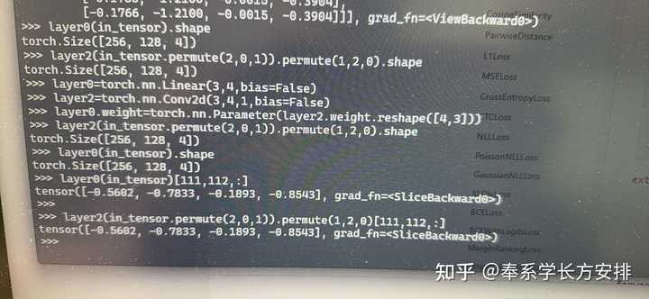

> 作者：奉系学长方安排　|　赞同 129　|　评论 18　|　[原文](https://www.zhihu.com/question/274256206/answer/1986080266721177884)

最近在CV相关的地方看到conv 1x1起初也很迷惑，第一反应是“和全连接有啥区别？这不就是重新发明了一遍Linear？”。实现conv2d(C1,C2,1)，只需要把(N,C1,H,W) 转成(N,H,W,C1)放进Weight为（C2,C1）的Linear就好了。

那就试试呗？

果然这俩操作是等效的。

又找做CV的同学探讨了下，终于搞清楚了……

搞CV的这帮人习惯的Linear用法，是把后面三个维度全部flatten，变成（N,HxWxC）去用，用的多了，导致他们习惯性地认为Linear就一定要flatten了再用。所以，这个问题下能看到一些答主说“conv1x1可以空间维度权重共享”“输入shape可变”（潜在的信息是：Linear必须要对不同的H、W有不同的权重，因而输入shape不可变）。但实际上flatten不是必须的。

早期某个重要研究的作者，当他需要对C维度做线性变换时，选择了“1x1 Conv”这种方式来实现。\[1\]

这种选择的原因，可能是来自早期版本\[2\]的torch.nn.Linear只支持shape为(N, hidden\_size)的输入、而不是现在的(\*, hidden\_size)。\[3\]

结论：管这玩意叫“1x1 conv”而不是全连接，这只是一个叫法问题。cv论文里提到的全连接层，默认指的是flatten/reshape + Linear两个操作的组合。

今天，我们可以直接用Linear来实现同样的效果，语义更清楚。毕竟这个操作和卷积没啥关系。
