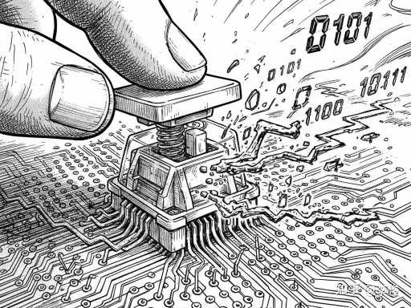
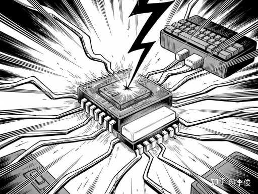
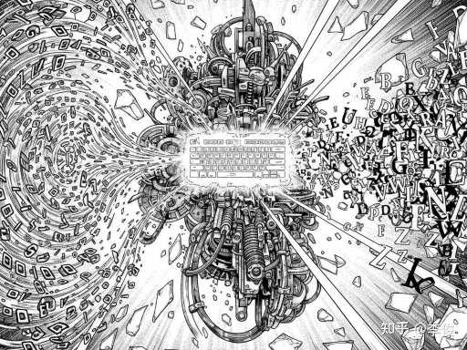
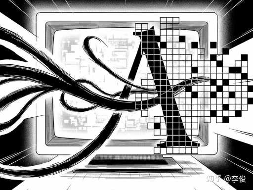
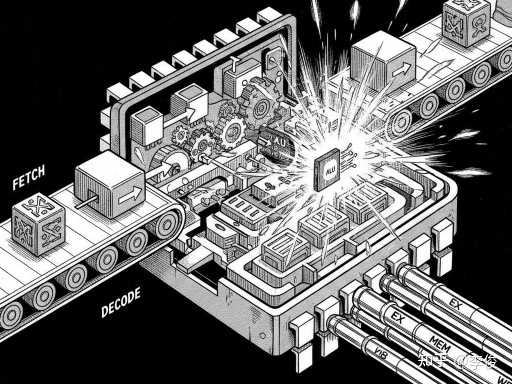
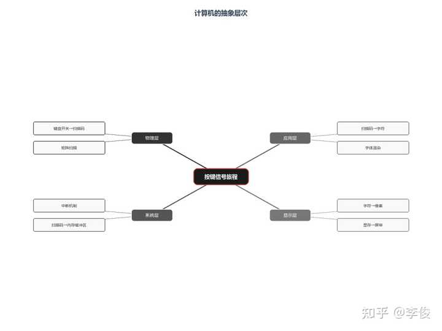

> 作者：无知之徒　|　赞同 626　|　评论 41　|　[原文](https://www.zhihu.com/question/666025968/answer/2011477559322367689)

### **从一个按键说起**

你按下键盘上的字母"A"。

不到1毫秒，屏幕上出现了这个字符。

看起来很简单？实际上，这1毫秒内，一个电信号穿越了至少**6层抽象**，经过了**数十个硬件组件**，跨越了**多条总线**，才完成了这次"简单"的交互。

**计算机的本质，不是计算，而是抽象。**

每一层抽象都把底层的复杂性隐藏起来，只向上层暴露一个简洁的接口。正是因为有了这些抽象，程序员才能用高级语言写代码，而不必关心电子如何在晶体管间流动。

今天，我们追踪一个按键信号的完整旅程，看看计算机是如何通过层层抽象，把一个物理动作变成屏幕上的字符。

### **第一层抽象：从物理信号到扫描码**

你按下的不是字母，是一个**开关**。

键盘的每个按键下面都有一个机械开关。当你按下"A"键，开关闭合，电流导通。这是最底层的物理现实——只有通和断，没有"A"。

**键盘控制器**的工作，就是把这种物理信号翻译成计算机能理解的数字。

它是怎么做到的？

### **矩阵扫描**

键盘上100多个按键，如果每个都单独连一根线到计算机，那键盘线得比手指还粗。所以键盘用了一个聪明的设计：**矩阵扫描**。

想象一个棋盘，行线和列线交叉。每个按键就在一个交叉点上。控制器快速地给每一行通电，然后检测每一列有没有电流。如果第3行通电时第5列检测到电流，那就说明第3行第5列的按键被按下了。

这就是**扫描码**的由来——一个表示按键位置的数字。

按下"A"键，控制器可能输出扫描码`0x1E`。松开"A"键，输出`0x9E`（多了一个高位，表示"释放"）。

**第一层抽象完成**：物理动作 → 数字编码。

但这还没完。这个扫描码现在还停留在键盘内部的缓冲区里，需要被送出去。

### **第二层抽象：从I/O设备到内存**

扫描码要送到CPU，但CPU不能傻等着键盘输入。

CPU的运行速度是**每秒几十亿次**，键盘输入的速度是**每秒几十次**。如果CPU每执行一条指令都要检查"键盘有没有输入"，那99.9999%的时间都在做无用功。

怎么办？**中断机制**。

### **中断：硬件版的"有事找我"**

中断的设计思路和生活中一样：你不需要每5分钟给快递员打一次电话问"快递到了吗"，而是让快递员到了给你打电话。

键盘控制器产生扫描码后，会向CPU发送一个**中断请求信号**（Interrupt Request，IRQ）。

这个信号通过**中断控制器**（8259A或其现代替代品），被分配一个中断号。键盘通常是IRQ1，中断号0x21。

CPU在执行每条指令后，都会检查有没有中断信号。如果有，就暂停当前工作，转去处理中断。

### **中断向量表**

CPU怎么知道该怎么处理键盘中断？

内存里有一张**中断向量表**（Interrupt Vector Table），里面存储了每个中断号对应的处理程序地址。这就像一个电话簿：中断号0x21对应的是键盘处理程序的地址。

当CPU收到键盘中断：

1\. 把当前的程序计数器（PC）、状态寄存器等压栈保存

2\. 根据中断号查表，找到处理程序地址

3\. 跳转到处理程序执行

**键盘处理程序**会通过I/O端口（通常是0x60）读取扫描码，然后把它存入内存中的**键盘缓冲区**。

**第二层抽象完成**：I/O事件 → 内存数据。

现在，扫描码已经安全地躺在内存里了。但它还只是扫描码，不是字符"A"。

### **第三层抽象：从扫描码到字符**

扫描码`0x1E`代表的是"键盘上A键的位置"，不是字符"A"。

为什么？因为同一个按键，在不同国家的键盘上可能代表不同的字符。美国人按那个键是"A"，法国人按是"Q"（他们的键盘布局不同）。

**操作系统**负责把扫描码转换成字符。

### **输入子系统**

现代操作系统都有**输入子系统**（Input Subsystem），它负责：

1\. **从内核缓冲区读取扫描码**

2\. **根据当前键盘布局转换成字符**

3\. **处理组合键**（Shift+A = 大写"A"，Ctrl+C = 复制命令）

4\. **把字符送到当前活动窗口**

这个转换过程涉及**键盘布局映射表**。Windows注册表里有`HKEY_LOCAL_MACHINE\\SYSTEM\\CurrentControlSet\\Control\\Keyboard Layouts`，存储了各种语言的映射关系。

转换完成后，字符"A"被放入**消息队列**，等待被应用程序读取。

**第三层抽象完成**：硬件相关编码 → 统一字符编码。

### **第四层抽象：从字符到像素**

应用程序收到字符"A"后，要把它显示在屏幕上。

但你看到的不是字符，是**像素**。

显示器只认识像素——每个点是什么颜色。字符"A"是由一组像素点组成的图案，这组图案存储在**字体文件**里。

### **字体渲染**

当你输入"A"时，应用程序会：

1\. **查找字体文件**（如微软雅黑、宋体）

2\. **获取字符"A"的字形描述**（矢量曲线或位图）

3\. **根据字号缩放字形**

4\. **光栅化**：把矢量曲线转换成像素网格

5\. **抗锯齿处理**：让边缘更平滑

这些像素数据被写入**显存**（Video Memory），也就是显卡上的内存。

### **从显存到屏幕**

显卡的**显示控制器**会以每秒60次的速度（60Hz），从显存读取数据，转换成视频信号，发送给显示器。

显示器收到信号后，控制每个像素点的颜色，你就看到了字符"A"。

**第四层抽象完成**：字符编码 → 像素矩阵。

### **第五层抽象：CPU如何执行这些指令**

上面说的所有操作——扫描、中断、转换、渲染——最终都要由CPU来执行。

CPU是怎么执行指令的？

### **指令周期：取指-译码-执行**

CPU执行一条指令，分三个阶段：

**1\. 取指（Fetch）**

● 程序计数器（PC）存储下一条指令的地址

● 把地址送到内存，取回指令

● 指令存入指令寄存器（IR）

**2\. 译码（Decode）**

● 控制器解析指令的操作码

● 确定要做什么操作（加法？读取？跳转？）

● 确定操作数在哪里

**3\. 执行（Execute）**

● 运算器（ALU）执行计算

● 或者访问内存读取/写入数据

● 更新程序计数器

然后重复。

### **一个例子**

假设CPU要执行`ADD R1, R2, R3`（把R2和R3的值相加，存入R1）：

1\. **取指**：从内存读取这条指令的机器码

2\. **译码**：识别出这是加法指令，操作数在R2和R3

3\. **执行**：ALU把R2和R3的值送入加法器，计算结果写入R1

每一条指令都在纳秒级完成。

**第五层抽象完成**：高级语言 → 机器指令 → 电信号。

### **抽象的代价**

抽象不是免费的。

每一层抽象都带来了**性能开销**：

| 抽象层 | 开销  |
| --- | --- |
| 键盘扫描 | 几微秒 |
| 中断处理 | 几十微秒 |
| 操作系统转换 | 几百微秒 |
| 字体渲染 | 几毫秒 |
| 显存写入 | 几微秒 |

加起来，就是你感受到的"输入延迟"。通常在10-50毫秒之间。

对普通人来说，这点延迟可以忽略不计。但对电竞选手来说，这是生死攸关的差距。所以他们用**机械键盘**（触发更快）、**高刷新率显示器**（144Hz以上）、**有线连接**（无线有额外延迟）。

### **记住一句话**

**计算机的本质是抽象：把复杂封装起来，只暴露简单的接口。**

一个按键信号的旅程：

物理开关 → 扫描码 → 中断 → 内存缓冲区 →

字符编码 → 消息队列 → 字体渲染 → 显存 → 像素

每一层都只做一件事：接收下层的简化输出，处理，向上层提供简化接口。

**正是这种分层抽象，让人类能够驾驭极其复杂的计算机系统。**

程序员不需要知道键盘是怎么扫描的，只需要读`getchar()`的返回值。

程序员不需要知道显卡是怎么渲染的，只需要调用`DrawText()`函数。

抽象的力量，就是让复杂变得可控。

