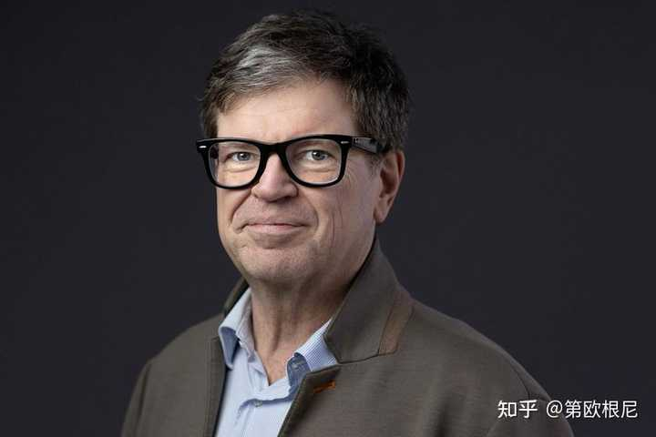
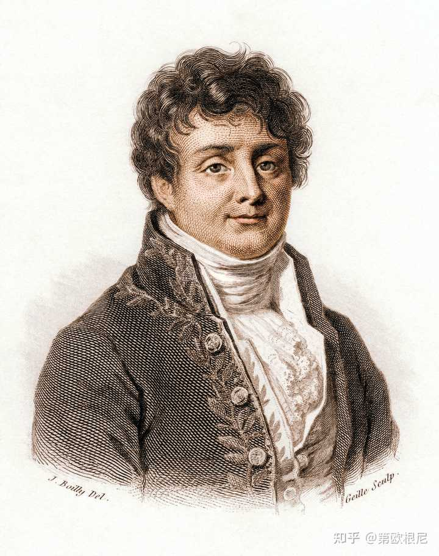
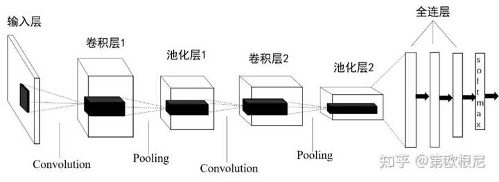

> 作者：第欧根尼　|　赞同 2335　|　评论 89　|　[原文](https://www.zhihu.com/question/582340981/answer/2002170397253183149)

## 想了解杨立昆的想法，需要知道杨立昆的来时路。

## 1、从S细胞到卷积运算

1980年，在巴黎高等电子与电工学院的图书馆里，一位戴着厚重眼镜的年轻人，正在向图书馆管理员询问有关《感知机》的材料。管理员从尘封多年的书架上面，找出来给了他，并用奇怪的眼光看了一眼这个年轻人。毕竟这种60年代的论文，追求新技术，爱跟热点的年轻人会感兴趣还蛮奇怪的。他顺便瞟了一眼他的借书证，证件上的名字叫做杨·安德烈·勒坎（Yann André Le Cun），后来大家都喜欢叫他杨立昆。

杨立昆（Yann LeCun）

杨立昆的本科学的是电机工程，他的专业训练集中在信号处理、电路设计和系统控制上。当时明斯基的断言，他从直觉上觉得纳闷，但是却并无法在科学上有任何的证据来反驳，直到他拿到一本1980 年的《Biological Cybernetics》杂志，里面有一篇福岛邦彦发表的关于“神经认知机”（Neocognitron）的论文。

福岛邦彦的理论并非凭空产生，而是建立在 20 世纪 60 年代两位神经生理学家 David Hubel 和 Torsten Wiesel 的诺贝尔奖级研究之上。这两位科学家将微电极植入猫的初级视觉皮层，试图记录神经元在看到不同光影时的反应。

他们发现，大脑并不是整体性地接收图像，而是通过不同职能的细胞进行层级化处理。其中最普遍的是一种简单细胞（Simple Cells），这些细胞非常“挑剔”。只有当光条出现在视网膜的特定位置，并且处于特定角度（比如水平或垂直）时，它们才会疯狂放电。它们就是视觉中的最基础单元。另外一种叫做复杂细胞（Complex Cells）：，它们接收多个简单细胞的信号。这些细胞同样喜欢特定角度的光条，但对位置不再敏感。只要光条在视野范围内，无论在左边还是右边，它都会激活。复杂细胞如同简单细胞的监工，会对简单细胞的工作进行抽象，从而处理更复杂一些的情况。还有一些超复杂细胞， 负责识别线条的末端、拐角或形状的长度。视觉细胞是有着明确的分工和抽象层次的。

他们观察到的这种层级处理的关系，揭示了视觉的真正奥秘。视觉的最终目的是识别“那是苹果”或“那是敌人”。这种层级排列就像搭建阶梯，简单细胞检测边缘，复杂细胞整合边缘形成形状。更高层（如 IT 区）将形状合成为物体。 这种分层让生物能够从杂乱的光影中抽离出“语义”，从而做出逃跑或捕食的决策。

福岛邦彦产生了一个极具野心的想法：能否用电子电路或计算机代码，复现这种“简单细胞到复杂细胞”的层级结构？很明显，福岛是个连接主义者，他希望实现“自下而上”的特征自我涌现，他也意识到了构建多层网络是解决问题的方法。十年后，罗森布拉特又等到了一个支持者。

但是福岛对多层网络构建的方式和罗森布拉特不一样。罗森布拉特所设想的多层感知机是全连接的，也就是每一层之间是没有差别的，他只是单纯的提高了网络的深度。但是福岛的网络，则是局部连接，每一层神经元只看前一层的一小块区域，而且他模仿的是S细胞和C细胞交替的真实生物结构，底层的神经元视野很小，但是通过层层堆叠，一个神经元的“有效视野”会被逐渐放大，它能看到更大的轮廓。这是一种认知广度的逐层扩大。福岛邦彦把他的想法，都汇聚在他的“神经认知机”的论文中。

可以想象，杨立昆看到“神经认知机”的论文时会有多兴奋。而且，他精通的信号处理方面的技能，又给他提供了另外一种视角，在杨立昆看来，福岛的S细胞神经元，就是一个二维信号的滤波器，在信号处理领域，卷积是用来滤波的。通过一个滤波器滑过信号，可以滤掉噪声、增强边缘。杨立昆认为，他只要设计一个矩阵（卷积核），在图像上滑过，就能实现福岛S细胞的功能。

当杨立昆想通了这一点，就开始动手创造一个新的神经网络，他要把罗森布拉特的全连接网络和福岛邦彦的神经认知机的结构揉在一起，这个网络就是神经网络发展历史中大名鼎鼎的卷积神经网络CNN（Convolutional Neural Networks）。

## 2、空间魔法：一切都是正弦波

杨立昆本科就读的巴黎高等电子与电工学院，非常重视数学基础，而杨立昆的专业，学的最重要的一门课程，就是傅立叶变换。杨立昆这门课的成绩尤为突出，让-巴蒂斯特·约瑟夫·傅里叶（Jean-Baptiste Joseph Fourier）这位在拿破仑时代工作的数学家留下的数学遗产，为杨立昆创造出CNN这个AI时代最伟大的空间魔法，提供了重要的作用。

让-巴蒂斯特·约瑟夫·傅里叶（Jean-Baptiste Joseph Fourier）

傅立叶最重要的成就是傅立叶变换。傅里叶变换最伟大的发现是：任何复杂的信号，无论是一段声音还是一张照片，都可以拆解为一系列简单的正弦波。这个观念，几乎是刻在所有信号处理从业者的基因里的。杨立昆显然也是具备这一视角的。在杨立昆看来，图像并不是像素点的随机堆砌。如果把图像看作起伏的地形，颜色突变的边缘就是“高频”波，平坦的背景就是“低频”波。用波的视角来寻找图像的特征，滤波器就起到作用了。卷积的过程，实际上就是在不断询问图像：“喂，你这里有没有和我这个频率对得上的特征？”如果对上了，乘法结果就大，神经元就激活。

傅立叶变换带给杨立昆的第二个启示是：一个信号无论在时间轴或空间轴上怎么移动，它的频率成分是不变的，改变的只是相位。这就是平移不变性，既然本质没变，那么我用来检测特征的那个“滤波器”参数也就不应该变。这就是 “权重共享” 的底层逻辑——用同一个滤波器扫描全图，因为它在捕捉那种恒定的“空间频率”。

在傅立叶思想的影响下，杨立昆构建的CNN是这个样子的：

CNN的网络结构

卷积层就如同神经认知机里面的S细胞，负责对某一种特征的识别。池化层则是C细胞，负责对这些提取出来的特征进行模糊处理，以便让这个特征更具普适性。卷积层和池化层的配合如同收音机在接受广播信号，卷积层像是在拨动收音机旋钮。每一个卷积核就是一个“选频器”，它在图像中寻找特定的“空间频率”。如果找到了，就会产生强烈的电信号。池化层负责锁定，像是检波器。它告诉网络：“在这个 2x2 的范围内，我确认听到了我们要找的那个电台的信号，虽然它位置稍微跳了一下，但能量最强点就在这。”

此时，这个电台的信号，已经被锁定了，但是检波后的包络信号依然散布在不同的频率通道里。喇叭不能直接处理这些分布式的电荷，它需要电流按顺序流入线圈，并振动喇叭，开始发声。CNN也需要这样一个把信号压扁的过程。在CNN中，在 CNN 中，这个过程叫 Flatten（展平）。通过展平，卷积和池化提取出的二维特征图（Feature Maps）拆开，拉成一排长长的一维向量。这个向量就能传输给全连接层了。

这个全连接层在收集到传过来的各种特征值之后，作出最后的判断，回答这样一个问题：“既然这些特征都在，那么最合理的解释是什么？”此时，神经网络才真正开始脱离信号处理阶段，开始进行逻辑决策，并做最后的输出。

在 CNN 的最后，它通过一个叫 Softmax 的函数输出概率。Softmax 把全连接层算出的能量值转化成 0 到 1 之间的概率，且总和为 1。具体的输出结果可能是这个样子的：

-   “猫”：0.92
-   “狗”：0.05
-   “汽车”：0.03

这个空间魔法，把一张图片变成了物理层面的电信号，然后又把物理层面的“电信号强度”翻译成了人类可以理解的“置信度”。杨立昆把一套信号处理的算法，一个神经认知机的结构，和一个全连接网络缝合在了一起。

如果这个时候，有个数字图像处理的专家来审视杨立昆的CNN，丝毫不会惊讶。他的这个结构和多尺度滤波器组如出一辙，只不过传统的数字图像处理的多个滤波器的后面，接的是一些简单的决策逻辑或者是一个浅层的机器学习分类器SVM什么的。

还有最关键的一点，传统的数字图像处理，这些滤波器都是专家手工编写的，而杨立昆要做的事情是，让全连接网络的反馈，去持续修改卷积层。换言之，杨立昆的滤波器，不需要专家手工编写了。而实现这种反馈的机制，正是辛顿的反向传播。但那个时候，是1985年，辛顿和鲁梅尔哈特的反向传播论文还没有发表。是的，杨立昆和辛顿殊途同归，杨立昆独立发明了一遍反向传播，但他那篇用法语发表的论文却远并没有辛顿的知名。他的博士导师，对杨立昆选择神经网络的研究方向，也是颇为失望。法国的杨立昆，倍感孤独。

幸运的是，这篇论文被辛顿看到了，辛顿当时已经来到了多伦多大学。他立刻邀请杨立昆来多伦多大学，加入自己的实验室。在这里，杨立昆不再是那个孤独的法国探索者，而是进入了连接主义的核心圈子。在多伦多，辛顿给予了他学术上的高度自由，而杨立昆则向辛顿展示了如何将这些抽象的神经元变成能够处理真实图像的物理滤波器。对杨立昆来说，多伦多那段时间的科研环境虽然简陋，但那里的咖啡和讨论比他在巴黎时更有质量。

## 3、LeNET-5:神经网络的诺曼底登陆

在多伦多大学的短暂停留之后，杨立昆加盟了位于美国新泽西的贝尔实验室。当时辛顿的实验室偏向理论探索，而杨立昆渴望在一个拥有更强大算力和实际数据的环境中验证他的 CNN 构想。当时贝尔实验室的负责人拉里·杰克尔（Larry Jackel），为杨立昆提供了一种名为 DSP（数字信号处理器） 的高性能硬件。杨立昆能用它编写汇编语言来优化神经网络。

在贝尔实验室，杨立昆终于能实现他学生时代的构想，在 1989 年发布了第一代卷积神经网络。而且，他还成功说服了美国邮政局（USPS），让他的程序去识别那些歪歪扭扭的手写邮政编码和支票，让卷积神经网络不仅仅只是作为实验室的玩具，而变成了真正可以创造生产价值的工具。

从1989年到1998年推出LeNet-5，杨立昆花了近十年的时间。这段时间，杨立昆发挥了自己在工程领域的特长，突破了四大难题，这些难题的解决方案，经过演化，已经成为了当下整个深度学习领域甚至整个AI工程领域的基石。

第一个难题是，如何处理连笔和分割问题。这也是End-to-End 的雏形。End-to-End 的目标是，构建一个单一的、巨大的神经网络模型，直接将原始数据映射到最终目标，中间的所有步骤都由模型自己在训练中自动学会，而不是由人来设计。这可能是这十年里杨立昆解决的最棘手、也最被后人低估的问题。

1989 年的模型只能识别单个切好的数字。但在现实世界（比如支票、信封）上，数字是连在一起的（如 "1998"）。 传统方法是：先用一个算法把数字切开（分割），再送给 CNN 识别。 如果切错了（比如把 8 切成了两个 0），CNN 识别能力再强也没用。这是“分割”与“识别”的鸡生蛋蛋生鸡问题。杨立昆创造性的使用了图变换网络来对分割这个行为本身来做训练。他不再试图先完美分割，而是生成多种可能的分割路径，让网络在所有路径中找到得分最高的那一条。梯度不仅可以更新 CNN 的权重，还能反向传播回去优化“分割”的策略。在杨立昆眼中，所有问题都是可以通过梯度下降来解决的。杨立昆在工程上的成功，鼓励了所有的后来者，今天的语音识别，机器翻译，甚至特斯拉的 FSD 自动驾驶，核心逻辑都是建立在杨立昆给予的对梯度下降的信心上。

杨立昆解决的第二个难题，从现在的视角看，也是居功至伟。他解决的问题是：如何让模型“变小变快”？这个方案正是模型压缩的先驱。90 年代的硬件极其简陋（算力可能只有现在的亿分之一）。一个全连接层或者大的卷积层，既占内存又算得慢。如果要把算法装进银行的支票读取机或者手持设备里，必须极致压缩。当时杨立昆如果没办法做到这个优化，CNN就无法赢得这个真正让神经网络走进工商界的Case，全世界对机器学习的接受可能会因此晚上若干年。幸亏，工程之神附体的杨立昆用了二阶导数来对每个权重对误差的影响力进行计算，影响力小的直接删除。这样，他在不降低准确率的情况下，把参数量减少了 60% - 80%。如今这种方法，被广泛的用在了模型剪枝上，他又一次向业界证明，这种工程优化方式行得通。

在 90 年代初，大家都在用自己的私有数据吹牛。你说你的算法准，我说我的准，但数据不一样，没法比。学术界处于“自说自话”的混乱状态。杨立昆和同事 Corinna Cortes 将美国国家标准与技术研究院（NIST）的高清手写数字库进行了清洗、标准化，制作了 MNIST 数据集（6万张训练，1万张测试）。它确立了“基准测试（Benchmark）”文化。而这直接催生了ImageNet，如果没有ImageNet，AlexNet们将不会出现。这是杨立昆解决的第三个难题：“如何证明我比别人强？”

他最后解决的难题，就是确立了现代CNN的标准。他最终在LeNet-5中，确定了经典的7层结构，也就是这种标准范式，才使得后面演化出来了AlexNet，VGG和ResNet，而这些LeNet-5的后代子孙，则进一步启发了Transformer的构建。

接下来，宿命的齿轮开始转动，杨立昆撞上了和辛顿一样的墙壁，梯度消失问题出现了。在当时，如果你试图把 LeNet 堆叠到 10 层甚至 20 层，它会立即崩溃，根本无法训练。但是当时LeNet-5的目标只是解决手写数字识别和银行支票问题，不需要那么深的网络。输入只是 32x32 的灰度图，对于这种简单的低分辨率图像，5 层网络已经能提取完美的特征了。在这一点上，杨立昆比辛顿显然是幸运一些。神经网络的深度问题，直到AlexNet的出现，才开始逐渐有了解决的趋势。杨立昆在赢得了“全美国 10% - 20% 的支票都是由杨立昆设计的算法自动读取的”这样的战绩后，依然和辛顿一起忍受着SVM的冷嘲热讽，并肩安慰着渡过AI的寒冬。

## 4、从卷积网络之父到深度学习三巨头

在人工智能发展的宏大史诗中，杨立昆犹如一位执掌维度的“高卢空间魔法师”。当早期的学者们试图用枯燥的逻辑符号去定义世界时，这位带着电机工程背景的法国人，却开启了独有的“信号之眼”，看穿了图像的本质——那不是杂乱的像素堆砌，而是起伏流动的空间波谱。

但除了作为“卷积网络之父”确立了视觉处理的标准外，杨立昆在拓宽神经网络的思想边界方面，实际上有着比 CNN 更深远、更具哲学意味的贡献。

他为神经网络首次引入了“基于能量的模型”。这是一个极具杨立昆个人色彩，但常被大众忽视的深刻思想。主流 AI，如 辛顿的派系，非常喜欢用概率论，强制所有可能性的总和为 1，比如常见的Softmax。杨立昆认为概率论在高维空间（比如生成一张图）是束手束脚的。他提出了能量模型：借鉴统计物理，不强求归一化，只要把“正确答案”的能量压低，把“错误答案”的能量抬高即可。这种物理学视角的引入，为后来处理复杂结构化预测，如图像生成、语音合成等提供了比纯概率模型更自由的数学框架。

他也是“端到端学习”的推广者，为行业确立了“端到端学习”的信仰。在杨立昆之前，机器学习是一条割裂的流水线：预处理 $\rightarrow$ 特征提取 $\rightarrow$ 分类器。每个模块由不同的人用不同的理论设计。他极其强硬地推行“整体论”。他认为整个系统，从输入像素到输出决策应该是一个单一的、可微分的函数。这种思想杀死了“手工特征工程”，确立了“梯度即上帝”的原则——只要你能定义误差，梯度就能流过系统的每一个角落，自动修正所有参数。这成为了现代深度学习最底层的公理。现代的自动驾驶技术和机器人等和现实物理世界交互的模型，目前大多采用端到端模型，和杨立昆的强势推动和行业影响力有很大的关系。

他也是“自监督学习”的布道者。当所有人都在疯狂做标记数据或玩强化学习（RL）时，杨立昆抛出了著名的“蛋糕理论”。他认为强化学习是蛋糕上的樱桃，样本极少，反馈极稀疏；监督学习是蛋糕上的糖霜，样本虽多，但需要人工；自监督学习才是蛋糕胚子，海量数据，自我预测。他极力反对机器依赖人类标签，主张机器应该像婴儿一样，通过“预测被遮挡的部分”来理解世界。这一思想直接预言并推动了后来 BERT、MAE 等大模型的诞生逻辑，也正是这样的观念，使得他和扎克伯格在2025年斥资150亿美金收购人工标注公司Scale AI意见相左，乃至半年后出走FAIR，让这段三顾茅庐式的佳话并未画上完美的句号。

他不仅仅让卷积在图像处理领域风靡，还将卷积推向了“非欧空间”。他们利用谱图理论（Spectral Graph Theory），将卷积的概念推广到了图（Graph）和流形（Manifold）上。这直接开启了图神经网络（GNN）和几何深度学习这一庞大的分支，让神经网络的触角从“看照片”延伸到了“药物研发（分子图）”和“推荐系统（关系网）”。

截止到2026年初，他依然战斗在AI领域的最前线，他成为对抗“自回归AR”范式的最重要的旗手，并提出了世界模型JEPA的概念。他公开反对目前主流的 Transformer式的自回归（Auto-regressive）生成，认为那是“概率性的鹦鹉学舌”，没有真正的逻辑和规划。他提出了 JEPA（联合嵌入预测架构）。智能的核心不是“预测下一个词”，而是“在抽象空间中模拟未来”。真正的 AI 应该在大脑中建立一个世界模型，能够理解因果律，并基于此进行推理和规划，而不是仅仅基于统计学猜概率。

正因为他有着如此倔强的性格，如此丰富的工程经验和深厚的数学功底，又有着巨大的影响力，他才得以成为和辛顿比肩的深度学习三巨头。

---

本文出自一个专注讲述人工智能发展历史的专栏，专栏火热连载中，内容限时免费，欢迎各位有兴趣的朋友阅读。

[硅基物种起源](https://www.zhihu.com/column/c_2000233132604031127)
