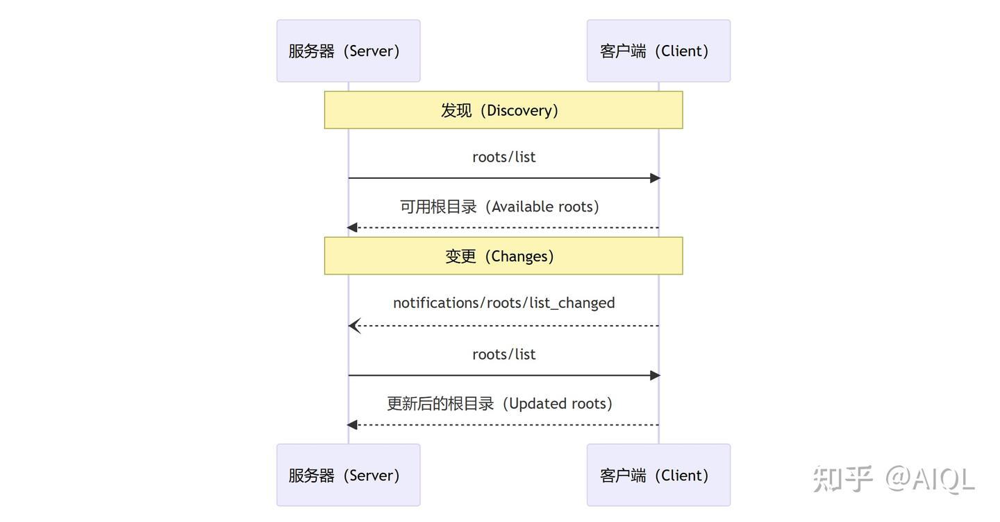

> 作者：AIQL　|　赞同 2　|　评论 0　|　[原文](https://zhuanlan.zhihu.com/p/17890141660)

**模型上下文协议（Model Context Protocol, MCP）** 提供了一种标准化的方式，使客户端能够向服务器暴露文件系统的“根目录”（Roots）。根目录定义了服务器在文件系统中可以操作的边界，使服务器能够了解它们可以访问哪些目录和文件。支持该协议的客户端可以从服务器请求根目录列表，并在列表发生变化时接收通知。

## 用户交互模型（User Interaction Model）

在 MCP 中，根目录通常通过工作区（workspace）或项目配置界面暴露。

例如，实现可以提供工作区/项目选择器（workspace/project picker），允许用户选择服务器应有权访问的目录和文件。这可以与版本控制系统或项目文件中的自动工作区检测功能结合使用。

然而，实现可以自由地通过任何适合其需求的界面模式暴露根目录——协议本身并不强制规定任何特定的用户交互模型。

## 能力声明（Capabilities）

支持根目录的客户端必须在初始化时声明根目录能力：

```
{
  "capabilities": {
    "roots": {
      "listChanged": true
    }
  }
}
```

`listChanged` 表示客户端是否会在根目录列表发生变化时发出通知。

## 协议消息（Protocol Messages）

### 列出根目录（Listing Roots）

为了获取根目录，服务器发送 `roots/list` 请求：

**请求：**

```
{
  "jsonrpc": "2.0",
  "id": 1,
  "method": "roots/list"
}
```

**响应：**

```
{
  "jsonrpc": "2.0",
  "id": 1,
  "result": {
    "roots": [
      {
        "uri": "file:///home/user/projects/myproject",
        "name": "我的项目（My Project）"
      }
    ]
  }
}
```

### 根目录列表变更（Root List Changes）

当根目录发生变化时，支持 `listChanged` 的客户端必须发送通知：

```
{
  "jsonrpc": "2.0",
  "method": "notifications/roots/list_changed"
}
```

### 消息流（Message Flow）



## 数据类型（Data Types）

### 根目录（Root）

根目录定义包括：

-   `uri`：根目录的唯一标识符。在当前规范中，这必须是一个 `file://` URI。
-   `name`：可选的人类可读名称，用于显示。

### 根目录示例

**项目目录（Project Directory）**

```
{
  "uri": "file:///home/user/projects/myproject",
  "name": "我的项目（My Project）"
}
```

**多个仓库（Multiple Repositories）**

```
[
  {
    "uri": "file:///home/user/repos/frontend",
    "name": "前端仓库（Frontend Repository）"
  },
  {
    "uri": "file:///home/user/repos/backend",
    "name": "后端仓库（Backend Repository）"
  }
]
```

## 总结

**根目录（Roots）** 是 **模型上下文协议（Model Context Protocol, MCP）** 的一部分，旨在为客户端和服务器之间的文件系统交互提供标准化支持。通过定义**根目录**，协议明确了服务器在文件系统中的操作边界，确保服务器只能访问指定的目录和文件。客户端可以暴露根目录列表，并在列表发生变化时通知服务器，从而实现动态的权限管理。

### **根目录的作用**

-   根目录定义了服务器可以访问的文件系统范围。
-   支持动态更新，客户端可以在根目录列表变化时通知服务器。

**1\. 用户交互模型**：

-   根目录通常通过工作区（workspace）或项目配置界面暴露。
-   实现可以结合版本控制系统或项目文件自动检测根目录。

**2\. 能力声明**：

-   客户端需在初始化时声明是否支持根目录列表变更通知（`listChanged`）。

**3\. 协议消息**：

-   服务器通过 `roots/list` 请求获取根目录列表。
-   客户端通过 `notifications/roots/list_changed` 通知服务器根目录列表的变化。

**4\. 消息流**：

-   服务器与客户端通过请求和通知实现根目录的发现与更新。

**5\. 数据类型**：

-   根目录包含 `uri`（唯一标识符）和 `name`（可读名称）。
-   支持单项目目录和多仓库场景。

### 应用场景

-   **单项目目录**：适用于单个项目的文件访问控制。
-   **多仓库管理**：适用于同时管理多个代码仓库的场景，如前端和后端分离的项目。

### 优势

-   **标准化**：提供统一的协议规范，便于不同客户端和服务器的集成。
-   **灵活性**：允许客户端根据需求自定义根目录的暴露方式。
-   **动态更新**：支持根目录列表的实时变更通知，确保服务器始终访问最新的文件范围。

通过 **根目录**，客户端和服务器可以更安全、高效地协作，同时为用户提供灵活的文件访问控制能力。
