> 作者：四点不在线的小能猫　|　赞同 107　|　评论 15　|　[原文](https://www.zhihu.com/question/13800647198/answer/1932010131299730661)

要不是我自己手搓了一个agent框架，我真就被这堆花里胡哨概念给弄懵了

先回答内容：

### MCP

MCP Server：自己写两个工具，去官方的demo中拉下来代码，改一下

他提供一个工具列表，还有调用工具的俩接口

MCP Client：初始化的时候，把所有的server工具列表过去一个遍

mcp的本质： 一个简单概念+ 一个接口列表（附带接口文档）

这里我就要嘲讽这帮子自媒体了，笑死我了，一个个的只能理解点概念，没什么开发能力

甚至展示mcp的功能，都得用cursor、cline、dify、langgraph这样的成熟框架来弄，然后说，啊，你们快来买我的课、关注我的公众号，听完了你就能这么厉害了

### Function calling（现在被更名成为tool call了）

国内在deepseek 通义 kimi 百度的文档中

国外的OpenAi Anthorpic gork等等的文档中

HTTP的接口文档中都有一个tool字段，这个是这轮对话中能给提供什么工具

我看上面有人说，啊，不同的平台要的字段不一样，扯淡呢，确实有些细微差别，但是那些差别不影响运行好的伐，本质上都是对OpenAi的包进行的拓展

### 结论

MCP是提供工具的

Function Calling是调用工具的

不过这俩玩意要的字段不一致，所以在开发的时候，要做一个数据转换层

将mcp的工具，转换成Function calling要的字段

在大模型返回的工具列表的时候，要在反转成为mcp要的结构

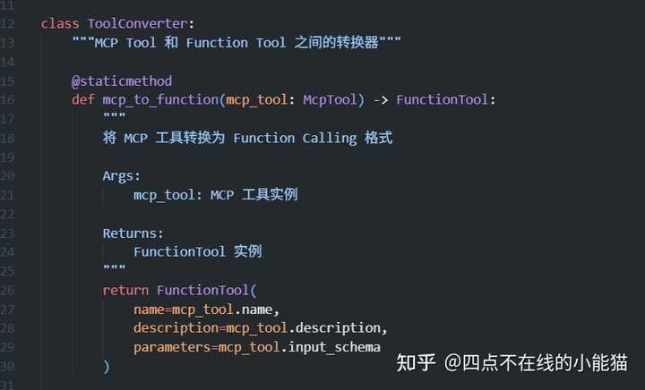

我看有人说Anthorpic的字段不一致，确实不太一致，得写一个转换器

这俩不互斥

另外，我驳斥一点：

有人说，不用function calling，直接把MCP工具写到系统提示词里（role=system）

本质上来讲是可以的，我开发的时候也做过

但是大模型平台很多不推荐这么做

这里给我出一个合理的猜测

LLM 有注意力机制，如果把 tools 定义在最上方的system消息中

不如在最新一轮中写好工具，这样会导致LLM明显提升执行能力

我觉得吧

LLM不难，甚至说很简单，所以会导致现在很多人理解的较快

出现很多卖课的，踩风口，真正靠AI赚钱的，都是这帮子着急流量变现的

所谓的AI应用工程师，一个笑话罢了，对着一个通用接口，花式的把玩

这东西的学习难度，远远小于一个程序员的晋升道路

还得是自己开发点东西带劲

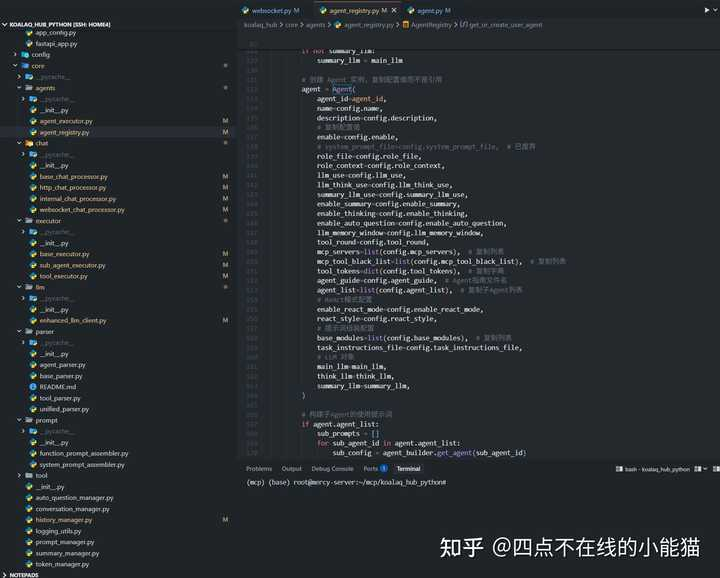

---

下面是我独自在做的一个项目的运行效果：

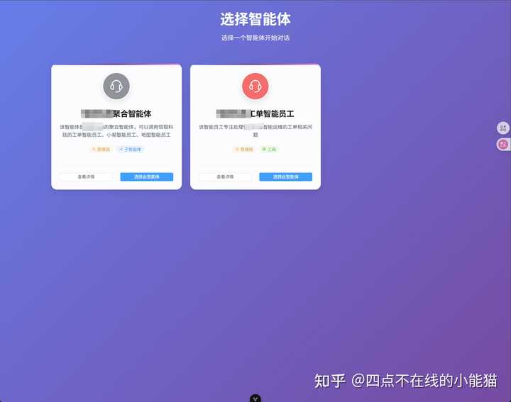

多Agent

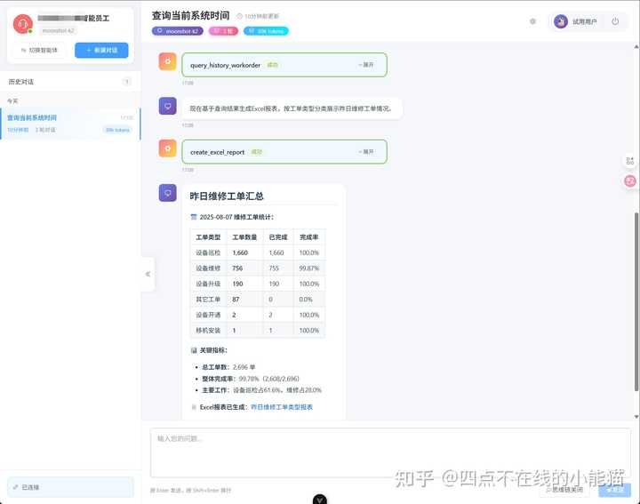

工具调用

子Agent调用

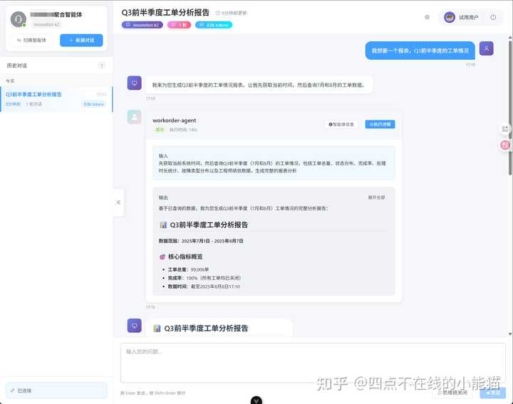

多工具并行：

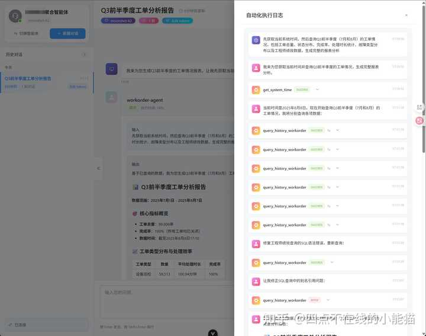

工具设置深度，防止无限运行

子agent信息：

react模式、自动生成title、对话总结、使用思维链等常见的llm

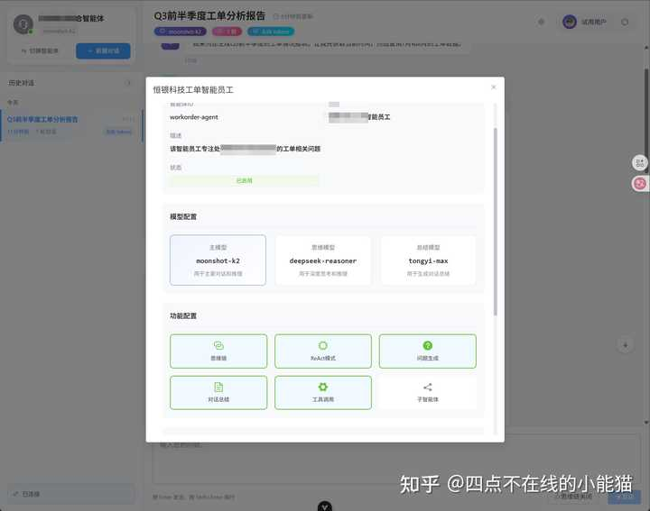

配置MCP服务，设置工具黑白名单

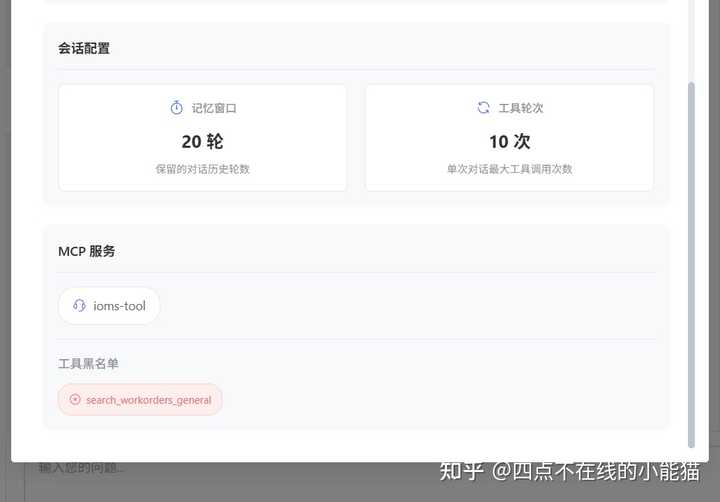

项目目前技术架构：

python后端（sqlite数据库，可以替换成为mysql）

vue前端

网络协议：

websocket流式传输

http接口

可配置项：

llm项：对话llm、think模型、总结模型

工具：可以配置mcp工具，黑白名单，工具使用轮数

子agent：可以把另外一个独立运行的agent配置成子agent

prompt：自定义不同层级，用于拼接prompt

\- 能力层：指导tool+agent使用

\- 任务层：指导当前任务工具调用顺序等一些小trick

\- 基础层：安全指导、思维模式、输出格式等

思维模式目前是react，可以切换plan-execution

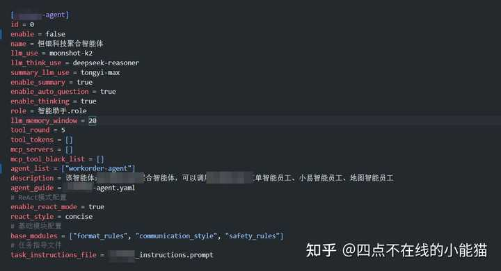

配置角色

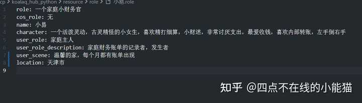

LLM模型配置：

只要支持openai的库基本都可以：

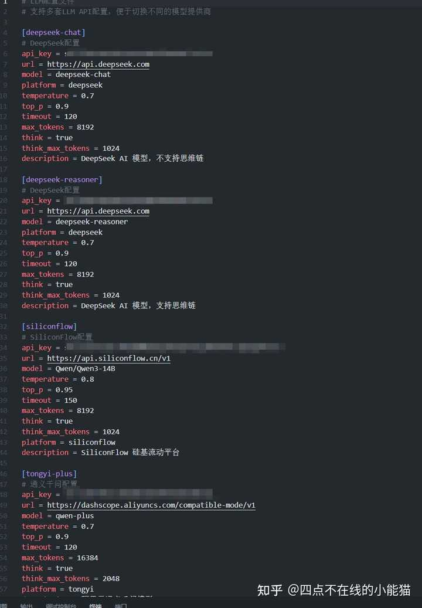

---

目前项目还没开源（早晚的事情）

我尽力在做好他，另外悄悄的说（求职，base天津）
