> 作者：百问音乐　|　赞同 140　|　评论 22　|　[原文](https://zhuanlan.zhihu.com/p/1975607934072406330)

很多人觉得乐理难学，究其原因是没有打好基础，今天就从最基础的do re mi fa so la si讲起，用十分钟时间带你入门乐理吧～

## **第一节 唱名的由来**

即使没有接触过系统音乐教育的同学，也应该听过过do re mi fa so la si，那你有没有想过，为什么要这么唱呢？下面我们就来讲讲其由来。

要回答这个问题，就要追溯到11世纪，一个意大利音乐家Guido of Arezzo为了方便唱谱，就用一首歌曲的第一个音节（单音节方便发音）来表示不同的音高，分别为Ut，Re，Mi，Fa，Sol，La（后面的音比前面的高），如图一所示。

到16世纪，Ut被改成do；17世纪，增加了si。

从此，就形成了do，re，mi，fa，so，la，si，因为这些是唱谱时表示不同音高的，所以叫做唱名。这就是唱名的由来，到此为止，我们学会了乐理的第一个名词-唱名。

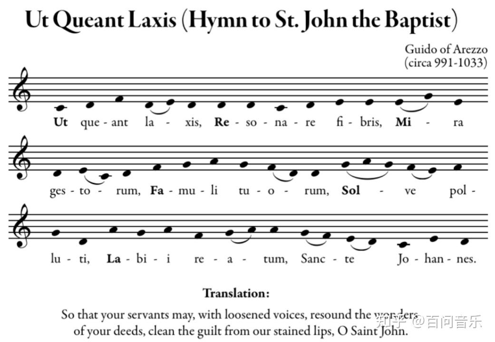

图一

### **思考题1-do的频率是多少**

1\. 初中物理告诉我们，决定音高的是频率，那么do的频率是多少呢？

## **第二节 简谱的由来**

聪明的同学会问了，do，re，mi，fa，so，la，si唱的时候比较方便，但是记谱的时候还是比较复杂，有没有更简单的记谱方式呢？这个问题在17世纪就有个和你一样聪明的人就想到了。

1665年一名法国修士提出，用阿拉伯数字1到7来带入唱名do 到 si，这样记谱就更加方便了，于是就形成了简谱。

于是，就形成了下表的对应关系：

|     |     |     |     |     |     |     |     |
| --- | --- | --- | --- | --- | --- | --- | --- |
| 唱名  | do  | re  | mi  | fa  | so  | la  | si  |
| 简谱  | 1   | 2   | 3   | 4   | 5   | 6   | 7   |

到此为止，我们学会了乐理的第二个名词-简谱

### **1 唱名与简谱的应用**

学会了唱名与简谱，就可以视唱简谱的曲子了，以下图欢乐颂的简谱为例，谱子第一行的数字为简谱，简谱下面为唱名。

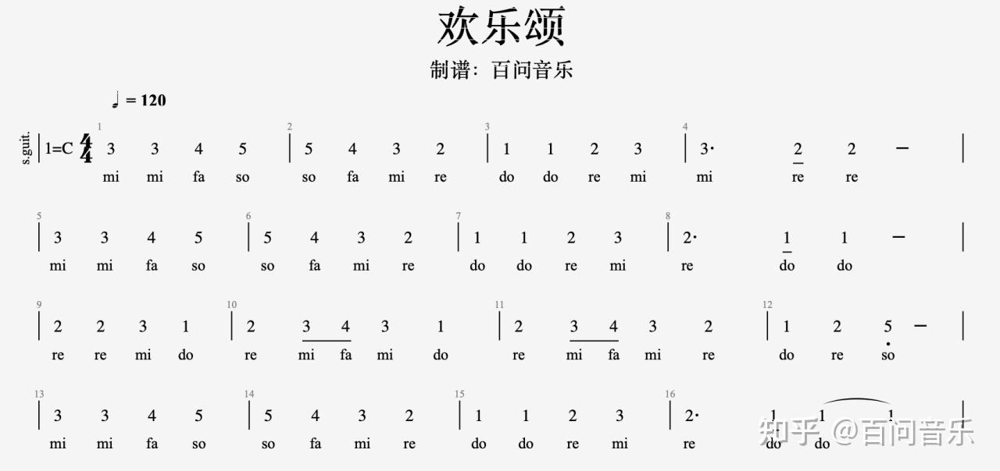

### **思考题2-比7高的音怎么表示**

既然1，2，3，4，5，6，7代表不同的音高，如果比7的音高还要高，比1的音高还要低，简谱和唱名分别怎么表示呢？

### **思考题3-怎样读写简谱**

简谱中将数字分开的竖线，数字下方的线和数字后面的点分布是什么意思

### **2 简谱在吉他指板上的分布**

学会视唱欢乐颂之后，要怎样在吉他上弹奏呢？学习完吉他指板图就可以实现了。

我们常见的吉他指板简谱如下图所示，到这里，我们就可以根据简谱来弹奏一些简单的曲目了。

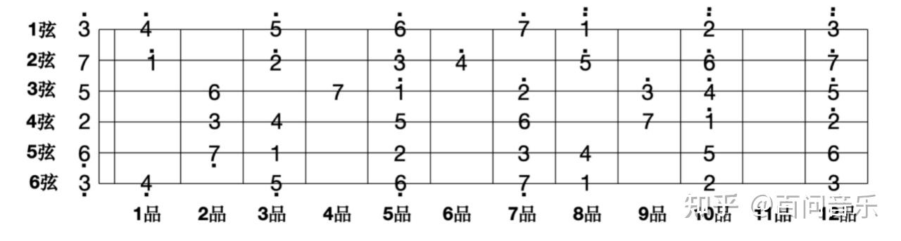

图二

## 第三节 **音名C D E F G A B的概念**

### **1 第一节思考题1答案**

在讲音名之前，先来解答一下第一节中的思考题：初中物理告诉我们，决定音高的是频率，那么do的频率是多少呢？

参考答案：唱名do的频率是不确定的，因为音乐中，只要一个歌曲中的相对音高差是确定的，我们听起来就是同一首歌。如果一首歌我们第一个音唱的比较高，只要后面的音和第一个音的相对音高是不变的，听起来的旋律还是一样，只是整首歌的音高都提高了而已（我们在唱歌是，有时候会感觉起高了，就是第一个音唱的比较高，后面更高的音超出了我们的音域，导致唱不上去或者破音）。

所以，唱名是一个相对的概念，任何音都可以唱做do；同理，简谱也是一个相对的概念，唱做do的，都可以写成1（这种方式叫做首调唱名法，另一种方式是固定调唱名法，具体差异见相关专题）。

### **2 音名CDEFGAB**

既然唱名和简谱是一个相对的概念，那么是否有一个概念，可以确定某个音的音高呢？当然有，那就是音名。

我们就以88键钢琴为例，钢琴上每个键的音的频率是固定的，从左到右分成七组，分别表示为C1 D1... B1， C2 D2...B2， .... C7 D7...B7。这样，每个音就可以用音名+数字角标的形式来表示了（这种方式叫做科学音调记号法）。

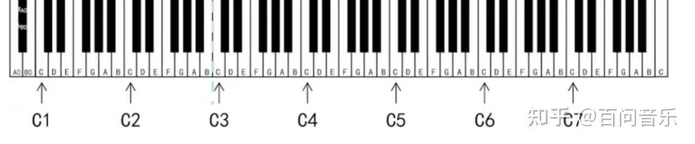

如果我们把C唱做do，那么唱名，简谱和音名的对应关系如下：

|     |     |     |     |     |     |     |     |
| --- | --- | --- | --- | --- | --- | --- | --- |
| 唱名  | do  | re  | mi  | fa  | so  | la  | si  |
| 简谱  | 1   | 2   | 3   | 4   | 5   | 6   | 7   |
| 音名  | C   | D   | E   | F   | G   | A   | B   |

到此为止，我们学会了乐理的第三个名词-音名，到此为止，可以说是入门音乐了，有了这些基础，后面再理解其他概念就容易多了。

音名与频率的关系，可参考如下文章：

7\. 音名与频率的对应关系及泛音 - 百问音乐的文章 - 知乎

[7\. 音名与频率的对应关系及泛音](https://zhuanlan.zhihu.com/p/1963665383438423187)

### **3 吉他指板上的音名分布**

在吉他指板上，音名的排列如图三所示：

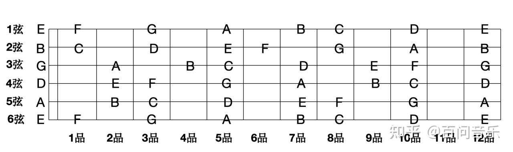

图三

### **思考题4-D唱作do的意义**

在本节开头的答案中说，任何音都可以唱做do，如果把音名D唱做do，和把C唱做do，需要用什么概念来区分呢？

### **思考题5-为什么C-D与E-F形状不一样**

从吉他音名图上可以看出，C（1）到D（2）之间相隔一品，而E（3）和F（4）之间是相邻的，这是为什么？

### **思考题6-音名的频率是多少**

既然音名的频率是确定的，那么每个音名的频率是怎样规定的呢？

## 第四节 **十二平均律**

通过前三节的学习，我们知道了唱名，简谱，音名的概念。也知道了其在吉他指板上的分布。聪明的同学又要问了，这些音是按照什么规律排列的呢？回答这个问题之前，就要先了解十二平均律。

### **1 第二节思考题2答案**

在讲解十二平均律之前，先回顾下思考题2的答案。

既然1，2，3，4，5，6，7代表不同的音高，如果比7的音高还要高，比1的音高还要低，简谱和唱名分别怎么表示呢？

参考答案：如果某个乐曲的音，比si（7）还要高，或者比do（1）还要低，要怎么唱和记谱呢？为了方便，我们就不引入新的唱名和数字了，比si（7）高一级的音，唱名我们称之为“高音do”（在唱谱的时候，为了方便，仍然唱为do，发音和do一样，但音高要更高），简谱记为(1的上面加一个实心黑点）

同理，比do（1）低一级的音，唱名为“低音si”，简谱记为7（7的下面加一个实心黑点）

加入高音和低音的唱名和简谱对应关系如下：

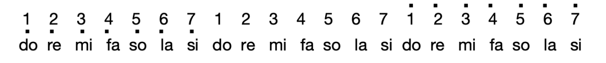

注意：唱的时候无论是高音do，还是低音do，都唱作do，但唱的音高不同；读的时候，读成高音do，1读成低音do。

### **2 音程与度的概念**

在学习十二平均律事情，还需要了解音程与度的概念。

为了方便表达音和音之间的距离，我们引入了音程的概念（即两个音之间的距离叫做音程

），音程的单位叫做度，举例说明：

1到1，2，3，4，5，6，7，1(高音do）的音程分别称为一度，二度，三度，四度，五度，六度，七度，八度，以此类推，后面的音为九度，十度。。。。

一度到八度音程列举如下：

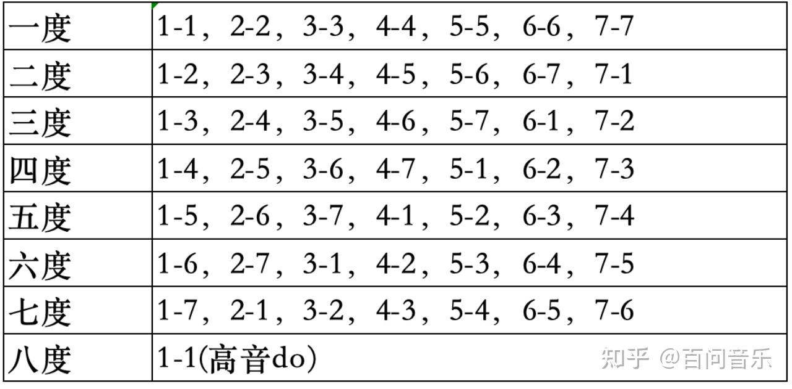

这里只是简单介绍下音程的概念，更多内容参考如下文章：

9\. 一篇文章讲清楚音程 - 百问音乐的文章 - 知乎

[9\. 一篇文章讲清楚音程](https://zhuanlan.zhihu.com/p/1964032764102808740)

### **3 十二平均律定义**

千呼万唤始出来，学习完高音低音，音程与度的概念之后，终于要到本节的主题十二平均律了。

将一个八度音（do到高音do，高音do频率是do的二倍）按频率等比分成12等份（任意相邻的两份的音程值为2的12次方根）。具体如下图所示，每一份我们称为一个半音（两个半音为一个全音），这就是十二平均律了。

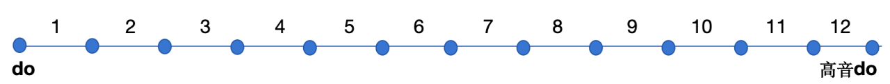

### **思考题5答案**

学习完十二平均律之后，思考题5的答案就有了。

从吉他音名图上可以看出，C（1）到D（2）之间相隔一品，而E（3）和F（4）之间是相邻的，这是为什么？

参考答案：因为吉他相邻两品之间相差一个半音，1和2相差两个半音，所以要间隔一品，3和4相差相差一个半音，所以是相邻的。

聪明的同学又会问了，为什么1和2要相差两个半音（一个全音），3和4要相差一个半音呢，这样规定的依据是什么？这就是音阶要解决的问题了。

### **4 升号#（sharp）降号b（flat）和还原记号♮（natural sign）**

C和D的音程差是一个全音，在C和D之间还存在一个音，这个音比C高半音，比D低半音，要怎么表示呢，这就要引出升降号的概念了。

比C高半音，我们表示为C#或者#C，读作升C（C#为国外的写法，#C为国内的写法，这样写的区别，取决于读法的差异，升C国外度C sharp，所有升号#写在后面，国内读作升C，所有升号写在前面）。

如果连续升两个半音，用x表示

比D低半音，我们表示为Db。

比C高半音的音，和比D低半音的音，是同一个音，所有C#和Db表示的是同一个音。

如果连续降两个半音，用bb表示。

学习了半音的概念，一个八度的12个音表示如下：

C,C#/Db,D,D#/Eb,E,F,F#/Gb,G,G#/Ab,A,A#Bb,B

## 第五节 **大调音阶**

十二平均律将一个八度平均分成12个半音，很显然这12个半音是无法在1，2，3，4，5，6，7，1中平均分配的，通过吉他指板图，我们知道3(mi)-4(fa)，7(si)-1(.)(高音do)相差半音（吉他指板上相邻的两个品音高差为半音），1（do）-2（re），2（re）-3（mi），4（fa）-5（so），5（so）-6（la），6（la）-7（si）相邻两个音相差全音（2个半音，吉他指板上隔一品）。

总结一下，我们经常弹奏的吉他指板，一个八度内，相邻两个音的音高差关系是全音，全音，半音，全音，全音，全音，半音，为了方便，我们简称为全全半全全全半。

满足“全全半全全全半”关系的音阶，我们称之为大调音阶，前面的问题也就有答案了，为什么1和2要相差两个半音（一个全音），3和4要相差一个半音呢，因为这种音阶排列方式是大调音阶的排列方式，也是流行音乐最常用的音阶排列方式。大调音阶演奏的音乐，通常是明亮欢快的，下图列举了大调音阶的排列，看起来会比较清晰了。

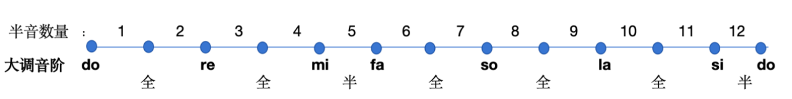

### **1 C大调音阶**

第二节我们学习了简谱在吉他指板的分布，第三节学习了音名在吉他指板上的分布，把两者结合在一起，如下图所示，是否能够总结出什么规律呢？

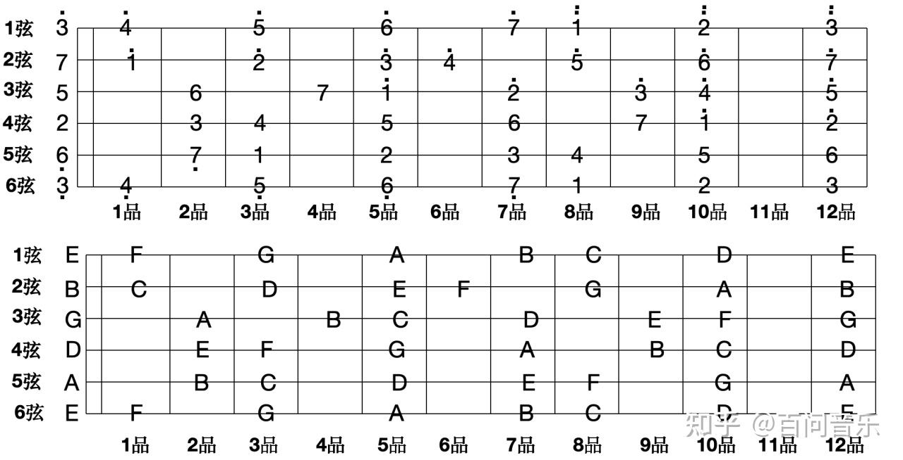

1\. 简谱图和音名图都是满足全全半全全全半的大调音阶规律的，所以这是一个大调音阶；

2\. 简谱图中1（do）的位置，和音名图中C的位置是一样的，可以理解为将音名C唱作do（1）。

上面这种，将C唱做do（1），且满足大调音阶关系（全全半全全全半）的音阶，我们叫做C大调音阶。

### **2 第三节思考题4答案**

第三节思考题4提到，“任何音都可以唱做do，如果把音名D唱做do，和把C唱做do，需要用什么概念来区分呢？”

如果把D唱做do（1），同时满足大调音阶关系（全全半全全全半），我们称之为D大调，

D大调音阶的唱名，简谱和音名对应如下

|     |     |     |     |     |     |     |     |
| --- | --- | --- | --- | --- | --- | --- | --- |
| 唱名  | do  | re  | mi  | fa  | so  | la  | si  |
| 简谱  | 1   | 2   | 3   | 4   | 5   | 6   | 7   |
| 音名  | D   | E   | F#  | G   | A   | B   | C#  |

其简谱和音名的指板图如下：

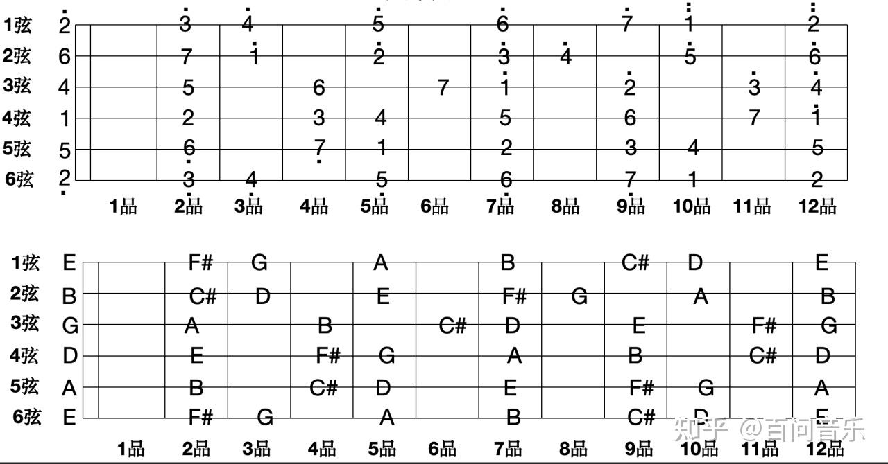

### **3 大调音阶的规律总结及12个大调音阶和指板图推导**

通过C大调和D大调音阶的推导，我们发现，满足大调音阶关系，将哪个音名唱做do，就是什么大调。

既然一个八度有12个半音，因此一共有12个大调。12个大调音阶图如下：

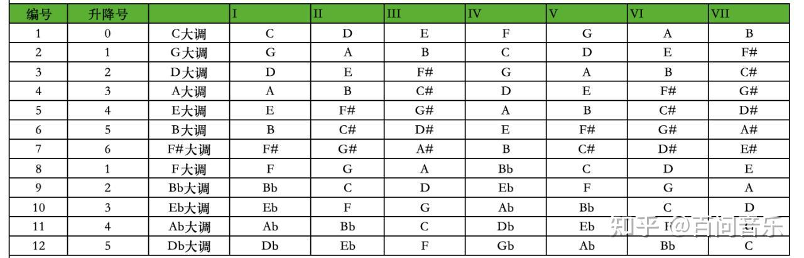

\-------------------------------------------------------------------------------------------------------------

2026年5月20日更新

不错呀，看到了最后，那就奖励一下好学的你吧，最近总结的一份更全的乐理入门：

吉他乐理完全自学手册（万字长文） - 百问音乐的文章 - 知乎

[吉他乐理完全自学手册（万字长文）](https://zhuanlan.zhihu.com/p/2040403701521717161)
