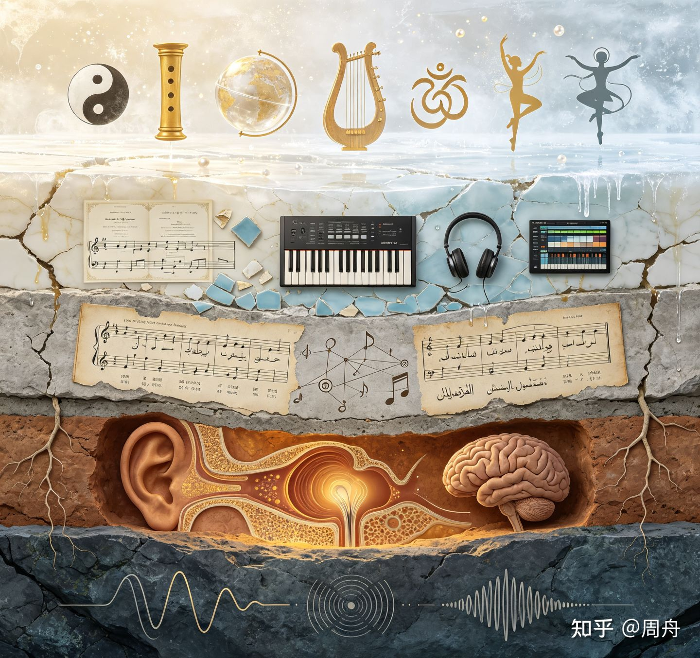
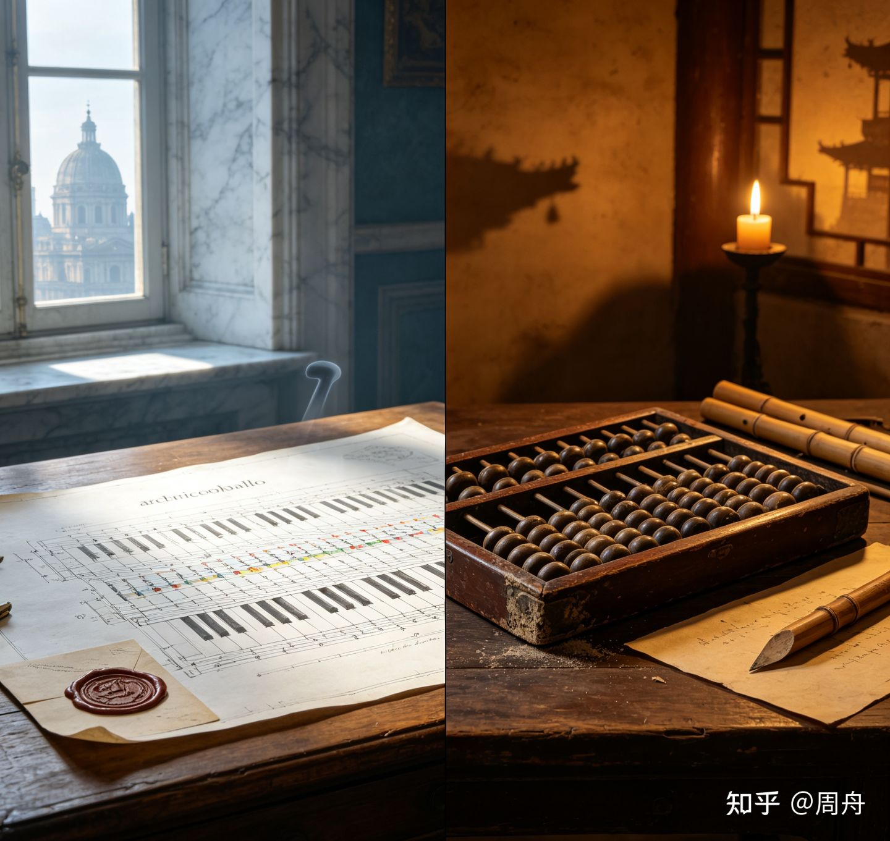
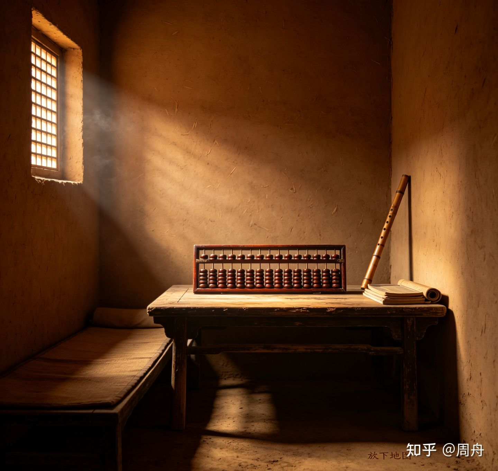

> 作者：周舟　|　赞同 1050　|　评论 33　|　[原文](https://zhuanlan.zhihu.com/p/2066463102284063110)

## 写给重度音乐爱好者的十万字乐理（Music Theory）读本：从入门到飞升（上）

---

### 目录

-   引言：为什么学习乐理？
-   第1章 声音的物理基础：振动、泛音与律制
-   第2章 前大小调时代：人类如何尝试组织声音
-   第3章 被删除的琴键：Vicentino与朱载堉
-   第4章 把声音写下来：记谱法与音乐符号系统
-   第5章 时间中的建筑：节奏如何操纵人的身体
-   第6章 声音的色彩：音程协和度光谱
-   第7章 声音的堆叠：和弦
-   第8章 声音的政治：调式
-   第9章 离开家，再回来：转调的艺术
-   第10章 纵向与横向：和声同旋律共舞
-   第11章 音乐的建筑蓝图：从动机到奏鸣曲式
-   第12章 解放和弦：布鲁斯、爵士与AI音乐
-   第13章 从乐谱到耳边：织体、配器与演奏
-   第14章 乐理只是地方性知识？
-   第15章 算盘与鹅毛笔：十二平均律全球史
-   第16章 打破乐理规则
-   第17章 身体、乐器与乐理
-   尾声：四个声音

写给重度音乐爱好者的十万字乐理（Music Theory）读本：从入门到飞升（下） - 周舟的文章 - 知乎

[写给重度音乐爱好者的十万字乐理（Music Theory）读本：从入门到飞升（下）](https://zhuanlan.zhihu.com/p/2066464299980271961)

### 引言：为什么学习乐理？

上一次你被音乐击中灵魂，是什么时候？

你的耳蜗里有大约3500个内毛细胞，它们把一段空气振动的频率分解成电信号，传给你的听觉皮层。你的大脑在约50毫秒内完成了对纯五度（频率比3:2）的”这很舒服”的判断。在这个判断发生的同时，你手臂上的汗毛竖起来了。乐理想尝试回答一个问题：为什么几个空气振动，能让汗毛竖起来？

乐理常被误解。在很多人眼里，乐理是一堆需要背诵的规则：音程的定义、和弦的标记、调号的顺序，像一本交通法规，告诉你什么能做、什么不能做。这种误解让许多音乐爱好者对乐理望而却步。他们担心：学了乐理，会不会毁掉对音乐的感受？

乐理从来不是立法者。它不做”你应该这样写”的规范，而做”音乐家们是这样做的”的描述。它不是菜谱，遵循它不一定做出好菜；它是味觉笔记，记录那些已被证明有效的做法，并试图理解它们为何有效。一个孩子不需要学习语法就能说出完全符合语法规则的句子。母语者凭直觉就知道”我昨天去了学校”是对的。语法学家的工作不是发明这些规则让说话者遵守，而是发现并描述那些母语者早已内化的模式。乐理与音乐的关系正是如此。莫扎特不需要翻开和声学教材来写协奏曲，但他的每一笔都蕴含着可以事后被分析和理解的内在逻辑。

不过，我们需要给”语法”这个类比加上一个关键的限定。语法在母语者大脑中是无意识内化的，人们不需要上课就能掌握母语句法。但乐理所描述的”语法”并非如此：印度拉格的即兴者、巴厘岛甘美兰的乐师、加纳鼓乐合奏中的鼓手，他们的”乐理”同样不是从教科书上学来的，而是通过师徒间的口传心授、身体化的模仿和长年累月的浸染而内化的。这意味着，乐理作为对音乐实践的事后描述，可以有多种形态：纸面上的符号体系、身体上的肌肉记忆、师徒间的呼吸传递。西方学院派乐理只是其中一种，恰好因为历史偶然获得了全球性的制度化霸权。本书所讲述的”乐理”，主要就是这套西方学院传统。然而我邀请你在阅读中留意，它只是人类组织声音的众多方式之一。

本书不是“**又一本乐理教程**”。市面上已经有足够多的教程告诉你音程是什么、和弦怎么标记。本书要回答那些教程从来不问的问题。为什么音程听起来是这样？为什么和弦有色彩？为什么不同文明的音乐听起来如此不同？本书要拆开那个”填满胸口的东西”，看看它里面究竟是什么。它尝试告诉你：你所学的乐理，不是声音组织的唯一真理，它只是特定历史路径的产物。知道这件事之后，你反而会更爱音乐。

如果你已经会一点乐器，钢琴上能弹几个和弦、吉他上能按几个把位，却总觉得知其然而不知其所以然，这本书是为你写的。如果你还是零基础、是需要从识五线谱开始的初学者，这本书可能会让你觉得跳过了太多步骤。我建议你先找一个简单的乐器（任何乐器），先让手指和耳朵建立最基本的对话，再回到这里。

如果你曾经觉得乐理很难、很枯燥，像一门需要死记硬背的”外语”，那不是你的问题。那是乐理教材和教学体系的问题（防！自！学！），一个我们在后续章节中将认真讨论的问题。

本书试图带你走完这条”从直觉到理解”的路径。以下三条主线将贯穿始终。

*术语提示：本书中”乐理”一词在多数语境下指狭义基本乐理，即西方启蒙时期以降、以十二平均律和五线谱为技术基础的描述体系。在涉及跨文化比较和认识论反思时，它的语义会扩展至更广义的音乐理论体系，包括印度拉格、阿拉伯木卡姆、中国五声调式等各自独立的声音组织理论。这一区分是本书论证的核心线索之一。*

**第一条主线：物理之声。** 一切始于物体的振动。琴弦的颤动、空气的疏密、鼓膜的响应。声音的物理属性是音乐大厦的基底。基底不决定房屋的样式，却决定了什么结构是可能的。泛音列如何预示了和弦的叠置？为什么纯八度听起来像同一个音？三种律制之争背后是怎样的物理与数学博弈？

**第二条主线：听觉秩序。** 人类的听觉系统不是一个被动接收器，它会主动组织听到的声音：寻找中心、建立期待、感受紧张与释放。音程的协和与不协和、调性的向心力、节奏的期待与意外：这些都不是物理规律，而是心理规律。它们是物理声音与音乐意义之间的翻译层。

**第三条主线：文化语法。** 同样的物理振动，不同文明做出了不同选择。西方选择了十二平均律和大小调，中国选择了五度相生和宫商角徵羽，印度选择了二十二律的拉格，印尼甘美兰选择了另一套音程体系。它们都是人类面对”如何组织声音”这一根本问题时给出的文化答案。你今天在音乐课本里学到的”乐理”，是特定历史路径的产物，而非声音组织的唯一真理。

以下是三条主线对应的全文章节映射，你可以在这里寻找17章漫长旅程的方向感：

**第一条主线：物理之声。** 第1章（声音物理）、第2章（前大小调时代）、第3章（被淘汰的替代路径）、第15章（十二平均律全球史）。

**第二条主线：听觉秩序。** 第5章（节奏与听觉预期）、第6章（音程协和度的感知）、第7章（和弦功能与听觉向心力）、第10章（和声进行的听觉动力学）、第14章（协和度感知的跨文化证伪）。这条主线不局限于单一章节，而是以”物理之声”为材料、以”文化语法”为边界的一条连续性论证。

**第三条主线：文化语法。** 第4章（记谱法）、第8章（调式体系）、第13章（织体与配器）、第14章（乐理地方性）、第15章（跨文明律学史）、第16章（乐-宇宙论）、第17章（身体与媒介）。

我们的旅程将从声音的原子出发，穿过记谱法的大门，进入节奏与节拍的时间秩序，感受音程的色彩光谱，攀上和弦的立体建筑，漫步调式的多元宇宙，经历转调的远游与回归，见证和声与旋律的精妙协奏，研习曲式与对位的严格训练，展开织体与配器的空间想象，证伪乐理的普适性宣称，追溯十二平均律的全球史，聆听规则破坏者的列传，最终抵达身体与媒介的地方性。

这不是一趟轻松的旅程。但如果你愿意带上耳朵和好奇心，它将是值得的。

### 第1章 声音的物理基础：振动、泛音与律制

**核心命题**：乐理的起点，是物体的振动。人类如何将自然界的噪音提炼为有序的乐音？

### 1.1 声音的四维空间

想象一个声音，任何声音。钢琴的中央C。远处教堂的钟声。你手机的提示音。你可以从四个维度描述它。

**高低。** 声音的高低取决于振动频率。每秒振动440次的物体发出我们称为”A”的那个音。频率越快，音越高。这是乐理描述最核心的维度，也是五线谱的纵轴所映射的东西。

**长短。** 一个音持续多久。这是节奏的原始材料。

**强弱。** 振幅决定力度。一个音可以如耳语般轻柔，也可以如雷鸣般震撼。

**色彩。** 这是最神秘的一个维度。为什么同一音高，钢琴和小提琴听起来完全不同？因为泛音，我们马上会讲到。

这四个维度构成了乐理描述的全部对象。但在进入泛音之前，有一个更根本的区分：**乐音与噪音。** 乐音是规则的振动，一个物体以稳定的频率来回运动，产生清晰可辨的音高。噪音是不规则的振动，无数频率同时杂乱地发声，你无法从中辨认出一个确定的”音高”。传统乐理主要处理乐音，但现代音乐已经将噪音纳入了表现力的版图：从打击乐的爆炸式扩展，到工业噪音的实验，再到电子音乐中的噪声音乐流派。这个边界本身也是流动的，它在提醒我们：乐理所描述的”音乐”，从一开始就是一个有边界的研究对象。

### 1.2 泛音列：每个声音里藏着的一群小矮人

当一个物体振动时，它并不只发出一个频率。这是音乐声学中最重要的事实。

> 🗨️ **大师引路**
>
> 让我告诉你一个秘密：你从来没有听过一个”纯”的声音。你弹钢琴上的中央C，你以为你只听到了一个音。实际上，你同时听到了至少六个音——C、高八度的C、G、再高八度的C、E、G。只是你的大脑把它们”压缩”成了一个声音，并告诉你”这就是C”。
>
> 这不是魔术。这是物理。一根琴弦振动时，不仅整根弦在振动（产生基音），弦的一半、三分之一、四分之一……各自也在振动（产生泛音）。这些泛音就像一群小矮人，有的很乖（第2、3、4、6泛音和基音相处愉快），有的有点叛逆（第7泛音略微跑调）。泛音列就是这群小矮人的完整名单。
>
> 为什么这件事很重要？因为这群小矮人的排列顺序——C、C、G、C、E、G——恰好构成了一个大三和弦。大三和弦不是谁发明的，它就藏在每一个乐音的内部。你不需要学习乐理就能”听到”它（你的耳朵一直在听它，只是你的大脑把它压缩了），但学了乐理之后，你会”听出”它——你能从这个被压缩的复合声音中分辨出那群小矮人各自的存在。
>
> 但这里有一个很容易被忽略的小细节：第七个小矮人（第7泛音，降B）不太合群，它不在大三和弦的成员里。如果大三和弦是”自然”的，那降B也是”自然”的。为什么我们选择了前六个、冷落了第七个？这个问题没有标准答案。但请记住它——在第6章讨论音程的协和与不协和时，我们会再遇到它。
>
> 🗨️ **大师引路**
>
> 我们来做一个想象的实验。
>
> 你站在一间空旷的房间里。你拍了一下手。回声在墙壁之间弹跳。现在，想象你能把那个拍手声放慢一千倍。
>
> 在放慢的过程中，你听到的不再是”啪”的一声，而是一系列逐渐展开的音高：首先是低沉的”嗡嗡”（基音），然后是高一层的”嗡嗡”（八度），然后是更高的一个音（纯五度），再往上是一个更亮的音（大三度）……
>
> 这不是比喻。这就是泛音列，每个声音内部都自带的”隐藏和弦”。当你弹响钢琴上的C时，你听到的是C，但C的内部已经包含了C、G、E，也就是一个大三和弦。你的耳朵把它们合并成了”一个音”，因为它们在时间上没有先后，它们同时发生。
>
> 但这是什么意思呢？你不需要知道任何公式就能理解的核心洞见是：大三和弦不是音乐家”发明”的——它藏在每一个声音的物理结构中。这就是为什么在不同文明独立发展的音乐传统中，纯五度和大三度都被赋予了特殊地位，不是因为文化交流，而是因为任何一个弹拨琴弦的人都能听见泛音。
>
> 但这里有一个关键的保留：泛音列”建议”了大三和弦，但没有”命令”它。不同的音乐文化从同一个泛音列中听到了不同的可能性。中国选择了五度生律链的前五个音（宫-徵-商-羽-角），在五声之内止步——这是对狼音的自觉回避。印度用微分音的斯鲁蒂体系精细地划分了泛音之间的微妙空间。巴厘岛甘美兰的Ombak（声波拍频）证明了”两个略有偏差的音同时响起”可以比”精确同频”更美。
>
> 同一个泛音列，无数种”听见”的方式。

假设一根弦以440Hz振动，你听到的是A音。但同时，这根弦也在以880Hz、1320Hz、1760Hz、2200Hz……振动。整根弦的振动产生了你感知到的”主音”（基音），而弦的1/2、1/3、1/4……各自分段振动，产生一系列更高的音——**泛音**。基音决定我们感知到的”音高”，泛音的振幅和分布模式则决定”音色”。这就是为什么同一音高在不同乐器上听起来不同的原因：每件乐器的共鸣体选择性地放大某些泛音、抑制另一些泛音，形成了独一无二的”泛音指纹”。小提琴的琴身共鸣特性强调中高频泛音，使其音色明亮而富有穿透力；管风琴的低音音栓则筛选掉了大部分高频泛音，留下近乎正弦波的纯厚音响。这大概是物理学给音乐家最慷慨的馈赠了 🎁。

把所有泛音按从低到高排列，就得到了**泛音列**。让我们列出前八个泛音（以C为基音）：

-   第1泛音（基音）：C，你感知到的”主音”
-   第2泛音：C（高八度），频率比2:1
-   第3泛音：G（上方纯五度），频率比3:1
-   第4泛音：C（再高八度）
-   第5泛音：E（上方大三度），频率比5:1
-   第6泛音：G
-   第7泛音：B♭（近似，略偏低），频率比7:1
-   第8泛音：C

继续往上：第9泛音（D，大九度）为九和弦提供声学依据；第11泛音（F♯，约551音分，偏离平均律增四度约49音分）在频谱音乐中被用作”自然的增四度”。20世纪法国频谱作曲家Gérard Grisey在其代表作《分音》（*Partiels*, 1975）中直接以低音长号的泛音列前16个泛音为和声材料，而非传统的大小调和声。Grisey的创作方法来自对声音本身的声谱图分析——他将长号低音E2的电子声谱图”分配”给不同乐器：每个泛音分音由一件乐器演奏，第五和第九泛音在声谱中比基音更响亮，他便在配器中让这两个泛音的乐器声部突出于基音之上；每个泛音被近似到最近的四分之一音，整部作品的音高材料因此不是十二平均律，而是基于泛音列自然频率的四分之一音近似。第13泛音（A，约841音分，偏离平均律小六度约41音分），Grisey将这个”走音”的A作为整部作品的核心音高张力来源。他有一句名言：”La musique se fait avec des sons, pas avec des notes.“——”音乐是用声音做的，不是用音符做的。”在这个意义上，频谱音乐将泛音列从乐理的声学注脚升级为和声材料的唯一来源。

现在，请仔细看前六个泛音：C-C-G-C-E-G。把它们放在同一个八度内重新排列，你得到了什么？**C-E-G，一个大三和弦。**

这不是巧合。大三和弦没有发明者。它就藏在每一个乐音的内部。每当你弹响一个音，大三和弦已经在那里了，只是被你的耳朵当作一个统一的音色来感知，而没有意识到它其实是一个和弦。

然而，这一”发现”叙事需要被限定。泛音列的前六个泛音确实包含了大三和弦的材料，但将这些材料”识别”为一个独立的、具有功能意义的”和弦”，而不是感知为基音音色的组成部分，需要一个理论框架的介入。当拉莫在1722年将大三和弦命名为”完美和弦”（accord parfait）时，他是在”建构”一个分析范畴，用以解释他那个时代的音乐家早已凭听觉在使用的和声实践，而不是在”发现”一个自然界中早已存在的实体。在这个意义上，”自然”本身就是一个历史化的概念。

但在这个美丽的叙事中，有一个重要的限定。泛音列的第7泛音是B♭，一个略偏低的降B。它与基音构成的音程并非大三和弦的成员。泛音列既包含大三和弦的材料（第4、5、6泛音），也包含小七度（第7泛音）、小九度（第9泛音）等”不协和”材料。西方和声理论选择了”三度叠置”作为组织原则，**这是一个文化选择而非物理必然。** 印度音乐面对同样的泛音列，将微妙的音高差异融入了22个微分音的斯鲁蒂（śruti）体系；中国音乐选择了五度生律链的前五个音，形成了无半音的五声调式。物理给出了材料，人类听觉系统对简单整数频率比（2:1、3:2、4:3、5:4）的加工可能具有跨文化的生理基础，2024年的跨文化听觉研究（*Music Perception*, 2024）提示，对简单频率比的加工可能具有跨文化的生理基础，但音程与特定情感（如”大三度=明亮”）的联结则需要文化暴露才能建立。但不同的音乐文化用这些材料建造了截然不同的建筑。如果说听觉生理提供了某些跨文化的”建筑材料偏好”（如对简单整数比的低粗糙度感知），那么将这些偏好组织为”大三和弦=稳定=快乐”这一整套语义系统的，是西方音乐在特定历史路径中的文化选择。

### 1.3 乐音体系的建立

面对无穷无尽的振动频率，人类需要建立一个有限的坐标系统。

**音级与音列**：在一个八度内，西方音乐选择了十二个音——七个基本音级（C、D、E、F、G、A、B）加上五个变化音级（黑键）。这十二个音按高低顺序排列，就是半音音阶。它像一个十二级台阶的循环楼梯，每走十二步，你回到起点的”高处版本”。

**音的分组**：为了区分不同八度中的同名音，音乐家们建立了一套分组系统。小字一组（中央C所在的八度）是基准坐标，它的A音就是国际标准音A4=440Hz。往上是小字二组、三组、四组，钢琴最高音C8约4186Hz。往下是小字组、大字组、大字一组，钢琴最低音A0约27.5Hz——这个频率已经逼近人类听觉的下限，你感受到的几乎是身体的震动而非明确的”音高”。大字组的命名源自早期管风琴的”大管”音栓，这个历史遗迹至今留在我们的记谱体系中。

**音域与音区**：从A0到C8，约七个八度是人类音乐实践的主要疆域。高音区明亮、穿透、轻巧。中音区温暖、饱满，是人声的主要活动范围。低音区厚重、深沉、有时混沌，低音提琴的最低音几乎让人感到空气在颤动而非振动。作曲家选择在哪个音区写作，已经是音乐叙事的第一笔。贝多芬《悲怆》奏鸣曲以一个深沉的低音和弦开场——那不是旋律，那是基底的震动。

**国际标准音**：A4=440Hz。1939年5月，国际标准协会在伦敦召开会议，正式建议将A4定为440Hz；这一标准在1955年被国际标准化组织（ISO）正式接受（ISO R 16, 1975年修订为ISO 16）。然而，纽约爱乐、波士顿交响乐团以及法国、意大利等部分欧洲国家的乐团实际使用A=442Hz——所谓”国际标准”在实践中更像是一种”建议”。标准音的统一是现代音乐工业得以运转的前提，但这道”统一”本身也是政治协商和工程妥协的产物，而非声学规律的必然。有学者指出，纳粹德国在1930年代曾将A=440推广为”德意志标准音”（Reichskulturkammer标准），试图以此统一德国境内的音乐音高。二战后这一标准被纳入ISO全球体系，A=440的”国际性”因此不只是科学协商的产物，也承载着地缘政治的历史层积。

### 1.4 三种律制的千年之争

现在，我们来到了乐理史上最迷人的岔路口之一：如何在一个八度内确定十二个音的位置？

这个问题看似简单，实则困扰了人类两千年。核心困难在于一个数学事实：纯五度的循环永远无法完美闭合一个八度。

> 🗨️ **大师引路**
>
> 你是18世纪的钢琴调音师。你面临一个不可能完成的任务。
>
> 你的老板，一位贵族音乐爱好者，要求你调出这样一架钢琴：它弹C大调时所有和弦都纯净如天使的歌声（纯律），弹G大调时也同样完美，弹D大调、A大调、E大调……全部12个调，一个都不能”走音”。这个要求就像要求一位厨师同时用甜、酸、苦、辣、咸做出12道味道完全不同的菜，但每道菜都必须”完美”。
>
> 数学家会告诉你：这是不可能的。因为自然数的比例——3:2（纯五度）、5:4（大三度）——无法在一个闭合的八度循环中同时保持完美。就像你无法用整数块的砖头砌出一个完美的圆，总有一块砖需要被削掉一角。
>
> 十二平均律的做法是：不追求任何一个调的”完美”，而是将所有不可避免的偏差均匀地分配到每一个音上。每一块砖都被削掉同样大小的一角，这样圆就砌成了——不是完美的圆，但每个位置看起来都差不多。
>
> 这就是为什么我们说十二平均律是”民主化的不完美”。它牺牲了每一个和弦的绝对纯净，换来了在所有调之间自由穿行的能力。巴赫之所以能用24个大小调各写一首前奏曲与赋格，不是因为钢琴突然变得”完美”了，而是因为他接受了一种”普遍的不完美”。
>
> 而今天，我们这些习惯了平均律的耳朵，已经不太听得出来这种”不完美”了。如果有人弹一个真正的纯律大三度给你听，你可能反而觉得它”太纯了”、”太空了”、”好像少了点什么”。你的耳朵被平均律训练了一百年，已经忘记了大三度”应该”是什么味道。

**三种律制核心参数对比**

| 维度  | 五度相生律 | 纯律  | 十二平均律 |
| --- | --- | --- | --- |
| 生律逻辑 | 连续纯五度（3:2）×12次 | 直接从泛音列提取整数比 | 八度等比分割：¹²√2≈1.05946 |
| 大三度频率比 | 81:64 ≈ 408音分 | 5:4 = 386音分 | 400音分 |
| 纯五度频率比 | 3:2 = 702音分（完美） | 3:2 = 702音分 | ≈700音分（偏差约2音分） |
| 八度闭合？ | ✗ — 有”毕达哥拉斯音差”（Pythagorean Comma，约23.46音分） | ✗ — 只能在近关系调中转悠 | ✓ — 完美闭合 |
| 转调自由？ | ✗ — 有”狼音程” | ✗ — 仅限几个近关系调 | ✓ — 全部十二个调自由使用 |
| 核心代价 | 部分五度崩溃 | 转调范围受限 | 所有音程（除八度）都略微不纯 |
| 活着的传统 | 中国五声调式的生律逻辑 | 弦乐四重奏/合唱团的自然倾向 | 钢琴、吉他、所有键盘-品柱乐器 |
| 一句话 | 旋律的极致 | 和声的极致 | 自由的极致 |

**五度相生律**：从一个音出发，连续上行纯五度（频率比3:2）十二次，理论上应该回到出发音的高八度版本。但数学给出了残酷的回答：(3⁄2)¹² ≈ 129.746，而2⁷ = 128。十二个纯五度略微超过七个八度，这个微小的差距被称为”毕达哥拉斯音差”（约23.46音分，接近四分之一半音）。这意味着，如果严格按照纯五度生律，你的音阶中将存在一个无法使用的”狼音程”，一个严重偏离纯五度的音程，听起来如同狼嚎。自然之路为何走不通？因为数学上不存在一种方案，能让”所有纯五度都纯净”且”八度完美闭合”同时成立。

**纯律**：舍弃纯五度完美的执着，直接取自泛音列。大三度从泛音列的5:4中获得，小三度从6:5中获得，和声因此变得无比纯净。纯律的和弦听起来像是阳光穿透干净的玻璃。但代价是致命的：你只能在几个近关系调中转悠。纯律是为某一个特定调量身定做的，一旦主音改变，那些精心调校的比率就失效了。纯律像一座美丽的花园，四周却是悬崖。

**十二平均律**：一个数学上的”妥协”。将八度（频率比2:1）均分为十二个相等的半音（每个半音频率比为¹²√2≈1.05946）。在这个体系里，除了纯八度，所有音程都略微偏离纯频率比。纯五度不再是完美的3:2，而是约700音分（比纯五度的702音分少了2音分）。换来的代价是大三度宽了约14音分（比纯律大三度386音分升至400音分），在所有常用律制中，十二平均律的大三度是最”不纯”的。然而数百年的听觉习惯已使现代人的耳朵完全接受了这个偏差，甚至觉得纯律大三度”过于纯净”而缺乏色彩。而这个妥协换来的，是一个革命性的自由：你可以在十二个调的任何一个中演奏，而不会遇到任何”狼音”。

中国明代律学家朱载堉（1536-1611）在1584年的《律学新义》中，用81档特大算盘进行开方计算，首次以数学方法精确计算了十二平均律，将2开12次方根，精确到小数点后24位。这个计算比法国数学家马兰·梅森（Marin Mersenne）在《Harmonie Universelle》（1636）中的独立计算早了约50年。但耐人寻味的是，朱载堉的发明在他的故乡被长期搁置。清代学者陈澧批评”此于算法则密矣，而非古人简易之意”，乾隆下令批驳朱载堉及其著作。李约瑟后来感叹：”这真是不可思议的讽刺。欧洲人赞叹并实践朱载堉的发明，而在他的故乡中国，其创造却被束之高阁。”十二平均律从1584年的数学发现到19世纪钢琴制造业的普及，经历了近三百年的”协商期”。它并非一出现就被欢呼拥抱。

三种律制的千年之争，最终以十二平均律的广泛采用告一段落。但”告一段落”不是”一劳永逸”。纯律仍然是弦乐四重奏和合唱团在演奏纯和声段落时依靠听觉自然倾向去接近的理想。五度相生律的逻辑仍然活在中国五声调式的生律法之中。不同的律制，是人类在不同的音乐需求——旋律的流畅、和声的纯净、转调的自由——之间做出的不同权衡。不存在”最好的”律制，只存在”最适合特定需求的”律制——这大概是乐理版的”没有免费的午餐” 🍽️。

> **本章落点**：我们今天使用的”十二平均律+五线谱”体系，是物理规律、数学妥协与历史选择共同作用的结果，而非唯一真理。当你理解了这一点，后续面对所有调式与音阶体系时，你将拥有一种开放的心态——那不是”另一种奇怪的音阶”，那是人类在相同的物理约束下做出的另一种合理选择。但如果我们今天使用的音律体系只是”历史选择的结果”，那么，在”选择”发生之前，人类曾经用怎样的耳朵聆听世界？

### 本章延伸阅读

**挑战重度音乐爱好者的七万字乐理（Music Theory）进阶：音乐哲学的数学原理（Philosophiæ Musicæ Principia Mathematica）** - 周舟的文章 - 知乎

**目录**

-   引言 弦理论的2500年
-   第1章 从振动方程到乐器家族
-   第2章 振动体谱系：膜·板·音乐厅
-   第3章 协和度物理：拍频·临界带宽·听觉滤波器
-   第4章 听觉认知链：从脑干到奖赏系统
-   第5章 听觉的演化：从爬行动物下颌到人类听骨
-   第6章 律制的数学：连分数与十二平均律
-   第7章 律制制度史：算盘·印刷术·投票
-   第8章 音高的代数：Z₁₂群与五度圈
-   第9章 和声几何学：Tonnetz与轨形
-   第10章 旋律的对称：变换群·序列主义·概率作曲
-   第11章 节奏的数学：比约克伦德算法·相移·1/f噪声
-   第12章 音色的数学：傅里叶级数·共振峰·物理建模
-   第13章 音色的操控：混音·模拟美学·微分音
-   第14章 声音的工程：从亥姆霍兹共鸣器到降噪耳机
-   第15章 音乐认识论：发现还是发明？
-   第16章 后乐理时代：AI作曲·脑机接口·声音医学
-   结语 在数学够不到的地方

[挑战重度音乐爱好者的七万字乐理（Music Theory）进阶：音乐哲学的数学原理](https://zhuanlan.zhihu.com/p/2067570816519345962)

### 第2章 前大小调时代：人类如何尝试组织声音

**核心命题**：大小调体系并非自古如此。在它成为西方音乐的”默认操作系统”之前，人类用了两千年探索”如何组织声音”这个问题的其他答案。

### 2.1 美索不达米亚与埃及：最早的调音证据

最早的乐理是一块泥板。

在美索不达米亚的乌尔皇家陵墓（约公元前2600-前2400年）中出土的御制乌尔琴，以及约公元前1800年的巴比伦里拉琴调音文献，共同表明当时的美索不达米亚已使用基于3:2五度关系的七声音阶。这些楔形文字泥板记录了里拉琴的调音指令——”如果第2弦与第5弦不一致，则调紧第5弦”——其操作逻辑显示，美索不达米亚乐师已掌握了一套基于五度相生的调音程序。韦斯特（West 1994）的研究细致爬梳了巴比伦里拉琴的律制问题，认为至少可追溯至公元前1800年、很可能更早至公元前2200年，当时所使用的音阶就已按照3:2的关系订立七声音阶，与今天的毕达哥拉斯五度相生律完全相同。埃及的类似证据包括底比斯墓室壁画中的竖琴演奏场景和一份约公元前1200年的纸草残片，其中记录了”好的声音”与”坏的声音”的区分。这是人类最早的音质美学判断之一。

但必须坦诚地指出：巴比伦的音乐理论研究尚存许多疑点与冲突。巴比伦调音泥板的具体解读在学者间仍有激烈争论（参见Dumbrill与Duchesne-Guillemin的论辩）。我们所能确认的是：在毕达哥拉斯出生之前至少一千年，人类已经在系统地思考”如何给乐器调音”这个问题。

### 2.2 古希腊：毕达哥拉斯与亚里士多塞诺斯的对决

如果说美索不达米亚提供了”如何做”的操作指南，那么古希腊人第一次系统地问了”为什么”。

**毕达哥拉斯**（约公元前570-495年）的名字在第1章已经出现过。传说他经过铁匠铺（此故事的最早来源是晚期antiquity的二手记载，现代学者如Andrew Barker对其历史性持保留态度），注意到不同重量的铁锤敲击时发出的音高不同，由此发现了音高与弦长的数学关系：弦长比为2:1时产生八度，3:2时产生纯五度，4:3时产生纯四度。毕达哥拉斯学派将这一发现提升为宇宙论——行星的运动产生”天体音乐”（Musica Universalis），这一和谐与地球上的音乐共享同一套数理秩序。在这个框架中，音乐的本质是数学，耳朵只是数学真理的不完美接收器。

但毕达哥拉斯的对立面——**亚里士多塞诺斯**（Aristoxenus of Tarentum，约公元前375-320年）——提出了一个彻底不同的立场。

亚里士多塞诺斯是亚里士多德的学生，但他放弃了师祖柏拉图与毕达哥拉斯学派的数学理性主义传统，转向了彻底的听觉经验主义。在其存世著作《和谐的要素》（*Elementa Harmonica*，残篇，英译见Barker 1989）中，他明确主张：判断音程的最终权威不是数学比例，而是受过训练的耳朵。一个音程是”协和”还是”不协和”，不由弦长比的简单性决定，而由听觉经验的实际判断决定。

> **Aristoxenus, \*Elementa Harmonica**\* (trans. Andrew Barker, 1989, Book II, 33-34)
>
> “We must not suppose that the apprehension of the concordant and the discordant is the same thing as the knowledge of the ratios through which they come about. … For the hearing is the ultimate criterion in these matters; the account that is given must be in agreement with the perceptual evidence, and not the other way about.”
>
> （中译：”我们不应认为对协和与不协和的感知等同于对产生它们的比例的知识。……因为在这些问题上，听觉是最终的仲裁者；给出的解释必须与感知证据一致，而非相反。”）

他在《和声要素》中系统研究了乐音、音程、四音列及音阶理论。他虽然在一定程度上认同毕达哥拉斯学派的观点，但更强调以听觉经验而非纯数学计算来判断音程的协和性。该著作被视为欧洲历史上首部以独立音乐科学为目标的和声理论文献。亚里士多塞诺斯大量引用悲剧合唱和nomos（古希腊叙事性独唱体裁）的表演实践作为其立论依据——他认为nomos歌手对音程的微调证明了听觉判断优先于数学计算。

亚里士多塞诺斯的”听觉优先”立场，与毕达哥拉斯的”数学理性主义”形成了西方音乐思想史上第一次”身体”对”理念”的反抗。毕达哥拉斯学派将音乐视为宇宙数学秩序的投影，人的听觉只是被动的接收器；而亚里士多塞诺斯将”受过训练的耳朵”提升为认识论的最终仲裁者——这实际上是将音乐家的身体实践置于哲学家的理论思辨之上。这一立场与第6章讨论的协和度感知的文化建构性将在两千多年后形成回响。

这一”听觉优先”立场在中世纪拉丁西方几乎完全失传。博埃修斯（Anicius Manlius Severinus Boethius，约480-524年）在《论音乐的体制》（*De institutione musica*）中将毕达哥拉斯数学理性主义确立为权威，亚里士多塞诺斯的名字仅以贬义方式被提及：

> **Boethius, *De institutione musica*, I.34** (ed. Friedlein 1867: 224)
>
> “Is vero est musicus, qui ratione perpensa canendi scientiam non servitio operis sed imperio speculationis assumit.”
>
> （中译：”真正的音乐家，是通过理性思考掌握歌唱科学的人，不是通过手的劳作，而是通过思辨的统治。”）
>
> “Sed de his hactenus. Nunc illud est intuendum, quod Aristoxenus, qui auribus solis iudicat de sonis, quaedam facit quadripartitam in genera divisionem, ab his, quae diximus, non parum dissidentem.”
>
> （中译：”但此事暂且按下不表。现在应当审视的是：亚里士多塞诺斯——那位仅凭听觉来评判声音的人——将诸属（genera）分为四类，这与我们前文所述的分类有相当大的分歧。”）

注意博埃修斯的措辞：”qui auribus solis iudicat de sonis”——”那位仅凭听觉来评判声音的人”。这不是中立转述，而是认识论上的降级：以”耳朵”（而非”数学”）作为音乐理论的最终仲裁者，在博埃修斯看来是一种理论缺陷，而非方法论选择。博埃修斯在《论音乐的体制》第一卷末尾进一步将”音乐从业者”分为三个等级：instrumentalis（演奏者）——只动手不动脑，最低；poeta（诗人/作曲者）——靠直觉创作，中等；musicus（音乐理论家）——能理解音乐背后的数学-宇宙论原理，最高。这大概是人类历史上最早的”鄙视链”——音乐理论家看不起作曲者，作曲者看不起演奏者。而听众——他们根本不在这三个等级里 🙃。这一社会分类将”演奏者”与”思考者”永久性地割裂，将在随后一千年间塑造欧洲音乐家的自我认同。

古希腊音乐理论还为后世留下了另一个重要遗产：三种”属”（genera）的分类体系。自然属（diatonic，两个全音加一个半音）、半音属（chromatic，小三度加两个半音）、微分音属（enharmonic，大三度加两个四分之一音）。这是人类历史上最早的调式分类体系。值得注意的是，微分音属在古希腊音乐实践中是三种基本调式组织方式之一，不是”实验性例外”，而是被亚里士多塞诺斯和托勒密（Claudius Ptolemy，约100-170年）同等对待的标准方案。德尔斐的雅典人宝库中出土的两首阿波罗颂歌（约公元前128年）残篇中包含enharmonic属的明确记谱——微分音是古希腊音乐实践的真实组成部分，而非理论家的玄想。

但这一传统在欧洲音乐史上几乎彻底中断。1322年，教皇约翰二十二世颁布教令《Docta sanctorum patrum》，首次将半音化实践与”异端”挂钩，禁止在圣乐中使用半音化手法。从中世纪教会调式对半音的严格限制，到博埃修斯《论音乐的体制》在13-16世纪作为巴黎大学和牛津大学”四艺”标准教材所确立的”数学理性主义”正统——微分音属被降级为”纯理论好奇”而非实践可能——再到大小调体系的制度化，再到十二平均律的标准化，微分音被系统性地从”合法乐理”中逐出。当第3章的Vicentino在1555年重新提出微分音键盘时，他是在试图恢复一个已被中断了一千多年的传统。

**托勒密**，这位以天文学闻名的希腊化科学家，在《和声学》（*Harmonika*）中以整数比分类音程体系，奠定了后来纯律传统的理论基础。托勒密的工作代表了毕达哥拉斯数学理性主义与亚里士多塞诺斯听觉经验主义的首次综合——他试图用数学来描述耳朵已经知道的东西。

### 2.3 伊斯兰世界的知识传递

当古希腊的音乐理论在欧洲随着罗马帝国的崩溃而一度沉寂时，是伊斯兰世界保存并发展了这份遗产。

8至10世纪，巴格达翻译运动期间，亚里士多塞诺斯的经验主义著作和托勒密的《和声学》被译为阿拉伯文。托勒密《和声学》的阿拉伯语翻译由Ḥunayn ibn Isḥāq（约809-873年，巴格达”智慧之家”首席翻译官）或其学生完成，约在9世纪中叶。**法拉比**（Al-Fārābī，约870-950年）在《音乐大全书》（*Kitāb al-Mūsīqī al-Kabīr*）中综合了希腊理论并加入了阿拉伯音乐实践中的微分音观察。这部巨著分上下两部：上部论述声音产生的音乐理论原理，涉及协和与不协和音程、乐器节奏、作曲法等；下部论述理论如何运用到具体乐器上。法拉比可能是第一个系统描述四分之一音的音乐理论家，他的理论和实践对后世中亚、西亚、阿拉伯诸国和波斯以至欧洲的音乐文化发展产生了重大影响。

12世纪，克雷莫纳的杰拉德（Gerard of Cremona）在托莱多将法拉比《音乐大全书》从阿拉伯语译为拉丁语（*De scientiis*），这个译本成为13世纪巴黎大学音乐课程的标准参考文献。这条传递链——从雅典到巴格达（希腊语→阿拉伯语，9世纪），从巴格达到托莱多（阿拉伯语→拉丁语，12世纪）——确保了古希腊的音乐理论遗产没有像微分音属那样彻底中断。当欧洲大学在13世纪开始将音乐列为”四艺”（quadrivium）之一时，他们使用的教材中，法拉比的分类体系和托勒密的和谐理论已经成为标准内容。

### 2.4 中世纪到文艺复兴：风格史时间线

以下是一张快速扫描的时间线，覆盖从格里高利圣咏到文艺复兴复调黄金时代的风格演变。这些节点为后续各章（第4章的记谱法、第11章的对位法）埋下了历史伏笔。

**中世纪到文艺复兴音乐史三线年表（9世纪→16世纪）**

| 世纪  | 技术/基础设施 | 制度/社会 | 风格/代表人物 | 地理中心 |
| --- | --- | --- | --- | --- |
| 9世纪 | 纽姆记谱法（neumes）出现 | 加洛林文艺复兴推动圣咏统一 | 奥尔加农（organum，圣咏+平行五/四度） | 法兰克王国 |
| 11世纪 | 四线谱（圭多） | 本笃会修道院网络扩张 | 圭多手·唱名法 | 意大利（阿雷佐） |
| 12-13世纪 | 节奏模式记谱 | 巴黎大学兴起、圣母院建设 | 莱奥南、佩罗坦（复调） | 法国（巴黎） |
| 14世纪 | 有量记谱法（mensural notation，维特里，约1320年） | 教廷迁阿维尼翁、黑死病 | 马肖《圣母弥撒》（Messe de Nostre Dame） | 法国（阿维尼翁/兰斯） |
| 15世纪 | 活字印刷（古腾堡，约1450年） | 勃艮第宫廷赞助、意大利城邦竞争 | 迪费、若斯坎·德普雷 | 勃艮第→意大利 |
| 16世纪 | 五线谱定型、早期出版乐谱 | 特伦托大公会议、反宗教改革 | 帕莱斯特里纳、拉絮斯 | 意大利（罗马） |

-   **9世纪**：奥尔加农，在格里高利圣咏的单旋律上叠加平行五度或四度的第二声部。这是西方多声部音乐的最早实践。
-   **11世纪**：圭多·达雷佐（Guido d’Arezzo，约991-1050）发明四线谱和唱名法（ut-re-mi-fa-sol-la）。第4章将详细展开。
-   **12-13世纪**：巴黎圣母院乐派。莱奥南（Léonin）和佩罗坦（Pérotin）创作了最早的复调音乐，使用节奏模式（rhythmic modes）组织多个声部。
-   **14世纪**：新艺术（Ars Nova）。菲利普·德·维特里（Philippe de Vitry）在论文《新艺术》（约1320年）中系统化了有量记谱法，使节奏的精确记谱成为可能。
-   **15-16世纪**：文艺复兴复调的黄金时代。若斯坎·德普雷（Josquin des Prez）将人文主义的表达能力注入复调织体，帕莱斯特里纳（Palestrina）的无伴奏合唱作品被后世对位法教学奉为典范。在这个以男性修道院和大学为中心的音乐理论史中，有一个声音几乎被完全遗忘：宾根的希尔德加德（Hildegard von Bingen，1098-1179），宾根修道院的女院长。她不仅留存了超过70首礼仪音乐（比同时代绝大多数男性作曲家都多），还发展了一套独特的音乐宇宙论——在《神圣作品之书》（*Liber divinorum operum*, 1163-1173）中，她将音乐描述为”圣灵在物质世界中的呼吸”，天使在天堂中用音乐调和宇宙的秩序，而人类的歌唱是对这一宇宙和谐的肉身参与。希尔德加德的音乐理论没有进入”四艺”教材，她的名字在博埃修斯主导的拉丁西方乐理传统中被系统性边缘化了——不是因为她的理论缺乏深度，而是因为她的性别被排除了进入大学和修道院学术网络的资格。

### 2.5 数字低音：巴洛克时期的和弦速记系统

数字低音（basso continuo）是巴洛克时期（约1600-1750年）通用的和声实践方式。它的运作机制简洁而高效：作曲家在低音谱上为每个低音标注数字——如”6”表示低音上方叠一个大六度（即第一转位三和弦），”⁶₄”表示低音上方叠六度和四度（第二转位三和弦），”7”表示低音上方叠七度（七和弦）。演奏者（通常是键盘手或鲁特琴手）根据这些数字实时构建和弦，不需要知道”这是主和弦还是属和弦”，只需要知道”从这个低音出发要叠哪些音程”。

在这个意义上，数字低音体系不关心”和弦是什么”（功能和声的”主/属/下属”分类尚未诞生），它只关心”从低音出发要叠哪些音程”。它是功能和声的”前身”——它提供了和弦结构的操作框架，但尚未赋予和弦以调性功能意义。

从拉莫（1722年，第7章已介绍）开始，理论家逐渐将数字低音中的常见音程组合归纳为”原位三和弦”“七和弦”等独立实体，并赋予它们调性功能。这是和声理论史上最关键的范式转换之一——从”音程思维”（数字低音的操作逻辑）转向”和弦思维”（功能和声的分析逻辑）。

C.P.E.巴赫（Carl Philipp Emanuel Bach）在其《论键盘乐器演奏的真艺术》（*Versuch über die wahre Art das Clavier zu spielen*, 1753/1762）中，为数字低音的实际演奏提供了最详尽的指南，包括如何装饰和弦、如何分配左右手、如何在键盘上实现光滑的声部进行。

> **C.P.E. Bach, *Versuch über die wahre Art das Clavier zu spielen* (1753), Einleitung**
>
> “Der Generalbaß ist das vollkommene Fundament der ganzen Begleitung; ohne ihn ist alles, was man auf dem Claviere spielet, ein bloßes Klimpern.”
>
> （中译：”数字低音是全部伴奏艺术的完美基础；没有它，在键盘上所演奏的一切都只是胡乱的敲击。”）

值得一提的是，C.P.E.巴赫拒绝拉莫的根音理论——在他看来，5-3、6-3和6-4和弦是完全不同的事物，而非同一和弦的不同转位。数字低音的实践导向和声思维，与拉莫的抽象理论构成了18世纪和声教学的两条并行路径。

**前大小调时代·关键节点年表**

| 时间  | 文明/地区 | 事件  | 意义  |
| --- | --- | --- | --- |
| 约公元前2000年 | 美索不达米亚 | 乌尔琴与调音泥板 | 最早的调音文献证据 |
| 约公元前1200年 | 埃及  | 纸草残片”好/坏声音” | 最早音质美学判断 |
| 约公元前530年 | 古希腊 | 毕达哥拉斯发现弦长比 | 数学理性主义奠基 |
| 约公元前330年 | 古希腊 | 亚里士多塞诺斯《和声要素》 | 听觉经验主义奠基 |
| 约公元150年 | 希腊化世界 | 托勒密《和声学》 | 纯律数学系统化 |
| 约950年 | 伊斯兰世界 | 法拉比《音乐大全书》 | 希腊理论综合+微分音 |
| 约1025年 | 意大利 | 圭多·达雷佐四线谱 | 记谱法革命 |
| 约1320年 | 法国  | 维特里《新艺术》 | 有量记谱法 |
| 约1555年 | 意大利 | Vicentino archicembalo | 微分音键盘 |
| 1584年 | 中国  | 朱载堉《律吕精义》 | 十二平均律精确计算 |
| 1722年 | 法国  | 拉莫《和声学》 | 功能和声理论奠基 |
| 1753年 | 普鲁士 | C.P.E.巴赫键盘论文 | 数字低音实践指南 |

> **本章落点**：从美索不达米亚的调音泥板到C.P.E.巴赫的数字低音指南，我们跨越了三千多年的历史。这一时期的核心主题是多元性——不同的文明、不同的思想家、不同的实践者，各自独立地探索着”如何组织声音”这一根本问题。毕达哥拉斯的数学理性主义与亚里士多塞诺斯的听觉经验主义的对峙，至今仍在乐理学的深层结构中回响。而在下一章，我们将看到两个具体的人物——Vicentino和朱载堉——他们各自在16世纪提出了突破性的音律方案，却各自被历史搁置了数百年。

### 第3章 被删除的琴键：Vicentino与朱载堉

**核心命题**：音乐理论史不是”更好的理论战胜更差的理论”的线性进步，而是特定社会技术约束下某些理论被选中、另一些被淘汰的路径依赖。

> **【微型人物档案】朱载堉（1536-1611）**

-   身份：明代郑王世子 → 让爵者 → 独立学者
-   生卒：1536年（嘉靖十五年）生于河南沁阳郑王府 → 1611年（万历三十九年）卒于沁阳，享年76岁
-   生命中的数字：约13岁筑土室独居 → 约32岁（1568年）父王平反 → 约50岁（1586年）第七次上疏让爵成功 → 48岁（1584年）完成《律学新义》 → 在土室中独居十九年
-   核心成就：以81档特大算盘将2开12次方根计算至小数点后24位，精确度领先欧洲约40-50年
-   一个能记住的细节：他在土室中的日常——仅一榻、一桌、一架算盘、数卷律书
-   一句话总结：他主动放弃了权力，然后完成了一项挑战了千年权力（三分损益法的经学权威）的计算

**朱载堉生平时间轴**

1536 — 朱载堉生于河南沁阳

1548 — 父朱厚烷被削爵囚禁，朱载堉筑土室独居

1567 — 父平反，朱载堉结束十九年土室生活

约1571-1586 — 七次上疏让爵

1584 — 《律学新说》完成，首次精确计算十二平均律

约1595-1606 — 完成《乐律全书》编纂

1611 — 去世

1740 — 江永《律吕新论》正面引述新法密率

### 3.1 罗马的一封控告信

1551年，罗马。意大利音乐理论家尼古拉·迪亚兹（Nicola Vicentino，1511-1576）与葡萄牙作曲家Vicente Lusitano之间爆发了一场著名的公开辩论。争论的焦点是：在当时的声乐作品中，一段特定的音乐段落究竟是基于自然音体系（diatonic）还是包含了半音化（chromatic）的进行？Vicentino坚持后者，认为当时的复调音乐已经广泛使用了古希腊文献中记载的半音和微分音手法。裁判判定Vicentino落败。

但Vicentino没有沉默。1555年，他出版了《古代音乐还原于现代实践》（*L’antica musica ridotta alla moderna prattica*），在书中不仅系统地阐述了自己的半音化理论，还描述了一件前所未有的乐器——**archicembalo**。这件键盘乐器在一个八度内拥有36个键（作为对比，现代钢琴一个八度只有12个键），将通常的半音进一步细分为更微小的音程，能够同时演奏自然音、变化音甚至四分音。Vicentino试图用这件乐器证明一件事：古希腊文献中描述的半音和微分音音乐不是失传的遗迹，而是可以在当代实践中被还原和演奏的活的声音。一个拥有36键/八度的键盘——在16世纪，这相当于把宇宙飞船图纸交给了铁匠铺。

这是一个今天看来惊人地超前的想法——微分音音乐在20世纪才重新成为严肃作曲家的探索领域。但在16世纪，Vicentino为此付出了沉重代价。他的理论被指控为”音乐革新者”的异端思想，他本人卷入了罗马宗教裁判所的调查。他死后，archicembalo被遗忘。他的36键设计图在图书馆里沉睡了近四百年 💤。

### 3.2 Vicentino为什么失败了？

一个自然的反应是：既然archicembalo在声学上合理——事实上，20世纪的微音程实验和21世纪复兴的31平均律（31-TET）可以追溯到Vicentino的理论路径——那为什么它失败了？

答案不是”它的理论有缺陷”。答案是三重社会技术约束的同时施压。

**技术约束：乐器制造的不可能性。** 16世纪的键盘制造技术——木料加工精度、金属弦的均匀度、调音钉的稳定性——根本无法批量生产36键/八度的键盘。即使手工制作出一台原型，保持它在演出过程中的音准稳定也是几乎不可能的任务。更根本的是，为archicembalo所写的音乐没有一套可传承的记谱法。当时的五线谱体系无法系统地记录微音程，archicembalo的演奏者只能依赖发明者本人口传心授。

**制度约束：教会的审查。** 16世纪中叶正是特伦托大公会议时期（1545-1563），天主教会在宗教改革的压力下对圣乐进行了严格规制。半音化风格被部分教会权威视为感官享乐和异教遗迹（古希腊半音音乐）的渗透。宗教裁判所对Vicentino的调查并非仅仅因为他的音乐，而是因为他的整套理论主张暗含了”古希腊异教音乐可以被还原于基督教圣殿”的神学危险。

**基础设施约束：记谱法的不兼容。** 当时的五线谱体系本身是为自然音体系设计的。即使Vicentino的36键键盘能发出微分音，他也缺乏一套有效的符号系统来将这些音高精确地记录和传播。一件没有记谱法支持的乐器，就像一台没有操作系统的计算机，它可能运行得更快，但没有人能用它。

### 3.3 隔海的算盘声：朱载堉的五重身份

在Vicentino去世后不到十年，地球另一端的河南沁阳，一位明代皇室宗亲正在进行另一场与音律有关的孤独实验。他的故事比Vicentino更漫长，更沉默，也更耐人寻味。

> 🗨️ **大师引路**
>
> 烛火摇曳。一个约十三岁的少年在土室里削一根竹管。他用的工具是一把竹刀。他把竹管举到唇边，吹响。不够。他拿起锉刀，继续微调内径，直到耳中的那个音与算盘上的那个数字终于合而为一。
>
> 这个少年叫朱载堉。他在这个土室里住了十九年——不是坐牢，是自愿的。他的父亲被嘉靖皇帝囚禁，他筑土室独居以示抗议。在这十九年里，他只做一件事：计算。用一架81档的特大算盘，计算2的12次方根。
>
> 他算到了小数点后第24位。在那个没有电子计算器、没有对数表、没有微积分的时代，这是人类手工计算的巅峰之一。🧮🤯
>
> 然后他把算盘推到一边，开始削竹管。因为对他而言，数字只是第一步——他需要用耳朵验证算盘上的每一个小数。

**第一层·人子。** 朱载堉（1536-1611）之父朱厚烷（郑恭王）因直谏嘉靖帝沉迷道教斋醮、大兴土木，于1548年被削爵囚禁于凤阳高墙。时年约十三岁的朱载堉在宫门外筑土室独居，自称”席藁独处者”，不入王府、不婚不仕，以此举抗议父冤。这一”行为艺术”式的伦理抗议持续了十九年，直到嘉靖帝驾崩、隆庆帝即位后朱厚烷被平反。[^1](https://zhuanlan.zhihu.com/p/2066463102284063110/%E4%B8%8D%E5%90%8C%E6%96%87%E7%8C%AE%E5%AF%B9%22%E7%AD%91%E5%AE%A4%E7%8B%AC%E5%A4%84%22%E7%9A%84%E8%B5%B7%E7%AE%97%E7%82%B9%E6%9C%89%E5%8D%81%E4%B8%83%E5%B9%B4%E4%B8%8E%E5%8D%81%E4%B9%9D%E5%B9%B4%E4%B8%A4%E8%AF%B4%E2%80%94%E2%80%94%E5%89%8D%E8%80%85%E4%BB%A5%E6%9C%B1%E5%8E%9A%E7%83%B7%E8%A2%AB%E5%9B%9A%EF%BC%881548%E5%B9%B4%EF%BC%89%E8%B5%B7%E7%AE%97%E8%87%B31567%E5%B9%B4%E5%B9%B3%E5%8F%8D%EF%BC%8C%E5%90%8E%E8%80%85%E4%BB%A5%E6%9C%B1%E8%BD%BD%E5%A0%89%E7%AD%91%E5%9C%9F%E5%AE%A4%E8%87%B3%E7%88%B6%E8%B5%A6%E3%80%82%E6%AD%A4%E5%A4%84%E9%87%87%E6%88%B4%E5%BF%B5%E7%A5%96%E3%80%8A%E7%8E%8B%E5%AD%90%C2%B7%E4%B9%90%E5%BE%8B%E5%AD%A6%E5%AE%B6%C2%B7%E7%A7%91%E5%AD%A6%E5%AE%B6%EF%BC%9A%E6%9C%B1%E8%BD%BD%E5%A0%89%E3%80%8B%E7%9A%84%E5%8D%81%E4%B9%9D%E5%B9%B4%E8%AF%B4%EF%BC%88%E4%BB%A5%E7%AD%91%E5%AE%A4%E8%B5%B7%E7%AE%97%EF%BC%89%E3%80%82) 他在土室中的生活细节——仅一榻、一桌、一架算盘、数卷律书——由戴念祖（2011）根据朱载堉本人的诗文集和同时代人的笔记还原。十九年的隔离与父囚的冤屈，使他同时获得了专注的条件和对正统的批判距离——这正是他敢于挑战”三分损益法”千年传统的精神前提。

**第二层·让爵者。** 朱厚烷平反后，朱载堉本应继承郑王爵位。但他七次上疏，坚持将爵位让给曾诬告其父的旁支朱载壐，理由是其父蒙冤期间，朱载壐虽有过失但已悔改，且按宗法制度应优先继承。七次上疏跨越十五年（约1571-1586年），每次都被驳回，直到第七次才获批准。这一行为在当时被视为”至孝”与”至仁”的典范，但也使他彻底脱离了官场庇护，成为一个没有任何制度资源的独立学者。让爵与研律，是同一种精神在两个领域的表达：对权力本身的疏离，使他在面对”三分损益法”这一千年律学正统时所持有的批判距离，与他面对王爵世袭特权时所持有的距离，是同一个距离。💪🧮

**第三层·实验声学家。** 朱载堉不仅是一个数学家，也是一个实验声学家。烛火摇曳。朱载堉拨动81档算盘的最后一颗算珠，在纸上记下第24位小数。他拿起竹刀，开始削制一根新的律管，内径比前一根窄了一根发丝的宽度。他把律管举到唇边，吹响。耳朵凑近管口。还不够。他拿起锉刀，继续微调内径，直到耳中的那个音与算盘上的那个数字终于合而为一。他设计了名为”均准”的弦式调律工具——”形如琴者，贵其有一定之徽也”——用于验证新法密率的实际音响效果。更重要的是，他在律管实验中发现了”管口校正”（end correction）问题：管内振动空气柱的有效长度大于管的物理长度。他系统地通过调整律管的内径来补偿这一偏差，以确保管律与弦律一致。这是声学史上对管口校正问题的首次系统记录，比欧洲同类发现早约半个世纪。朱载堉的工作不是”书斋里的数学推导”，而是”数学计算→律管制作→听觉验证→内径修正”的完整实验科学闭环。

> **朱载堉《律吕精义·序》（1584年）**
>
> “律非难造之物，而造之难成其妙。……臣父郑王厚烷，因言获罪，禁锢高墙。臣载堉席藁独处，十有九年。……乃以律吕之理，推之数学，得新法密率。……其法以黄钟之律为始，以勾股之术推之，得十二律之长短。盖天地之自然，非人力所能损益也。”

**第四层·记谱改革者与民间音乐采录者。** 朱载堉创制了一种”有量记谱法”，在工尺谱的基础上增加时值标记，试图解决中国传统记谱法”不记节奏”的问题。更耐人寻味的是，他系统采录了明代民间乐曲，编入《乐律全书》的”乡饮诗乐”和”灵星小舞谱”部分。在”礼不下庶人”的传统中，一位前宗室成员对民间音乐的严肃采录是极不寻常的。田中 有紀（2023）指出，朱载堉的民间音乐采录并非出于”采风”的传统礼乐观念，而更接近一种现代意义上的”田野调查”——他记录的是当时实际演唱演奏的音乐形态，而非经过礼乐规范过滤后的”理想版本”。戴念祖将其评价为”在自然科学和艺术科学两大领域皆成就卓越”的”东方文艺复兴式”人物。

**第五层·隔代知音。** 在乾隆帝亲自批驳朱载堉的学术氛围中（《四库全书总目》称其”凭虚而谈，不切实用”），徽州学者江永（1681-1762）在《律吕新论》（1740年序）中正面引述并赞赏了朱载堉的新法密率。江永的论证策略是：他承认新法密率的数学正确性，但否认它”违背古法”。因为”古法”（三分损益）本就不是为了精确的平均律，而是为了生成五声音阶。朱载堉的发明不是对古法的”破坏”，而是对古法未解决的一个问题的”补全”。田中 有紀（2023）评价江永为”乾隆时代唯一真正理解新法密率的学者”。

一个人在罗马被教会审查，另一个人在河南主动放弃了权力。两个人走在各自时代的前面，都被搁置了——却在同一个世纪里，各自独立地试图打破同一种束缚：用耳朵听到的声音，对抗书本上写定的规则 🤝。

> **本章落点**：音乐理论史不是”更好理论战胜更差理论”的线性进步。它是特定社会技术约束下某些理论被选中、另一些被淘汰的路径依赖。Vicentino的36键被删除，朱载堉的计算被束之高阁——它们都不是因为”理论错误”而被遗忘。它们只是出现在错误的时间。关于三分损益法的千年技术问题链和朱载堉”律历合一”的思想动机，详见第15章。而在四百年后，被删除的键在31-TET中重新发声，朱载堉被重新”发现”为世界科学史上的先驱——被历史压制的路径，终究会找到回来的路。

### 第4章 把声音写下来：记谱法与音乐符号系统

**核心命题**：记谱法是声音与视觉之间的翻译协议，是音乐得以跨越时空传承的核心技术。它不仅是”记录工具”，它也是一种基础设施，使某些音乐成为可能、使另一些音乐变得困难。

### 4.1 音高的视觉化

在记谱法发明之前，音乐的传承完全依赖口耳相传。一个歌手学会了一首歌，然后教给下一代。如果这个链条在某个环节断裂，那首歌就永远消失了。人类历史上99%以上的音乐从未被记录下来——它们随着最后一个会唱它的人的离世而永远消失。

记谱法的发明，从根本上改变了这一局面。它将转瞬即逝的声音**凝固**为可以保存、复制、传播的视觉符号。这不仅仅是一种技术手段，它深刻地改变了音乐本身的可能性。有了记谱法，作曲家可以构思比任何人的记忆力都更复杂的音乐结构；不同地域的音乐家可以演奏同一首作品；音乐理论家可以分析、比较和总结音乐的结构规律。但同时，记谱法也做了一件事：它筛选了”什么值得被记录”。那些无法被五线谱的离散音高网格捕捉的微分音、滑音、音色变化——在马卡姆传统中至关重要的四分之一音、在布鲁斯中弯曲的”蓝色音符”、在巴厘岛甘美兰中刻意制造的Ombak声波拍频——都被排除在了”精确记录”的范围之外，从而也被部分地排除在了”乐理可描述的对象”之外。记谱法不仅是工具，它也是一种权力。

在此必须明确一个认识论立场：五线谱这套”视觉协议”，以及任何记谱体系，从来不是中立的翻译工具。它决定了哪些声音参数被精确固定、哪些被留给演奏者、哪些被彻底排除在”可记录的音乐”之外。在这个意义上，选择一种记谱体系就是选择一种”什么是值得被精确记录的音乐”的定义。马卡姆传统中的四分之一音、布鲁斯的弯音、甘美兰的Ombak——它们在西方五线谱中的”不可精确记录性”不是技术局限，而是五线谱体系的构成性特征：它从一开始就不是为这些声音设计的。认识到这一点，才能真正理解后续章节中关于”乐理是地方性知识”的论证——这一论证在记谱法层面已然成立。

五线谱的解决方案朴素而天才：**用空间位置映射音高。** 五条平行的线产生四个”间”，加上上下可以无限添加的加线，构成了一个可以无限扩展的纵轴坐标。音符在谱上的位置越高，音越高。这是人类最自然的视觉隐喻：高音确实让人感到在上面，低音让人感到在下面。这种空间感受可能植根于我们的身体经验：高音由较短的声带/弦产生，在物理空间中更容易从上方传来；低音的波长长，更容易从地面附近传来。

谱号是这个坐标系统的基准点。G谱号（高音谱号）将其中心曲线缠绕的第二线定义为G4——它的符号本身就是经过历史演化的字母G的变形。F谱号（低音谱号）的两个点夹住F3——它是字母F的遗骸。C谱号（中音谱号）的中央夹角指向C4。三种谱号可以联合使用。钢琴谱表用花括号连接高低音谱号，形成一个从A0到C8的完整音域视野。这个设计让钢琴家可以同时处理多达十个手指在近七个八度范围内的运动——它是人类发明的信息密度最高的视觉编码系统之一。

五线谱为何最终定型为五条线？11世纪意大利本笃会修道士**圭多·达雷佐**（Guido d’Arezzo，约991-1050）最初使用一至两条水平线来标定特定音高。到12-13世纪，四线谱成为格里高利圣咏记谱的标准。第五线的加入和定型发生在16-17世纪，活字印刷排印乐谱时，五线的间距恰好能在标准印刷版面上容纳大多数圣咏和早期器乐作品的音域，超过五条线的谱面在排印时容易出现油墨渗透到相邻线之间的技术问题。同时，人类短时记忆广度约为七加减二（George Miller, 1956），但更精确的视觉认知机制是”组块化”（chunking）：熟练的视奏者不是逐音阅读，而是将常见的音型模式——音阶片段、琶音、终止式——作为整体组块识别。五条线加四个间的九个音高位置，对初学者是九个独立信息单元，对熟练者则是三到四个常见和弦或音阶片段的”组块”。因此五线谱的认知上限并非由Miller的七加减二直接决定，而是取决于阅读者的专业组块化程度——这与第17章”视奏的认知组块化机制”的论述相通。一种记谱法的”最优设计”，取决于它所服务的音乐的”核心参数”。五线谱的”五条线”之所以成为标准，正是因为它所服务的音乐——离散音高、多声部、精确时值——恰好是西方音乐的核心特征。

圭多做出了三项开创性贡献：第一，他引入了一至两条水平线来标定特定音高，使音高的上下关系变得精确可读。第二，他从赞美诗《Ut queant laxis》（约公元800年，传统上归为Paulus Diaconus所作，为施洗约翰节的晚祷赞美诗）中提取每个乐句的起始音，创造了ut-re-mi-fa-sol-la六个唱名。这六个音节恰好对应六声音阶的六个音级，ut后来被替换为更易唱的Do（源自Dominus，主）。这首赞美诗是献给施洗约翰的，其拉丁文歌词恰好每行起始音构成上行六声音阶——这究竟是巧合、是圭多为教学目的改造了既有旋律、还是他特意请人创作了这首赞美诗以配合其唱名体系，学界至今存在争论。圭多在他的《致米迦勒书》（*Epistola ad Michahelem*，约1033年）中首次公开描述了这个唱名法，而在他更早的著作《辨微录》（*Micrologus*，约1026年）中，六声音阶（hexachord）的理论框架已经成形。圭多的唱名法不是孤立的”灵感迸发”——它是11世纪本笃会修道院音乐教育系统化运动的产物，也是声乐实践从纯口传转向口传-符号并用的关键转折点。

> **《Ut queant laxis》**（约公元800年，传统归为Paulus Diaconus所作）
>
> Ut queant laxis　resonare fibris
>
> Mira gestorum　famuli tuorum,
>
> Solve polluti　labii reatum,
>
> Sancte Ioannes.
>
> （中译：为使你的仆人们能以放松的声带/回响你所行之奇迹的赞美，/请解除我们被玷污的嘴唇上的罪疚，/圣约翰啊。）
>
> 每行第一个音节——Ut、Re、Mi、Fa、Sol、La——被圭多用作六声音阶的唱名。”Ut”后来被”Do”（源自*Dominus*——”主”）替代，因其更易歌唱。

第三，他设计了”圭多手”——将唱名映射到左手手掌和手指的各个关节上。教师指向手的不同位置，学生即唱出对应音高。手掌本身成为了一架无声的键盘，20个音域覆盖了近三个八度。这套体感教学法使僧侣学习圣咏的时间从十年缩短到一两年，是中世纪最重大的教育技术创新之一。圭多手是11世纪的”乐理App”。和弦轮盘是21世纪的”圭多手”。一千年过去了，人类还是喜欢把知识压缩到一只手上 ✋。

### 4.2 时值的刻度

音高解决了”什么音”的问题，还需要解决”多长”的问题。

音符时值体系是一套严格的比例系统：一个全音符等于两个二分音符，一个二分音符等于两个四分音符，依此类推。这不是随意规定，而是基于人类对二分法的天然直觉。

附点是这个体系的优雅补充——在原有音符时值上增加一半。延音线（tie）跨越不同小节的边界，将两个同音高音符连接成一个连续的时值，它让记谱法摆脱了”小节线必须束缚时值”的限制。延长号（fermata）标记在音符上方，表示该音的时值由演奏者自由延长，延长多少没有精确规定，取决于演奏者的艺术判断。延长号是记谱法中留给演奏者自由空间的标记之一，它承认了一个事实：音乐的时间不能完全被机械化地度量，某些时刻需要呼吸、需要停留。

休止符（rest）与音符一一对应：全休止、二分休止、四分休止……沉默与声音共享同一套时值语言。在某些作品中——比如贝多芬晚期弦乐四重奏中那些突然的、具有结构力量的全乐队休止——休止符承载的戏剧重量甚至超过了音符。

### 4.3 音高变化的标记

升号（♯）、降号（♭）、重升（𝄪）、重降（♭♭）、还原（♮）——五种变音记号构成了音高微调的基本词汇。

一个容易被忽视但极重要的规则：**临时记号（accidental）的管辖范围。** 一个小节内的临时记号覆盖该小节内所有后续同音级的音，但跨过小节线后自动失效。这个规则并非天然正义——它只是西方记谱法在历史演化中选择的一种约定。早期记谱实践中，临时记号只对紧跟在它后面的那个音有效。

调号（key signature）是临时记号的”宏观管理”——将整首曲子中反复出现的变音记号集中放置在谱号之后，一次性声明。五度循环圈上的调号排列——升号调依次升F-C-G-D-A-E-B，降号调依次降B-E-A-D-G-C-F——这个顺序本身就是五度生律在视觉上的忠实映射。

### 4.4 表现力与演奏法符号

乐谱不只是音高和时值的坐标图。它还要传达”怎么演奏”。

连奏线（slur）是一条跨越音符的弧线，指令演奏者平滑过渡、不留间隙。断奏点（staccato）是音符上方的小点，要求将音符缩短约一半，制造轻快的跳跃感。力度标记从ppp（极弱）到fff（极强）构成了一条戏剧张力的控制曲线。但更重要的是它们的变化方式——crescendo（渐强）让音乐在时间中积累能量，subito piano（突弱）则是在你以为高潮将至时突然抽走音量，制造一种令人屏息的脆弱。力度策略的深层原理是：它们对听众的身体姿态进行了干预——突弱让你的身体不自觉地前倾，突强让你的肩膀微微后仰。

在力度与速度的标记之外，**装饰音（ornament）**是记谱法中一个独特的存在——它们不是”音符本身”，而是对音符进行微观调控的指令。四种主要装饰音各有其记谱符号和演奏惯例：**倚音**（appoggiatura）以跳进进入、级进解决至和弦音，占据强拍或重音位置，18世纪音乐理论家Quantz称其为”所有装饰音中最必要的”；**波音**（mordent）迅速在主音与邻音间交替一次，高音区短笛上的波音如阳光在水面的闪烁；**回音**（turn）四个音环绕目标音，常见于贝多芬和肖邦的旋律装饰；**颤音**（trill）持续快速交替于主音与上方音之间，巴洛克时期通常从上方辅助音开始（如C-D-C-D…）、古典时期后改为从本音开始（如C-D-C-D…）。这一惯例变化是区分巴洛克与古典演奏风格的关键细节之一，在C.P.E.巴赫的《论键盘乐器演奏的真艺术》中有详细论述。

装饰音在18世纪不是可有可无的”装饰”——它是旋律表达的核心组成部分。然而，西方装饰音记谱预设了一个离散音高的本体论：音符是”干净的点”，装饰是”点之间的曲线”。但在许多非西方传统中，”干净的点”本身就是一个文化假设——声音天生就是有纹理的、有弯曲的、有生命的。印度拉格的Gamaka（微装饰音，梵语गमक）不是”附加在音符上的装饰”，而是音符本身的构成要素，一个音如果没有Gamaka，就被认为是”死的音”。阿拉伯马卡姆的Tahrir（阿拉伯语 ，声带装饰技巧）是一种快速的声带颤动技巧，它不属于任何”装饰音记谱符号”可以捕捉的范畴，因为它涉及的是声带肌肉的微秒级调节，而非离散音高的切换。

速度标记同样塑造性格。Largo（宽广的，约40-60bpm）让时间变慢，每个音符都有重量。Presto（急速的，约168-200bpm）将音符抛向空中，制造令人眩晕的兴奋。但术语只是起点——同一个Andante（行板，约76-108bpm），不同的演奏家选择的不同具体速度会让音乐从”散步”变为”沉思”或”前行”。节拍器数字是骨架，术语是血肉，演奏者的时间感是灵魂。

### 4.5 记谱法的文化对照

五线谱不是记录音乐的唯一方式。

简谱用阿拉伯数字1-7代表调式音级，用附点表示时值，用上方或下方的点表示八度位置。它的核心智慧在于：数字代表的是**相对音高关系**（首调思维），而非绝对音高。同一个”1”，在C大调是C，在G大调是G。简谱的数字音符时值表示法用横线和下划线替代五线谱的符头/符干/符尾体系——全音符1—到十六分音符1̲̲——视觉编码简洁直观。其传播路径耐人寻味：19世纪初法国人Galin、Paris、Chevé将其系统化（Galin-Paris-Chevé体系），经日本教育家伊泽修二传入日本学校音乐教育，再于20世纪初（约1903-1905年间）通过留日中国学生和日语音乐教科书的中文译本进入中国学堂乐歌。沈心工、李叔同等人借助简谱在”学堂乐歌”运动中大规模普及新式歌曲。简谱的”首调思维”与五声调式天然亲和——在五声性旋律中，1、2、3、5、6的数字标记直接对应宫、商、角、徵、羽，无需升降号。这解释了为何简谱至今在流行音乐、民谣吉他和成人钢琴速成领域保持事实主流地位。从认知科学的角度看，五线谱用空间位置编码音高（视觉隐喻），简谱用抽象数字编码音高（概念隐喻）——两种编码激活不同的大脑区域，意味着使用不同记谱系统的音乐家，实际上在用不同的认知模块”理解”同一个声音。

中国传统的**工尺谱**则代表了另一种记谱哲学——它用”合四一上尺工凡六五乙”等字符表示音高，以”板眼”标记节拍位置，但不记录精确的节奏时值。具体的节奏处理在很大程度上留给演奏者的传统训练和当下判断。

> 🗨️ **大师引路**
>
> 你拿到了一份菜谱。上面写着：”鱼香肉丝——猪肉、木耳、笋、泡椒、姜、蒜、醋、酱油、糖、淀粉。”
>
> 没有分量。没有火候。没有”翻炒几下”。
>
> 你会崩溃吗？如果你是在厨房里长大的，你不会。你知道泡椒的量取决于今天的泡菜坛子里还剩多少。你知道”翻炒几下”取决于灶火的大小。你知道猪肉应该切成什么样的丝。
>
> 工尺谱就是这样一种”菜谱”。它告诉了你旋律的骨架——”合四一上尺工凡”——但具体的节奏、装饰音、速度变化，都交给了老师的口传心授和你的当下判断。它不是”不精确”——它是把”精确”的定义交给了演奏者，而非纸面。
>
> 为什么？因为工尺谱所记录的五声性旋律，天生是稳定的——一个曲牌即使被伸缩、变奏、加花，骨架仍然可辨。在一个骨架不会被改写的传统中，血肉何必被精确记录？

这种”半开放”的记录将音乐的骨架写下来，但血肉托付给口传心授的传承系统。为什么中国音乐传统会选择这样一种”不精确”的记谱方式？深层原因在于：五声调式无半音的协和本质使得旋律框架具有高度的稳定性和可辨识性。同一首曲牌，即使节奏被即兴拉伸或压缩、装饰音被自由添加，其旋律骨架仍然清晰可辨。工尺谱的”半开放”特性恰好适应了这种音乐生态——它将骨架写下来，但血肉托付给口传心授的传承系统。这与五线谱在西方音乐精确化进程中的角色形成了深刻对照：一个追求”将声音凝固”，一个追求”为即兴留白”。

对照这三种记谱法，能看到一个更深层的差异：不同文化在”声音→符号”翻译中追求什么。五线谱追求精确性——将尽可能多的演奏参数固定在纸上，减少传承中的信息丢失。简谱追求便捷性——用最少的符号实现最常见的音乐需求。工尺谱保留即兴空间——有意不固定某些参数，将创造性留给演奏者。这三种选择不是”先进与落后”的关系，而是”精确与自由”这组永恒张力在记谱领域的三种平衡方案。

> **本章落点**：当你看着一份五线谱时，你不是在看”音乐本身”。你在看的是一套视觉协议——它选择了将哪些声音参数精确固定、哪些留给演奏者、哪些彻底忽略。意识到这一点，你才真正开始阅读乐谱。而记谱法决定了”什么能被写下来”，织体与配器则决定了”写下来的东西如何被实现为声音”。这一问题我们将在第13章展开。

### 第5章 时间中的建筑：节奏如何操纵人的身体

**核心命题**：音乐是时间中的建筑，节奏与节拍是它的承重结构。节奏不是简单的”长短”，而是期待与意外的精妙游戏。

### 5.1 节拍：音乐的脉搏

在音乐的诸多元素中，节奏是最直接作用于身体的那一个。你不需要任何音乐知识就能跟着节拍跺脚、点头、摆动身体。这种身体性，让节奏成为音乐最古老也最普世的维度。2026年2月，《Nature Human Behaviour》的一项新生儿研究为此提供了神经科学佐证：匈牙利自然科学研究中心的研究团队对22名仅两天大的新生儿进行了听觉实验——在播放规律的鼓点节拍序列时，偶尔在非重拍位置插入一个额外的鼓点，使节拍结构被微妙破坏。脑电图（EEG）记录显示，新生儿在听到节奏违规事件时，大脑产生了明确的失匹配负波（mismatch negativity, MMN）——一种被广泛研究的、标志着”听觉系统检测到了意外事件”的脑电成分。这一发现提示，人类大脑在出生时就已具备检测节奏结构违规的神经机制。但必须指出：该研究仅测试了简单的二拍子节奏违规，对于更复杂的节奏结构（如三拍子、切分音、复节奏），新生儿的反应尚不明确；此外，MMN仅表明大脑”检测到了意外”，不等于”有意识地期待了某个节拍”。这与旋律期待形成对照——旋律预测的能力似乎需要更多的文化暴露才能建立。

**节拍**是音乐时间的组织框架。它做两件事：第一，将时间的连续流切割成等长的”拍”；第二，在这些拍上建立强弱循环。如果你听到的是”强-弱-强-弱”，那是二拍子，进行曲的基因。如果是”强-弱-弱”，那是三拍子，圆舞曲的灵魂 💃。

拍号（time signature）用两个数字宣告节拍的类型。4/4——以四分音符为一拍，每小节四拍，其强弱模式为强-弱-次强-弱：第三拍的”次强”给予四拍子一种内在的推进力，避免了四个强拍的单调循环。3/4是华尔兹的标记：一强两弱，旋转的物理惯性被编码在节拍里。第一拍舞者深蹲，第二三拍提踵上升，强弱弱正好对应着身体重心的下沉与上扬。6/8的灵魂在于它的”复合”感：你同时感受到两个层面的脉动——大的两拍和每拍内的三连音细分。这是摇摆乐（swing）节奏的基础。

**混合复拍子**是打破对称的冒险。5/4——五拍子——你无法将它均分为两组或三组整数拍。柴可夫斯基第六交响曲第二乐章用5/4写圆舞曲——一首每一步都踩在”不对”的位置上的华尔兹，产生了一种谜一般的摇摆感。7/8则通常组合为2+2+3或3+2+2，源自东欧和巴尔干民间音乐传统。它让习惯了四拍子的身体感到一种微妙的”失重”。

**弱起**是节拍最优雅的反叛。当一首曲子不从第一拍开始，而是从弱拍进入——比如贝多芬第五交响曲开头那三个短促的G，第四拍弱起，冲向第一拍的强击——音乐获得了一种向前的推力，如同在说话之前先吸了一口气。

> 🗨️ **大师引路**
>
> 你现在就可以体验弱起。不用乐器。
>
> 说一句话：”我今天早上吃了面包。”注意你的呼吸——你在说”我”之前，已经吸了一口气。那口气就是弱起。音乐也是这么呼吸的。
>
> 贝多芬第五交响曲开头那三个短促的G——它们就是那口气。你不是从”第一拍”开始的，你是从吸气开始的。弱起让音乐”向前倒”——它制造了一种你已经迟到了、必须赶紧追上去的感觉。🏃💨

中国传统音乐中的**板眼体系**提供了另一种节拍思维。板是强拍（用击板标示），眼是弱拍。一板一眼相当于二拍子，一板三眼相当于四拍子。但板眼与西方节拍有一个微妙的差异：板的间距不是绝对的等时。在慢板中，板与板之间可以有弹性的拉伸，这为文人音乐的”韵”提供了时间容器。

### 5.2 节奏：时间的分割与重组

如果说节拍是稳定的脉搏，**节奏**就是在这个脉搏上跳动的具体形态。

一种节奏型，足以定义一个音乐流派。进行曲的附点节奏（长-短-长-短）制造前进的驱动力。圆舞曲的”强-弱-弱”让旋转成为听觉得以触摸的形状。探戈的切分节奏——强拍被悬空，弱拍被强调——让音乐同时具有锋利和性感的双重性格。

**连音符**是节奏中最具”反叛精神”的存在。当你在一个本应均分为两份或四份的时值里塞进三个、五个、七个均等的音，你就暂时悬置了”二分法”的统治。

现在，做一个实验：用你的右手在桌面上匀速敲击四拍子——1-2-3-4、1-2-3-4。持续十秒钟，让这个节奏成为你身体的一部分。然后，在某一拍的第三拍上，用三个均等的音替换原来的两个八分音符：1-2-哒哒哒-4。你感到什么？你的身体在”哒哒哒”处短暂地失去了平衡——三个音挤进两个音的空间，时值网格被撕开了一个小口子，然后第四拍又把你接住了。这就是**三连音**的心理效果：它不是纸上把时值均分的数学练习，而是在你的身体预期中制造了一次微小的”失重”。

**切分音**是节奏的灵魂所在。它的运作原理很简单——将一个通常不被强调的位置变成重音，同时让通常被强调的位置保持静默或弱奏。

> 🗨️ **大师引路**
>
> 你听过摇滚乐吗？你注意到鼓手在第二拍和第四拍上敲军鼓——而不是在第一拍和第三拍？那就是切分。你的身体天然地期待重音落在”1”上——因为那是”第一拍”，是强拍。但摇滚乐把重音放在了”2”和”4”上。你感到的那种”想点头但又不在’1’上点头”的感觉，就是切分的核心体验。🎸
>
> 做一个实验：用手在桌子上敲”1-2-3-4”，保持稳定。现在，把”2”和”4”加重，让”1”和”3”变轻——你的身体会感到一种微妙的不平衡。这就是切分——它在你的预期中制造了一个空洞，然后用一个意外的重音来填充它。切分的魅力在于：它让你主动参与——你的大脑在不断预测下一个重音会在哪里，而音乐不断在”你猜对了”和”你猜错了”之间切换。

再做一个实验：继续敲击你的四拍子——1-2-3-4。现在，把第二拍和第四拍加重，而让第一拍和第三拍变轻：1-**2**\-3-**4**。你的身体期待在第一拍感受到重音，但它落空了；你不期待的第二拍却得到了重音。这就是切分——当你的身体期待一个重音时，它被悬空；当你不期待时，重音来了。你不需要知道”切分”的定义就能感受到它的力量——当你在流行音乐的副歌中不由自主地拍手在反拍上时，你的身体已经被切分捕获了。

### 5.3 音值组合法与速度

音值组合法（beaming / rhythmic grouping）的核心原则是：**以拍为单位，用符尾将属于同一拍的音符连接成组。** 在4/4拍中，你不会看到四个八分音符各自飘浮——你会看到它们的符尾被连接成两组，让演奏者一眼就能识别拍的边界。音值组合法是乐谱中的”空格和标点”——它们不发声，但决定了发声信息被大脑解码的速度。

速度从根本上决定音乐的性格。同一个旋律，以Largo演奏可以是一首安魂曲，以Presto演奏则可能变成狂欢节的舞曲。速度变化——accelerando（渐快）和ritardando（渐慢）——是最直接的时间塑形工具。渐快让音乐变得紧迫，能量累积；渐慢让时间拉长，为重要的结构点留出”到达的空间”。

西方节拍体系预设了”时间的线性切割”——拍号将时间等分为可预测的单元。但这并非人类组织时间的唯一方式。在西非Ewe和Yoruba鼓乐传统中，多个独立的节奏层次同时进行——3对2、4对3、甚至12对8——整体的节奏体验不是单一节拍的细分，而是多个独立时间流的并置与交错。约翰·米勒·切尔诺夫（John Miller Chernoff）在《African Rhythm and African Sensibility》（1979）中指出：非洲复节奏的核心理念不是”精确”，而是”对话”。每个节奏层都在与其他层”交谈”，而”节拍”只是这场对话的临时共识。

> **John Miller Chernoff, *African Rhythm and African Sensibility* (1979)**
>
> “In African music, the rhythm is not a pattern to be played correctly; it is a relationship to be sustained. The question is not ‘Are you playing it right?’ but ‘Are you with it?’”

印度古典音乐的塔拉（tala）则代表了另一种时间哲学：一个塔拉周期（如16拍的Tintal或7拍的Rupak）不是线性的”从开始到结束”，而是永恒循环的圆。演奏者在每个周期的第一拍（sam）汇合，然后各自即兴展开，再在下一周期的sam重新汇合。这种时间观与印度教/佛教的轮回（samsara）宇宙论深度绑定——时间不是箭头，而是轮盘。西方线性切割、非洲对话性并置、印度循环回归——三种时间哲学没有高下之分，它们是人类面对”如何在时间中存在”这一根本问题时给出的三种回答。节奏最终是被身体执行的——当我们在第17章讨论乐器特定乐理时，你将看到不同乐器的物理特性如何塑造了各自独特的节奏表达。

> **本章落点**：节奏的魅力不在于”准确”，而在于”期待与意外”之间的精妙游戏。切分之所以动人，三连音之所以有流动感，混合复拍子之所以令人着迷，都是因为它们打破了听觉的惯性。规则存在的意义，是让违反变得有意义。

### 第6章 声音的色彩：音程协和度光谱

**核心命题**：音程是和声与旋律的共同原子。它不仅是两个音之间的”距离”，更是色彩与张力的基本词汇。

### 6.1 二维度量：度数+音数

接下来这一章，你需要你的耳朵。如果你手边有钢琴或任何键盘乐器，放在触手可及的地方。如果没有，你的嗓子就是乐器 🎤。

音程是两个音之间的距离。这个距离需要用两个坐标来锁定：**度数**和**音数**。

度数是”台阶编号”——两个音之间包含多少个音名（包括两端的音在内）。从C到E，音名序列是C-D-E，三个音，所以它是三度。音数是”台阶高度”——其中包含多少个半音。C到E包含四个半音，C到E♭包含三个半音。度数决定了一个音程的”姓氏”，音数决定了它的”名字”——大三度或小三度。仅靠度数无法区分”大三度”和”小三度”——它们都是三度，但半音数不同。仅靠半音数也无法正确命名——从C到E♭是三半音，从C到D♯也是三半音，但前者是小三度，后者是增二度。度数与音数的双重坐标，是记谱体系的”语法正确”与物理声响的”听觉事实”之间的桥接。

**旋律音程与和声音程**是对同一种”距离”的两种呈现方式。旋律音程中，两个音先后出现——横向的距离产生线条。和声音程中，两个音同时发声——纵向的距离产生色彩。同一个小三度，先后弹是”温柔的跨度”，同时弹则是一块特定的”色彩砖”。

### 6.2 音程的色彩光谱

将音程按协和度排列，得到的不是”协和/不协和”的二分，而是一道连续的光谱。

**音程协和度光谱：物理基础与文化习得的双层结构**

协和度递减 →

| 极完全协和 | 完全协和 | 不完全协和 | 轻度不协和 | 高度不协和 |
| --- | --- | --- | --- | --- |
| 纯一度·纯八度 | 纯五度·纯四度 | 大/小三度·大/小六度 | 大二度·小七度 | 小二度·大七度·三全音（tritone） |
| 频率比最简（1:1, 2:1） | 次简（3:2, 4:3） | 较复杂（5:4, 6:5, 5:3, 8:5） | 更复杂 | 最复杂 |
| 几乎无色 | 坚实·空洞 | 明亮/柔和 | 温和紧张 | 尖锐紧张 |
| ← 物理层主导（快速神经通路~50ms） | → 文化层主导（慢速通路~200ms，需文化暴露） |     |     |     |

三全音（增四度/减五度，频率比45:32≈1.406）恰好坐落在这条光谱的断裂带上——其声学粗糙度可被所有听觉正常的人感知，但对它的”不安”反应是文化习得的（见第6章Tsimane实验和第14章跨文化神经科学证据）。

**极完全协和**：纯一度（perfect unison）和纯八度。纯八度的频率比是2:1——两个音听起来像”同一个音的更亮版本”。它们过于协和，以至于几乎无色。大量使用平行八度会让和声”消失”——这就是为什么四部和声写作中避免平行八度的深层声学原因：它使两个声部暂时合并为一个感知上的”单层”。

**完全协和**：纯五度（3:2）和纯四度（4:3）。纯五度是所有音程中除八度外最”坚实”的一个——它是泛音列中第一个非八度的音程（第3泛音），人类听觉对它有一种天然的亲近。中世纪奥尔加农最早的多声部音乐就用平行五度——不是因为”规则允许”，而是因为纯五度是唯一一个让当时的耳朵觉得”和单音一样干净”的叠加音程。现代和声实践中，纯四度因其空洞感而成为”空间制造者”——德彪西的作品中大量平行四度进行，它们不是功能的载体，而是氛围的涂抹。

**不完全协和**：大三度（5:4）、小三度（6:5）、大六度（5:3）、小六度（8:5）。它们既不空洞（如纯音程），也不紧张（如不协和音程）。在钢琴上弹一下C-E（大三度），然后弹C-E♭（小三度）。注意你身体的反应——大三度响起时，你的肩膀是否微微放松？小三度响起时，你的眉心是否轻轻皱起？这个微小的半音之差，是你身体对”明亮”与”柔和”的最原始判断。如果你手边没有乐器，试着用哼唱的方式体验：哼一个从C到E的上行，然后哼一个从C到E♭的上行——注意你喉咙的肌肉在E♭处是否比E处多了一瞬间的犹豫？音程的色彩不只是耳朵的感知，也是声带的肌肉经验。

> 🗨️ **大师引路**
>
> 你现在就做一个实验。不需要乐器。
>
> 哼一个音。随便什么音。然后从这个音开始，往上哼一个”祝你”——对了，那是一个大二度。
>
> 现在再哼一个音，然后往上哼一个”do-mi”（大三度）——你哼的是《欢乐颂》前两个音。
>
> 然后哼”do-me”（小三度）——你哼的是一首悲伤的歌曲的开头。
>
> 你注意到什么？当你在哼小三度时，你的喉咙可能在me处多停留了一瞬间——那个微小的”犹豫”，是你身体对”小三度”和”大三度”之间那半音之差的直觉性反应。
>
> 但大三度=明亮、小三度=柔和——这个等式并非天生。2024年的脑成像研究揭示了两条并行的神经通路：一个快速通路（听觉皮层→杏仁核，约50ms）对简单频率比（如3:2的纯五度）产生即时的生理反应，一个慢速通路（听觉皮层→前额叶，约200ms）对基于文化习得的和声期待产生反应——”大三度=明亮”属于后者。你的耳朵是被你听过的所有音乐训练成将大三度与”明亮”联系在一起的。

但这里有一个重要的限定：跨文化听觉实验表明，从未接触过西方音乐的非西方听众对”大三度=快乐、小三度=悲伤”的判别准确率仅略高于随机水平（约52%），而对速度（快=积极、慢=消极）和力度（强=高能量、弱=低能量）的情绪信号识别率则超过70%。2025年发表的一项跨文化研究比较了印度与西方听众对和声音程张力的感知，发现心理声学现象（粗糙度和谐波性）对西方音乐家解释力最强，对印度音乐家和非音乐家解释力依次减弱。这意味着：**音程的情感色彩部分地是文化习得的结果。** 你的耳朵不是”发现了”大三度是明亮的——它是在数百次重复暴露中被训练成将大三度与”明亮”的音乐语境联系起来。

> 🗨️ **大师引路**
>
> 让我用一个完全不同的例子来解释”协和度不是自然的”。
>
> 辣椒。辣椒素刺激你的三叉神经（不是味蕾），产生灼烧感。这是物理事实——任何有正常三叉神经的人，吃了辣椒都会感到灼烧。这是”物理层”。
>
> 但不同文化对”灼烧=好吃”的标记完全不同。一个在四川长大的人可能会说”没有辣椒的菜没有灵魂”；一个在清淡饮食传统中长大的人可能会说”这个菜太辣了，我吃不了”。这不是他们的舌头构造不同——他们的三叉神经都在报告”灼烧”。但一个人的大脑将”灼烧”标记为”美味”，另一个人的大脑将”灼烧”标记为”痛苦”。这是”文化选择层”。
>
> 音程的协和与不协和也是如此。三全音在绝大多数人的听觉系统中会产生声学粗糙感——就像辣椒素在任何有正常三叉神经的人口中都会产生灼烧感。但一个在西方音乐传统中长大的人将这种粗糙感标记为”紧张”“需要解决”“魔鬼的音程”；一个在巴厘岛甘美兰传统中长大的乐师可能将同样的粗糙感标记为”这就是它应该有的质感”；而一个在密西西比三角洲布鲁斯传统中长大的吉他手则将三全音（降五级）标记为”蓝调的灵魂”。
>
> 物理给出了材料（辣椒素会灼烧、三全音会粗糙），但文化决定了这些材料是”美味”还是”痛苦”、是”魔鬼”还是”灵魂”。

这个类比的精确对应如下——荷兰心理声学家Reinier Plomp和Willem Levelt在1965年发表的经典实验中，让受试者对纯音音程的协和度进行评分，得出一条优美的U形曲线——当两个纯音的频率差Δf接近0（同度）时协和度最高，Δf增大进入临界带宽（critical bandwidth）时协和度骤降至最低点（最大粗糙度），Δf继续增大超过临界带宽的约25%时协和度开始回升，在大约超过临界带宽的1.0-1.2倍时达到第二个高值。这条曲线为”粗糙度是声学普遍现象”提供了量化证据——它基于基底膜的物理振动模式，而非文化习得。但曲线的”形状”（最小值位置、回升斜率）在不同实验中因受试者的音乐训练背景而略有差异，提示粗糙度的”感知阈值”已开始受文化因素调节。

**不协和**：大二度、小二度、大七度、小七度，以及所有增减音程。它们携带张力、渴望解决。

在这个光谱上，有一个音程占据着独特位置：**三全音**——增四度或减五度，恰好将八度一分为二（六个半音）。

> 🗨️ **大师引路**
>
> 电影里坏人出场时的音乐，十有八九在用三全音。《大白鲨》的主题——那两个交替的音符——就是三全音。为什么它听起来”不对”？因为你的耳朵在期待两个音”握手”（协和），但三全音的两个音像是”互相躲避”——它们之间的距离恰好是八度的一半，不多不少，刚好让耳朵找不到”家”。😈
>
> 在声学上，纯五度的频率比是3:2——这是整数比，简单，稳定。三全音的频率比大约是45:32——不是简单的整数，你的听觉系统处理它时需要多花一点点时间。那个”多花的处理时间”，被你的大脑翻译成了”紧张”。
>
> 三全音后来被回溯性地称为diabolus in musica——”音乐中的魔鬼”——但这个标签直到18世纪初（1702年，德国理论家Andreas Werckmeister）才出现。中世纪的歌手之所以避免唱三全音，不是因为他们认为它是”魔鬼”，而是因为一个非常实际的原因：在无伴奏的情况下，三全音极难准确唱出来——两个声部中总会有一个歌手不自觉地向协和音程”滑”过去，导致音准漂移。中世纪的歌手避开三全音，不是怕魔鬼，是怕跑调——在没有自动调音软件的时代，唱准三全音比避开魔鬼更难。
>
> 一个被回避了数百年的音程，在布鲁斯中成为蓝调音阶的骨干（降五级），在爵士中成为属七和弦张力的来源，在现代恐怖片配乐中成为制造不安的标准工具——”魔鬼”变成了”表现力”。音乐史就是一部”昨天的噪音变成今天的经典”的连续剧 🎬。

中世纪的音乐理论家后来称它为diabolus in musica——”音乐中的魔鬼”。但这个标签是一个18世纪初（1702年，德国理论家Andreas Werckmeister）才出现的回顾性命名，并非中世纪的实践禁令。中世纪歌手避免三全音，更实际的原因是：在无伴奏声乐中，三全音极难准确演唱——不协和音程的声学张力在没有器乐支持的纯声乐环境中会导致音准漂移，歌手的音高会不自觉地向协和音程”滑动”以消除紧张。

然而，正是这个曾经被回避的音程，在布鲁斯中成为蓝调音阶的骨干（降五级），在爵士中成为属七和弦张力的来源，在现代电影配乐中成为”悬疑”的标准语言。一个时代回避的音程，成为另一个时代色彩表现力的核心——协和与不协和的边界并非由物理学一劳永逸地划定，人类的耳朵一直在学习。

更直接的证据来自跨文化研究。2024年发表于《Nature Neuroscience》的一项fMRI研究发现，未经西方音乐训练的东亚被试对三全音并未表现出显著的”不协和”反应，而西方被试即使在没有明确调性语境的情况下也对三全音表现出强烈的”不安”反应。同一项研究还揭示了两个并行的神经通路：快速通路（听觉皮层→杏仁核，约50ms）对简单频率比产生即时反应——这是物理基础；慢速通路（听觉皮层→前额叶，约200ms）对基于文化习得的和声期待产生反应——这是文化习得。这意味着协和度的感知是”先天物理+后天文化”的双重产物。三全音的”魔鬼”属性属于后者。

### 6.3 音程的变换动力学

**音程转位（interval inversion）**：将音程下方的音上移八度，得到的新音程度数互补（九减原度数），性质反转。大三度转位为小六度，增四度转位为减五度。转位的意义不仅是乐理上的”分类工具”——在实际创作中，转位改变了音程的空间质地：大三度是紧凑的、块状的，其转位小六度是宽阔的、带有空间感的。同一个音高组合（如C-E），当C在低音区E在中音区时是”温暖的拥抱”，当E在低音区C在高音区时则变成”开放的呼喊”。

**不协和音程的解决**是音乐动力学的微观基础。不协和不是”难听”，而是”携带方向”。增四度倾向向外解决到小六度——两个音各自往外走半音，张力如被松开的弹簧般释放。减五度倾向向内解决到大三度。小七度倾向向内解决到大六度。增音程——增二度、增四度、增五度——倾向向外解决（两个音各自往外走半音），如增四度向外解决到小六度；减音程——减五度、减七度——倾向向内解决（两个音各自往里走半音），如减五度向内解决到大三度。增音程的”向外扩散”与减音程的”向内收缩”——前者释放、后者聚拢——是听觉心理对空间隐喻的又一次调用。这一”向外扩张/向内收缩”的解决方向，是西方功能调性体系内部的空间隐喻——它预设了”调性中心”的存在，所有偏离中心的音程都”渴望”回归。在不存在调性中心的音乐传统中（如巴厘岛甘美兰的五声Slendro音阶），增减音程没有”解决”的需求——它们本身就是完整的音响事件。

这些倾向不是规则教条，而是听觉心理的自然趋向——泛音列中不存在小二度和三全音的简单频率比，听觉系统将它们标记为”需要处理的对象”。属七和弦（大三+小三+小三）的三音与七音之间恰好构成一个三全音——这个三全音是属七和弦驱动力的物理来源。听觉心理实验证实：当听众听到属七和弦时，三全音引发的听觉张力激活了大脑前扣带皮层（与冲突监测相关）；当解决到主和弦时，该区域活动显著下降，皮肤电导水平下降约15-20%。属七和弦到主和弦的解决——V⁷→I——并非文化习得的习惯，它是在你的听觉系统中被物理唤起的期待。一个有趣的听觉实验：在钢琴上弹G⁷，然后不要弹C——让那个悬置的张力停留在空气中。你的耳朵会”痒”——它会自动在想象中补充那个C大三和弦。

> **本章落点**：音程是音乐情绪的词汇表中最基础的词条。大三度的明亮、小三度的柔和、三全音的悬疑——这些不是文化习得的联想，而是植根于声学比率和听觉心理的直觉反应。但当你在第8章看到调式时，请记住一个大前提：不同文化将这些音程组织成”调式”的方式各不相同。大三度在西方大小调中是”明亮=快乐”的符号，但在其他音乐传统中，同一个音程可能被赋予完全不同的情感意义。而本章所述音程协和不协和的光谱，将在第14章接受跨文化实证研究的解剖——Tsimane实验将告诉我们：哪些”规律”是物理的，哪些是文化的。旋律小调上行时伪装成大调（前五个音与大调完全一致），下行时回归小调的柔和气质——这种”双向性”使其成为爵士即兴中最灵活的调式材料（详见第8章）。

### 第7章 声音的堆叠：和弦

**核心命题**：和弦是多个音程的立体叠加，是调式和声的基本”词语”。同一个和弦，在不同的调式语境中扮演完全不同的角色。

### 7.1 和弦的构建法则

为什么西方和声体系以三度叠置为基础？

答案埋在泛音列中。前六个泛音天然构成一个大三和弦——C（基音）、C（第2泛音）、G（第3泛音）、C（第4泛音）、E（第5泛音）、G（第6泛音）。声学规律给出了三度叠置的原型。但必须再次强调那个关键的限定：泛音列也包含第7泛音（降B，小七度），如果继续往上数——第9泛音（D，大九度）、第11泛音（升F，增十一度）——泛音列还”包含”了大量其他音程材料。**西方和声选择三度叠置是文化选择，而非物理强制。** 印尼甘美兰的斯连德罗（Slendro）音阶大约为等距五声音阶，与泛音列大三和弦结构完全无关，但它同样是伟大音乐文化的基石。

当人类开始将多个音程叠加为和弦时，三度叠置是听觉上最”自然”的起点，因为泛音列已经把它的前六个成员写在了每一个乐音的结构中。但三度叠置在西方成为”默认”——而不是四度叠置或二度叠置——同样经历了三重约束的过滤：技术约束（三度叠置的和弦在键盘上最容易演奏——C-E-G恰好是隔一个白键按一个白键的均匀分布，手的自然跨度恰好覆盖）、制度约束（拉莫1722年《和声学》将三度叠置确立为学院规范，此后的和声教材基本上以三度叠置为”自然”起点）、基础设施约束（五线谱的垂直空间天然适合三度叠置的记谱——线-间-线的格局正好对应三度，而四度叠置的记谱在五线谱上需要更多加线）。三重约束的共同作用，使”三度叠置=天然和声”这一等式从文化选择演变为不言自明的”常识”。

拉莫（Jean-Philippe Rameau）在1722年《和声学》（*Traité de l’harmonie réduite à ses principes naturels*，全名意为”将和声归结为其自然原则的论著”）中首次系统阐述了”根音”概念——在此之前，和弦被视为低音上方音程的集合（数字低音思维），而非自成一体的垂直结构。1726年，拉莫在《音乐理论新体系》（*Nouveau système de musique théorique*）中引入了”corps sonore”（发声体）这一核心概念：任何振动的弦或管都天然产生泛音列，而泛音列的前六个音恰好构成大三和弦——因此，大三和弦不是音乐家的”发明”，而是物理学的”发现”。这一论证策略极为高明：它将一个文化选择（”我们应该用三度叠置来构建和弦”）转化为一个自然法则（”自然界本身就是三度叠置的”）。此后近三百年，”三度叠置=自然和声”的话语几乎从未被严肃质疑——直到第14章Tsimane实验才从实证层面打开了一个缺口。

> **Jean-Philippe Rameau, *Traité de l’harmonie* (1722), Introduction**
>
> “La Musique est une science qui doit avoir des règles certaines; ces règles doivent être tirées d’un principe évident.”
>
> （中译：”音乐是一门应该有确定规则的科学；这些规则必须从一个明显的原理中推导出来。”）

**三和弦**由两个三度叠置而成：根音→三音（大三度或小三度）→五音。四种排列组合产生四种色彩。**七和弦**再加一个三度——四个音的立体结构进一步丰富了色彩层次与功能指向。**九和弦、十一和弦、十三和弦**继续往上叠加，每一次叠加都在和弦中引入一个新的色彩维度，但同时也稀释了根音的统治力。当叠加超过十三度时，所有七个音级都已被纳入，和弦与音阶的边界趋于消失。

**原位（root position）与转位（inversion）**：当根音在低音声部时，和弦”站得最稳”——这是原位。当三音、五音或七音落在低音声部，和弦的稳定性依次下降。低音是听觉的”底座”——改变低音就改变了整个和弦在地面上的投影。

**和弦标记的两套语言**：古典罗马数字分析用I、IV、V等标记和弦在调式中的功能角色——它告诉你这个和弦在调性体系中”做什么”。流行字母和弦符号用C、Dm、G⁷标记和弦的绝对音高构成——它告诉你这个和弦”是什么”。前者是功能语法，后者是成分列表。一个有素养的音乐家需要两种语言。

**如何确定一个和弦的根音**：将和弦中的所有音符按三度重新排列，最底下的那个音即为根音。例如C-E-G-A——重新排列为A-C-E-G（A-C三度、C-E三度、E-G三度）→根音是A。但必须认识到：”按三度排列找根音”的方法，本身就是三度叠置文化的产物。在非三度叠置的和声传统中——如中国古琴的空弦和音（四度+五度）、甘美兰的音簇——”根音”这个概念可能根本不适用。

### 7.2 三和弦的四种色彩

**大三和弦**（大三度+小三度）：稳定、明亮、肯定。它是调性音乐的基石。

**小三和弦**（小三度+大三度）：只将三音降低半音——色彩从晴空转为阴翳。但再次提醒：这个”大=高兴、小=悲伤”的等式并非跨文化普适。在某些非西方音乐传统中，小三度的丰富泛音融合度被感知为”温暖”而非”忧伤”——情绪标签是文化习得的，不是声学决定的。

**增三和弦（augmented triad）**（大三度+大三度）：两个大三度的叠加将根音与五音的距离拉至增五度——悬浮、扩张、不安的漂流感。在德彪西手中，增三和弦不是”需要解决的紧张”，而是一种”无重力的状态”。

> 🗨️ **大师引路**
>
> 弹一个C大三和弦（C-E-G）——感觉像站在坚实的地面上。把G升高半音到G♯——你现在有了C-E-G♯，一个增三和弦。你脚下的地面突然消失了。你不是在坠落——你是在漂浮。你不知道自己要去哪里，因为增三和弦的根音、三音、五音之间的距离完全对称（大三度+大三度），它没有明确的”方向感”。德彪西用增三和弦来制造那种”梦境中的悬浮感”——你既不在上升也不在下沉，你只是悬在那里。

**四种三和弦的结构-色彩-功能对照**

| 类型  | 内部结构 | 根-五音 | 色彩  | 功能倾向 |
| --- | --- | --- | --- | --- |
| 大三和弦 | 大三+小三 | 纯五度 | 明亮、稳定 | 调性基石（I级） |
| 小三和弦 | 小三+大三 | 纯五度 | 柔和、忧郁 | 调性对比（ii/iii/vi级） |
| 增三和弦 | 大三+大三 | 增五度 | 悬浮、扩张 | 过渡/色彩（全音阶产物） |
| 减三和弦（diminished triad） | 小三+小三 | 减五度 | 收缩、紧张 | 推动解决（vii°→I） |

**减三和弦**（小三度+小三度）：两个小三度的叠加使根音到五音成为减五度——收缩、紧张、幽暗。在恐怖片配乐中，减三和弦的琶音是标准的”不安制造机”。

### 7.3 七和弦的情感扩展

**属七和弦（dominant seventh chord）**（大三+小三+小三）：根音上的大三和弦骨架加上小三度的七音——这个结构使它同时包含大三和弦的”稳定骨架”和三全音的”不协和张力”（三音与七音之间）。属七到主的解决（V⁷→I）是调性音乐中最具”回家感”的和声语汇。

> 🗨️ **大师引路**
>
> 你在电影里看过无数次这个场景：主角经历了漫长的冒险——战斗、迷失、被击败、重新站起来——最后，他推开了家门。
>
> 在那一刻，配乐通常做一件事：从”属七和弦”走向”主和弦”。
>
> 你不必知道这些术语。你的身体知道。你的肩膀放松了。你的呼吸变深了。你可能甚至没有意识到音乐做了什么——但它精确地在你的主角推开家门的那一刻，同时按下了”紧张”和”释放”这两个按钮。🏠
>
> 属七和弦包含了一个三全音——还记得那个”不确定往哪走”的音程吗？在三全音中，有两个音都”想”去往特定的方向：一个想往上走半音，一个想往下走半音。当它们同时解决时——一个往上走到主音，一个往下走到中音——你的听觉系统说：”到家了。”🧠✨
>
> 这不是文化习得的——这是你的听觉系统对声学张力的一种生理反应。fMRI研究证实：当听众听到属七和弦时，大脑前扣带皮层（与冲突监测相关）被激活；当解决到主和弦时，该区域活动下降，皮肤电导水平下降约15-20%。你的大脑字面意义上地在”化解冲突”。

如果用纯律来听，4:5:6:7的比例构成一个”泛音七和弦”——大三和弦（4:5:6）加第7泛音（7:4比例）。这个和弦的七音比十二平均律的属七和弦低约31音分，音响更稳定、更协和，其”需要解决”的倾向弱化或消失。十二平均律的属七和弦实际上是对这个纯律和弦的一种”有代价的近似”——代价是约31音分的七音偏差，换来了在所有十二个调中自由使用属七和弦的能力。

**其他七和弦**：大七和弦（明亮的底色配尖锐的光泽——爵士ballad的标志性音响），小七和弦（柔和、内省——R&B和neo-soul的情感基石），半减七和弦（幽暗但不绝望），减七和弦（四个音之间每相邻两个都是小三度——对称性使其任何一个音都可以被重新解释为根音，为转调提供了最便捷的通道）。

以属七和弦G⁷（G-B-D-F）为例，它可以以四种形态出现：原位（根音G在低音，标记为V⁷，稳定但携带张力）、第一转位（三音B在低音，标记为V⁶₅，轻量化，常出现在经过段落中）、第二转位（五音D在低音，标记为V⁴₃，最不稳定，低音上方二度F与上方G构成不协和）、第三转位（七音F在低音，标记为V⁴₂，极度不稳定，低音F强烈倾向于下行解决到E）。转位标记的数字表示低音上方的音程结构——如⁶₅表示低音上方有六度和五度——这是数字低音遗留下来的”缩写”系统（第2章已介绍）。

在钢琴上，G⁷的原位是一个紧凑的四音手型，手指几乎不需要伸展；第三转位G⁷/F则将七音置于最低声部，右手的手型从”紧凑”变为”开放”——手掌需要跨越更大的物理距离。这种身体上的”伸展感”与听觉上的”不稳定性增加”是同构的——身体的紧张映射了和声的紧张。在吉他上，同一个G⁷和弦的不同转位对应着完全不同的把位和手型——吉他手对和弦转位的感知不是”理论概念”，而是”手指肌肉的记忆”。和弦转位的”稳定性等级”（原位 > 第一转位 > 第二转位 > 第三转位），不仅是声学现象，更是身体经验的抽象化——”稳定”的深层含义是”身体不需要努力”，”不稳定”的深层含义是”身体处于紧张状态”。

### 7.4 和弦在调式中的功能生态

同一个和弦，在不同的调式中扮演完全不同的角色。

C-E-G。在C大调中，它是I级——主和弦，归宿。在F大调中，它是V级——属和弦，携带驱动力。在a小调中，它是III级——一抹温暖的中音色彩。在e小调中，它是VI级——在忧郁的底色中加入明亮但遥远的基座。

**和弦功能对照表（以C大三和弦为例）**

| 调性  | 级数  | 功能角色 | 情感色彩 |
| --- | --- | --- | --- |
| C大调 | I   | 主和弦 | 归宿、稳定 |
| F大调 | V   | 属和弦 | 驱动力、渴望回归 |
| G大调 | IV  | 下属和弦 | 拓展、开放 |
| a小调 | III | 中音和弦 | 温暖、遥远的希望 |
| e小调 | VI  | 下中音和弦 | 忧郁底色中的明亮 |
| d小调 | VII（自然小调） | 导音和弦 | 罕见、紧张 |

同一个物理音响，功能完全不同。这揭示了和声最深层的秘密：**和弦的意义不由其内部的音程结构单独决定，而由其与调性中心的关系决定。**

**正三和弦**——I、IV、V——是调式的三大支柱。I是中心，V是回归的渴望，IV是向外的拓展。**副三和弦**——ii、iii、vi——在功能上分别是IV、V、I的色彩替身。当一首流行歌用vi-IV-I-V而不是I-IV-V-I作为主循环时，以vi开场的循环永远不给你完全的”落地感”——它提供的是一种持续的情感悬置。

> **本章落点**：和弦不是孤立的声音配方，而是调性关系网中的节点。同一个和弦在不同的调中扮演不同的角色——就像同一个人可以在不同的关系中是父母、是孩子、是朋友。和声的美，正在于这种”位置决定价值”的相对性。而和弦在调式中的功能生态，是和声进行的微观基础——当这些和弦连接成序列、构成终止式与曲式单元时，我们将在第11章看到”和声→曲式”的跃迁。

### 第8章 声音的政治：调式

**核心命题**：调式是音围绕主音形成的有机引力场。主音是太阳，其他各音如同行星，各有其轨道和倾向。调式是文化的听觉指纹。

### 8.1 调性向心力的建立

**调式、音阶、调、调性**——这四个术语在日常语言中经常混用，但区分它们对于深入理解音乐至关重要。调式（mode）是音组织的模式——哪些音被选用、它们之间的音程关系如何、主音是谁。音阶（scale）是调式的阶梯化排列。调（key）是调式加主音高度的具体指定。调性（tonality）则是这一切作用于听觉后的整体感知——那种”有一个中心在引力”的感觉。

调式音级各有其不可替代的性格。**主音**（Tonic，第I级）——归宿，音乐的引力中心。**属音**（Dominant，第V级）——权力，距离主音纯五度，是”回家”欲望最强烈的音级。**下属音**（Subdominant，第IV级）——平衡，在五度循环中位于主音的另一侧，与属音形成对称。**导音**（Leading Tone，第VII级）——渴望，距离主音仅半音，强烈倾向于上行解决到主音。**中音**（Mediant，第III级）——色彩，决定调式的明暗基调。这七个音级的”社会结构”构成了调性向心力的微观生态。

### 8.2 大小调体系

在进入大小调的情感世界之前，请记住第6章的那个限定：”大调=明亮、小调=忧伤”是西方音乐文化内部的约定——不是声学规律，不是跨文化普适。

> 🗨️ **大师引路**
>
> 一个班级有七个学生：C、D、E、F、G、A、B。每个学生有自己的性格——C沉稳可靠，G热情外向，B有点神经质，总喜欢黏着C。这七个学生组成一个班级，做任何事情都要有一个”班长”。
>
> 如果C当班长（C大调），这个班级的氛围是：明亮、自信、有目标感。班长的稳重性格感染了全班，大家都觉得”有主心骨”。如果A当班长（a小调），同样的七个学生、同样的座位排列，但班长的性格变了——A比较内向、敏感、有点忧郁。全班的气氛随之改变：虽然还是这七个人，但”感觉”完全不一样了。
>
> 调式就是”谁当班长”。大小调体系有24个班级（12个大调+12个小调），每个班级的班长不同，氛围也不同。中古调式则是在这七个学生的基础上，偶尔从隔壁班借一个学生来当班长，或者让一个学生同时扮演两个角色——比如多利亚调式（Dorian）让D当班长，但把B♭换成B♮（把第六个学生的性格微调了一点），于是忧郁的底色里透出了一点温暖。
>
> 这就是调式的魔法：同一批人，换一个班长，整个班级的气质就变了。

**自然大调与自然小调**仅在一个关键变量上分化：第三级音距离主音是大三度还是小三度。全-全-半-全-全-全-半 vs 全-半-全-全-半-全-全——从C开始弹白键得到大调，从A开始弹白键得到小调。同一批音，主音不同，情绪基调彻底翻转。

但自然小调存在一个结构性问题：它的VII级音距离主音是一个全音，缺乏大调中VII级→I级那种”半音渴望”的尖锐推动力。**和声小调**的解决方案是升高VII级——属功能被激活，代价是VI级与升VII级之间形成一个增二度。这个突兀的跨度赋予了和声小调独特的”东方韵味”。当西方听众觉得某段音乐有”阿拉伯风情”时，十有八九他们在听增二度。

**旋律小调**进一步修缮：上行时升高VI和VII级，下行时还原。这是一种”双向调式”——上行时它伪装成大调（前五个音与大调完全一致），下行时它回归小调。这种灵活性使它成为爵士即兴中最常用的调式之一。

**五度循环圈**将调号关系视觉化。从C开始，每次上行纯五度增加一个升号，下行纯五度增加一个降号。圈底三个等音调（B=C♭，F♯=G♭，C♯=D♭）是平均律的产物——在纯律中它们不是等音。

> 🗨️ **大师引路**
>
> 来，先别看那个复杂的圈。我们从一个音开始——C。
>
> 从C往上走一个纯五度，到G。再从G往上走一个纯五度，到D。一直这样走下去——C→G→D→A→E→B→F♯→C♯→G♯→D♯→A♯→F→C——走了十二步，你回来了。
>
> 这就是五度循环圈。它看起来像一个钟面，因为在十二平均律中，每走一步恰好是钟面上的”一小时”。
>
> 但请记住我前面说过的那句话：自然界中不存在十二平均律——十二个纯五度不能精确闭合一个八度。所以真正的”纯五度钟面”是不会闭合的——它每走一圈就会比上一圈多出一点点（约23.46音分）。十二平均律把这个”多出来的缝隙”均匀地分摊到了每一步上，让钟面可以光滑地转动——代价是每一步都稍微偏离了纯五度的纯粹比例（3:2）。
>
> 你在教材上看到的那个完美对称的圆形图，不是自然的形状——它是被数学熨斗熨平了的自然。下次看到那个圆，记得它原本是一根不闭合的弹簧 🌀。

**关系大小调**共享同一调号——C大调和a小调。**同主音大小调**——C大调和c小调——共享主音但调号相差三个升降号。这种关系更”远”但更戏剧性：音乐不需要改变中心就可以翻转色彩。舒伯特是这种明暗闪烁的大师——在一首C大调的作品中突然引入c小调和弦，太阳的位置（主音C）没有改变，只是光线变了质地。

### 8.3 中古调式：被遗忘又被重拾的七种声音

在大小调体系成为”默认操作系统”之前，中世纪的教堂音乐使用一套不同的调式组织——中古调式（教会调式）。它们从自然大调的各个音级出发构建——使用完全相同的音高材料，仅改变主音：

**七种中古调式快速对照**

| 调式  | 主音位置 | 特征音程 | 底色  | 标志色彩 | 典型用例 |
| --- | --- | --- | --- | --- | --- |
| 伊奥尼亚（Ionian） | do  | 大七度 | 大调  | 标准明亮 | 现代大小调”默认” |
| 多利亚（Dorian） | re  | 大六度 | 小调  | 有窗的忧郁 | 《斯卡布罗集市》 |
| 弗里几亚（Phrygian） | mi  | 降二度 | 小调  | 紧压的张力 | 弗拉门戈por arriba |
| 利底亚（Lydian） | fa  | 升四度 | 大调  | 漂浮的明亮 | Williams《E.T.》主题 |
| 混合利底亚（Mixolydian） | sol | 降七度 | 大调  | 蓝领的松弛 | 摇滚吉他riff |
| 爱奥利亚（Aeolian） | la  | 小六度 | 小调  | 沉静的忧伤 | 自然小调”默认” |
| 洛克里亚（Locrian） | ti  | 减五度 | 无   | 无处为家 | 现代金属/前卫摇滚 |

**多利亚**（从re到re）：小调底色（小三度），但第六级是大六度而非小六度。那一点额外的亮度，让忧郁不再是沉入黑暗，而是带着韧性的哀愁。

**弗里几亚**（从mi到mi）：小调底色，但第二级是降二级——小二度。主音被上方的小二度紧紧挤压。

> 🗨️ **大师引路**
>
> 你站在一个房间里，门在你身后。有人从门外走进来——不是轻轻推门，而是猛地撞开门，然后在你耳边停下。那个”撞门”的声音就是弗里几亚调式的降二级音——它从主音上方仅仅一个半音的距离”撞”进来，然后停在主音上。你听到的不是”一个音”——你听到的是一个动作：撞击、挤压、然后释放。这就是为什么弗拉门戈音乐听起来那么”身体化”——它的音阶本身就包含着一种近乎暴力的张力。💃

在弗拉门戈音乐中，弗里几亚调式是整个音乐语言的核心——吉他手在弗里几亚进行（IV-♭III-♭II-I）上构建复杂的即兴（在C弗里几亚中：F-E♭-D♭-C），歌者用降二级到主音的半音下滑来表达一种近乎身体性的”深歌”（cante jondo）痛感。弗拉门戈音乐家不把弗里几亚称为”弗里几亚”——他们称之为”por arriba”（上方指法），这不仅是技术术语，更是一种植根于吉他指板、身体姿态和家族传承的感知方式。调式在这里不是抽象的音阶结构，而是一种被手和身体记忆的物理经验。

我第一次在塞维利亚一间挤满人的地下室听到弗拉门戈时，并不知道弗里几亚是什么。吉他手的手指在指板上滑动，歌者的声音从降二级滑向主音——那一刻，不是”我听懂了弗里几亚”。是我的身体被那半音的下滑拉紧了，然后在下滑完成时，在声音终于停在了主音的那一刻，松开了。那是我第一次在没有理论标签的情况下，体验到一个调式的情感重量。

**利底亚**（从fa到fa）：大调底色，但第四级是升四级——增四度。这个升高的四级产生一种”漂浮的明亮”。约翰·威廉姆斯为《E.T.》创作的主题使用C利底亚调式（升F为特征音），在开头三小节内就有意识地引入升F，推迟了自然四级（F♮）的出现。更精妙的是，他系统性地控制升四级与自然四级的交替——当E.T.与Elliott建立情感联系时，升F占主导，音乐保持利底亚的”漂浮感”；当叙事回到现实的成人世界时，F♮回归，音乐暂时落地。这种”利底亚/自然大调的双稳态切换”让调式不再是一个静态的标签，而是一个动态的”色彩开关”。笔者的非正式观察表明，利底亚调式在科幻/奇幻类电影配乐中的出现频率显著高于其他类型——这一印象有待系统性研究的验证。

**混合利底亚**（从sol到sol）：大调底色，但第七级是降七级。那降七级赋予大调一股蓝领的、不修边幅的气质——许多摇滚吉他riff基于混合利底亚。

**洛克里亚**（从ti到ti）：减五度——主音与属音构成三全音。在所有白键调式中，它是唯一一个在I级上形成减三和弦的调式。它在传统功能调性中几乎不存在，但在现代金属和前卫摇滚中却被有意使用——当你要的正是”无处为家”的漂浮感时，一个本就不稳定的”主”和弦恰好是你要的。

### 8.4 中国民族调式体系

中国五声调式是独立于大小调体系的另一套音组织逻辑。它不是”缺少了两个音的大调/小调”，而是一套有自身生律逻辑和美学原则的完整体系。

**五声调式的基础：五度生律链。** 从宫音出发，连续上行纯五度四次，得到五个音——宫→徵→商→羽→角。将它们按音高顺序排列，得到五声音阶——宫-商-角-徵-羽。这五个音之间不包含任何半音——最小的音程是角-徵之间的大二度。没有半音的后果是：五声调式中不存在”导音→主音”那种尖锐的倾向性。旋律不靠张力-解决来驱动，而靠音与音之间的纯五度亲缘关系来组织。协和性是天然的。

1978年出土的曾侯乙编钟（约公元前433年）为五度生律链提供了震撼的考古证据。这套65件编钟的调音体系以”宫-徵-商-羽”四声为核心框架，其生律逻辑与《管子·地员》记载的”三分损益法”高度吻合。测音研究表明其生律法以五度相生为框架，兼采用纯律三度生律法作为补充，形成了”五度-三度复合律制”（来源：湖北省博物馆及《中国音乐文物大系》公开资料）。这意味着：曾侯乙时代的乐师已经自觉地将三度关系作为音律体系的核心组织原则之一——而欧洲音乐理论中对三度音程的系统认识，要到13-14世纪才逐步形成。

一个关键的差异：毕达哥拉斯律走完了十二个五度，试图闭合循环（并发现了狼音问题）；中国古代律学则自觉地止步于五个五度——”五声”不是”十二律的简化版”，而是对”不走向狼音”的自觉选择。五声框架内没有半音，整体的协和度天然高于七声框架的任何律制妥协。这一自觉的”止步”是中国音乐音响美学的重要物理基础。

**五种调式的性格**：宫调式——端庄方正。商调式——苍劲悠远，阿炳《二泉映月》便是商调式的典范。角调式——在五声中最为罕见，带有紧迫感。徵调式——明亮开阔，《茉莉花》以徵调式写成。羽调式——柔和婉转，是五声中最接近自然小调的一种，但缺少导音使它的”忧伤”比西方小调更沉静。

**六声与七声调式**：在五声骨架中插入四个偏音——清角、变徵、闰、变宫——形成不同的七声音阶体系。偏音的声学角色与五正声不同：它们是”经过音”和”装饰音”，不占据旋律的落脚点。强拍和终止音几乎总是正声。这个”正声中心、偏音辅助”的原则，是五声性旋律即使使用了七个音仍保持”中国味道”的关键。

**同宫系统**是理解民族调式远近亲疏的核心概念。共享同一个宫音的五种调式构成一个”调式家族”——它们使用完全相同的一批音，仅主音不同。同宫犯调（改变主音但不改变音高材料）是一种微妙的色彩转换，而非戏剧性的场景切换——因为音高材料未变，变的是引力中心。

在当代中国民间音乐实践中，五声调式仍然是”活的”组织原则。西北秦腔中的”苦音”（以徵调式为基础但强调四级和七级的微分音变化——”苦音”的降七级约介于平均律的降B与本位B之间，不能在任何西方乐理范畴内被精确命名）、潮州音乐中的”重三六”（强调la和fa，实际音高介于平均律大小三度之间）和”活五”调（re和sol可微调滑动），都是”五声调式在实际音乐中不是五个固定音高，而是五个音区”的实证。中国音乐学界自2003年杨通八提出”新乐理”概念以来，已出现了明确的学科建设反思（杜亚雄，2004；施咏，2018），但坦率地说，杜著仍以西方乐理的概念框架（”调式”“和声”“转调”）为分析语言，尚未建立完全独立于西方范畴的分析体系。

### 8.5 其他音阶掠影

**全音阶**：将八度均分为六个全音（没有半音）。所有相邻音的距离都是全音——因此全音阶中没有导音，没有大三度与小三度的明暗区分。德彪西大量使用全音阶来制造”无重力”的音乐空间——旋律不走向任何地方，和声不渴望任何解决。

**布鲁斯音阶**：大调音阶加入降三级、降五级、降七级。这些”蓝色音符”来自非洲音乐传统与西方大小调体系的碰撞。西非萨赫勒地区的弹拨乐器（如ngoni）演奏中，演唱者的旋律线使用与西方大小调完全不同的音高系统——存在一个在大三度与小三度之间系统滑动的”中性三度”区域（约330-370音分）。当这些旋律线与使用固定半音和声的西方乐器（吉他、钢琴）在美国南方相遇时，旋律的”弯曲音高”与伴奏的固定音高之间产生了”摩擦”。吉他手通过推弦（将弦拉弯来微调音高）来模拟非洲传统中的微分音滑动，蓝调音乐独特的张力正来自这种跨文化音高冲突的创造性转化。在布鲁斯的世界里，音高不是楼梯，是斜坡。

**Bebop音阶**：1940年代比波普爵士乐手的即兴实践中自发形成的音阶变体。其核心逻辑极其务实：在传统的七声调式音阶中插入一个半音经过音，形成八音音阶，使下行音阶的音符落点与4/4拍小节的强拍自动对齐——当音阶有八个音时，从主音开始下行，第一拍（强拍）是主音，第二拍是六级音，第三拍是四级音，第四拍是二级音，恰好全落在和弦音上。这不是某个理论家”发明”的——它是在Charlie Parker和Dizzy Gillespie在Minton’s Playhouse的午夜即兴中自发涌现、事后被David Baker（1980s）等爵士教育家整理为教学体系的”实践倒逼理论”的教科书级案例。Bebop音阶是爵士乐手在4/4拍的机械网格中争取”身体自由”的战术——通过增加一个半音，确保手指在高速下行时精准踩中强拍。中国五声调式的”无半音”，则代表了另一种策略：通过消除半音的”倾向性张力”，让旋律在时间中自由流动，不受强拍-弱拍的机械束缚。两者都是”身体对理论的反抗”，但反抗的路径截然相反。Bebop音阶与本章已有的布鲁斯音阶（”蓝色音符”来自非洲旋律传统与西方和声乐器的碰撞——实践先于理论）和全音阶（德彪西刻意制造的悬浮效果——理论自觉引导实践）共同构成了”音阶来源”的三种模式：理论引导实践、实践倒逼理论、跨文化碰撞催生新形式。

> **本章落点**：调式是文化在声音中留下的指纹。听到五声音阶感受到东方韵味，听到弗里几亚联想到弗拉门戈的张力，听到布鲁斯音阶嗅到密西西比三角洲的泥土气息——这些联想不是随机的条件反射，而是数百年的音乐实践在调式结构中凝聚的文化记忆。每一种调式都是一套独特的”情感语法”——它选择突出哪些音程、弱化哪些音程、给予哪些音倾向性，从而预设了一整套表达的倾向。学习一个调式，不只是学习一组音，而是学习一种感受世界的声学方式。全音阶、布鲁斯音阶、五声音阶——这些音阶体系的选择背后是千年律学探索史。第15章将讲述十二平均律这一”民主化的不完美”如何在东西方各自独立地被发明、又各自被搁置。

### 第9章 离开家，再回来：转调的艺术

**核心命题**：调性不是静止的标签，而是可以游移、转换、模糊的动态过程。转调是音乐叙事中最激动人心的”场景切换”。

### 9.1 调关系的远近

五度循环圈不仅是一张调号图表——它是一幅调性亲疏关系的世界地图。

**近关系调**：调号相差一个升降号以内的调。它们共享六个或以上的自然音——转调时”共同音”丰富，过渡平滑。从C大调转到G大调——只需将F换成F♯，听众几乎察觉不到”换调”的瞬间，只觉得”亮度微微增加”。**远关系调**：调号相差两个及以上升降号的调。共同音急剧减少——从C大调（无升降号）转到E大调（4升），带有戏剧性的碰撞感。五度循环圈上，最远的调关系是三全音——C与F♯。从C大调直接跳到F♯大调，就像没有任何过渡突然出现在另一个世界。

**C大调与其他调的”距离”量表**

| 目标调 | 调号差异 | 共同自然音 | 共同三和弦 | 距离级别 | 转调感觉 |
| --- | --- | --- | --- | --- | --- |
| G大调 | 1升  | 6个  | I/ii/IV/V/vi | 近   | “亮度微微增加” |
| F大调 | 1降  | 6个  | I/iii/IV/V/vi | 近   | “稍微暗了一点” |
| a小调 | 0（关系调） | 7个  | 全部  | 最近  | “同一片风景的另一面” |
| D大调 | 2升  | 5个  | I/ii/V/vi | 中近  | “可以平滑过渡” |
| B♭大调 | 2降  | 5个  | I/iii/IV/V | 中近  | “明显但自然的转换” |
| E大调 | 4升  | 4个  | I/IV/V | 远   | “戏剧性的闯入” |
| F♯大调 | 6升  | 2个  | I/V | 最远  | “三全音——另一个世界” |

为什么我们本能地用”远”/“近”来描述调关系？因为人类理解频率关系的唯一途径是通过空间的类比。认知语言学家和音乐学家发现，西方乐理的核心术语——音”高”（high/low）、和声”进行”（progression）、转”调”（modulation，原意为调整尺度）——几乎全部来自空间隐喻。这不是修辞装饰。这是我们思考音乐的操作系统。Tonnetz（音网）——一个将音高空间组织为纯五度×大三度的二维网格——将这种隐喻外化了：在Tonnetz上，转调真的是”移动”，和声进行真的是”路径”。五度循环圈之所以成为”调关系地图”的默认格式，同样受三重约束塑造——技术约束（五度相生律是西方调律的千年基础，五度循环圈是这一律制逻辑的视觉化）、制度约束（18-19世纪音乐学院的调性教学以五度圈为核心教具）、基础设施约束（键盘乐器的黑白键排列本身就是五度圈在物理空间中的投影——从C到G是上行五度，从C到F是下行五度，在键盘上这两个方向都是”向右/向左移动”的同一物理动作）。

在英文文献中，这两类调性关系有清晰的术语区分：**Relative Key**（关系调）——共享同一调号但主音不同（如C大调与a小调）；**Parallel Key**（同主音调）——共享同一主音但调号不同（如C大调与c小调，调号相差三个升降号）。但在中文乐理教材中，这两个术语的译名长期混乱——李重光《音乐理论基础》使用”平行大小调”指代relative key（关系调），而斯波索宾《和声学教程》中译本使用”平行大小调”指代parallel key（同主音调）。两套体系在中国音乐院校的教学中长期并存，同一中文术语在不同教材中指代完全相反的概念。这个术语混乱的深层原因是20世纪初中国引进西方乐理时的多源头翻译——日本体系（通过李叔同等早期留学生传入）使用”平行調”指代relative key，苏联体系（1950年代通过中苏合作传入）使用”平行调”指代parallel key。两套翻译体系在中国的共存，制造了延续至今的术语混乱。每一个术语翻译的选择，都是一次文化编码的重写。本文统一采用：关系调=调号相同、主音不同（relative key）；同主音调=主音相同、调号不同（parallel key）。

> 🗨️ **大师引路**
>
> 你住在C大调这栋房子里。每个房间有它的功能——客厅是主和弦（I级），厨房是属和弦（V级），卧室是下属和弦（IV级）。你可以在房间里走来走去（和声进行），但你没有离开这栋房子。
>
> 离调是：你走到邻居G大调的门口，探头看了一眼——嗯，他家客厅的沙发颜色不一样——然后你回来了。你没有搬进去。
>
> 转调是：你真的搬到了G大调。你带着行李（音乐材料），在新房子里安顿下来，最后在G大调的客厅里坐下，用G大调的终止式确认：”我到家了。”
>
> 🗨️ **大师引路**
>
> 你在C大调这座城市里住了一辈子。每条街你都认识——I级是你的家，V级是你每天买咖啡的地方，IV级是你周末散步的公园。你对这座城市的每个角落都感到”理所当然”。
>
> 现在，有人把你扔到了F♯大调——三全音之外的另一座城市。这里的建筑风格完全不同，街道的走向是反的，咖啡的味道也不一样。你感到”陌生”——不是因为这座城市本身”不好”，而是因为它离你的参照点太远了。
>
> 转调的戏剧性就来自这种”城市切换”的速度。古典作曲家会带你一站一站坐火车（近关系调→远关系调），让你逐渐适应。贝多芬偶尔会直接把你空投到目的地——你还在晕机，音乐已经开始了。✈️

### 9.2 转调与离调

**转调**是”搬家”——音乐从一个调性中心搬到另一个调性中心，并在新调上以终止式确认这次搬迁。**离调**是”串门”——音乐短暂地进入另一个调，但不巩固新调的中心地位，随即返回。离调通常通过副属和弦实现。离调是色彩的点缀——在熟悉的和声风景中短暂地打开一扇窗，让另一种光线透进来。

**共同和弦**是转调的桥梁。两个调共享的和弦越多，转调越平滑。古典时期的转调倾向于选择近关系调并使用共同和弦作为过渡。贝多芬则偏好更直接的方式——他有时放弃共同和弦的铺垫，让新调直接闯入。转调手段直接决定了音乐叙事的推进节奏——柔和的过渡vs突然的闯入，对应的是不同的叙事策略。

### 9.3 交替调式与调式变音

**同主音大小调交替**：在C大调与c小调之间游移。音乐不改变主音——太阳的位置不变——但光线在大调的金色与小调的阴翳之间闪烁。舒伯特是这种明暗闪烁的终极大师——同一段旋律在大调与小调之间来回滑移，仿佛是同一张面孔在阳光与阴影中交替出现。

**中国民族调式中的转调**：同宫犯调——宫音不变，主音在五种调式之间轮换——本质上是同一批音高材料的不同引力中心配置，色彩的变化是微妙的、内部的。异宫转调——宫音本身改变——才是与西方转调最接近的对应。

**半音阶（chromatic scale）**——一首C大调的乐曲中出现的升D或降A——它们”不属于”这个调——从何而来？四大来源：**调式交替（modal interchange）**（借用同主音小调的和弦）、**和弦外音**（经过音、辅助音中的半音变体）、**离调**（副属和弦引入的临时变化音）、**装饰性半音**（纯粹为色彩而引入的变音）。这些来源各异的变音合在一起，构成了完整的半音阶——十二个音的等距排列。半音阶的记谱遵循声部进行的逻辑：上行时用升号（C-C♯-D-D♯-E-F-F♯…），下行时用降号（C-B-B♭-A-A♭-G-G♭…）。这一规则的本质是音级的倾向性——升号暗示上行解决，降号暗示下行解决，记谱习惯本身就在记录解决方向的听觉预期。20世纪无调性音乐（勋伯格、韦伯恩）有意打破这一规则——在无调性语境中，音级不再具有”倾向性”，变音记号的选择不再暗示解决方向，而仅服务于读谱便利性和避免等音歧义。但半音阶本身不等于”无调性”——在瓦格纳的高度半音化音乐中，调性被拉伸到极限但尚未断裂，每一个半音仍然在功能框架中被赋予方向感。只有当十二个音被系统地赋予平等地位——如勋伯格在1920年代正式提出的十二音技法——调性的向心力才被正式解构。

> **本章落点**：调的流动是音乐叙事最强大的动力之一。从主调的”家园”出发，经历近关系调的温柔过渡或远关系调的戏剧性闯入，最终回到主调获得”回家”的满足感。这趟远行与回归的旅程，暗示了一个人类叙事的原型模式：离开、经历、回归——回归时你已不同。转调是音乐叙事最强大的动力之一。当转调与终止式共同构成更大的曲式单元时，第11章将展开”和声→曲式”的完整跃迁。

### 第10章 纵向与横向：和声同旋律共舞

**核心命题**：一首完整的音乐作品，是纵向和声层与横向旋律线的精妙协奏。二者并非先后关系，而是共生的。

### 10.1 和声进行的逻辑

当多个和弦连接成序列时，它们之间产生了”引力”。**功能圈**——I-IV-V-I——是调性和声的基本句型。I是出发点也是目的地，IV是”向外走”，V是”准备回来”。早在拉莫1722年出版《和声学》系统阐述功能理论之前，音乐家们已经凭听觉在使用这个循环了。理论只是给已经存在的听觉实践命名。

**终止式（cadence）**是音乐段落句读的和声标点。正格终止（V-I）——最坚决的句号。变格终止（IV-I）——”阿门终止”，较柔和。阻碍终止（V-VI）——你期待I，但得到了VI——音乐没有结束，而是转了一个弯。半终止（结束在V级上）——逗号，空气中弥漫着尚未解决的期待。

> 🗨️ **大师引路**
>
> 音乐也需要”标点符号”。一首几百小节的交响曲，如果没有句读，听起来就像一段没有逗号、句号、段落分隔的文字——令人窒息。
>
> 终止式就是音乐的标点符号。正格终止（V-I）是句号——干净利落，”这句话说完了”。变格终止（IV-I）是感叹号的柔和版——”阿门”，像教堂里唱诗班在祈祷结束时的那一声叹息。半终止（停在V级）是逗号——”话还没说完，请继续听”。阻碍终止（V-VI）是省略号——你以为要结束了、心已经准备好落地了，作曲家却说”等一下，还有一件事”——然后音乐继续。
>
> 下次听任何一首歌，试着在副歌结束时注意和弦的变化。你会感觉到一个”句号”——音乐落地了。那通常是正格终止（V-I）。而在主歌结束、即将进入副歌时，你会感到一个”逗号”——音乐还没落地，它在等你。你不需要知道和弦的名字就能感受到这些”标点”——你的身体已经在感受它们了：句号让肩膀放松，逗号让人微微前倾，省略号让人屏住呼吸。

但功能圈不是理解和声空间的唯一方式。胡戈·里曼（Hugo Riemann，1849-1919）在1893年正式提出功能和声理论，他发明的一套和声转换方式被20世纪的美国理论家大卫·列文（David Lewin）等人在20世纪后期系统发展为”新里曼理论”。它的核心工具是**Tonnetz**（音网）——一个以纯五度和大三度为轴的二维网格。在Tonnetz上，一个三和弦占据一个三角形区域。和声进行可以被可视化为三角形在网格上的移动。P操作（将大三和弦变为同根音小三和弦）、L操作（导音交换）、R操作（相对调转换）——这三种操作在数学上构成一个群，与二面体群D6同构。这意味着：**和声变换可以被严格地用群论来描述。**

这有什么用？来看瓦格纳《特里斯坦与伊索尔德》前奏曲。传统功能分析在这部作品面前几乎失效——那些半音化的和弦进行拒绝被归入任何清晰的功能标签。但在Tonnetz上，这些和弦的移动轨迹呈现出清晰的几何模式——三角形在网格上自由漂移，不再沿功能圈（I-IV-V-I）移动。Tonnetz揭示了瓦格纳实际上在做的事：他不是在”违反”功能逻辑，而是在**另一套空间规则中运作**。功能圈不是错误的——它只是不够用。Tonnetz的意义不在于取代功能理论。它证明乐理可以有不同的描述语言——功能理论用”角色”（主/属/下属），新里曼理论用”移动”（P/L/R），无分优劣，适用于不同的音乐现象。

### 10.2 声部进行：从规则到身体

当多个声部同时运动时，如何让它们各自保持独立又不互相冲突？密集排列中声部之间距离较近，音响温暖浓密。开放排列中声部之间距离较大，音响明亮通透。

**平行五度的双重面孔**

| 帕莱斯特里纳《教皇马切利弥撒》（1567） | 德彪西《沉没的教堂》（1910） |
| --- | --- |
| 平行五度被严格避免 | 平行五度被刻意使用 |
| 声部独立是审美目标——每一条旋律线都应能被单独哼唱并保持独立意义 | 音块滑移是审美目标——五度的平行移动制造了一种”没有透视法的声音空间” |
| 不协和→解决的因果链完整 | 不协和可以”悬置”——不解决本身就是美学状态 |
| 服务于特伦托大公会议对圣乐”清晰可辨”的要求 | 服务于印象派对”模糊轮廓”的追求 |
| 一张听觉”图标”：精确雕刻的大理石浮雕 | 一张听觉”图标”：水面倒影中被微风揉碎的轮廓 |

避免平行五度和八度——不是因为这些音程本身”不好”，而是因为它们使两个声部暂时失去了独立性，在听觉上合并为一个单层。这一禁令的最早系统表述可追溯至15世纪末——Johannes Tinctoris在《对位艺术》（*Liber de arte contrapuncti*，1477）第三卷中首次明确禁止了平行五度与平行八度，理由不是”难听”，而是它们使声部”丧失了甜美（dulcedinem perdunt）”——即丧失了复调的声部独立性。

> **Tinctoris, *Liber de arte contrapuncti* (1477), Liber III, Cap. 1**
>
> “Et quamvis in duabus partibus supra cantum planum plurimae concordantiae reperiantur, tamen duae quintae aut duae octavae simul ascendentes vel descendentes dulcedinem perdunt… Prohibitae ergo sunt in contrapuncto duae quintae et duae octavae simul ascendentes vel descendentes, eo quod concordantiae nimis uniformes sunt et nullam partium diversitatem efficiunt.”
>
> （英译Seay 1961: 132：”Therefore parallel fifths and parallel octaves are prohibited in counterpoint, because these concords are too uniform and produce no diversity among the parts.“）
>
> （中译：”因此，平行五度与平行八度在对位中是被禁止的，因为这些协和音程太过均一，不能产生声部之间的多样性。”）

但在德彪西的印象主义音乐中，平行五度和八度被刻意使用——他恰恰不需要声部独立，他要的是音块的滑移。规则的存在和规则的打破，服务于不同的音乐目标。

除”避免平行五八度”之外，四部和声写作还有一套更完整的规则体系。上三声部（女高音-女中音-男高音）相邻声部之间一般不超过八度——超过八度会使上方声部脱离SATB的”合唱织体”音域范围，而低音与上方声部可超过八度则是因为低音的泛音列需要更宽的频率空间来避免浑浊。重复音选择遵循一个原则：原位三和弦通常重复根音（声学稳定性最高），第一转位可重复根音或五音（三音不重复——三音是第一转位的低音，重复它将使低音被过度强调，破坏转位应有的”轻量化”效果），减三和弦一般重复三音（避免强化减五度）。声部超越——一个声部越过相邻声部的位置——被避免是因为它破坏了各声部的”身份边界”。

在键盘上弹奏I-IV-V-I进行时，如果使用共同音保持（C大三和弦→F大三和弦时保留C音在拇指不动，仅移动其他手指），手指的物理运动量最小，同时听觉上也最平滑。这种”手指不需要移动=听觉平滑性”的映射不是巧合——它是键盘乐器物理布局对人类和声感知的深刻塑造。平行五度的被避免，在键盘上也意味着”如果两个声部平行移动，手指必须做相同的横向运动，这在物理上不如保持共同音省力”。这一”身体化”维度在第17章中将得到更充分的展开。

**四部和声写作·核心规则清单**

☐ 声部间距：上三声部（S/A/T）相邻≤八度，T/B可超八度

☐ 避免平行五度与平行八度（两声部暂时丧失独立性）

☐ 避免声部超越（一声部越过相邻声部的位置）

☐ 重复音：原位优先重复根音，一转位可重复根音或五音（三音不重复）

☐ 减三和弦一般重复三音（避免强化减五度）

☐ 共同音尽量保持（听觉平滑=手指省力）

**四部和声自诊断量表**

在完成四部和声写作后，逐条检查。每项”否”得1分。得分6/6=完美通过。

| 检查项 | 是/否 |
| --- | --- |
| 是否有平行五度？（任意两个相邻声部连续同向移动至纯五度） |     |
| 是否有平行八度？（任意两个相邻声部连续同向移动至纯八度） |     |
| 上三声部相邻间距是否超过八度？（SAT中的S→A或A→T距离>八度） |     |
| 原位三和弦是否重复了根音？（例外：减三和弦重复三音） |     |
| 第一转位是否避免重复了三音？（三音是低音，过度强调会破坏轻量化效果） |     |
| 是否有声部超越？（一个声部越过其相邻声部的位置） |     |

全部通过后，在钢琴/DAW上实际弹奏这段和声进行——耳朵是最终的裁判。规则是为你服务的，不是让你为规则服务的。如果它听起来对，它就是对的。如果它听起来不对——那就再检查一遍清单 👆。

### 10.3 和弦外音：旋律的血肉

和声是骨架。但在骨架之上，旋律需要血肉。**和弦外音（non-chord tone）**——不属于当前和弦的音——正是这种血肉。经过音填充和弦音之间的缝隙。辅助音在同一和弦音周围制造微小的波动。

这些外音可以用两个坐标来系统分类。**时位维度**：出现在拍子的重音位置（强位）还是非重音位置（弱位）。**进入方式维度**：以级进方式进入还是以跳进方式进入。

**和弦外音分类矩阵**

|     | 弱位进入 | 强位进入 |
| --- | --- | --- |
| 级进进入 | 经过音、辅助音 | 延留音（保持进入） |
| 跳进进入 | 跳进辅助音、跳进经过音 | 倚音（跳入-滑出） |

以延留音与倚音的对比为例展示这两个坐标的分析力——延留音和倚音都占据强位（→强位外音），但进入方式不同：延留音通过同音保持进入（前一和弦的音被”延留”到下一和弦的开头，制造”一只脚还留在上一个和弦”的悬置感），倚音通过跳进进入（旋律跳到一个不属于当前和弦的音，然后下行半音或全音滑入和弦音——这个”跳入-滑出”的弧线制造了比延留音更强烈的戏剧性张力）。前者是”带进来的不协和”，后者是”闯入的不协和”。两个维度交叉生成完整的外音分类矩阵。

**和弦外音诊断量表**

分析步骤：

1.确定这个音属于当前和弦吗？

-   是 → 和弦音，分析结束
-   否 → 进入步骤2

2.这个音出现在拍子的什么位置？

-   强位（重拍/次重拍）→ 可能是延留音或倚音
-   弱位（非重拍）→ 可能是经过音或辅助音

3.这个音是如何进入的？

-   级进进入 → 可能是经过音或辅助音
-   跳进进入 → 进入步骤4

4.跳进进入+强位 → 倚音（最富表情的外音类型）

同音保持进入+强位 → 延留音（”一只脚留在上一个和弦”）

5.检查离开方式：级进解决到和弦音 → 外音判定确认

> 🗨️ **大师引路**
>
> 你在走路。你的前脚已经踩到了下一块石头上，但后脚还没有抬起来——你整个人被拉长了一瞬间，然后后脚才跟上。延留音就是这个感觉：和声已经变了（你的前脚已经踩到了新和弦），但旋律还停留在旧音上（你的后脚还没抬起来）。这一瞬间的”被拉长”制造了一种悬置感——然后旋律终于下行半音或全音”解决”到新和弦的音上（后脚跟上），你感到一种释放。延留音的魅力就在于：它让你在那一瞬间同时处于两个地方。

此外，三种特殊和弦类型值得单独讨论，它们位于和弦外音与独立和弦之间的模糊地带。**挂留和弦**（suspended chord）：以二度（sus2）或四度（sus4）替代和弦的三度音。三度音被”悬置”——它要么晚一拍再出现（古典延留），要么干脆不出现（流行sus和弦作为独立色彩）。流行音乐中常见的Csus4→C的解决是延留音逻辑在当代实践中的简化版——三度音E被四度音F悬置一拍，然后F下行解决到E，形成”期望→满足”的微型戏剧。**斜杠和弦**（slash chord）：如C/E（C大三和弦、E为低音）——斜杠左边是和弦，右边是指定的低音。它与传统转位标记的关系：C/E就是C大三和弦的第一转位，但斜杠记法不预设功能和声的分析框架——它只告诉你”弹什么”，不告诉你”它是几级和弦的第几转位”。**那不勒斯和弦**（Neapolitan chord）：降II级大三和弦，常以第一转位出现（♭II⁶，在C大调中为F-A♭-D♭——低音F，D♭在女高音）。在C大调中，D♭-A♭-F这三个音全部不在C大调的自然音列中——它们属于遥远调性的”闯入者”。在贝多芬《悲怆》奏鸣曲第一乐章中，那不勒斯和弦出现在呈示部第一主题的结束处（第10-11小节），将调性暂时推入远关系色彩空间后通过半音下行回到属和弦——它在这里不是孤立的色彩点缀，而是从c小调到E♭大调的调性过渡的结构性节点。其经典用法是♭II⁶→V⁷→I——降II级替代了下属功能（IV级的”增强版幽暗版本”），然后经由属七回归主和弦。”那不勒斯”这一标签本身，就是18-19世纪德奥音乐家对南欧（意大利南部）的”他者化”想象。在德奥古典主义的话语体系中，”那不勒斯”代表着非理性、感官享乐、异域风情。降II级和弦的”幽暗”，实际上是德奥作曲家对”南方”的听觉投射——不是声学规律，而是文化想象。

### 10.4 旋律的形态学与配和声

**动机（motif/motive）**是旋律的最小有机体——一个短小的音型，足够独特以至于可以被辨认，足够简洁以至于可以被发展。贝多芬第五交响曲开头那四个音——”短短短长”——是第一乐章几乎所有素材的来源。动机的价值不在于它本身有多美，而在于它提供了多少可以被拆解、重组、变形的发展可能。

> **Gottfried Wilhelm Leibniz** (attributed)
>
> “Musica est exercitium arithmeticae occultum nescientis se numerare animi.”
>
> （中译：”音乐是心灵在无意识中进行算术练习。”）

**级进与跳进**：级进是音阶式的步进——平稳、歌唱、抒情。跳进是跨越多个音级的跳跃——器乐化、戏剧性。大多令人难忘的旋律在级进中积累情感，在跳进中释放情感。

**旋律的方向与高潮**：上行积累张力，下行释放张力。高潮点的位置决定了旋律的整体情绪曲线。如果高潮在黄金分割点附近（约整个旋律长度的60%处），旋律会给人一种”自然的满足感”。

**旋律发展手法**：重复建立记忆。模进（sequence）——在同一音型模式下移高或移低——将记忆与变化结合。变奏——保持骨架改变外貌。展开——将动机碎片化重组。

**休止符**：沉默不是空无，而是下一个乐思的蓄水池。贝多芬《暴风雨》奏鸣曲的开头，一个缓慢的琶音之后是长时间的休止——你被抛入了无声的空间，不确定接下来会发生什么。休止让下一个音的到来成为一种”被渴望的事件”。

给定一条C大调的旋律——开头的骨干音是C和E。这些音暗示了什么和弦？C和E同属于C大三和弦（C-E-G）和A小三和弦（A-C-E）。如果选择C——这是I级，主和弦，稳定。如果选择Am——这是vi级，有忧郁色彩的替身。如果旋律中出现了B——那个音不是C大三和弦的成员，而是G大三和弦（G-B-D）的三音——那就强烈暗示了属功能的介入。旋律的每一个重拍音都在发出和声的”暗示”——为旋律配和声就是将这些暗示从背景拉到前景的过程。这一原则的适用边界：在无调性音乐中，旋律音不再”暗示”任何和声——因为调性中心不存在，音级的功能身份失效；在全音阶旋律中，每一个音都与其他音等距（全音），没有导音-主音的倾向性关系，因此和声暗示极度模糊——这正是德彪西使用全音阶的意图之一；在五声调式旋律中，由于不存在半音（无导音），旋律音的”和声暗示”比大小调旋律弱得多——同样的旋律音可以被配以完全不同的和声而听起来都”合理”。因此，”旋律暗示和声”是一条调性音乐内部的规则，而非普适的声学规律。旋律是水面上的浪花，和声是推动浪花的那股暗涌。

> **本章落点**：和声赋予了旋律以深度和方向感，旋律赋予了和声以血肉和呼吸。乐理的终极目的之一，就是让你在听到一段音乐时，能同时感知到这两股力量如何在时间中交织共舞。和声与旋律的协奏，在学院乐理中进一步发展为两套并行的训练体系：对位法（声部独立的严格训练）与和声实践（跨风格的应用）。第11章与第12章将分别展开。

**继续阅读：**

**写给重度音乐爱好者的十万字乐理（Music Theory）读本：从入门到飞升（下）** - 周舟的文章 - 知乎

[写给重度音乐爱好者的十万字乐理（Music Theory）读本：从入门到飞升（下）](https://zhuanlan.zhihu.com/p/2066464299980271961)

