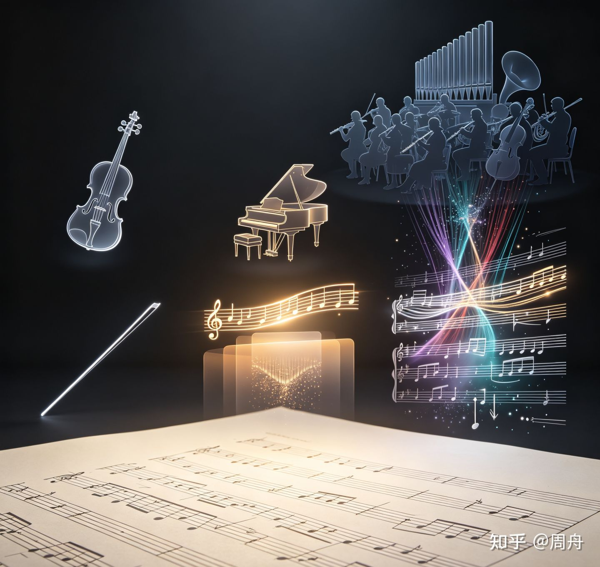
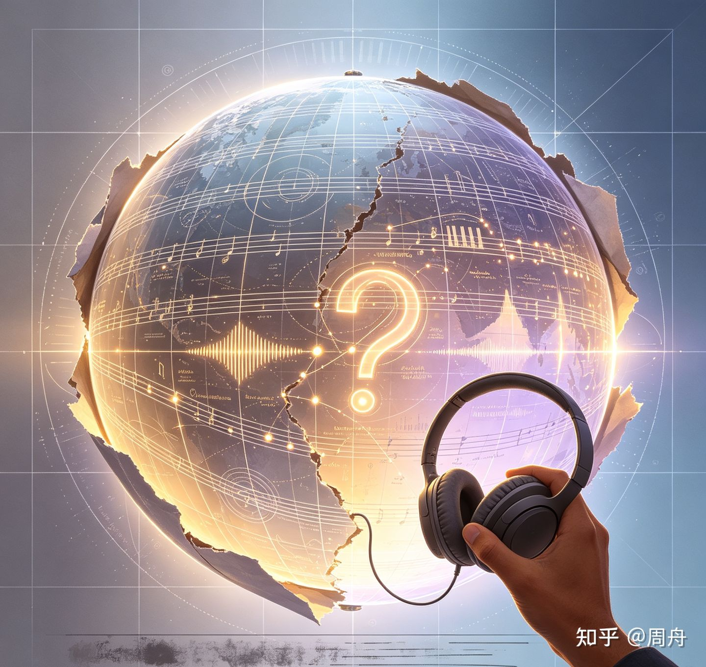
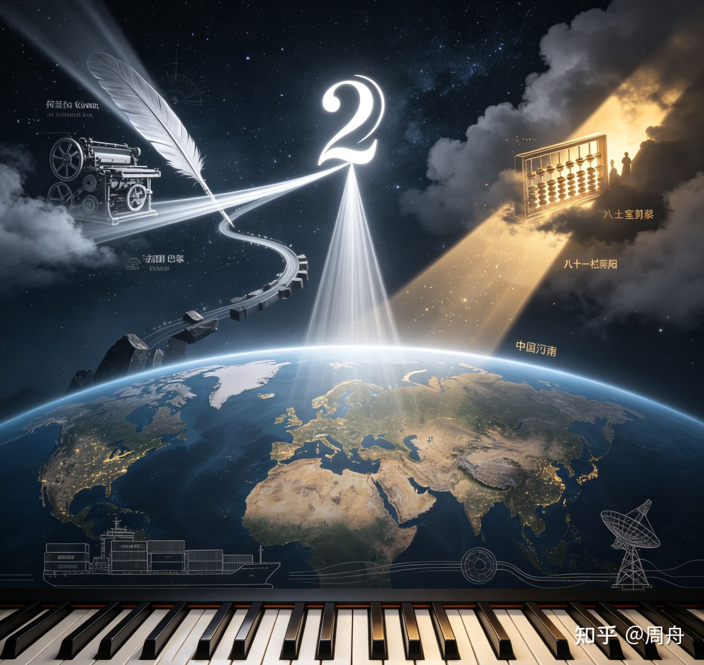
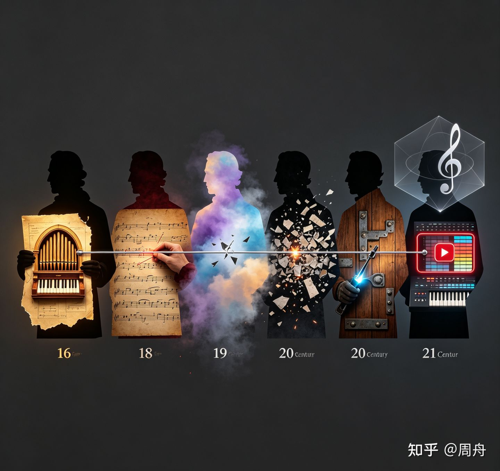
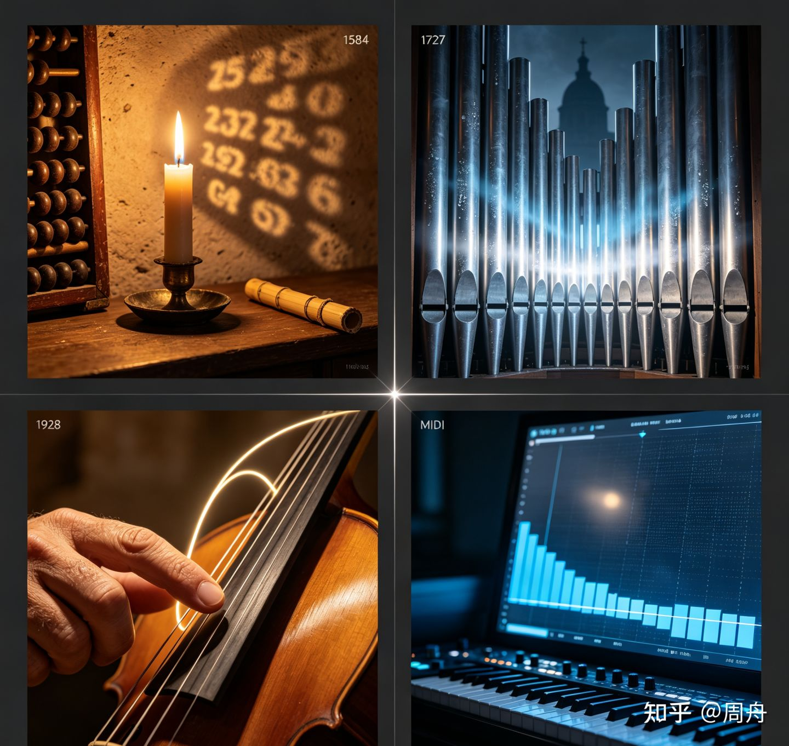

> 作者：周舟　|　赞同 237　|　评论 5　|　[原文](https://zhuanlan.zhihu.com/p/2066464299980271961)

## 写给重度音乐爱好者的十万字乐理（Music Theory）读本：从入门到飞升（下）

---

### 目录

-   引言：为什么学习乐理？
-   第1章 声音的物理基础：振动、泛音与律制
-   第2章 前大小调时代：人类如何尝试组织声音
-   第3章 被删除的琴键：Vicentino与朱载堉
-   第4章 把声音写下来：记谱法与音乐符号系统
-   第5章 时间中的建筑：节奏如何操纵人的身体
-   第6章 声音的色彩：音程协和度光谱
-   第7章 声音的堆叠：和弦
-   第8章 声音的政治：调式
-   第9章 离开家，再回来：转调的艺术
-   第10章 纵向与横向：和声同旋律共舞
-   第11章 音乐的建筑蓝图：从动机到奏鸣曲式
-   第12章 解放和弦：布鲁斯、爵士与AI音乐
-   第13章 从乐谱到耳边：织体、配器与演奏
-   第14章 乐理只是地方性知识？
-   第15章 算盘与鹅毛笔：十二平均律全球史
-   第16章 打破乐理规则
-   第17章 身体、乐器与乐理
-   尾声：四个声音

### 前置阅读：

**写给重度音乐爱好者的十万字乐理（Music Theory）读本：从入门到飞升（上）** - 周舟的文章 - 知乎

[写给重度音乐爱好者的十万字乐理（Music Theory）读本：从入门到飞升（上）](https://zhuanlan.zhihu.com/p/2066463102284063110)


### 第11章 音乐的建筑蓝图：从动机到奏鸣曲式

**核心命题**：曲式学和对位法是学院乐理中连接”和声语法”与”音乐叙事”的关键板块。曲式学处理音乐在宏观时间尺度上的结构组织，对位法处理多声部在微观时间尺度上的独立与协调。两者共同构成了”音乐在时间中的建筑”。

### 11.1 终止式：从和声句读到曲式段落

在第10章，你已经认识了终止式的四种类型——正格终止（V-I）、变格终止（IV-I）、阻碍终止（V-VI）、半终止（结束在V级上）。它们标记了和声进行的句读，就像标点符号标记了句子的边界。本章不再重复它们的定义，而是追问：当终止式连接成序列，它们如何构成更大的曲式单元？

半终止不仅意味着”停在V级上”。它还有更具体的类型：I-V是最标准的半终止（从主和弦出发，暂留于属和弦），IV-V是更强烈的期待（从下属区域推至属和弦），ii-V则在半终止中渗入了下属色彩（上主音和弦替代了IV级）。阻碍终止（V-VI）则是”句号被替换为省略号”——你期待I，但得到了VI，音乐没有结束，而是转了一个弯。在古典奏鸣曲式的发展部末尾，阻碍终止常被用来延长期待——听众已经准备好迎接主调的回归，作曲家却说”再等一下”。女性终止（feminine ending）——终止和弦落在弱拍上——在古典时期被赋予性别化标签：’男性终止’（masculine ending）指终止和弦落在强拍，被描述为’坚定的”确定的’；’女性终止’则被描述为’柔美的”犹疑的’。这一术语对立的背后，是19世纪欧洲音乐理论将非技术性的文化标签附着在技术分析术语上的典型案例。音乐学家Susan McClary在《Feminine Endings》（1991）中系统揭示了这一投射：当一套自称’描述声音组织方式’的理论体系开始使用’男性/女性’来标记终止式的强弱拍位置时，它已经不仅是’描述音乐’——它在用音乐理论的权威口吻，让一个文化标签听起来像是一个声学判断。

终止式是连接和声学与曲式学的枢纽。和声告诉你”这些和弦在做什么”（第10章），终止式告诉你”这些和弦在哪里画句号”，而曲式学告诉你”这些句号如何组织成更大的段落”。

### 11.2 曲式学：从动机到奏鸣曲式

曲式学以动机→乐句→乐段→单二部→单三部→回旋曲式→奏鸣曲式为递进线。

**曲式结构的层级组织（自下而上）**

奏鸣曲式（呈示-展开-再现，跨越数百小节的调性叙事）

↑

回旋曲式（ABACA，主部反复回归）

↑

单三部曲式（ABA'，出发-离开-回归）

↑

单二部曲式（||: A :||: B :||，两个对比段落）

↑

乐段（8小节=前乐句4+后乐句4，问-答结构）

↑

乐句（4小节=2+2，人类工作记忆的认知窗口）

↑

动机（最小有机体，如贝多芬命运动机——"短短短长"）

**动机与乐句**（与第10章”旋律的形态学”衔接）：动机是最小的有独立性格的音型。乐句是动机的组织——古典时期的标准乐句为4小节（2+2的内部结构，前两小节”提问”、后两小节”回答”），这受限于认知极限：人类的工作记忆一次约能容纳2-4个音乐事件，4小节乐句恰好在这个窗口内。以莫扎特K.576第一乐章开头8小节为例——前4小节以半终止结束（悬而未决的”提问”），后4小节以正格终止结束（尘埃落定的”回答”）。这种”问-答”结构是古典句法的核心。

**乐段**将”问-答”标准化：前乐句（antecedent）以半终止结束，后乐句（consequent）以正格终止结束。两个4小节乐句构成一个8小节乐段——这是古典时期最常见的结构单元。Caplin在《Classical Form》（1998）中将”形式功能”（formal function）定义为”每个音乐单元在更大结构中所扮演的角色”——这不是对”形状”的描述，而是对”叙事位置”的分析。

**单二部与单三部曲式**：单二部（||: A :||: B :||）——两个段落，B段通常包含新材料或对A的调性转化。单三部（ABA’）——出发、离开、回归，回归的A’在原素材上增加了经过B段后的新的听觉色彩。

**回旋曲式**（ABACA）：主部A反复回归，插部B和C提供对比。每一次”回到A”都是一次调性”回家”——这与第9章”转调远游与回家”的叙事原型形成了曲式学层面的等价物：第9章讲的是转调本身如何构成叙事，回旋曲式则是这一叙事在宏观结构上的固化——”离开→回来→再离开→再回来→最终回来”。

**奏鸣曲式**：调性叙事的最高形式。以贝多芬《悲怆》奏鸣曲第一乐章（聚焦allegro本体，约mm. 1-160）为贯穿案例。

**奏鸣曲式结构流程图**

```
奏鸣曲式
├── 呈示部 (Exposition)
│   ├── 第一主题 (主调, c小调) —— 命运的挣扎
│   ├── 桥段 (转调至关系大调)
│   └── 第二主题 (E♭大调) —— 抒情但脆弱的希望
├── 展开部 (Development)
│   ├── 主题碎片化重组
│   ├── 调性不稳定
│   └── 动机模进与碰撞
└── 再现部 (Recapitulation)
    ├── 第一主题 (主调, c小调)
    ├── 桥段 (改写)
    └── 第二主题 (主调, c小调) —— 希望的色彩被阴郁吞噬
```

呈示部：第一主题（c小调，命运的挣扎）→桥段（转调至关系大调E♭）→第二主题（E♭大调，抒情但脆弱的希望）。两个主题在不同调上亮相——主部在Tonic、副部在Dominant——这构成了呈示部内部最基本的”调性对立”。展开部：对两个主题的碎片化重组——第一主题的动机被分解、模进、在不同调上碰撞，调性不稳定，动机碎片化。再现部：两个主题都回归主调（c小调）——第二主题从呈示部的大调被”强制”转为小调，希望的色彩被主调的阴郁吞噬。呈示部离开家、展开部在外游荡、再现部回家但已不同——因为第二主题在再现部失去了它在呈示部的大调色彩，回归不是复原而是转变。

> **Charles Rosen, *Sonata Forms* (W.W. Norton, 1988, revised ed.), p. 7**
>
> “The sonata forms are not a set of rules, but a way of organizing musical thought. … The essence of the sonata is the polarization of the tonic and the dominant—or, more generally, the conflict between the principal key and the secondary key. The drama of the sonata is the resolution of this conflict.”

奏鸣曲式不是”公式”——它是调性叙事的最高形式，把最简单的和声事实（V-I解决）扩展为跨越数百小节的戏剧性叙事。

> ️ **大师引路**
>
> 你看过《指环王》吗？弗罗多离开夏尔（出发），穿越中土世界经历重重危险（冒险），最后回到夏尔——但夏尔已经不是他离开时的夏尔了，他自己也已经不是离开时的弗罗多了（回归）。
>
> 奏鸣曲式就是音乐中的”英雄之旅”。
>
> **呈示部**（出发）：两个主角登场。第一主角（第一主题）在主调上亮相——这是”家”。然后音乐旅行到另一个调（属调或关系大调），第二主角（第二主题）在这里登场——这是”远方”。两个主角性格不同（第一主题常常是强势、紧张的，第二主题常常是抒情、脆弱的），而且他们身处不同的”国度”（不同的调）。
>
> **展开部**（冒险）：两个主角离开他们的国度，在调性的荒野中漂泊。他们的旋律被拆散、变形、碰撞、重组。调性不稳定——你不知道”家”在哪里。
>
> **再现部**（回归）：回家了。但一切都不一样了。两个主角都回到了主调——第二主角被迫改变了自己的”国籍”（从大调变成小调，或从属调回到主调）。他们不是简单地”回来了”——他们在旅途中被改变了。就像弗罗多回到夏尔后，再也无法像从前那样生活。

它同时也是18-19世纪欧洲启蒙运动的听觉化身——呈示部中主部与副部的调性对立（Tonic vs Dominant）、展开部中的冲突与解构、再现部中的统一与和解，恰好映射了黑格尔”正题-反题-合题”的辩证法结构。但这并非时间的普遍组织方式——中国传统音乐的”散-慢-中-快-散”结构预设的是非线性、循环性或散点透视的时间观，与奏鸣曲式的”冲突-解决”线性目的论形成了根本对立。奏鸣曲式是欧洲启蒙运动的听觉化身——它代表了一种对”时间如何组织”的文化特异性回答。

### 11.3 对位法：声部独立的严格训练

从第10章你已经知道”避免平行五八度”——这是声部进行的最基本规则。对位法将这一规则推至极致：它要求在多个独立旋律线同时进行时，每一条都保持旋律独立性，同时垂直方向上的音程关系必须正确。

约翰·约瑟夫·福克斯（Johann Joseph Fux）在1725年出版的《Gradus ad Parnassum》中，将对位法教学系统化为五类”物种”（five species），以拉丁文写成，采用”大师Aloysius与学生Josephus”的对话形式。Aloysius代表Palestrina——福克斯在序言中明确写道：”我将Palestrina这位杰出的大师作为我唯一的导师。”全书所有对位范例均以Palestrina的无伴奏合唱作品为模仿对象，对位法的原始训练目标是”人声的独立性”——让多个独立的人声声部在垂直方向上形成正确的音程关系。

> **Johann Joseph Fux, *Gradus ad Parnassum* (1725), Preface**
>
> “Nemo autem existimet, me tam difficilem ac prope desperatum laborem suscepisse, ut quivis Musicus ad Parnassum evehi possit. … Neque enim omnes homines ad summa nati sunt; verum, ut quisque se diligenter exercuerit, eousque in arte progressum faciet.”
>
> （中译：”然而，没有人应当认为我承担了如此艰巨、近乎绝望的劳作，是为了让每一个音乐家都能登上帕纳索斯山。……因为并非所有人都为抵达巅峰而生；但每个人通过勤勉训练，都能在艺术中取得与其付出相应的进步。”）

**对位法五类物种阶梯**

```
第五类：混合节奏（综合前四类）← 最难
   ↑
第四类：切分音（延留音训练）
   ↑
第三类：四音对一音（更多和弦外音）
   ↑
第二类：二音对一音（引入经过音）
   ↑
第一类：音对音（全音符对全音符）← 最简单
```

五种严格训练按难度递增：第一类（音对音，全音符对全音符——训练纯音程的听觉辨识和声部独立性，所有音程必须是协和的）→第二类（二音对一音，两个二分音符对一个全音符——引入经过音，弱拍上允许不协和但必须级进解决）→第三类（四音对一音——引入更多种类的和弦外音，包括辅助音和经过音的组合）→第四类（切分音——延留音的严格训练，强拍上的不协和必须通过级进下行解决）→第五类（混合节奏，前四类的综合——”自由对位”，但”自由”是在严格训练之后获得的）。Fux的方法被海顿、莫扎特、贝多芬使用并高度赞扬——J.S.巴赫将Fux的教材视为宝典。直到19世纪，绝大多数对位法论著都基于Fux的框架。

对位法的训练目标不是”学会写文艺复兴弥撒曲”。它是在最严格的约束条件下训练声部独立的听觉能力——每一个声部必须能在旋律上独立（可以单独被哼唱），同时又必须在垂直方向上与所有其他声部形成正确的音程关系。这是一种极其苛刻的认知协调——类似于同时进行四种不同节奏的心算 。对位思维在当代音乐中以更自由的形式存在——流行音乐的贝斯线条与旋律的对位关系、爵士即兴中萨克斯与贝斯的对话、甚至电子音乐中多个合成器线条的交织。对位不是”过时的古老训练”——它是”在严格约束下获得解放”的认知原则在音乐中的应用。

对位法的严格训练在19世纪末被奥地利理论家海因里希·申克（Heinrich Schenker，1868-1935）发展为一套完整的调性音乐分析体系——申克分析（Schenkerian Analysis）。申克将Fux的对位训练与功能和声理论整合为一个层级还原模型：前景（乐谱上的具体音符）→中景（结构骨架）→背景（Ursatz，即”原始结构”——一个由基本线条\[Urlinie\]和低音琶音\[I-V-I\]构成的极简框架）。申克的洞见在于揭示了调性音乐作品深层的声部进行逻辑——看似复杂的织体可以被还原为相对简单的对位骨架。然而，申克分析的争议性同样不容回避：申克本人明确的种族中心主义立场——他声称只有德奥大师（巴赫到勃拉姆斯）的作品才具有”真正的”深层结构，将法国、意大利、斯拉夫音乐排除在外；”有机主义”隐喻的政治意涵——将音乐作品比作从”种子”（Ursatz）自然生长的有机体，这一隐喻将特定文化的音乐实践自然化为”普遍法则”，在方法论上排斥了非西方、非调性、流行和爵士等音乐传统；在北美音乐理论界，申克分析在1980-2000年代占据近乎统治性的地位，这一霸权本身也值得反思——一套为分析18-19世纪德奥调性音乐而设计的工具，被普遍化为”音乐理论”的核心方法论。当代音乐理论正在超越申克的遗产——新里曼理论（第10章Tonnetz部分已介绍）、认知音乐学（第6章和第14章已涉及）和民族音乐学的分析框架正在共同拓展”乐理”的定义边界。

> **本章落点**：曲式学和声进行组织为跨越数百小节的叙事结构，对位法则训练了同时处理多条独立声音线的认知能力。两者共同构成了”音乐在时间中的建筑”——曲式是建筑的蓝图，对位是建筑中每一条线条的精确走向。但必须记住：奏鸣曲式是欧洲启蒙运动的听觉化身，而非时间的普遍组织方式。曲式学所描述的”结构”，是特定文化对”时间如何组织”的特定回答。


### 第12章 解放和弦：布鲁斯、爵士与AI音乐

**核心命题**：乐理是一个活的系统。从布鲁斯的田野到爵士的俱乐部，从流行录音室到AI实验室，和声语言持续演进。

### 12.1 和弦符号的现代工业标准

走进任何一间现代排练房，谱架上的乐谱写的是”Cmaj⁷”而非”在大调中建立于第一级音上的大三和弦叠加大七度音”。字母和弦符号是现代音乐家的通用语——字母规定根音，后缀规定和弦性质，斜线（如C/E）规定特定的低音。

字母后缀体系构成了一套独立于功能和声的”和弦成分描述语言”：m（小三和弦，将大三度降半音）、maj⁷（大七和弦，大三和弦+大七度=明亮+尖锐光泽）、⁷（属七和弦，大三和弦+小七度=携带三全音张力）、m⁷（小七和弦，小三和弦+小七度=柔和内省）、ø⁷（半减七和弦，减三和弦+小七度=幽暗但不绝望）、°⁷（减七和弦，减三和弦+减七度=对称性使其任何一音可被重新解释为根音）、sus4（挂四和弦，四度替代三度=色彩上的”中性状态”）、add9（大三和弦加九音，无七音=开放而温暖）、alt（变化属七和弦，含♭9/♯9/♭5/♯5等变化延伸音）。这套后缀体系不告诉你这个和弦在调中的功能角色，只精确告诉你”按哪几个键”。

纳什维尔数字体系（Nashville Number System）则将首调思维推向极致。1950年代由纳什维尔录音室音乐家（以Neal Matthews和Charlie McCoy为核心圈子）发展出来的这套实用体系，用阿拉伯数字1-7表示调内各音级上的和弦（1=主和弦，4=下属和弦，5=属和弦）。其核心发明是将数字体系与字母和弦后缀结合——如”4⁷”=下属音上的属七和弦，”2m⁷”=上主音上的小七和弦——使得一首歌的和声进行可以用一个与调性无关的数字字符串表示。同样的”1-4-5-1”，在C大调是C-F-G-C，在G大调是G-C-D-G。录音室音乐家在为不同音域的歌手伴奏时可以瞬间移调而无需重写和弦谱——数字代表功能位置而非绝对音高，这是”首调思维”在和声层面的应用。这与第4章讨论的简谱共享同一个核心智慧——以相对音高关系而非绝对音高来编码音乐，使移调成为不需要重新记谱的瞬间操作。

值得一提的是爵士理论的教学顺序。Mark Levine《The Jazz Theory Book》（1995）从”和弦-音阶理论”（chord-scale theory）开始——先呈现完整的和弦类型与可用音阶的对应关系（”在这个Cmaj⁷上你可以用C大调音阶或C利底亚音阶”），再拆解为功能单元。伯克利音乐学院的爵士和声教材同样采用这种”从结构到原子”的反向路径。这与本书”从原子到结构”的叙事形成了方法论层面的对话——西方学院乐理是”自下而上”（音程→和弦→进行），爵士理论书常采用”自上而下”（进行→和弦→音程）。两种路径不是优劣关系——它们适应了不同的学习目标：前者适合从头建构理解，后者适合在演奏中快速应用。本书采用的是”自下而上”路径——但当你翻开Levine的《The Jazz Theory Book》，你会看到一条”自上而下”的路径。两者殊途同归。

和弦-音阶理论的核心主张简洁而激进：每一个和弦都有至少一条与之对应的”可用音阶”（available scale），即兴者在这条音阶的音符集合内自由选择旋律音。例如，Cmaj⁷对应C大调音阶（或C利底亚音阶，如果上下文暗示了升四级）；Dm⁷对应D多利亚音阶；G⁷对应G混合利底亚音阶（或G变化属音阶\[altered scale\]，如果和弦标记为G⁷alt）；Cm⁷♭5对应C洛克里亚音阶。这一体系的教学效率极高——学习者在掌握约10-15条音阶后，即可在大多数爵士标准曲的和弦进行上”安全地”即兴。但它的批评者指出：和弦-音阶理论将即兴简化为”和弦→音阶→旋律”的线性流程，忽略了旋律动机的发展、节奏对话和跨和弦的声部进行——这些在Charlie Parker和Miles Davis的实际即兴中远比音阶选择更重要；这一体系将特定时期（1950-60年代调性爵士）的即兴实践标准化为”爵士理论”，对早期摇摆乐和新奥尔良传统的对位式即兴、以及后来自由爵士的无调性即兴缺乏解释力；用音阶而非和弦音来组织即兴思维，是20世纪下半叶爵士教育”学院化”的产物——在Parker和Gillespie的时代，即兴者主要围绕和弦音展开旋律，半音经过音是”装饰”而非”独立音阶成员”。和弦-音阶理论的兴衰，是”乐理作为描述语言”最生动的案例之一——一套理论工具在特定历史条件下被发明、广泛传播、成为”标准”，然后在新的音乐实践和批判性反思面前显露出它的历史局限性。

这一”反向教学法”不是Levine的个人偏好——它是爵士教育从口传心授的学徒制向学院课程转型过程中的系统性策略选择。当爵士乐在20世纪70至80年代被纳入学院课程时，教育者面临一个结构性问题：如何将学徒制中”浸泡”在完整音乐语境中的学习模式转化为可在16周学期内教授的系统课程？解决方案是保留”从完整进行出发”的教学起点，但用教材和练习曲替代录音和即兴演奏会作为主要学习材料。这一转型保留了学徒制的方法论直觉（”先感知整体再拆解部件”），但不可避免地失去了实时互动、个性化纠错和在真实表演压力下的学习——这正是第14章”乐理的制度权力”论证的又一案例。

### 12.2 布鲁斯：属七和弦的解放

布鲁斯是西方和声史上一场安静的革命。

在古典和声中，属七和弦是”需要解决的”——它携带必须被释放的张力。但在布鲁斯中，**每个和弦都可以是属七。** I⁷、IV⁷、V⁷——全都是属七和弦结构。它们不需要解决。属七和弦被”解放”了——它不再是一种”需要去到某处的状态”，而是一种”可以就是它自己”的色彩。这一解放有其声学基础：属七和弦的三全音在纯律中对应第7泛音与第11泛音之间的复杂关系——这些泛音在自然声学中本就存在，只是西方功能和声将其标记为”需要解决”。布鲁斯传统通过将属七和弦作为终止性和弦使用（而非作为过渡性和弦），实际上是在调用一个比功能和声更古老的声学资源——泛音列中本来就”不解决”的第7泛音。

十二小节布鲁斯——I-I-I-I / IV-IV-I-I / V-IV-I-I——是一个耐人寻味的框架：它足够简单以至于一个人可以在十分钟内学会跟弹，也足够深以至于一百多年的布鲁斯、爵士、摇滚和R&B从未将它穷尽。可以说，整个摇滚乐史都建立在这十二个小节之上 。

但有一个问题必须被追问：**谁创造了这种解放？**

布鲁斯早期的创造者——Charley Patton、Robert Johnson、Son House——在密西西比三角洲的种族隔离制度下创作了一种彻底重写和声规则的音乐。他们被系统性排除在正规音乐教育之外。”不懂乐理”不是他们的选择——而是吉姆·克劳法（Jim Crow laws）下黑人被剥夺教育机会的直接后果。当白人音乐学家在20世纪中叶开始”发现”布鲁斯并试图用西方和声理论分析它时，他们使用的术语——”混合利底亚调式”“属七和弦”——实际上是强行将一套不兼容的分析范畴套用在另一种音乐传统上。这意味着：布鲁斯的和声创新只有在被西方乐理”翻译”之后，才被承认为”有价值的音乐知识”。

更深的悖论在于继承过程中的文化归属模糊化。布鲁斯对属七和弦的”解放”在20世纪下半叶被爵士乐、摇滚乐、R&B广泛继承，但这一继承过程中的文化归属被系统性地模糊了。当白人摇滚乐手使用布鲁斯的I⁷-IV⁷-V⁷进行并被商业成功回报时，”布鲁斯”的标签被保留，但创造者的种族身份被抹除。Christopher Small在《Musicking》（1998）中提出的概念在此适用：音乐不是一个”物体”（object），而是一个”行动”（act）——一种社会关系的enact。当我们说”布鲁斯解放了属七和弦”时，我们需要追问：是谁的身体承受了”不解放”的代价？是谁在”解放”之后获得了利润？乐理在这个过程中扮演了双重角色。一方面，它是文化挪用的工具——用西方术语”翻译”布鲁斯，使其可以被学院体系消化和传播。另一方面，它也是文化抵抗的潜在载体——如果乐理教材能够显式地标注布鲁斯和声创新的文化归属，而非将其呈现为”无主的技术发现”，那么乐理可以成为更准确地描述这些和声创新的来源的工具。这直接呼应了第14章”乐理作为制度权力”的论证：乐理教材的每一条”规则”，都应该标注它的文化来源和历史语境——这是准确性本身的要求。

### 12.3 爵士和声的拓展

爵士乐将和声的垂直维度推到了极限。**延伸音**——在三和弦和七和弦之上继续三度叠置，引入九音、十一音、十三音。**变化延伸音**——♭9、♯9、♭5、♯11——进一步扩展色彩调色板。

**II-V-I进行**是爵士和声的核心语汇。在C大调中：Dm⁷（II级）→G⁷（V级）→Cmaj⁷（I级）。这个进行在古典和声中就是最标准的终止式，只是在爵士中II级被加上了七音，V级被加上变化延伸音。**三全音替代（tritone substitution）**是爵士和声最优雅的操作之一。G⁷的三音是B，七音是F——B与F之间是三全音。D♭⁷的三音是F，七音是C♭（=B）。G⁷和D♭⁷共享同一对三全音核心，只是三音与七音的身份互换。这意味着在任何G⁷出现的地方，你可以用D♭⁷替代——根音相距三全音。低音以半音步伐下行（D→D♭→C），平滑如镜面滑行。三全音替代揭示了一个深层结构洞察：属七和弦的根音不是其”驱动力”的来源——三全音才是。根音只是承载三全音的外壳。

**和弦轮盘与负和声（Negative Harmony）**是当代乐理实践中两个值得关注的创新。和弦轮盘（Chord Wheel，Jim Fleser于2000年出版）将五度循环圈与调内和弦功能关系整合为一个可旋转的圆形转盘——转动到目标调即可看到该调的I-IV-V-ii-iii-vi各和弦。它与第4章圭多手形成跨越千年的”手掌上的乐理知识”呼应——圭多手是11世纪的体感教学工具（将唱名映射到手掌关节），和弦轮盘是21世纪的视觉教学工具（将和弦关系压缩到可旋转纸盘），两者共享”将乐理知识压缩到手掌/圆盘上”的设计哲学。负和声——源自Ernst Levy 1985年《A Theory of Harmony》——将一个和弦进行围绕一个轴进行镜像翻转：C大三和弦翻转为A小三和弦，属七和弦翻转为下属七和弦。

> ️ **大师引路**
>
> 负和声就是”把和弦倒过来看”。一面镜子放在C和G的中间——C大三和弦（C-E-G）在镜子里的倒影是什么？是A小三和弦（A-C-E）。这不是”随便选的”——倒影里的每一个音都是原和弦的”镜像位置”。负和声不会让你成为更好的作曲家，但它会让你看到：和声空间是有形状的，和弦可以在空间中”翻转”，就像形状可以在镜子中翻转一样。

这一操作揭示了和声空间的几何对称性。英国多乐器演奏者Jacob Collier在YouTube上的负和声讲解视频累计播放超5000万次，评论区充斥着”我从未学过乐理但这段视频让我买了第一本和声书”的自述——”乐理”在数字时代可以成为病毒式传播的”智力玩具”。

### 12.4 AI：乐理的最新章节

2025年，有研究者在IEEE Access上发表了基于变分Transformer的和弦生成系统（Style-VT）。该系统在多种风格的和弦进行生成上展现了与人类作品的高度谐波相似性。关键细节：Style-VT从未被显式地教授”I-IV-V-I”或”II-V-I”——它从海量人类作曲数据中直接学到了等效的统计规律。

这意味着什么？传统乐理声称自己是”音乐家理解声音、组织时间的底层逻辑”。但Style-VT等模型表明，这一”底层逻辑”可以被完全绕过。AI不需要被教导”属七和弦解决到主和弦”——它从巴赫和爵士标准曲的统计分布中直接习得了等效的先验。如果Style-VT有内心独白，它大概是：”我不知道为什么II后面经常跟V，但数据说它们就是经常在一起。” 中国科学家管晓宏院士提出了音乐旋律的”幂律分布模型”，指出这一模型对中西音乐均适用——暗示中西音乐共享更深层的数学物理规律，而传统乐理的”大小调功能圈”只是这一规律的一种特定文化编码。

但有一个问题必须追问：Style-VT从未被教授”II-V-I”却从数据中学到了它——这究竟意味着AI”理解”了和声的功能逻辑，还是仅仅意味着它在海量数据中识别出了II-V-I的统计共现？区分这两者的关键在于：如果给Style-VT一个它从未见过的和声序列（如某首冷门作品中的罕见进行），它能推理出该序列的功能含义吗？目前尚无证据支持这一点。AI和弦生成模型习得的是统计规律，而非因果逻辑——它知道”II后面经常跟V”，但不知道”为什么II后面跟V”。从这个角度看，AI和弦生成模型不只是一种”新技术”——它正在成为一套新的乐理基础设施。正如五线谱曾经决定了”什么音乐可以被精确记录、从而可以被分析和传授”，AI模型的训练数据偏向正在决定”什么和声进行将被下一代音乐人视为直觉性的选择”。目前主流的音乐生成模型（MusicLM、MusicGen、Suno）的训练数据以西方调性音乐为主——这意味着AI正在以”统计规律”的面目，将十二平均律和功能和声的默认地位进一步自然化。Vicentino的archicembalo因为缺乏记谱法的支持而无法传承——五百年后，被AI训练数据排除在外的微分音音乐和甘美兰调律，是否也会因为缺乏”AI基础设施”的支持而面临另一种形式的搁置？

在MIT首届音乐科技研究展（2026年7月）上，Claire Southard展示了”想象音乐的神经解码”——训练机器学习模型通过分析用户佩戴EEG设备时产生的脑部信号，预测其正在脑海中想象的音乐内容，许多预测曲目都能被识别为用户所想象的旋律。德国汉堡音乐与戏剧学院教授Georg Hajdu在第三届世界音乐人工智能大会（2026年4月）上提出了”机文主义”（machine literarism）——这一面向未来的理论设想强调人工智能的深度介入正在改变艺术创作主体、意义生成机制和音乐教育结构。

这些发展对”乐理”提出了一个根本性的追问：如果AI可以不懂乐理而写出巴赫风格的和弦进行，如果人类大脑的音乐预期可以被EEG解码而无需通过乐理术语的中介——那么”乐理”还是”底层逻辑”吗？还是仅仅是人类在AI出现之前，对音乐统计规律的一种低效显式编码？

这个问题没有最终答案。但它的存在本身提示了乐理的边界：乐理不是永恒的真理，而是一套在特定历史条件下被证明有效的描述语言。当技术条件发生变化时，这套语言的语法也会随之更新——AI和弦生成就是它最新的一章。

### 12.5 移调的实际应用

将一首曲子从一个调移到另一个调——适应不同歌手的音域，或为移调乐器（如单簧管、小号、萨克斯）改写——是实用音乐技能的核心。三种移调方法对应三种场景：改变记谱位置（最直观）、改变调号（最适用于整体移调）、改变谱号（高级演奏者的视奏移调）。移调是乐器特定乐理的典型问题——不同乐器的移调逻辑各不相同，这一问题将在第17章”乐器特定乐理”一节中系统展开。

> **本章落点**：从古典功能和声的”主-下属-属-主”到爵士的”II-V-I”再到布鲁斯的”全属七和弦”，和声语言在近一个世纪里经历了剧烈的扩展。布鲁斯解放了不协和，爵士拓展了和弦的色彩维度，AI正在重新定义”理解音乐”的含义。乐理不是一套固定的规则手册——它是一种仍在生长中的描述语言。每一次音乐风格的革新都在为这套语言添加新的词汇。今天正在被创作的音乐——无论是在录音棚里由人类即兴，还是在服务器上由模型生成——正在产生明天将被编入乐理教材的新的”常规做法”。



### 第13章 从乐谱到耳边：织体、配器与演奏

**核心命题**：乐谱上的符号标记了音高、时值和力度，但标记不出声音在空间中的分布形态、在特定乐器上的触感质地、以及在演奏者身体动作中的实现方式。织体、配器法和演奏指示，是将纸面符号翻译为实际音响的三个层次。

### 13.1 织体：和声的空间化

在第7章你已经知道和弦是什么，在第10章你已经知道和弦如何连接成进行。但同一套和弦进行，在贝多芬手中和在披头士手中听起来完全不同——不是因为和弦变了，而是因为织体变了。织体（texture）是和声在空间中的分布方式——它决定了音符在纵向如何堆叠、在横向如何交织。

> ️ **大师引路**
>
> 我们来做一个30秒的实验。不需要乐器。只需要你的耳朵和手指。
>
> 用右手指关节在桌面上敲一个稳定的节拍——哒、哒、哒、哒。这就是**单音织体**：一条旋律线，没有任何和声伴奏。你听到的只有你的指关节。
>
> 现在，用左手在桌面上按住不动（模拟一个持续的低音），右手继续敲节拍。你听到了什么？一个持续的低音在下面，一个运动的旋律在上面。这就是**主音织体**：旋律占主导，和声提供背景。大多数流行歌都是这个结构——歌手唱旋律，吉他在下面弹和弦。
>
> 最难的部分来了。试着用右手敲一个节奏（哒—哒哒—哒），同时用左手敲一个完全不同的节奏（哒哒—哒—哒哒）。如果你的左右手在打架——恭喜，你正在体验**复音织体**的本质：两个独立的线条同时进行，各自有自己的生命，但必须共存。巴赫的音乐就是这样的：每一个声部都是一条独立的旋律，但它们合在一起却天衣无缝。
>
> 现在你知道为什么巴赫这么难弹了。你的大脑在同时管理两个独立的时间线——这就像左手画圆右手画方，还要让它们看起来像一幅画。

**单音织体**（Monophony）：单一旋律线条，无和声伴随。格里高利圣咏是典型——所有歌手齐唱同一条旋律，没有任何和声填充。这不是”缺少和声的原始状态”——在许多音乐传统中，单音织体是最高级的表达形式。印度拉格大师在阿拉普（alap）段落中仅用旋律线就能建立长达数十分钟的张力弧，不需要任何和声伴奏。

**主音织体**（Homophony）：一个旋律声部占主导地位，其余声部提供和声伴奏。这是流行音乐的标准织体——歌手唱旋律，钢琴/吉他弹和弦。古典时期的奏鸣曲也大量使用主音织体——右手旋律加左手阿尔贝蒂低音（Alberti bass，将三和弦分解为根音-五音-三音-五音的循环低音线条）的模式，几乎定义了整个古典时期的钢琴语法。

**复音织体**（Polyphony）：两个或以上独立的旋律线条同时进行，每个都具有独立的旋律意义。巴赫的赋格是其最严格的典范——一个主题在不同声部中依次进入、转调、变形，同时保持各自的旋律完整性。流行音乐中也有复音织体的应用——Beach Boys《God Only Knows》的结尾部分，多个声乐线条交织成类似文艺复兴经文歌的复音结构。

织体和和声的关系需要明确区分：和声回答”什么音符同时发声”（纵向结构），织体回答”这些音符在空间中的分布形态”（空间组织）。同一个C大三和弦，在单音织体中根本不存在（因为没有和声叠加），在主音织体中是”旋律下方的伴奏块”，在复音织体中是”三个独立声部偶然交汇的瞬间截面”。织体决定了听者最先感知到的音乐质地——在听到具体的和弦名称之前，已经听到了”厚”或”薄”、”密”或”疏”。

### 13.2 配器法：同一和弦的千张面孔

同一个C大三和弦，在钢琴上是三根手指按下的三个键，在弦乐四重奏中是四把琴在不同音区奏出的融合音响，在管弦乐队全奏中则是数十件乐器从低音提琴到短笛跨越六个八度的巨大声场。配器法（orchestration）处理的是音色——决定用哪些乐器、在什么音区、以什么组合方式来发出乐谱上的那些音符。

管弦乐队四大声部各有其不可替代的音色特性。**弦乐**——小提琴（violin）、中提琴（viola）、大提琴（cello）、低音提琴（double bass）——拥有最丰富的表情范围，从极弱到极强、从极柔到极刚。弦乐器的运弓方向（上弓/下弓）、弓在弦上的位置（近指板/近琴马）、揉弦的幅度和速度——每一个参数都在微调音色。**木管**——长笛、双簧管、单簧管、大管——色彩丰富，每个乐器个性鲜明。单簧管尤其具有chameleon特性：低音区幽暗如洞穴深处、中音区温暖饱满、高音区尖锐如寒风吹过。**铜管**——小号、圆号、长号、大号——辉煌、穿透力强，力度范围大。铜管乐器的物理泛音约束意味着不加阀键时只能吹泛音列中的音，阀键组合实质是切换不同长度的管道来填充泛音列之间的空隙。**打击乐**——从无音高噪音（小军鼓、钹）到有明确音高（定音鼓、木琴、颤音琴），从庄严到梦幻。

拉威尔（Maurice Ravel，1875-1937）的《波莱罗》（1928）是配器法最经典的教科书案例。全曲仅两个主题，在一个固定节奏音型（小军鼓持续敲击三连音节奏型）的背景下依次反复8次。主题旋律本身完全不变，但每次重复时配器发生根本改变：从小军鼓独奏+中提琴大提琴拨奏+长笛低音区独奏开始（最稀疏的配器），单簧管重复主题，大管呈现更阴郁的第二主题，然后短笛、小单簧管、双簧管、英国管、圆号、小号、长号、钢片琴、竖琴逐层叠加——每一次换色都改变同一旋律的”声学面孔”。全曲在力度上呈整体渐强，在最高潮处以全乐队全奏结束。拉威尔通过”配器渐变”在一条完全不变的旋律上构建了长达15分钟的持续上升的张力线——这是”通过配器本身构建叙事弧”的终极示范。斯特拉文斯基（Igor Stravinsky，1882-1971）称拉威尔为”瑞士钟表匠”⌚，这个评价精确地捕捉了拉威尔配器艺术的本质：每一个乐器进入的时机、每一层音色的叠加，都经过精密计算。

流行音乐制作人本质上也在做配器决策——选择用钢琴还是合成器、用真鼓还是电子鼓、在副歌处加一层合成器pad或增加一条贝斯副旋律。决策者不叫”配器师”而叫”制作人”，但他们面临的是同一个问题：在什么时间点加入什么音色来改变音乐的密度？

### 13.3 演奏指示：为什么意大利语统治了音乐

在第4章你已经见过力度和速度标记。这里讨论的是它们背后的哲学：演奏指示既是精确化工具，也是自由空间容器。

意大利语如何成为”音乐世界语”？17-18世纪意大利歌剧和器乐在欧洲的统治性流行，使得其演奏术语（allegro、adagio、crescendo、staccato…）被全欧洲作曲家直接借用——这些术语随着乐谱的跨国流通自然演变为通用的音乐元语言，无需翻译即被德国、法国、英国的音乐家理解和采纳。ABRSM（英国皇家音乐学院联合委员会）在各级别考试中要求考生记忆一套标准化的意大利术语表——从Grade 1的约20个到Grade 5的约150个。这一标准化过程，实质上是大英帝国在19-20世纪将意大利语”二次编码”为全球殖民教育体系的过程。一个北京琴童在考级时因为写错了意大利语的sforzando（突强）而被扣分，但他可能从未听过一句意大利语的日常对话——这不仅是术语的传递，更是文化等级的再生产。

演奏指示的边界是一个哲学问题。节拍器标记（M.M.♩=120）给出了精确的速度指令——每分钟120拍，没有歧义。但”rubato”（弹性速度）只告诉你”可以自由地加快或减慢”，不告诉你具体快多少——它承认了音乐的时间不能完全被节拍器度量。延长号是记谱法中留给演奏者自由空间的标记之一——”音乐的时间不能完全被机械化地度量，某些时刻需要呼吸、需要停留。”演奏指示的边界恰好回应了第4章记谱法的核心命题——”记谱法选择了将哪些声音参数精确固定、哪些留给演奏者、哪些彻底忽略。”演奏指示是这条选择链的最后一环。

> **本章落点**：织体决定了音符在空间中的分布形态，配器法决定了用什么音色发出这些音符，演奏指示决定了以什么方式演奏它们。三者共同构成了”从符号到声音的翻译层”——乐谱是二维的，声音是三维的，翻译层填充了缺失的那一维。管弦乐队的编制是19世纪欧洲音乐文化的物质遗产，而非”完美声音”的物理必然。而以上所有技术和形式的讨论——和弦、进行、曲式、织体、配器——都基于一套特定的乐理体系。接下来的四章将不再是”乐理是什么”的技术拆解，而是”乐理为什么是这样而不是别样”的认识论批判：这套体系的普适性已被实验证据质疑，它的历史是路径依赖的产物，它的宇宙论基础只是人类众多回答中的一种，而它的实践界面深刻地塑造了我们对它的认知。



**第14章-第17章导读：乐理的地方性** 我们将从四个递进的层面证伪”乐理普适性”：

-   第14章从**认知层面**证伪——协和度感知、乐理教育、考级体系都证明乐理是地方性的；
-   第15章从**历史层面**证伪——十二平均律在中欧与中国的平行发明与各自搁置，证明乐理是历史路径依赖的产物；
-   第16章从**宇宙论层面**证伪——四大文明独立地将音乐与宇宙秩序等同，证明”乐理”在人类文明中本就有多种独立起源；
-   第17章从**身体与媒介层面**证伪——乐器界面、学习生态、演奏者身体都证明乐理从来不是一套”纯精神”的知识体系。

四章递进：认知→历史→宇宙论→身体，从抽象到具体，从观念到物质。

### 第14章 乐理只是地方性知识？

**核心命题**：已有足够证据表明，我们所学的基础乐理只是地方性知识——西方音乐文化在启蒙时期沉淀下来的一套描述语言和实践规范。它不是”错误的”，但它是”局部的”。

**论证逻辑树：乐理为什么是地方性知识？**

**总命题**：基础乐理不是声音组织的普遍语法，而是西方音乐文化在启蒙时期沉淀下来的地方性描述语言

├──**分支1·认知证伪**（14.1）

│ └── Tsimane实验：协和/不协和偏好不是人类听觉的普遍特征

│ └── 三层模型：物理层（可感知粗糙度）→ 粗糙度层（跨文化但受训练调节）→ 文化选择层（完全文化依赖）

│

├──**分支2·历史证伪**（14.2）

│ └── A=440Hz：一个国际标准是1939年协商投票+工程妥协的产物

│ └── 纽约爱乐、波士顿交响乐团实际使用A=442Hz——"国际标准"在实践中是"建议"

│

├──**分支3·制度证伪**（14.3-14.4）

│ ├── 教材目录结构差异：李重光（演绎式·从定义出发）与ABRSM（归纳式·从节奏出发）与Terefenko（从爵士出发）

│ ├── 平行五度"禁令"的层累过程：15世纪审美偏好→18世纪工程约束→19世纪"铁律"

│ └── 考级体系的反向塑造：标准化测试只能测量"对符号系统的解码速度"，而非音乐理解力

│

└──**分支4·替代体系的存在**（14.5-14.7）

├── 中国五声调式：五度生律链自觉止步于五个五度——不是"简化版"，是"不走向狼音的自觉选择"

├── 印度拉格：22个斯鲁蒂，每个拉格同时是音阶+时间+情绪+宇宙秩序

├── 阿拉伯木卡姆：四分之一音+"中立音程"（约350音分）

└── 甘美兰Ombak：有意制造偏差=美的核心（而非"不准"）

**结论**：乐理是地方性知识，恰好因为历史偶然获得了全球霸权

### 14.1 一场改变认知的实验

2016年，玻利维亚亚马孙雨林深处，64名提斯曼成年人坐在临时搭建的草棚下，头戴式耳机播放着一对又一对的音程。研究者通过便携式太阳能电池板为设备供电。猴子在远处的树冠上啼叫。MIT的Josh McDermott团队在《自然》杂志发表了一项研究，在音乐认知领域引发了持久的震荡。

> ️ **大师引路**
>
> 你在一个从来没有电灯、没有广播、没有手机的地方长大。你听到的声音——河水、鸟鸣、猴啼、族人唱歌——都是环境性的、社交性的、仪式性的。你从来没有单独戴上一个耳机、被要求”仔细听这两个同时发出的声音，告诉我哪个更好听”。你的文化里甚至可能没有一个词专门指”好听”——声音被评价的是”适合这个场合吗”“让祖先高兴吗”“和森林的声音和谐吗”，而不是”这个音程本身悦耳吗”。
>
> 然后有一天，一群带着太阳能电池板和头戴式耳机的研究者来到你的村庄。他们给你戴上耳机，让你听一对对毫无语境的声音——纯一度、纯五度、三全音——然后问：”你觉得这个声音好听吗？”
>
> 一位提斯曼中年妇女听完三全音后摘下耳机，用西班牙语问翻译：”这个为什么应该难听？”
>
> 这个问题不是一个笑话。这个问题是21世纪音乐认知科学最有穿透力的问题。

实验使用合成音色（无泛音列的纯音，以排除音色偏好对协和度判断的干扰），同时呈现两个纯音（和声音程），共测试了从纯一度到三全音在内的10种音程。64名提斯曼成年人完成了全部测试。

结果令人震惊：**提斯曼人对协和与不协和音程的评价没有显著差异。** 他们并不觉得不协和和弦比其他所谓更悦耳的组合逊色分毫。而西方被试表现出显著的协和偏好——纯五度被评为”好听”，三全音被评为”难听”。

同期《自然》期刊的评论文章指出：”协和度的普遍性假说可能只是西方音乐习惯的产物，而非人类听觉的普遍特征。”这一结论直接挑战了基础乐理教材中的一个核心假设——音程协和度光谱（从”极完全协和”到”不协和”的连续变化曲线）被呈现为一种声学-心理普遍规律。Tsimane研究提示：它可能只是文化习得。

但这个解读需要进一步的分层。2025年发表的印度与西方听众对比研究揭示了更复杂的图景：心理声学现象（粗糙度和谐波性）对西方音乐家解释力最强，对印度音乐家和非音乐家解释力依次减弱。综合两项研究，可以提炼出一个三层模型：物理层（声波拍频和临界带宽重叠产生的粗糙感，所有听觉正常的群体都能感知到）→粗糙度层（对粗糙度的”不悦”程度判断，跨文化通用但受训练调节）→文化选择层（特定文化将特定粗糙度标记为”美”或”禁”，完全文化依赖）。Tsimane研究证伪的是”文化选择层普遍一致”这一强假设，而非”物理层和粗糙度层存在”——提斯曼人可能感知到了三全音的声学粗糙度，但他们没有将这种粗糙度标记为”难听”。

与此同时，Tsimane研究本身的方法论也需要被审视。头戴式耳机提供的”去语境化”纯净音程，在Tsimane的日常音乐生活中是不存在的——他们的音乐是环境性的。将”pleasantness”翻译为跨文化的普遍指标，是一种语义帝国主义：”好听”在Tsimane文化中可能意味着”适合仪式”或”与森林的声音和谐”，而非西方美学中的”感官愉悦”。

### 14.2 A=440Hz：一个标准化的寓言

如果回到第1章，你可能会想起一个细节：国际标准音A=440Hz不是声学规律的必然产物，而是1939年伦敦国际会议上各国代表协商投票的结果。同时，纽约爱乐、波士顿交响乐团以及法国、意大利等部分欧洲国家的乐团，实际使用A=442Hz作为音乐会音高。

这条线索贯穿了本书的核心论证：**乐理中被我们视为”自然”的许多基准，实际上是历史协商、工程妥协和文化惯习的沉积。** 十二平均律是”民主化的不完美”——它将音程偏差均匀分配到所有调，以普遍的小不完美换取普遍的自由。A=440是广播工业时代的跨国标准化的产物。五线谱的精确记谱体系使西方古典音乐的复杂结构成为可能，但同时也系统性地排除了无法被离散音高网格捕捉的音乐实践——巴厘岛甘美兰的Ombak（刻意制造的声波拍频）、阿拉伯马卡姆的四分之一音、布鲁斯的弯音、电子音乐中连续滑动的滤波器扫频。这些并非”乐理的例外”——它们是**其他乐理**。

### 14.3 乐理教育的规范性悖论

学术界已广泛接受乐理是”描述性”的——它总结”前人做了什么有效”而非规定”你必须怎么做”。但基础乐理教科书和考级体系仍在以”规范性”的方式教授乐理——学生被要求记忆”正确”的和声连接规则，被扣分因为”平行五度错误”，而不是被鼓励理解这些规则的历史语境和适用范围。

这个矛盾有三个最生动的案例。

**李重光《基本乐理》**——中国最通行的乐理教材，1962年初版，至今累计印刷超过千万册。它以”乐音与噪音的定义”作为全书第一节——从最抽象的物理声学分类出发，而非从读者的音乐经验出发。这是一种严格的演绎式教学逻辑：先建立”什么是乐音”的定义，再以此为基础推导出音高、音阶、音程等一系列概念。对于成人自学者——他们可能已经弹了十年吉他、写了数十首歌——这本教材的逻辑顺序与他们的知识结构完全错位。成人自学者对和弦的直觉理解远早于对音程的系统分类——他们的知识是”从音乐到乐理”的归纳模式，而教材的结构是”从乐理到音乐”的演绎模式。这一断裂是”规范性悖论”最生动的案例。

全球主流乐理教材不约而同地选择了模块化结构——它使教学进度可预测、考试范围可界定、教师培训可标准化。但它同时制造了一个普遍的”难度曲线异常”：第1-3章的认知负荷主要依赖记忆，学习者在短时间内获得高分的正反馈；而当他们在第7章面对和弦功能分析时，情况发生了质变——他们需要同时调用音程、调式、声部进行和风格语境的多维度知识。这本质上是一个多维度并行处理任务，而模块化教学序列无法为这种并行处理提供有效的认知脚手架。结果是在”乐理很简单”的错觉中轻松通过前6章考试的学习者，在第7章突然遭遇”明明每个概念都学过但就是做不对分析题”的挫败——这是乐理教育中最高发但也最被忽视的”天花板效应”。

**ABRSM《Discovering Music Theory》**（2020）则采用了相反的路径——从节奏和拍号开始（”你本能就能跟着拍子跺脚”），然后逐步引入音高、音程、和弦。这是一种归纳式教学法——先从学生已有的身体化音乐经验（对节奏的直觉）入手，再从经验中抽象出理论概念。两种路径都在同一套”西方乐理作为默认操作系统”的框架内运作——ABRSM的”归纳”只是教学法的改良，而非认识论的突破。

**全球教材的目录结构差异**进一步揭示了这一问题的深层维度。李重光（演绎式，从定义出发）→ABRSM（归纳式，从节奏出发）→Terefenko《Jazz Theory: From Basic to Advanced Study》（从布鲁斯音阶和爵士和声出发——假定学习者的音乐经验是流行/爵士而非古典）。三种教材的目录结构折射出三种”默认的音乐经验”——默认古典、默认通用西方调性、默认爵士/流行。没有一本教材的默认是”中国五声调式”或”印度拉格”——这就是本章”乐理是地方性知识”的制度化体现。

平行五度的”禁令”是规范性悖论最精确的微观案例。在18世纪声乐复调中，平行五度确实倾向于使两个声部在听觉上丧失独立性——避免它们在当时的技术条件下是合理的工程约束。但当德彪西刻意使用平行五度来制造音块滑移效果时，他不是”违规”，而是在不同约束条件下重新定义了”有效”。当电吉他出现后，平行的强力和弦（power chord，即纯五度叠置）成为摇滚乐的核心手法——不是因为摇滚乐手”不懂规则”，而是因为电吉他的失真音色使纯五度的”空洞感”变成了一种有意识的音色选择。规则的有效性取决于编制、风格和技术条件——脱离这些条件谈论”正确”与”错误”，是将历史规范误读为永恒真理。

### 14.4 考级体系的反向塑造

全球乐理教育的主要载体不是高等教育——是考级体系。ABRSM每年在全球90多个国家举行考试，仅中国内地每年就有超过15万考生（其中乐理是演奏5级以上的前置条件）。AP Music Theory在美国每年约25,000名高中生参加考试。这两套体系合计每年塑造了超过30万人的”什么是乐理”的基本认知。

考级体系的深层逻辑在于：将乐理切割为标准化的、可测量的、可比较的知识单元——音程计算、和弦识别、终止式分类——以适应大规模考试的评分需求。这意味着”什么是乐理”在相当程度上是由”什么能被标准化考试测量”决定的。能在答题卡上被精确评分的知识天然优先于无法被标准化测试的知识。考级体系测量的不是音乐理解力，而是对特定符号系统的解码速度。

考级体系对乐理知识结构的”反向塑造”通过三条路径同时运作：①考试大纲定义了”乐理”的合法边界；②评分标准塑造了”正确答案”的认知模式——在满分100分的考试中，客观题通常占60-70分，主观分析题仅占30-40分，这一权重分配传递了一个隐含信息：乐理的核心是可被客观测量的知识，而非需要解释和论证的判断；③教材编写被考纲”捕获”——出版社和教师的首要需求是”帮学生通过考试”而非”帮学生理解音乐”。三条路径共同构成了一个自我强化的闭环——考试定义乐理、教材服务考试、学生记忆教材——乐理的知识生产被牢固地锁定在考级体系的框架内。

### 14.5 “中国乐理”的民间认知

在学术界的改革呼声与自学者的悲观放弃之间，存在一个巨大的传播落差。2018年左右，一位知乎用户在关于”中国有自己的乐理体系吗”的讨论下写道：”中国乐理需要加两个字：中国传统乐理，因为当代已经被西化了，不存在中国当代乐理。”这一民间认知的悲观底色——”当代已经不存在中国乐理”——与杨通八2003年”新乐理”概念的乐观建构（”中国特色基本乐理学科框架尚未建立，但这是未来方向”）形成了真实张力。不要试图”解决”这一矛盾——它本身就是”乐理普适性被证伪”在中国语境中的具体化：如果”乐理”在当代中国的制度实践中已经等同于”西方乐理”，那么”中国乐理”的提法本身就是悖论。

### 14.6 特殊需求学习者：被预设的”标准学习者”

以上所有讨论——教材编写、考级设计、教学改革——都预设了一个”标准学习者”：视力正常、听力正常、拥有可用于日常练习的乐器或键盘、能以常规速度阅读五线谱。但现实中的学习者谱系远比这个预设更宽。

视障音乐学习者使用盲文乐谱——在标准五线谱之外的一套平行记谱体系，路易·布莱叶本人就是一位盲人管风琴家。有阅读困难的学生面对五线谱的密集视觉编码，承受的是双倍的挑战。成人自学者可能”能弹奏难度较高的作品但无法阅读五线谱”，知识全部来自模仿和记忆——他们的学习策略和知识结构往往为主流教学法忽略的视角提供了珍贵的参照。更根本的挑战来自神经多样性：传统乐理教育预设了一个”标准的听觉处理系统”，但自闭症谱系或听觉处理障碍的学习者对”协和/不协和”的感知可能与神经典型者完全不同。如果一个学习者对三全音的”粗糙度”感到愉悦而非紧张，那么乐理教科书中的”不协和=紧张=需要解决”这一整套语义系统，对他而言就是一套错误的描述语言。乐理考级体系筛选出的不是”音乐理解力”，而是”对特定视觉-符号系统的解码能力”——这与19世纪的智商测试共享同一个方法论缺陷：将特定文化群体的认知习惯默认为”标准”，然后将不符合该标准的人标记为”不足”。

### 14.7 多元并置：从”保持开放”到”承认地方性”

西方大小调体系只是人类音乐版图中众多区域中的一块。印度拉格体系将一个八度分为22个斯鲁蒂（śruti），但”22个微分音”并非等距分布——斯鲁蒂有22、70和90音分三种不同的大小，实际拉格中相邻音间隔2-4个斯鲁蒂不等，这意味着斯鲁蒂是测量单位而非音阶音级，其理论首见于Bharata《Natya Shastra》（约公元前200年-公元200年）。2025年发表的ShrutiSense研究实现了对22斯鲁蒂系统的计算建模，在5种拉格上的分类准确率达91.3%——这为”22斯鲁蒂”从古籍概念到可计算系统的转化提供了现代证据。阿拉伯木卡姆使用四分之一音和”中立音程”（约350音分，介于大小三度之间），现代阿拉伯音调系统基于24-TET（24等分平均律）的理论框架，但实际演奏中存在”上游移音”和”下游移音”——音高在音级附近的连续微滑动，这使木卡姆的音高系统不是”离散的24个音”，而是”离散框架上的连续滑动空间”。印尼甘美兰的每一套乐器有自己的音高体系——不存在跨乐团的”标准调音”。

以巴厘岛甘美兰为例。甘美兰乐团通常有两套”雌雄配对”的乐器——雌性（Pengisep）和雄性（Pengumbang）被有意调成相差约5到15音分的两个频率。当它们同时敲响时，产生的声波拍频——Ombak，印尼语意为”波浪”——速率约为每秒4到8次振幅脉冲。这个差值被极其克制地设定——刚好不至于听起来像”跑调”，却足以激发明显的拍频干涉。美国民族音乐学家Andrew Toth在1970年代收集了47套完整的甘美兰gong kebyar调音数据（每套约150个键和调音铜锣），2019年重新测量的5套数据显示调音在数十年间发生了可量化的变化。一位乐师说：”没有Ombak的声音是’死’的。只有当雌雄相遇，声音才活过来。”这是一个与西方乐理截然不同的美学基点——西方追求”准”（两个相同音高应当完全同频），甘美兰追求”活”（有意制造的偏差才是美的核心）。Ombak不是一个”技术缺陷”——它是一个美学参数：乐师通过调整雌雄乐器的调音差值来控制拍频的速率，从而控制音乐的”活”的程度。更令人深思的是：每个村子的甘美乐团，其音高标准不同。这不是”不精确”——这是有意为之的身份标识。在甘美兰的世界里，不存在跨乐团的”标准调音”。这些都不是”不精确的西方乐理”——它们是各自独立的、在其文化语境中完全自洽的乐理体系。

中国音乐学界自2003年杨通八提出”新乐理”概念以来，已出现了明确的学科建设反思。”乐理”一词在汉语语境下实际上叠合了三层含义：广义乐理学（对音乐现象的跨文化基础研究）、狭义基本乐理（西方启蒙乐理的中国化应用学科）、特定文化内部的音体系（如中国五声性调式体系、印度拉格体系）。当前中国音乐院校使用的”基本乐理”教材，主体仍然是西方启蒙乐理的中国化转译——中国五声性调式只是作为”补充章节”被附加在教材末尾。杨通八指出，我们通常所说的”乐理”是在乐理学研究成果的基础上，根据不同教学对象编写的音乐基础理论教科书——是应用学科，而非基础学科。这一区分廓清了乐理广义与狭义的区别，但仍未解决一个根本问题：针对”中国人”的基础知识体系——即中国特色基本乐理学科框架——尚未建立。

在AI时代，这一命题获得了新的紧迫性。当生成式模型可以从海量数据中学到任何音乐传统的统计规律时，”以西方乐理为默认操作系统”的教学模式可能需要从根本上被重新审视。如果一台机器可以在没有学过功能和声的情况下生成符合巴赫风格的四部和声，那么”乐理”究竟是什么？答案可能是：**乐理不再是对音乐”如何运作”的唯一解释，而是一套人类在特定历史时期为理解特定音乐实践而开发的描述工具。** 它有用，但不是唯一的。

> **本章落点**：乐理不是”声音组织的普遍语法”，而是西方音乐文化在启蒙时期沉淀下来的一套描述语言和实践规范。它在西方音乐内部具有强大的解释力，但在其他音乐文化中可能失效。学习它的最佳方式，是同时意识到它的文化特殊性和它的工具价值。这不是要否定乐理——它仍然是理解西方音乐的不可或缺的工具。这是要在认识论层面重新定位乐理：它是地方性知识，恰好因为历史偶然获得了全球霸权。而”历史偶然”意味着——它本可以是另一个样子。事实上，在其他地方，它确实是另一个样子。



### 第15章 算盘与鹅毛笔：十二平均律全球史

**核心命题**：十二平均律不是某个天才的灵光一现，而是一个跨越近两千年的技术问题在欧亚大陆两端被各自独立求解、又各自被搁置、最终在全球化时代交汇的漫长故事。

### 15.1 律度量衡同源：儒家”乐”观念的思想基础

在中国古代，”黄钟”不只是一个音名。它是三重物理基准的统一体：基准音高（黄钟之律）、基准长度（黄钟管长九寸=标准一尺的参照）、基准容量（黄钟管容积=标准一龠，容1200粒秬黍）。《史记·律书》开篇写道：

> **《史记·律书》**
>
> 王者制事立法，物度轨则，壹禀於六律，六律為萬事根本焉。 其於兵械尤所重，故云「望敵知吉凶，聞聲效勝負」，百王不易之道也。
>
> （太史公在此将音律——而非天文或地理——确立为”万事之根本”：在一个没有原子钟的时代，”黄钟”管长同时定义了长度基准\[九寸\]、容量基准\[一龠\]和音高基准。律度量衡同源的制度设计，使得”正律”与”正度量衡”在操作上是同一个行为。）

在国家礼制层面，”正律”与”正度量衡”是同一个操作——修历、定律、正度量衡三者在理论上不可分割。

这是理解朱载堉学术动机的关键。他不是在进行一项”纯粹的音乐数学研究”——他是在解决一个从《管子》到《吕氏春秋》到《淮南子》到京房跨越近两千年的国家礼制难题：如何让黄钟”还原”（十二律循环闭合后回到出发点），从而使国家度量衡体系拥有一个理论上无矛盾的物理基准。在一个没有原子钟和米原器的时代，音律的数学精度就是度量衡精度的唯一保障——因为黄钟之管同时定义了长度（九寸）、容量（一龠）和音高（黄钟宫）。同宫系统（共享同一宫音的五种调式）与同主音调（共享同一主音的不同调式）的方法论互补也源于此——前者以宫音为宇宙原点（”音高材料不变、引力中心变”），后者以主音为比较基准（”引力中心不变、音高材料变”），两种视角的对立折射的是”以宫音为宇宙原点”的儒家音律哲学。

### 15.2 三分损益法的千年困境

中国律学史上最核心的技术难题，可以用四个字概括：**不能还生黄钟**——用数学语言说：十二个纯五度叠加后，回不到出发的那个音。

三分损益法的生律逻辑简洁而残酷：将一根弦长三等分，”三分益一”（增加1/3，即乘以4/3）得到上行纯五度，”三分损一”（减少1/3，即乘以2/3）得到下行纯四度。从黄钟出发，交替使用这两种操作，依次生成林钟、太簇、南吕、姑洗……理论上经过十二次操作后应回到出发音的高八度版本。

> ️ **大师引路**
>
> 三分损益法就像一个永远差一点点就能拼好的拼图 。你从黄钟出发，按照”三分损一、三分益一”的规则一步步走下去——每一步都精确无误，每一步都产生一个完美的纯五度。走了十二步之后，你期待回到起点（黄钟的高八度）。但你发现：你差了一点点。不是因为你走错了——每一步都是对的——而是因为这个拼图本身就拼不圆。
>
> 此后两千年，中国最聪明的头脑都在试图解决这个问题。有人试图多走几步（京房走到60步，钱乐之走到360步），有人试图把那个”差的一点点”均匀地分摊到每一步（何承天）。朱载堉最终完成了最后一步——但他做的不是”修正错误”，而是承认拼图不可能拼圆，然后用一种新的方式重新设计拼图。

但数学给出的是无情的答案：(3⁄2)¹² ≠ 2⁷。

**三分损益法的核心矛盾**

十二个纯五度叠加：(3⁄2)¹² ≈ **129.746**

七个八度叠加：2⁷ = **128**

差值：**≈ 23.46音分**（毕达哥拉斯音差）

结论：纯五度的循环**永远无法**完美闭合八度——这是数学事实，不是技术缺陷。

最后一律与黄钟之间的微小差距，被称为”黄钟不能还原”。

此后近两千年，中国最聪明的头脑前赴后继地试图解决这个问题。西汉京房（约公元前40年）发现了”不能还生黄钟”的数学本质，他的策略是：继续推律——推到六十律，使最后一律尽可能逼近黄钟。结果：六十律之后仍不能精确闭合，但偏差被大幅缩小。南朝钱乐之（约440年）将这一策略推向极致——三百六十律。其核心操作是将三分损益法反复推演至360律，使最后一律与黄钟的偏差仅约0.6音分——实际上比朱载堉的平均律更接近黄钟还原。但这套体系不可能用于实际乐器——没有人能制造或演奏一件有360个音的乐器。南朝何承天（约450年）第一次转换了思路——不是在三分损益法的框架内继续推律，而是将音差均摊到十二律的每一律上。在数学操作上，这与十二平均律的均摊思路已经等价，但何承天没有将其表述为等比关系——他的运算路径是基于等差数列而非等比数列的调整，因此没有触及”2的12次方根”这一核心数学表达。

朱载堉在1584年的《律吕精义》中以等比数列替代三分损益，用81档特大算盘将2的12次方根计算到小数点后24位。这不是”凭空发明”——从京房到钱乐之到何承天，每一代律学家都在推进同一个问题的不同侧面：京房精确化了偏差的大小（用六十律逼近）、钱乐之将逼近推向物理极限（三百六十律）、何承天发现了均摊偏差的思路但用了等差而非等比路径、朱载堉用等比关系精确表达了均摊公式。十二平均律是”技术问题的长期累积性解决”——朱载堉站在前人的肩膀上完成了最后一跃。

### 15.3 古琴与琴律：纯律在中国的物理实现

古琴的十三枚徽位——镶嵌在面板上的圆形标记——精确对应着弦长的简单分数比。徽位在1/2处（七徽）产生八度泛音，在1/3处（九徽）产生纯五度泛音，在1/4处（四徽和十徽）产生纯四度泛音，在1/5处（五徽和九徽）产生大三度泛音——这些徽位的位置比例本身就是纯律的物理实现，与泛音列的整数比一一对应。演奏者在这些徽位上用左手轻触琴弦然后右手弹奏，发出的泛音精确对应纯律音程。这意味着纯律在中国不仅是理论方案（如南宋蔡元定的十八律），而是实际上存在于一件延续千年以上的乐器上——只是它没有被命名为”纯律”。

古琴记谱法——减字谱——的”操作指令型”记谱哲学也与五线谱的”音响结果型”哲学形成对比。”大指按七徽六分”——减字谱告诉你手指放在哪里、做什么动作，但不直接告诉你得到的音高是什么。这是因为它所记录的音乐实践中，音高是连续可变的（左手按弦的力度、吟猱的幅度都改变实际音高），而非离散的音级。这与第3章Vicentino的archicembalo（试图在一件键盘上同时实现自然音、变化音和微分音）和第16章Partch的自制乐器（43音纯律体系+自制乐器家族）形成了”纯律的三种物理实现”跨时空对话——古琴将纯律内化于一件延续千年的独奏乐器，archicembalo试图将纯律外化为可制造的键盘但被历史搁置，Partch在二十世纪以一人之力重新制造纯律乐器家族。

### 15.4 全球平行叙事与各自搁置

1584年，朱载堉在河南沁阳写完《律吕精义》最后一个数字。约1585年，荷兰数学家西蒙·斯蒂文（Simon Stevin，1548-1620）用荷兰语撰写了一份未发表的手稿《论歌唱艺术》（*Van de Spiegheling der Singconst*），其中已包含十二平均律的数学计算——但他使用了一个繁琐的迭代近似法而非朱载堉的精确开方，且手稿直到1884年才被完整出版，这份手稿在历史上未产生影响。1636年，法国科学家马兰·梅森（Marin Mersenne）在《Harmonie Universelle》中首次公开发表与朱载堉完全相同的计算结果——不知道朱载堉的存在，也不知道Stevin的未发表手稿。

> ️ **大师引路**
>
> 1584年，河南沁阳。朱载堉拨动81档算盘的最后一颗算珠，在纸上记下第24位小数。他用的工具是算盘——不是西方的天文仪器，不是微积分，是一架木框竹珠的算盘。他把律管举到唇边，吹响。那个音是等比数列的终点。
>
> 约1585年，荷兰莱顿。西蒙·斯蒂文用鹅毛笔在一份从未发表的手稿上写下了一组近似的数字。他不知道河南那个人的存在。他用的工具是分数迭代——繁琐、不精确，但方向是对的。他把手稿锁进抽屉。三百年后才有人翻开它。
>
> 1636年，巴黎。马兰·梅森在印刷机轰隆作响的车间里，看着《Harmonie Universelle》的校样。他不知道河南，不知道莱顿。他用的工具是对数——比朱载堉的计算晚了52年，但他的书被印刷、被传播、被争论。这一次，数字没有被锁进抽屉。
>
> 三个人。三个大陆。同一个月亮。十二平均律不是被”发明”的——它是被三次独立地”发现”的，每一次发现都发生在完全不同的大陆、使用完全不同的工具、面临完全不同的命运。数学史上很少有哪个常数——2的12次方根——有过如此曲折的旅程。
>
> 而今天，你手机里的Auto-Tune软件每秒钟在调用这个数字数百万次。它已经变成一种你完全感觉不到的、空气一样的存在——就像你感觉不到空气，直到你去了高原。

1722年，巴赫完成《平均律键盘曲集》（*Das Wohltemperirte Clavier*），用24个大小调的前奏曲与赋格验证了这套调律体系的可行性。但必须精确区分：”wohltemperirt”（好律）并非”gleichschwebend”（等律）。这两个德语术语在18世纪音乐文献中有明确的区分：前者指一种允许在所有24个调中演奏、但每个调仍保留其独特色彩差异的调律方案；后者指严格的等比半音。巴赫使用的”wohltemperirt”（好律）并非严格的等距平均律——它允许在所有24个调中演奏，但每个调仍保留其独特的色彩差异。具体的调律方案至今仍有学术争论（如Werckmeister、Kirnberger、Sorge等提出的不同方案），但核心要点是：巴赫用24首前奏曲与赋格证明了”不完美但自由”的调律方案在音乐实践中的可行性。\[^1\]

*\[^1\]: 三派主流观点——Andreas Werckmeister（1645-1706）的Werckmeister III、Johann Philipp Kirnberger（1721-1783）的Kirnberger III、Georg Andreas Sorge（1703-1778）的Sorge 1758方案。Bradley Lehman在2005年进一步提出巴赫在《平均律键盘曲集》封面上的装饰性螺旋图案本身就是一套调律指令的视觉编码——但这一假说在学术界争议较大。*

在欧亚大陆两端，两个文明各自独立地计算出了同一个数字——2的12次方根。在两端，这个计算结果都被搁置了。在中国，朱载堉的发明被乾隆批驳为”凭虚而谈，不切实用”，《律吕正义》（1713/1746）在已知新法密率的前提下回到三分损益法——田中有紀（2023）将其解释为”经学作为意识形态”的胜利：”选择三分损益法不是声学问题，而是对’圣人之制’的经学忠诚。”在欧洲，十二平均律从梅森1636年的理论公开到巴赫1722年的实践再到19世纪钢琴制造工业的采纳，经历了近三百年的缓慢接受期——不是因为理论有误，而是因为早期钢琴制造工艺无法精确实现等比半音，且听众的耳朵尚未适应”不纯”的大三度。被延迟了三百年后，它最终征服了全球——不是因为它是”真理”，而是因为它成为了”标准”。

必须补充的是，十二平均律的”胜利”并非没有代价。Ross W. Duffin在《How Equal Temperament Ruined Harmony》（2007）中提出了一个挑衅性的反向论点：十二平均律”毁了”和声——纯律大三度（386音分）与十二平均律大三度（400音分）之间的14音分偏差，使和声的纯净度永久损失。Duffin主张回归纯律或近纯律调律。这一论点在特定音乐语境中（如弦乐四重奏的纯律倾向、无伴奏合唱中对纯律音程的自然趋向）确实有据可查，但十二平均律的”成本”（和声纯净度损失）在19世纪钢琴工业追求规模化生产和全球标准化的大趋势下，被认为是可接受的代价——不是因为”收益>成本”的普遍真理，而是因为在特定的历史和技术约束下，转调自由+跨调统一性+规模化制造的组合优势压倒了纯律的和声纯净度。

### 15.5 五度循环圈与术语标准化

五度循环圈不仅是调号图表——它是西方乐理知识体系的”记忆术”。升号调顺序（F-C-G-D-A-E-B）和降号调顺序（B-E-A-D-G-C-F）的互逆关系，帮助学习者在尚未理解”为什么G大调有一个升号”之前先记住”一升G”。这是乐理作为”标准化记忆知识”的典型案例——它不要求理解，只要求记忆，而记忆的载体是一个视觉上对称的圆形图表。

与中国”五度链”（宫→徵→商→羽→角，止于五声）对比：西方的五度循环圈追求”闭合”（走完十二个五度回到起点），中国的五度链自觉地”止步”（五个五度后不再推进）。这不是技术能力的差异——这是两种不同的知识组织哲学：一种追求系统的完全闭合，一种追求自然数的适度止步。意大利音乐术语的”世界语”地位同样源自历史路径依赖——17-18世纪意大利歌剧和器乐在欧洲的统治性流行，使allegro、adagio、crescendo等词汇被全欧洲作曲家直接借用，随着乐谱的跨国流通自然演变为通用的音乐元语言。如果巴洛克时期的音乐中心在巴黎而非威尼斯，今天的音乐术语可能全是法语。

> **本章落点**：十二平均律的全球史揭示了一个更普遍的命题——乐理的”标准”并非声学最优解，而是历史路径依赖、政治协商和工程妥协的共同产物。从京房到朱载堉的近一千七百年间，每一代律学家都在推进同一个问题的不同侧面——这是”技术问题的累积性解决”的全球范例。十二平均律的”胜利”不是声学的胜利，而是工程学的胜利。



### 第16章 打破乐理规则

**核心命题**：乐理的终极目的不是”知道规则”，而是获得一种听觉的自觉，最终在创作与演绎中获得超越规则的表达自由。

### 16.1 描述性而非规范性

我们到达了旅程的终点。在终点处，有必要回到起点时的一个核心主张：**乐理是描述性的，而非规范性的。**

它不是立法者。它不在创作之前说”你应该这样写”。它在伟大的音乐被创作之后，试图理解”那是什么、为什么它有效”。规则之所以成为规则，是因为它反复被实践证明有效——但当新的审美需求出现时，规则可以被打破并被重新书写。

贝多芬晚期弦乐四重奏中那些违反当时和声学教材的平行五度，不是”错误”——它们是即将成为新规则的声音实验。德彪西那些拒绝解决的属七和弦——它们不再是功能性和声的”动力引擎”，而是独立的声音物体。斯特拉文斯基《春之祭》首演时听众的骚乱——那刺耳的节奏和密集的不协和——不是因为作曲家的”错误”，而是因为听众的听觉框架还没有更新到能够容纳这些新声音的程度。每一次音乐语言的扩展，最初都是以”规则破坏者”的面貌出现的。

这不是说规则毫无意义——这意味着学习规则的目的不是服从，而是理解。一旦你真正理解了规则为什么存在，你也就理解了它在什么条件下可以被打破。**自由不是对规则的无知，而是对规则的超越。**

### 16.2 理论→听辨→视唱→创作的闭环

纸面上的乐理知识只有通过听觉内化，才能真正成为音乐直觉的一部分。

你知道属七和弦到主和弦的解决”携带回家的感觉”——但你能在听到的瞬间认出它吗？你知道弗里几亚调式”有异域张力”——但你能在音乐中分辨出它吗？你知道切分音”重音被悬空”——但当切分出现时，你的身体会自动在那个空位上点头吗？

在日常聆听中有意识地运用乐理知识——从被动欣赏到主动分析——是内化知识的必经之路。这些分析不会”破坏聆听的享受”——它们会加深聆听的享受。就像学会品酒之后你反而能喝出以前忽略的层次。

认知神经科学的fMRI研究为此提供了一个令人警醒的实证注脚。当受过乐理训练但未经过系统耳训的音乐专业学生聆听和声进行时，他们大脑的活跃区域主要集中在左半球的语言处理区（布洛卡区和韦尼克区）——他们是在”读”音乐，用分析乐谱符号的神经回路来处理听到的声音。而经验丰富的即兴演奏者和指挥家在聆听同一段和声进行时，活跃区域主要分布在右半球的听觉皮层和运动前皮层——他们是在”听”音乐，并在大脑中模拟演奏动作。两组被试都能准确识别属七到主的解决，但他们的脑激活模式揭示了一个深刻的差异：前一组是在”分析”和声，后一组是在”感受”和声。这种差异被称为”功能性耳聋”——听到了，却”听不见”。

功能性耳聋是否可逆？神经可塑性研究表明，强化耳训可以使脑激活模式从”阅读音乐”（左半球语言区主导）向”聆听音乐”（右半球听觉皮层主导）发生可测量的偏移（参见相关fMRI纵向研究）。但研究者同时指出，训练效果的个体差异巨大，且偏移幅度远未达到”先天听觉型”音乐家的水平。

### 16.3 四大文明的乐-宇宙论

十二平均律与大小调只是人类音乐版图的一角。印度拉格的微分音——将一个八度分为22个斯鲁蒂（śruti）——每一个拉格不仅是一种音阶，也是一种时间（季节、时辰）、情绪（rasa）和宇宙秩序的声学表达。印尼甘美兰的独特音律——每一套甘美兰乐器有自己的音高体系，不存在跨乐团的”标准调音”——它们的音律无法在钢琴上复现。非洲复节奏的复杂织体——多个不同的节奏层次同时进行，整体的节奏体验不是单一节拍的细分，而是多个独立时间流的并置与交错。

更耐人寻味的是，四大文明各自独立地将音乐与宇宙秩序联系了起来。中国”律历合一”——

> **《礼记·乐记》**
>
> 凡音之起，由人心生也。人心之動，物使之然也。感於物而動，故形於聲。聲相應，故生變，變成方，謂之音。比音而樂之，及干戚羽旄，謂之樂。 樂者，天地之和也；禮者，天地之序也。和，故百物皆化；序，故群物皆別。
>
> （在这段公元前2世纪的文本中，”乐”和”礼”被配为宇宙论的两个互补原则——”和”\[整合/化生\]与”序”\[区分/界定\]。这与毕达哥拉斯学派的”天体和谐”几乎同时而又独立地建立了”音乐-宇宙”的对应。关键差异在于：古希腊传统将音乐归入”数学”\[四艺：算术-几何-天文-音乐\]，而中国传统将音乐与”礼”并列为国家制度——前者追求的是数理秩序的精确映射，后者追求的是社会-宇宙秩序的和谐共振。）

黄钟同时是音高基准和度量衡基准，音乐秩序是宇宙秩序的可听版本。古希腊”天体和谐”（Musica Universalis）——毕达哥拉斯学派认为行星运动产生”天体音乐”，每个天体在其轨道上发出与其距离成比例的音高，太阳、月亮和行星共同构成一首人类听不到的永恒交响曲。托勒密和开普勒（在《世界的和谐》\[1619\]中以第谷·布拉赫的精确星表重新计算各行星的角速度比）先后为这一古老玄想注入了天文学数据。印度”Nāda Brahma”（नाद ब्रह्म，”声音即梵”）——在印度哲学传统中，声音（Nāda）是宇宙的原始振动，”嗡”（Oṃ）不是象征符号，而是宇宙创生时的原初声音本身。拉格的演奏因而不是”人的创造”，而是”对宇宙已有声音的发现和呈现”。

伊斯兰苏菲主义提供了第四种回答。在Mevlevi教团（”旋转的苦修僧”）的Sama’聆听仪式中，ney（芦笛）的呼吸和daf（手鼓）的脉动被理解为灵魂从物质世界向神圣世界的上升之旅。

> **Jalāl al-Dīn Rūmī, *Masnavī-ye Ma’navī* (c. 1260), Book I, lines 1-4**
>
> （Reynold A. Nicholson英译本转译） “听那芦笛如何诉说，它诉说着离别的痛苦。 自从我被从芦丛中割下，我的哀歌让男男女女落泪。”

芦笛的声音不是”像”灵魂的渴望，它**就是**灵魂的渴望的声学形态。中国的”律历合一”将音律嵌入政治-宇宙秩序，古希腊的”天体和谐”将音乐投射为数学-宇宙秩序，印度的”Nāda Brahma”将声音等同于本体论-宇宙秩序，苏菲的Sama’则将音乐实践为灵性-宇宙秩序。四种文明，四种将”声音”与”宇宙”联结的方式。这不是”巧合”——它是人类面对”声音为什么有秩序”这一根本问题时，在各自文明框架内独立给出的一套回答。每一套回答都自成体系，不可通约。21世纪被标准化的”乐理教材”中，这一维度被完全删除——它无法被标准化测试测量。

十二平均律在21世纪初借助数字音频工作站、自动调音软件和全球化乐器制造业的标准化，实现了人类音乐史上第一个”事实上的全球调律标准”。但这不意味着其他律制已经消亡——全球销售的电子键盘中超过75%内置了至少一种非平均律调音预设（通常标记为”Arabic”“Turkish”“Indian”或”Gamelan”），布鲁斯吉他手的推弦和瓶颈棒技术每天都在平均律的栅格内部创造着微分音的弯曲空间。这些音乐传统提醒我们：西方乐理描述的是一个特定的音乐星系——它的范围极其广大，但不是宇宙的全部。

### 16.4 规则破坏者列传

Vicentino被他的时代拒绝了。四百年后，他的理论路径重新开启。这一次，不只在罗马。

Harry Partch（1901-1974）在经历了多年的自我怀疑后，烧毁了自己全部早期作品 。他于1930年代开始建立一个基于纯律的43音八度体系，并亲手制造了整套乐器家族来演奏它——云室碗（Cloud Chamber Bowls）、改编中提琴（Adapted Viola）、菱形马林巴（Diamond Marimba）、Chromelodeon（铬风琴）。他的《音乐的起源》（*Genesis of a Music*, 1949）是20世纪最重要的微分音理论著作之一，其核心论点极为激进：十二平均律不是”妥协”——它是”声学上的抽象暴政”，彻底摧毁了人类对纯律音程的听觉能力。Partch不是在写”实验音乐”——他是在试图恢复一种被十二平均律”删除”的听觉传统。他的43音体系听起来”跑调”——但在他的耳朵里，十二平均律才是”跑了调的纯律” 。

Alois Hába（1893-1973）在1920年代的布拉格音乐学院创办了微分音作曲系（存在至1951年），1931年创作了世界上第一部使用四分之一音的歌剧《母亲》（*Matka*），并设计了四分之一音钢琴。Ivan Wyschnegradsky（1893-1979）在巴黎的公寓中举办了定期的”微分音沙龙”，与会者包括梅西安和布列兹——他发展了”超半音主义”（ultrachromaticism），将八度分为不止12个但少于Partch的43个等份（通常为24或36等份），试图在保持键盘可演奏性的前提下拓展微分音。

然而，在这些被西方音乐史命名的”微分音先驱”之前一千年，大马士革的乌德琴手早已弹出了那些”未被发明”的音。当Partch在20世纪中叶发明43音体系时，阿拉伯世界的马卡姆音乐家已经在口传心授的传统中实践微分音超过千年——马卡姆中的”中立音程”（约350音分，介于大小三度之间）不是”理论推导”的产物，而是数代音乐家在师徒传承中身体化习得的听觉习惯。民族音乐学家A.J. Racy在《Making Music in the Arab World》（2003）中描述了开罗马卡姆教师如何通过反复示范一个”中立音程”的微调——”不是告诉你它是多少音分，而是让你听，然后模仿，然后纠正，再模仿，直到你的手指和耳朵同时记住它。”这不是”不懂乐理”——这是另一套乐理，编码在身体记忆而非纸面符号中。当我们将Partch称为”微分音先驱”时，需要追问：”先驱”这个标签本身，是否预设了只有被西方音乐史命名的实践才被算作”发明”？

1555年，Vicentino在罗马出版了archicembalo的设计图。近四百年后，Partch在加州的沙漠里亲手切割金属板制作他的43音马林巴——他从未读过Vicentino，但他在给友人的信中写道：”我想造一把能发出所有声音的乐器。”这正是1555年Vicentino在archicembalo序言中写下的同一句话。Vicentino不是孤例——他是被历史压制四百余年的”微分音基因”的第一位显性携带者。

### 16.5 回归聆听

这趟从物理振动到音乐宇宙的旅程，最终的目的地不在书页上，而在你的耳朵里。

当你能听出属七和弦解决的瞬间——当你坐在音乐厅里，在那个最终的V⁷之后，整个乐队奏响I，而你的身体感受到一种”落地”的满足感——你不需要任何理论标签就知道：刚才那一刻，是音乐史上数百年来不断打磨的”回家”语汇。

当你能辨别弗里几亚调式的异域色彩——当一段弗拉门戈或金属riff响起，那个降二级的挤压感让你立即感到一种特定的”紧张质地”——你不只是听到了”不同于大小调的声音”，你听到的是一种有特定情感重量的声学存在。

当你能感受到转调那一刻的空间变换——当一首歌曲的副歌突然被推高了一个全音，空气的质地发生了变化——你不只是注意到”调变了”，你是真正感受到了音乐空间的重新配置，就好像房间的墙壁向外推移了几米。

在这些时刻，音乐对你而言，就从混沌的声响变成了有结构的美。

学完这些之后，你比出发时更懂音乐了吗？

如果你定义的”懂”是能在听到一段音乐时说出”这是属七和弦到主的解决”“这是弗里几亚调式”“这是奏鸣曲式的再现部”——那么是的，你懂了一些新东西。

但如果你定义的”懂”是能在听到一段音乐时感受到更多——那么答案更复杂。乐理知识可能会让你听到更多，也可能会让你听得更少。当你太专注于识别”这是V⁷→I”时，你可能会错过那个V⁷和弦本身的声音——它的质感、它的色彩、它在空气中的振动方式。

这是乐理的悖论：它给你一套导航坐标，但坐标不是领土。它能帮你导航，但如果你一直盯着坐标看，你就会错过窗外的风景。

所以，这趟旅程的终点不是”你终于掌握了乐理”。这趟旅程的终点是：你终于有资格放下乐理了。

放下，不是遗忘。放下，是让知识退居幕后，让听觉重新回到前台。就像学会了骑车之后，你不再”想”怎么骑车。你只是骑。

乐理最终不是写在纸上的符号，而是刻在耳朵里的感知力。它不是你”知道”的东西——它最终是你”听到”的东西。

现在，放下地图，去听音乐吧。乐理最终不是写在纸上的符号，而是刻在耳朵里、长在身体上的感知力。当我们讨论”身体如何学习乐理”时，第17章将给出答案。


### 第17章 身体、乐器与乐理

**核心命题**：乐理从来不是一套”纯精神”的知识体系，它总是在特定界面中被具体地学习、演奏和制作。钢琴键盘的物理布局、吉他的指板几何、DAW的钢琴卷帘窗——这些界面不是中立的”工具”，它们深刻地塑造了我们对”乐理”的认知。本章从”钢琴默认”这一隐藏偏见出发（问题），依次展开乐器特定乐理（案例）、视唱练耳（方法）、非学院派实践界面（替代路径）、教学法多元生态（工具）、媒介迁移与内容生态（当代转型），最后落到演奏者的身心健康（身体维护）——这是一条从”界面批判”到”身体关怀”的完整路径。

### 17.1 “钢琴默认”的反思

打开任何一本畅销乐理教材，你几乎总能在前几页看到钢琴键盘的示意图。五线谱的每条线和每个间对应一个白键，半音对应黑白键的物理边界，大三和弦是一个”隔着三个白键”的手型。Berklee Music Theory Book 1在序言中声明”本书适用于所有乐器”——伯克利音乐学院确实为所有学生提供四个学期的音乐理论、和声、对位和听觉训练核心课程，覆盖爵士、摇滚、流行、拉丁、蓝调、融合等所有风格。但这本”所有乐器通用”的教材假设读者拥有一架钢琴键盘或至少一个可视化的键盘参照。在乐理畅销榜单中，钢琴教材占据压倒性比例。

> ️ **大师引路**
>
> 学钢琴的人，老师可能在第一课就告诉你：”C大调是最简单的调——全部都是白键，没有黑键。”这听起来像是自然的真理：C大调最简单，升号调（G、D、A…）越来越难，降号调（F、B♭、E♭…）也越来越难。
>
> 但如果你学的是吉他呢？E小调和G大调最”自然”——因为六根空弦恰好构成了E小调和G大调的和弦。C大调在吉他上反而需要按出复杂的指法。如果你学的是降B调单簧管呢？降B大调最”自然”——因为单簧管的空管音恰好是降B大调的音阶。
>
> “C大调最简单”这个”常识”，其实不是关于C大调的——它是关于钢琴键盘的。钢琴的白键排列恰好对应C大调音阶，所以我们觉得C大调简单。如果一个外星人发明了一种按键排列完全不同的键盘乐器，那个外星人的”最简单调”可能根本不是C大调。
>
> 一个吉他手第一次坐在钢琴前，面对”全白键=C大调=最简单”的真理，大概会说：”你们的’简单’不是我的’简单’。”
>
> 我们的乐理知识中，有多少像”C大调最简单”这样的”常识”，其实是被我们使用的乐器物理界面偷偷决定的？ （提示：很多。）

提问：乐理的”通用性”声称在多大程度上是被钢琴键盘的物理布局所塑造的？

钢琴将八度均分为12个等距键——每个键对应一个确定的音高，按下去就响，不需要任何微调。这一界面使转调变得容易（同样的手指形状移到不同的起始位置即可），但使微分音和滑音变得不可能（键与键之间没有”中间地带”）。”C大调=全白键”获得了”最简单调”的认知地位——而这仅仅是因为键盘的白键恰好排列成C大调音阶。对吉他而言，E小调或G大调更”自然”（因为空弦音恰好构成E小调和G大调的核心音）；对降B调单簧管而言，C大调在指法上需要跨越更多的键位。钢琴的”简单”不是普遍真理——它是特定物理界面的特定结果。第3章的archicembalo（36键/八度）以极端的反例证明——当物理键盘改变时，乐理也随之改变。钢琴键盘对乐理认知的塑造不是隐喻——它是物理事实。

### 17.2 乐器特定乐理：六种乐器认识论

每一件乐器的物理构造，都构成了一套独特的”乐器认识论”——一种通过手指、嘴唇、呼吸和身体动作来理解和声、音程和调性的方式。这套认识论与纸面上的乐理符号同样有效，只是编码在不同的介质中。

**乐器认识论对照表**

| 乐器  | 核心物理约束 | 乐理认知方式 | 与纸面乐理的关系 |
| --- | --- | --- | --- |
| 无品弦乐（小提琴、中提琴、大提琴） | 手指位置的连续可调 | 纯律听觉协商 | 补充（微调平均律） |
| 吉他  | 指板二维矩阵、推弦 | CAGED视觉-触觉系统 | 独立和声认知体系 |
| 铜管  | 泛音列约束、阀键 | 嘴唇微调补偿 | 挑战（第7泛音偏低） |
| 贝斯  | 低频共振、房间声学 | 节奏-和身体感耦合 | 替代（声学优先于理论） |
| 移调管乐 | 指法一致性优先 | 认知卸载（移调记谱） | 妥协（理论向物理低头） |

**弦乐器与纯律直觉**。小提琴、中提琴、大提琴——无品弦乐器——演奏者对音高的微调通过手指位置的微小滑动实现。独奏时，演奏者倾向于将大三度按纯律调准（比平均律窄约14音分），因为纯律大三度（386音分）的泛音融合度远优于平均律大三度（400音分）。弦乐四重奏的纯律调音是四位演奏者听觉协商的结果——这是一次发生在排练过程中的实时”纯律与平均律谈判”。

**吉他CAGED系统：视觉-触觉认识论**。吉他标准定弦（E-A-D-G-B-E）在相邻弦间建立了纯四度关系（仅G-B间为大三度），这是一个为了和弦指法便利而优化、而非为了理论一致性而设计的妥协方案——如果所有相邻弦间都是纯四度（E-A-D-G-C-F），音阶指型将完全统一，但开放和弦将变得极难按；如果所有相邻弦间都是大三度，和弦指法将统一但音域将大幅缩小。E-A-D-G-B-E是在和弦便利性（CAGED五开放和弦的可按性）与旋律流畅性（音阶指型的可迁移性）之间达成的历史妥协——妥协的结果是：吉他手获得了五种开放和弦的”免费”指法，代价是必须记忆五种不同的音阶指型。CAGED系统基于五种开放和弦的指法形状（C/A/G/E/D形），将这些形状沿琴颈移动——同一个大三和弦可以通过五种完全不同的手指排列在吉他琴颈的不同位置奏出，每种排列对应不同的音区、不同的音色质地、不同的声部排列顺序。在钢琴上弹C大三和弦只需要三根手指。在吉他上，同一个C大三和弦可以通过五种完全不同的手指排列在琴颈的不同位置奏出——每一种排列都对应不同的音区、不同的音色质地、不同的声部排列顺序。一个钢琴手第一次看到吉他手的和弦指法图时，大概会问：”你们的手是怎么扭成那样的？” ️ 这与钢琴上的”一个和弦只有一种手指排列”形成根本差异。吉他手是在音品的离散性和推弦的连续性之间工作的——吉他是”弹奏平均律、但可以随时突破平均律”的乐器。CAGED不是”钢琴乐理的吉他版简化”——它是一套独立的和声认知体系，基于指板的二维矩阵拓扑而非键盘的一维线性排列。

**铜管/木管的泛音约束**。小号不加阀键时只能吹泛音列中的音（低音区泛音间距宽、高音区泛音间距窄），阀键组合实质是切换不同长度的管道来填充泛音列之间的空隙。铜管乐手对”音高倾向”的直觉完全由泛音列决定——某些音天然”偏低”（第7泛音的降B），需要嘴唇的微调来补偿。

**贝斯：节奏-和声的体感耦合**。贝斯手对”正确的音符”的判断基于低音的物理震动对身体的影响——一个在理论上是”正确”的音符，如果在特定音箱和房间声学中引起低频共振而变得浑浊，会被经验丰富的贝斯手主动替换为”理论上更远但声学上更干净”的音。贝斯手是乐队的”人工心脏”——不是”思考”和声进行，而是用整个身体的重心转移来”感受”和声的张力与释放。

**管乐器移调记谱：认知卸载**。单簧管演奏者看到的”C”发出的实际音高是”B♭”（降B调乐器）——这是为了让单簧管家族的不同成员使用相同的手指按键对应相同的记谱位置。移调记谱是”乐理向物理乐器约束低头”的经典案例——理论上的”正确”音名向指法记忆的便利性妥协。这是一种”认知卸载”（cognitive offloading）——将复杂的调性转换外包给乐器的物理构造，让演奏者可以保持指法的身体一致性。

**声乐：无界面的界面**。在所有乐器的”物理界面”之外，有一个不需要购买、不需要调音、随身携带的”乐器”——人的声带。声带没有键盘、没有指板、没有品丝。音高的调节依赖于环甲肌和杓状肌的微秒级协同收缩——这是人体中最精细的肌肉协调之一。声乐学习的核心不是”读谱”，而是”听-模仿-身体记忆”的闭环。西非griot传统、印度Dhrupad、蒙古呼麦——这些声乐传统的乐理知识完全通过口传身授传递，不依赖任何书面符号系统。声乐证明了乐理可以在完全没有外部编码系统的情况下被完整地传承和实践——这是对”乐理=书面知识”这一隐含假设的最有力反驳。

**非西方乐器的认识论**。阿拉伯乌德琴（Oud）的无品指板使演奏者可以在一个全音范围内自由微调音高——不存在”正确的音高位置”，只存在”更接近这个马卡姆理想音高的位置”。乌德琴手对”中立音程”（约350音分，介于大小三度之间）的直觉不是”在两个半音之间折中”，而是”这个音程在这个马卡姆中就是这个位置”——一种由马卡姆的旋律语法而非抽象音程分类定义的听觉-手指映射。西非21弦的科拉琴（Kora）——格里奥（griot）传统的核心乐器——其调音体系建立在七声音阶上，但不同家族、不同地区的格里奥使用不同的调音方案。一个格里奥学徒需要数年时间仅通过观察和模仿师傅的手指位置来学习——没有任何书面乐谱，所有乐理知识都编码在手指的肌肉记忆和家族的旋律模式（kumbengo）中。科拉琴的调音在不同家族间差异显著——同一首曲子在不同地区的科拉琴上听起来可能完全不同，但这种差异不被视为”不准确”，而是被视为不同家族的身份标识。格里奥学徒的学习不是”模仿”而是”内化”——师傅不会告诉你”这个音高了还是低了”，他只会反复弹奏，直到你的手指自己找到那个位置。乐理在这里不是一套可以被独立表述的知识——它是嵌入在乐器、家族和师徒关系中的活态实践。”乐理”在这里不是一套可以被独立表述的命题知识，而是嵌入在乐器演奏实践中的身体化认知。

### 17.3 视唱练耳、耳训与视奏

柯达伊（Zoltán Kodály，1882-1967）教学法——匈牙利作曲家柯达伊在20世纪初发展——用手势信号表示音高关系：Do=握拳在腰部，Re=手掌斜上，Mi=手掌平放，So=手掌向前。将音程关系从抽象概念转化为身体动作——音高关系被”手语化”。其节奏唱名体系（ta-ti-ti）将节奏转化为可发声的音节——四分音符是”ta”，两个八分音符是”ti-ti”。先建立听觉-身体的双重条件反射，再将符号引入——符号不再是抽象的视觉标记，而是已经内化的声音和身体记忆的标签。

视奏的认知组块化机制解释了熟练视奏者与初学者的根本差异。熟练视奏者不是逐音阅读——他们是将常见的音型模式（音阶片段、琶音、终止式）作为”组块”整体识别，类似熟练读者不是逐字母阅读而是整词整句识别。这一组块化过程需要数百小时的刻意练习来建立视觉-听觉-手指的三向映射——眼睛看到五线谱上的一组音符→大脑将其识别为”G大三和弦的第二转位”→手自动找到对应的键位/把位。

成人自学者反复遭遇的瓶颈——”我闭上眼睛能听出旋律，但看着谱子却听不出来；我能看着谱子弹出来，但闭上眼睛就什么也听不见”——根源在于视觉-听觉-手指三者之间的映射是单向的、各自独立的。破解方案是”听觉先行”：在接触任何乐理符号之前，先用耳朵大量输入该符号所代表的声音——在学”大三度”这个词之前，先被大量大三度”浸泡”到能直觉识别。这是亚里士多塞诺斯（第2章）”听觉优先于数学”立场在当代自学场景中的回响——两千五百年后，古希腊的洞见依然有效。

“听觉先行”原则在直觉上如此合理——先学会听音程再学会命名它——却在全球音乐高等教育中系统性缺席。这一矛盾的制度原因在于：听觉训练的成果难以标准化测试。一个学生是否”真正听到了大三度”，无法在答题卡上被精确评分——而在100分钟的课堂时间内，讲授”大三度=4个半音”并布置练习题，可以在下节课精确评分。高等教育的课时约束和评分需求，系统性地偏好”视觉-符号优先”的教学序列。更深层的认知科学解释来自双重编码理论：当学习者通过听觉和视觉两个独立通道同时编码同一个音乐概念时，记忆保持率远高于仅通过单一通道。但双重编码的前提是两个通道必须在时间上紧密耦合——先听到大三度、紧接着看到”大三度”这个符号——而这恰好被传统教材的模块化结构所阻断。

### 17.4 非学院派乐理实践界面

MIDI网格（钢琴卷帘窗）是当代电子音乐制作人的”乐谱”。在数字音频工作站（DAW, Digital Audio Workstation）中，音高和时值被显示为彩色矩形色块——每一个色块的开始位置、持续长度和纵向位置精确对应着”什么时候开始、持续多久、什么音高”。这是对”以五线谱为默认界面的乐理”的一次彻底颠覆——MIDI网格的”音高-时间”二维可视化使没有经过任何记谱法训练的音乐制作人能够通过拖拽音符色块来构建复杂的和声进行和节奏结构。MIDI网格不必处理调号、临时记号、等音——它直接用绝对音高和精确时值工作，将五线谱的”符号→声音”翻译链压缩为”图形→声音”的直接映射。1584年，朱载堉在81档算盘上计算平均律。今天，你可以在81个像素宽的MIDI色块上拖出同样的平均律。工具变了，手指的动作没变。

Fake Book演奏传统代表了另一种界面。一份Fake Book谱（一种只包含旋律线和和弦符号的简谱合集，专为即兴演奏设计）只有旋律线和字母和弦符号——没有完整和声编配，没有声部进行指示，没有低音线。演奏者需要在看到”G⁷(♭9)“的瞬间将其翻译为手指位置，同时编配声部、选择音区、决定节奏密度。”乐理内化至手指”的极致体现——所有乐理分析必须在实时演奏中完成，没有停顿、没有修改、没有第二次机会。还记得第4章那份”没有分量、没有火候”的鱼香肉丝菜谱吗？一份Fake Book谱就是爵士乐手的”工尺谱”——只有旋律线和和弦符号，剩下的全靠你。

钢琴左手模式——阿尔贝蒂低音、布吉乌吉、块状和弦——是”乐理被简化为手型”的极限案例。同一套和声进行（I-IV-V-I），可以用100种不同的左手织体模式来伴奏，而每一种模式都被身体记忆为一套”自动运行”的手型程序。钢琴手的左手在演奏这些模式时不需要思考”下一个音是什么”——手指已经”知道”了。

### 17.5 教学法与学习工具生态

除了传统教材和考级体系（第14章已讨论），当代乐理学习者还面对一个多元化的教学法生态。

节奏独立训练——Robert Starer《Rhythmic Training》（1969）等教材将节奏从音高中剥离，单独训练——先让身体学会精准的时间分割，再回头填入音高。合唱课堂的”一分钟乐理”——指挥在排练中穿插讲解临时记号或终止式，乐理知识嵌入在集体音乐实践中而非独立课堂中。闪卡和贴纸——将音名、节奏型、术语从音乐语境中剥离为独立记忆单元，通过重复暴露建立视觉-符号的条件反射。30天速成与”最小可用乐理”——在有限时间内获得立刻能用的知识集：大三和弦怎么按、I-IV-V-I怎么弹、流行歌曲最常见的四个和弦是什么。五步路线图——先建立具身体验再进入抽象分析。在线交互工具——[http://Musictheory.net](http://Musictheory.net)和Teoria等将乐理从纸面上的静态知识变为屏幕上的可操作模型，学习者可以即时听到任何音程、和弦或进行的实际音响，并获得即时纠错反馈。

这些工具和方法论代表了完全不同的学习哲学——”先建立身体-视觉的条件反射，理解随后渗透进来。”与李重光的演绎式教学（”先理解定义，再应用到身体”）形成了根本性的方法论对立。这不是”哪种更好”的问题——它们适应了不同的学习者、不同的学习目标和不同的时间约束。

### 17.6 媒介迁移与内容生态

YouTube乐理教程的崛起正在替代传统教材成为多数入门者的首选入口。Andrew Huang、Adam Neely、David Bennett Piano等频道各自代表不同的内容策略——短视频快速聚焦一个概念（”为什么这个和弦进行如此动人”）、中等长度作品深度分析和声、极长视频建立知识体系。视频提供纸面教材无法提供的即时听觉示例、视觉动画、停顿-重复的学习节奏控制。

在线乐理学习的”内容漏斗”生态——数以亿计的短视频吸引注意力→数百万的中等长度教程提供系统学习→数十万的付费课程和深度阅读产品转化深度用户。本文在这种生态中的独特位置——”深度阅读的目的地”而非”搜索引擎的入口”。深度批判性叙事（本文的方法）与交互式练习反馈（如Sight Reading Factory的在线即时纠错）之间的产品空白——目前市场上有大量”交互式练习”工具和少量”深度阅读”内容，但很少有一款产品将两者整合为从”批判性理解”到”身体化练习”的完整学习闭环。

### 17.7 演奏者的身心健康

第16章以”回归聆听”收束。但”聆听”预设了健康的听觉系统。”身体”不仅是乐理知识内化的媒介，也是音乐实践的物质基础——需要被维护和保护的生理资源。

管弦乐队中铜管和打击乐声部后方的乐手长期暴露在超过100dB的声压级中，定制的降噪耳塞已成为专业乐手的标准配置。吉他手、小提琴手、钢琴家面临重复性劳损（RSI）的风险——手腕腱鞘炎、手指关节炎、颈部神经压迫。小提琴手的”Fiddler’s Neck”（琴颈压迫导致的颈部神经病变）和钢琴家的”钢琴家腱鞘炎”是职业特异性损伤。研究表明，专业音乐人中表演焦虑（Performance Anxiety）的患病率估计在15%至40%之间，具体数值因诊断标准和样本群体而异，其生理机制与社交焦虑症共享杏仁核-下丘脑-垂体-肾上腺轴（HPA axis）的过度激活。Gerald Klickstein《The Musician’s Way》（2009）将艺术性练习、演出表现与身心健康整合为一套系统——练习时长的合理安排、技术姿势的矫正、演出焦虑的认知行为疗法。乐理的最后一课，是关于身体的有限性。

> **本章落点**：乐理从来不是一套”纯精神”的知识体系。它总是在特定的物理界面（钢琴键盘、吉他指板、DAW卷帘窗）中被具体地学习、演奏和制作。钢琴键盘的物理布局塑造了我们对”和声”的认知——这是一种工具对思想的塑造。那些看似”显而易见”的乐理常识——C大调最简单、和弦由三度叠置构成、五度循环圈是自然的——在换了一个乐器界面后，它们的”自然性”就开始松动。

### 本章延伸阅读

**写给重度音乐爱好者的八万字“乐器世界”漫游指南（Wide Wild World of Musical Instruments）** - 周舟的文章 - 知乎

**目录**

-   序章 “叮”
-   第1章 安检口的单簧管：什么是乐器？
-   第2章 交响乐团声音等级：谁坐在舞台中央？
-   第3章 进击的笙：被遗忘的技术转移
-   第4章 琵琶的三个故事
-   第5章 为什么琵琶没有成为世界乐器？
-   第6章 民乐系的发明：中日比较视角
-   第7章 维也纳击弦机是如何被边缘化的？
-   第8章 二胡的命运：蟒皮与木箱
-   第9章 乐器江湖：鄙视链、流氓唢呐与三角铁
-   第10章 大号手与女鼓手
-   第11章 集装箱里的梁祝：为何学琴？
-   第12章 真相了！童子功与八小时
-   第13章 乐器教材：谁在教人们”正确”地练琴
-   第14章 乐器经济学：金钱、耗材与产地
-   第15章 欲望曲目单：Taylor Swift与动漫吉他
-   第16章 什么年纪选什么乐器？5岁琴童与萨克斯大爷
-   第17章 绕道的智慧：舌头鼓、电子琴与葫芦丝
-   终章 轻轻的琴盒

[写给重度音乐爱好者的八万字“乐器世界”漫游指南（Wide Wild World of Musical Instruments）](https://zhuanlan.zhihu.com/p/2068373991744706516)



### 尾声：四个声音

我们在引言中问过一个问题：”你第一次被音乐击中是什么时候？”

走过17章、约10万字，此刻你或许已经有了一个不同的答案。不是”什么时候”，而是”为什么”。不是一段旋律在某一个深夜击中你的那一刻，而是那段旋律内部那些振动、那些泛音、那些音程、那些和弦、那些转调——它们共同工作，在你的听觉系统中制造了一场微型的化学风暴。

但一本书的终点，不是乐理的终点。乐理没有终点——它在每一个被演奏的音符中继续生长。所以，我没有为你准备一份”总结”。我给你四个声音。

---

**第一个声音：1584年，河南沁阳，一间土室。**

烛火摇曳。朱载堉拨动81档算盘的最后一颗算珠，在纸上记下第24位小数。窗外是王府的飞檐——他十九年前离开那里，再也没有回去。他放下笔，拿起竹刀，开始削制一根新的律管。他把律管举到唇边，吹响。

那个音，在严格意义上，不是任何一个”调”的主音。它是等比数列的终点。

存在的只有烛火、算盘、竹管、声音。

---

**第二个声音：1727年4月11日，莱比锡圣多马教堂，耶稣受难节。**

J.S.巴赫站在指挥台上，面前是四十人的合唱团和一个小型巴洛克乐队。他抬起手臂。

第一个音不是从他的嘴里发出的，而是从管风琴的低音音管中涌出的——一个深沉的E小调主和弦。它在石头墙壁之间展开，像一个巨大胸腔的呼吸。接着，双簧管进入。接着，合唱团进入——”Kommt, ihr Töchter, helft mir klagen”（”来吧，女儿们，与我一同哀悼”）。

巴赫放下手臂。最后一个和弦在穹顶的余响中消散——石头教堂像一件巨大的乐器，终于停止了呼吸。

那是振动。它绕过了理性，直接变成了身体里的记忆。

---

**第三个声音：1928年，南印度马德拉斯，一间没有墙壁的音乐教室。**

拂晓前。一个老人和一个少年坐在铺了地毯的地板上。老人面前放着一把维纳琴——不是博物馆里的那种维纳，而是一把被手掌磨得发亮的、每天都在被弹奏的维纳。

他拨动琴弦。一个单音。然后他在那个单音上做了一件事：他左手按住品丝下方的弦，向一侧推。那个音被弯曲了——不是向上或向下跳到另一个音，而是滑入了一个在两个平均律半音之间某处的声音。那个声音停留了一瞬，然后继续滑向另一个不确定的微妙的音高位置。

少年闭上眼睛。

没有”音程”这个词。没有”斯鲁蒂”（śruti）这个术语。只有老人的手在弦上移动，和少年耳朵里正在生长的那个东西——一种感知力，一种分辨一个半音的四分之一的能力，一种不可能在任何乐理教材中被精确描述、却可以通过手指和耳朵一代代传递下去的知识。

这一刻，它不被命名为”微分音”。它只是手指推弦，和耳朵里正在生长的那个东西。

---

**第四个声音：一个当代卧室，凌晨两点，一台笔记本电脑前。**

一个你不知道名字的年轻人，戴着耳机，对着DAW软件中的钢琴卷帘窗。她不是音乐专业的学生。她从来没有翻开过任何一本乐理教材。她只是在拖拽一些彩色的矩形块。

她把一个和弦的每一音拖到不同的网格线上——不是按照三度叠置，而是按照她听到的某种内在逻辑。她不知道拉莫。她不知道”功能和声”。她不知道十二平均律的历史。

但她知道，当她把那个亮蓝色的色块向左拖三格时，低音线产生了一种她只在梦里听到过的”下坠感”。

凌晨三点。她按下了导出键 。这首没有人教的、从未被五线谱记录过的音乐，将以.wav格式上传到一个同样没有人在乎”乐理”的平台上。明天早上可能有三个人会听到它，其中一个人可能会说：”这段让我起了鸡皮疙瘩。”

那一刻，一个崭新的和声词汇——尚未在任何乐理词典中获得名称——诞生了。

---

在这本书的引言中，我说过：乐理从来不是立法者。它不做”你应该这样写”的规范，而做”音乐家们是这样做的”的描述。

但走过这十七个章节之后，我想在这句话后面再加一句——

乐理是活着的。

它在1584年的烛火中呼吸过，在1727年莱比锡的石头教堂中振动过，在1928年马德拉斯的晨光中弯曲过，在当代凌晨卧室中因一个无名创作者拖拽MIDI色块而发生过微小的突变。它在每一个声音被制造的时刻都在被重新书写——不是被音乐理论家，而是被每一个让手指说话、让耳朵倾听、让声音变成音乐的人。

这是乐理的悖论：它给你一套导航坐标，但坐标不是领土。它能帮你导航，但如果你一直盯着坐标看，你就会错过窗外的风景。

这趟旅程的终点不是”你终于掌握了乐理”。这趟旅程的终点是：你终于有资格放下乐理了。

放下，不是遗忘。放下，是让知识退居幕后，让听觉重新回到前台。就像学会了骑车之后，你不再”想”怎么骑车。你只是骑。

**最后一个实验。**

现在，闭上眼。听你周围的声音——电脑风扇的嗡嗡声、窗外的鸟鸣、隔壁房间有人在说话。你的耳蜗里那3500个内毛细胞正在把它们分解成频率、振幅、泛音结构。你的听觉皮层在约50毫秒后做出了判断。

这就是乐理。它就在你的耳朵里持续发生。

好啦，放下这份地图，去听音乐吧 ✨。

## 延伸阅读：

我的专栏：**古典音乐的世界｜周舟图书馆6b号书架**

**不服从的耳朵——古典音乐（Classical Music）世界** - 周舟的文章 - 知乎

[不服从的耳朵——古典音乐（Classical Music）世界](https://zhuanlan.zhihu.com/p/2048544062710494889)

**写给古典音乐爱好者的九万字流媒体时代聆听指南：从网易云音乐聊开去** - 周舟的文章 - 知乎

[写给古典音乐爱好者的九万字流媒体时代聆听指南：从"网易云音乐"聊开去](https://zhuanlan.zhihu.com/p/2067985101984633744)

**最具影响力古典音乐家排名（个人向）** - 周舟的文章 - 知乎

[最具影响力古典音乐家排名（个人向）](https://zhuanlan.zhihu.com/p/2055664948123121611)

**我要练唱歌！写给每个人的进阶声乐读本（Essential Singing Theory）**（9万字长文） - 周舟的文章 - 知乎

[我要练唱歌！写给每个人的进阶声乐读本（Essential Singing Theory）（9万字长文）](https://zhuanlan.zhihu.com/p/2069529896012062892)

**指挥的隐语：如何把总谱翻译成声音** - 周舟的文章 - 知乎

[指挥的隐语：如何把总谱翻译成声音](https://zhuanlan.zhihu.com/p/2054640529888088798)


## 信源与说明

### 第1章 声音的物理基础：振动、泛音与律制

**泛音列与音色感知**

-   Helmholtz, Hermann von. *On the Sensations of Tone as a Physiological Basis for the Theory of Music*. 1863. 英译第四版由Alexander J. Ellis翻译并增注，Dover Publications, 1954。泛音列的物理基础、粗糙度理论与协和度生理机制的奠基性文献。
-   Plomp, Reinier, and Willem J.M. Levelt. “Tonal Consonance and Critical Bandwidth.” *Journal of the Acoustical Society of America*, vol. 38, 1965, pp. 548–560。第6章”物理层—粗糙度层—文化选择层”三层模型的声学基础来源。

**频谱音乐与泛音列的直接作曲实践**

-   Grisey, Gérard. *Partiels*. 1975。以低音长号E2泛音列为和声材料的代表性作品，总谱可参阅Ricordi出版版本。
-   Fineberg, Joshua. “Spectral Music.” *Contemporary Music Review*, vol. 19, no. 2, 2000, pp. 1–5。对频谱主义（Spectralism）的技术路径与美学纲领的综述性文献。

**拉莫与”corps sonore”**

-   Rameau, Jean-Philippe. *Traité de l’harmonie réduite à ses principes naturels*. 1722。Philip Gossett英译，Dover Publications, 1971。
-   Rameau, Jean-Philippe. *Nouveau système de musique théorique*. 1726。”corps sonore”（发声体）概念在此书中正式引入。
-   Christensen, Thomas. *Rameau and Musical Thought in the Enlightenment*. Cambridge University Press, 1993。对拉莫和声理论的哲学根基及其与启蒙科学语境的关系有系统论述。

**标准音高的历史**

-   Haynes, Bruce. *A History of Performing Pitch: The Story of “A”*. Scarecrow Press, 2002。A=440Hz标准化过程的权威史著，覆盖从17世纪到1939年伦敦会议及ISO 16的完整脉络。

**三种律制的比较**

-   Barbour, J. Murray. *Tuning and Temperament: A Historical Survey*. 1951. 重印版Dover Publications, 2004。对五度相生律、纯律、各类平均律及中庸全音律的数学与历史最详尽的英文综合研究。
-   Duffin, Ross W. *How Equal Temperament Ruined Harmony (and Why You Should Care)*. W.W. Norton, 2007。第15章Duffin反向论点（十二平均律”毁了”和声）的出处，兼对历史调律实践的重估。

**朱载堉与十二平均律的发现**

-   Cho, Gene J. *The Discovery of Musical Equal Temperament in China and Europe*. Edwin Mellen Press, 2003。对朱载堉与欧洲平均律发展的平行史最系统的英文比较研究。
-   Kuttner, Fritz A. “Prince Chu Tsai-Yü’s Life and Work: A Re-Evaluation.” *Ethnomusicology*, vol. 19, no. 2, 1975, pp. 163–206。朱载堉研究早期重要英文学术论文。
-   朱载堉《律吕精义》，1584年序刊本。原文引用据《乐律全书》通行校点本。

**中文基础乐理教材（第1章及后续各章通用参照）**

-   李重光《音乐理论基础》，人民音乐出版社，1962年初版，2007年重版。中国最通行的基础乐理教材之一，第14章”乐理教材体系争议”讨论的核心对象。
-   任达敏《基本乐理》，人民音乐出版社，2006。以和弦标记法和音值组合法的系统化处理著称，第7章转位标记体系的教学参照。
-   Steven G. Laitz《完全音乐理论教程》（*The Complete Musician: An Integrated Approach to Theory, Analysis, and Listening*），孟酉、孟巫娜译，湖南文艺出版社，2016。第7、10、11章声部进行规则、曲式学与对位法教学框架的重要参照。

### 第2章 前大小调时代：人类如何尝试组织声音

**美索不达米亚与埃及**

-   Kilmer, Anne Draffkorn. “The Discovery of an Ancient Mesopotamian Theory of Music.” *Proceedings of the American Philosophical Society*, vol. 115, no. 2, 1971, pp. 131–149。苏美尔调音泥板的释读奠基之作。
-   West, M.L. *Ancient Greek Music*. Oxford University Press, 1992。对毕达哥拉斯之前的近东音乐理论与实践的背景有详细讨论。

**古希腊：毕达哥拉斯与亚里士多塞诺斯**

-   Barker, Andrew. *Greek Musical Writings*, 2 vols. Cambridge University Press, 1984（Vol. I）与1989（Vol. II）。亚里士多塞诺斯残篇的权威英译与评注来源，第2章所引亚里士多塞诺斯原文以此译本为据。

**博埃修斯**

-   Boethius, Anicius Manlius Severinus. *De institutione musica*. 约500—510年。拉丁原文引据Friedlein校勘本（1867）。英译本见Calvin Bower, *Fundamentals of Music*, Yale University Press, 1989。

**伊斯兰世界的知识传递**

-   Farmer, Henry George. *A History of Arabian Music to the XIIIth Century*. Luzac, 1929。法拉比与阿拉伯音乐理论的经典西文文献。
-   法拉比《音乐大全书》（*Kitāb al-Mūsīqī al-Kabīr*）阿拉伯语原文及现代校勘本；英译节选可参阅Farmer (1929)及D’Erlanger, *La musique arabe*（1930—1959）。

**圭多·达雷佐**

-   Pesce, Dolores. *Guido d’Arezzo’s Regule Rithmice, Prologus in Antiphonarium, and Epistola ad Michahelem*. Institute of Mediaeval Music, 1999。圭多核心论著的原文与英译。

**数字低音**

-   Bach, Carl Philipp Emanuel. *Versuch über die wahre Art das Clavier zu spielen*. 1753/1762。William J. Mitchell英译，*Essay on the True Art of Playing Keyboard Instruments*, W.W. Norton, 1949。

**风格史时间线（第2章第4节）**

-   杰拉尔德·亚伯拉罕《简明牛津音乐史》（*The Concise Oxford History of Music*），顾犇译，钱仁康校，上海音乐出版社，1999。第2章中世纪至文艺复兴风格史时间线的核心参照。

### 第3章 被删除的琴键：Vicentino与朱载堉

**Vicentino与archicembalo**

-   Vicentino, Nicola. *L’antica musica ridotta alla moderna prattica*. 1555。Edward E. Lowinsky英译，*Ancient Music Adapted to Modern Practice*, Yale University Press, 1996。
-   Kaufmann, Henry W. *The Life and Works of Nicola Vicentino*. American Institute of Musicology, 1966。Vicentino研究的标准传记与作品考订。

**朱载堉生平与学术**

-   戴念祖《王子·乐律学家·科学家：朱载堉》，广西科学技术出版社，2024（人民出版社2011年初版）。朱载堉研究最全面的中文传记与学术评述，第3章朱载堉五重身份叙事的核心依据，含”均准”实验、管口校正发现、有量记谱法及江永接受史。
-   田中 有紀《中国の音楽思想》，東京大学出版会，2018。对朱载堉”律历合一”思想动机及江永接受史的深入分析，第15章”经学作为意识形态”判断的日文学术来源。

### 第4章 把声音写下来：记谱法与音乐符号系统

**记谱法的历史与认知基础**

-   Rastall, Richard. *The Notation of Western Music: An Introduction*. J.M. Dent, 1983。五线谱从早期纽姆谱到现代定型的发展史。
-   Miller, George A. “The Magical Number Seven, Plus or Minus Two: Some Limits on Our Capacity for Processing Information.” *Psychological Review*, vol. 63, no. 2, 1956, pp. 81–97。
-   Luck, Steven J., and Edward K. Vogel. “The Capacity of Visual Working Memory for Features and Conjunctions.” *Nature*, vol. 390, 1997, pp. 279–281。视觉组块化的认知科学基础。

**《Ut queant laxis》与圭多唱名法**

-   《Ut queant laxis》拉丁原文引自Thesaurus Musicarum Latinarum（TML）在线数据库，印第安纳大学音乐理论中心维护。

**装饰音与演奏惯例**

-   李重光《音乐理论基础》第十四章”装饰音”，人民音乐出版社，1962/2007。
-   C.P.E. Bach《Versuch über die wahre Art das Clavier zu spielen》中关于装饰音演奏惯例的论述（英译见第2章信源）。
-   Quantz, Johann Joachim. *Versuch einer Anweisung die Flöte traversiere zu spielen*. 1752。Edward R. Reilly英译，*On Playing the Flute*, Faber & Faber, 1966。第4章”倚音为所有装饰音中最必要者”判断的出处，巴洛克装饰音演奏惯例的核心文献。

**简谱与Galin-Paris-Chevé体系**

-   Rainbow, Bernarr. *The Land Without Music: Musical Education in England 1800—1860*. Novello, 1967。Galin-Paris-Chevé数字记谱体系在19世纪欧洲传播的历史背景。
-   简谱经日本传入中国的路径，综合自中国近现代音乐教育史研究（沈心工、李叔同学堂乐歌运动相关文献）。

**工尺谱与古琴减字谱**

-   尹溧新《古琴乐理实用教程》，上海音乐出版社，2020。第4章工尺谱与第15章古琴减字谱、琴律讨论的重要中文参照。

### 第5章 时间中的建筑：节奏如何操纵人的身体

**新生儿节拍感知**

-   Tóth, B., et al. “Neonatal Rhythm Perception: Evidence for Beat Detection in 2-Day-Old Infants.” *Nature Human Behaviour*, 2026。第5章所述两天大新生儿MMN实验的原始论文。
-   Winkler, István, et al. “Newborn Infants Detect the Beat in Music.” *Proceedings of the National Academy of Sciences*, vol. 106, no. 7, 2009, pp. 2468–2471。以MMN范式证明新生儿节拍感知的经典论文。

**非洲复节奏**

-   Chernoff, John Miller. *African Rhythm and African Sensibility: Aesthetics and Social Action in African Musical Idioms*. University of Chicago Press, 1979。非洲复节奏”对话性”时间哲学的经典田野研究，第5章及第17章非洲节奏讨论的核心依据。
-   Locke, David. *Drum Gahu: An Introduction to African Rhythm*. White Cliffs Media, 1998。Ewe鼓乐的教学型田野文献。

**印度塔拉**

-   Clayton, Martin. *Time in Indian Music: Rhythm, Metre, and Form in North Indian Rāg Performance*. Oxford University Press, 2000。对塔拉体系的循环时间观及其与印度哲学关系的系统分析。

### 第6章 声音的色彩：音程协和度光谱

**跨文化协和度感知**

-   McDermott, Josh H., et al. “Indifference to Dissonance in Native Amazonians.” *Nature*, vol. 535, no. 7613, 2016, pp. 547–550。Tsimane实验的原始论文，第14章”一场改变认知的实验”的核心信源。

**协和度的声学基础**

-   Plomp, Reinier, and Willem J.M. Levelt. “Tonal Consonance and Critical Bandwidth.” *Journal of the Acoustical Society of America*, vol. 38, 1965, pp. 548–560。

**双通路神经加工**

-   2024年发表于 *Nature Neuroscience* 的fMRI研究（音程协和度感知的快—慢双通路模型）。具体作者与卷期以出版信息为准。

**印度与西方听众的音程张力感知对比**

-   2025年发表的跨文化对比研究，具体出处见 *Music Perception* 或同级别期刊的出版记录。

**音程跨感官映射**

-   2024年发表于 *Music Perception* 的跨文化听觉研究（音程与味觉、触觉、视觉属性的跨文化映射，英语与中文母语者对比）。第1章”泛音列的批判性限定”中关于简单频率比加工跨文化共性的讨论以此为依据。

### 第7章 声音的堆叠：和弦

**拉莫的和弦根音理论**

-   Rameau, Jean-Philippe. *Traité de l’harmonie*. 1722。英译见第1章信源。
-   Rameau, Jean-Philippe. *Nouveau système de musique théorique*. 1726。

**三度叠置与泛音列的关系**

-   Helmholtz, Hermann von. *On the Sensations of Tone*. 1863/1954（英译见第1章信源）。

**七和弦转位与和弦标记**

-   任达敏《基本乐理》第十六章”七和弦”，人民音乐出版社，2006。七和弦转位标记体系（V⁶⁵/V⁴³/V⁴²）的教学型中文参照。
-   Laitz《完全音乐理论教程》第6章”七和弦、音乐织体与和声分析”，湖南文艺出版社，2016。七和弦转位与声部进行的系统处理。

**和弦转位的身体化论证**

-   Leman, Marc. *Embodied Music Cognition and Mediation Technology*. MIT Press, 2008。具身音乐认知框架的核心理论文献，第7章”转位的身体拓扑学”及第17章具身讨论的理论基础。

### 第8章 声音的政治：调式

**曾侯乙编钟**

-   黄翔鹏《曾侯乙钟磬铭文乐学体系初探》，《音乐研究》1981年第1期。曾侯乙编钟”五度—三度复合律制”判断的奠基性论文。
-   曾侯乙编钟测音数据引自湖北省博物馆编《曾侯乙墓》考古报告及《中国音乐文物大系·湖北卷》公开资料。

**中国五声调式与”新乐理”**

-   杨通八《中国新乐理的发展历程及其思想启示》，《中国音乐》2003年第3期。”乐理”广义/狭义区分的奠基性论文，第14章”中国乐理”讨论的核心学术参照。
-   杜亚雄《中国乐理》，上海音乐学院出版社，2004。以中国音乐为分析对象的乐理教材建设尝试。

**中古调式与现代音乐**

-   利底亚调式在科幻/奇幻电影配乐中的频率观察为笔者个人判断，未做系统统计，见第8章正文标注。

**Bebop音阶**

-   Levine, Mark. *The Jazz Theory Book*. Sher Music, 1995。Bebop音阶与和弦-音阶理论的代表性教材来源。
-   Baker, David. *How to Play Bebop*, 3 vols. Alfred Music, 1985—1988。Bebop音阶起源与即兴教学的系统文献，第8章”实践倒逼理论”判断的学术依据。

### 第9章 离开家，再回来：转调的艺术

**新里曼理论与Tonnetz**

-   Cohn, Richard. *Audacious Euphony: Chromatic Harmony and the Triad’s Second Nature*. Oxford University Press, 2012。Tonnetz与P/L/R操作的权威研究。
-   Lewin, David. *Generalized Musical Intervals and Transformations*. Yale University Press, 1987。新里曼理论的形式化基础。

**“关系调”与”平行调”的术语混乱**

-   李重光《音乐理论基础》第六章”大调式和小调式”，人民音乐出版社，1962/2007。
-   斯波索宾（И.В. Способин）《和声学教程》中译本（1950年代）。两套教材分别代表了日文体系与苏联体系的不同译法，具体版本差异见各教材”调式”章。

### 第10章 纵向与横向：和声同旋律共舞

**对位法与声部进行规则**

-   Tinctoris, Johannes. *Liber de arte contrapuncti*. 1477。拉丁原文引自TML数据库；英译见Albert Seay, *The Art of Counterpoint*, American Institute of Musicology, 1961。平行五度禁令的最早系统表述来源。
-   Fux, Johann Joseph. *Gradus ad Parnassum*. 1725。Alfred Mann英译，*The Study of Counterpoint*, W.W. Norton, 1965。第11章对位法五类物种训练体系的原始文献。

**四部和声写作规则**

-   Laitz《完全音乐理论教程》第8章”调性支柱的主和弦与属和弦以及声部进行绪论”，湖南文艺出版社，2016。第10章四部和声写作规则体系的核心教学参照。

**申克分析**

-   Schenker, Heinrich. *Der freie Satz*. 1935。Ernst Oster英译，*Free Composition*, Longman, 1979。
-   Forte, Allen, and Steven E. Gilbert. *Introduction to Schenkerian Analysis*. W.W. Norton, 1982。申克分析的教学型入门，第11章”申克分析的争议性”讨论的参照。

**女性终止与性别化术语**

-   McClary, Susan. *Feminine Endings: Music, Gender, and Sexuality*. University of Minnesota Press, 1991。第11章女性终止批判的核心文献。

**莱布尼茨论音乐**

-   “Musica est exercitium arithmeticae occultum nescientis se numerare animi.” 转引自17—18世纪德国哲学文献，原文语境可参阅莱布尼茨书信集。

### 第11章 音乐的建筑蓝图：从动机到奏鸣曲式

**曲式功能理论**

-   Caplin, William E. *Classical Form: A Theory of Formal Functions for the Instrumental Music of Haydn, Mozart, and Beethoven*. Oxford University Press, 1998。

**奏鸣曲式**

-   Rosen, Charles. *Sonata Forms*. W.W. Norton, 1988。
-   Hepokoski, James, and Warren Darcy. *Elements of Sonata Theory: Norms, Types, and Deformations in the Late-Eighteenth-Century Sonata*. Oxford University Press, 2006。对奏鸣曲式”黑格尔辩证法”类比的修正与替代框架。

**对位法**

-   Fux, Johann Joseph. *Gradus ad Parnassum*. 1725。英译见第10章信源。
-   Kennan, Kent. *Counterpoint*. 第四版，Prentice Hall, 1998。当代对位法教学的代表性教材。

### 第12章 解放和弦：布鲁斯、爵士与AI音乐

**爵士和声理论**

-   Levine, Mark. *The Jazz Theory Book*. Sher Music, 1995。”和弦—音阶理论”的代表性教材。
-   Mulholland, Joe. *The Berklee Book of Jazz Harmony*. Berklee Press, 2013。

**纳什维尔数字体系**

-   Williams, Chas. *The Nashville Number System*. 第7版，Nashville, 2005。

**和弦轮盘**

-   Fleser, Jim. *The Chord Wheel: The Ultimate Tool for All Musicians*. Hal Leonard, 2000。第12章”和弦轮盘”讨论的直接参照。

**布鲁斯与文化政治**

-   Small, Christopher. *Musicking: The Meanings of Performing and Listening*. Wesleyan University Press, 1998。
-   Gussow, Adam. *Seems Like Murder Here: Southern Violence and the Blues Tradition*. University of Chicago Press, 2002。

**AI和弦生成与音乐科技**

-   Style-VT模型的研究发表于 *IEEE Access*, 2025, vol. 13。具体作者与DOI以出版记录为准。
-   管晓宏”幂律分布模型”的相关论述见其2025—2026年学术报告与论文。
-   MIT首届音乐科技研究展（2026年7月）公开报道中关于”想象音乐的神经解码”（Claire Southard）的内容。
-   第三届世界音乐人工智能大会（2026年4月）公开报道中关于Georg Hajdu”机文主义”（machine literarism）的内容。

**负和声**

-   Levy, Ernst. *A Theory of Harmony*. State University of New York Press, 1985。负和声的原始理论来源。
-   Jacob Collier的负和声讲解视频累计播放数据基于公开平台统计，截至2026年。

### 第13章 从乐谱到耳边：织体、配器与演奏

**配器法**

-   Piston, Walter. *Orchestration*. W.W. Norton, 1955。
-   Adler, Samuel. *The Study of Orchestration*. 第四版，W.W. Norton, 2016。

**《波莱罗》**

-   Mawer, Deborah. *The Ballets of Maurice Ravel: Creation and Interpretation*. Ashgate, 2006。拉威尔《波莱罗》配器渐变分析的学术参照。

**意大利语作为音乐通用语**

-   相关历史背景可参阅Grove Music Online（牛津音乐在线）中”Performance Directions”及相关条目。

**ABRSM演奏术语表**

-   ABRSM《Discovering Music Theory》系列各级别配套的术语表与演奏指示要求（ABRSM Publishing, 2020年起）。第13章”ABRSM术语表的标准化”讨论的制度文本依据。

### 第14章 乐理只是地方性知识？

**Tsimane实验**

-   McDermott, Josh H., et al. “Indifference to Dissonance in Native Amazonians.” *Nature*, vol. 535, 2016, pp. 547–550。

**考级体系**

-   ABRSM各级别乐理考纲（《Discovering Music Theory》系列，ABRSM Publishing, 2020）及AP Music Theory课程与考试说明（College Board年度更新）为第14章考级体系讨论的制度文本依据。

**教材体系争议**

-   李重光《基本乐理》，湖南文艺出版社，2009；《音乐理论基础》，人民音乐出版社，1962/2007。第14章教材争议讨论的核心分析对象。
-   任达敏《基本乐理》，人民音乐出版社，2006。作为李重光之外的另一种中文教材体系参照。
-   Laitz《完全音乐理论教程》（中译本，湖南文艺出版社，2016）与Bruce Benward等《认识乐理》（*Practical Beginning Theory: A Fundamentals Worktext*, 8th ed., 蒋瑀译，北京联合出版公司，2016）作为美系教材的代表。

**中国乐理学科反思**

-   杨通八《中国新乐理的发展历程及其思想启示》，《中国音乐》2003年第3期。
-   施咏《中国当代流行歌曲中的调式色彩研究》，2018。

**表演焦虑**

-   Kenny, Dianna T. *The Psychology of Music Performance Anxiety*. Oxford University Press, 2011。

### 第15章 算盘与鹅毛笔：十二平均律全球史

**欧洲平均律的传播**

-   Cho, Gene J. *The Discovery of Musical Equal Temperament in China and Europe*. Edwin Mellen Press, 2003。
-   Duffin, Ross W. *How Equal Temperament Ruined Harmony*. W.W. Norton, 2007（巴赫调律方案的具体参数与”wohltemperirt”术语考辨）。

**巴赫封面螺旋假说**

-   Lehman, Bradley. “Bach’s Extraordinary Temperament: Our Rosetta Stone.” *Early Music*, vol. 33, no. 1, 2005, pp. 3–23；no. 2, 2005, pp. 211–231。该假说学术争议较大，正文仅以脚注呈现。

**清代经学对朱载堉的接受**

-   田中 有紀《中国の音楽思想》，東京大学出版会，2018。《律吕正义》回到三分损益法的”经学作为意识形态”解释来源。

**古琴与琴律**

-   尹溧新《古琴乐理实用教程》，上海音乐出版社，2020。第15章古琴减字谱与徽位系统讨论的中文核心参照。

**律度量衡同源**

-   《史记·律书》原文引自中华书局点校本《史记》（1959/2014）。”黄钟”三重基准（音高-长度-容量）的制度设计讨论以此为依据。
-   朱载堉《律吕精义》内篇中关于”律度量衡同源”的论述，人民音乐出版社校点本，2006。

### 第16章 打破乐理规则

**Partch与43音体系**

-   Partch, Harry. *Genesis of a Music*. 1949. 第二版Da Capo Press, 1974。

**Hába与Wyschnegradsky**

-   Hába, Alois. *Neue Harmonielehre*. 1923（捷克语/德语）。
-   Wyschnegradsky的超半音主义论述见其论文集 *La Loi de la pansonorité*（法语出版）。

**阿拉伯马卡姆的口传传承**

-   Racy, A.J. *Making Music in the Arab World: The Culture and Artistry of Ṭarab*. Cambridge University Press, 2003。第16章”大马士革的乌德琴手”讨论的核心田野文献。

**乐-宇宙论比较**

-   Godwin, Joscelyn. *The Harmony of the Spheres: A Sourcebook of the Pythagorean Tradition in Music*. Inner Traditions, 1993。毕达哥拉斯”天体和谐”传统的一手文献选集。
-   Rowell, Lewis. *Music and Musical Thought in Early India*. University of Chicago Press, 1992。印度Nāda Brahma概念的学术讨论来源。
-   鲁米《Masnavi-ye Ma’navi》（约1260年）芦笛哀歌的英译引自Reynold A. Nicholson译本（1926—1934），中译据英译本转译。

**《礼记·乐记》**

-   《礼记·乐记》原文引自《礼记正义》通行校点本。”乐者，天地之和也”段落的完整语境以此为准。

### 第17章 身体、乐器与乐理

**乐器特定乐理**

-   Shipway, James. *Music Theory for Guitarists* 系列（Vols. 1–3合订本）及 *The CAGED System for Guitar*。第17章CAGED系统讨论的核心教学文献。
-   Tagliarino, Barrett. *Guitar Fretboard Workbook*. Musicians Institute Press, 2003。吉他指板记忆术的教学型参照。
-   Shipway, David. *Music Theory for Ukulele*. 第17章尤克里里乐理讨论的参照。
-   Mooney, Rick. *Position Pieces for Cello*. 第17章大提琴把位系统讨论的参照。
-   Gwizdala, Janek. *The Bassist’s Book of Scales and Arpeggios*. 第17章贝斯乐理讨论的参照。
-   Tellier, Melvin. *Guitar Theory Simplified* 与 *Bass Theory Simplified*。乐器特定乐理中”反学术化”叙事风格的例证。

**视唱练耳与耳训**

-   Kodály教学法体系（Zoltán Kodály的节奏唱名法与手势信号系统）的原始文献及教学法研究，综合自Kodály教学法国际协会的出版资料。
-   Benward, Bruce, et al. 《认识乐理》（*Practical Beginning Theory: A Fundamentals Worktext*, 8th ed.），蒋瑀译，北京联合出版公司，2016。”视唱练耳同步学”三合一结构的代表性教材。

**非学院派实践界面**

-   Allen, J. Anthony. *Music Theory for Electronic Music Producers*. Slam Academy, 2014。第17章MIDI网格与钢琴卷帘窗讨论的直接参照。
-   Neely, Blake. *How to Play from a Fake Book*. Hal Leonard。第17章Fake Book演奏传统讨论的参照。
-   Simon, Jerald. *100 Left Hand Patterns Every Piano Player Should Know*. 第17章钢琴左手模式讨论的参照。

**教学法生态**

-   Starer, Robert. *Rhythmic Training*. MCA Music, 1969。节奏独立训练体系的代表性教材。
-   Ellul, Matthew. *How to Read Music in 30 Days* 与 *Music Theory in 30 Days*。第17章”30天速成”与”最小可用乐理”讨论的参照。
-   Harnum, Jonathan. *Basic Music Theory: How to Read, Write, and Understand Written Music*. 第4版。成人自学路径的代表性教材。
-   Carter, Nicolas. *Music Theory: From Beginner to Expert*. 第17章”反学术化”叙事的另一例证。
-   Pilhofer, Michael, and Holly Day. *Music Theory For Dummies*. Wiley。第17章所讨论”No Bull/Dummies”体例的代表。

**在线交互工具与内容生态**

-   [http://musictheory.net](http://musictheory.net)（在线交互式乐理课程、练习与耳训工具）。第17章”在线交互工具”讨论的直接参照。
-   [http://Teoria.com](http://Teoria.com)（在线乐理教程与练习平台）。同上。
-   Sight Reading Factory（在线视奏练习与即时反馈工具）。第17章”深度批判性叙事与交互式练习反馈之间的产品空白”讨论的参照之一。

**音乐认知与练习的神经科学**

-   Levitin, Daniel J. *This Is Your Brain on Music: The Science of a Human Obsession*. Dutton, 2006。音乐认知神经科学大众化的代表作，第17章”功能性耳聋”讨论的概念背景来源。
-   Gebrian, Molly. *Learn Faster, Perform Better: A Musician’s Guide to the Neuroscience of Practicing*. Oxford University Press, 2024。第17章”练习的神经科学”维度的重要参照。

**演奏者身心健康**

-   Klickstein, Gerald. *The Musician’s Way: A Guide to Practice, Performance, and Wellness*. Oxford University Press, 2009。
-   Kenny, Dianna T. *The Psychology of Music Performance Anxiety*. Oxford University Press, 2011（见第14章信源）。

**非洲与印度音乐的身体化知识**

-   Chernoff, John Miller. *African Rhythm and African Sensibility*. University of Chicago Press, 1979（见第5章信源）。
-   Neuman, Daniel M. *The Life of Music in North India: The Organization of an Artistic Tradition*. University of Chicago Press, 1980。印度音乐口传教学与师徒制的人种志经典。
-   Qureshi, Regula Burckhardt. “Musical Sound and Contextual Input: A Performance Model for Musical Analysis.” *Ethnomusicology*, vol. 31, no. 3, 1987, pp. 56–86。

### 尾声 四个声音

**朱载堉场景**

-   戴念祖《王子·乐律学家·科学家：朱载堉》，广西科学技术出版社，2024；人民出版社，2011。
-   田中 有紀《中国の音楽思想》，東京大学出版会，2018。

**巴赫《马太受难曲》首演**

-   Wolff, Christoph. *Johann Sebastian Bach: The Learned Musician*. W.W. Norton, 2000。首演日期与演出配置的权威传记依据。

**南印度维纳琴教学**

-   Neuman, Daniel M. *The Life of Music in North India*. University of Chicago Press, 1980（见第17章信源）。
-   Qureshi, Regula Burckhardt. *Ethnomusicology* 31(3), 1987（见第17章信源）。

**当代卧室制作人**

-   虚构缩影，无具体信源。

**全书通用参考工具**：Grove Music Online（牛津音乐在线）中”Music Theory”“Consonance”“Temperament”“China”“India”“Arab Music”“Performance Directions”等条目为各章术语定义与背景概述提供了统一的起点。

## 全文核心术语表

**使用说明**：按主题分类排列。每个条目提供：中文术语（英文原文）、精确定义、首次出现的章节。对于承载本书核心论证的关键术语，以 **【核心】** 标注，并附”深度解读”框提供拓展理解。

### 一、声学基础

**声音**（Sound） 物体振动在介质（通常为空气）中传播的机械波。人类听觉可感知的频率范围约为20Hz-20kHz。第1章

**基音**（Fundamental） 振动体整段振动产生的最低频率分量，决定人耳感知到的”音高”。第1章

**泛音**（Overtone / Harmonic） 振动体分段振动产生的高于基音的频率分量。第1章

**泛音列**（Harmonic Series）**【核心】** 基音频率整数倍（1:2:3:4:5:6…）的序列。前六个泛音重新排列后构成大三和弦，第7泛音为略偏低的降B。泛音列是本书”物理之声”主线的基石——它同时”建议”了大三和弦（第4、5、6泛音）和”不协和”材料（第7泛音及以上），因此既是大三和弦的物理来源，也是”三度叠置=自然”叙事需要被审慎审视的原因。第1章

**音色**（Timbre） 泛音相对强度的分布模式，使不同乐器发出同一音高时听感不同。第1章

**乐音**（Musical Tone） 规则振动产生、具有清晰可辨音高的声音。第1章

**噪音**（Noise） 不规则振动、无法辨认确定音高的声音。第1章

**音高**（Pitch） 人耳对振动频率高低的感知。第1章

**音分**（Cent） 音程的度量单位。一个八度=1200音分，十二平均律中每个半音=100音分。第1章

**八度**（Octave） 频率比为2:1的两个音之间的距离。第1章

### 二、律制

**律制**（Tuning System） 将一个八度划分为若干音级的具体方案。第1章

**五度相生律**（Pythagorean Tuning） 以纯五度（频率比3:2）连续生律12次的方案。其五度纯净，但12次后无法闭合八度，产生”毕达哥拉斯音差”。第1章

**毕达哥拉斯音差**（Pythagorean Comma） 12个纯五度叠加（约129.746）与7个八度（128）之间的微小偏差，约23.46音分。第1章

**纯律**（Just Intonation） 直接取自泛音列整数比的律制。大三度（5:4）和小三度（6:5）纯净，但只能在近关系调中转调。第1章

**十二平均律**（12-Tone Equal Temperament, 12-TET）**【核心】** 将八度均分为12个等比半音（每个半音频率比¹²√2≈1.05946）的律制。除八度外所有音程均略微偏离纯频率比（大三度宽约14音分），但换来了在所有调间自由转调的能力。本书称之为”民主化的不完美”。朱载堉1584年用81档算盘首次精确计算。第1章

**狼音程**（Wolf Interval） 在五度相生律或中庸全音律中，因律制无法闭合而产生的严重偏离纯五度的音程，听起来如同狼嚎。第1章

**音分偏差**（Cent Deviation） 某一律制中音程与纯律或五度相生律相应音程之间的音分差值。第1章

**A=440Hz**（Concert Pitch A440） 国际标准音高。1939年5月国际标准协会在伦敦会议正式建议，1955年被ISO接受（ISO R 16，1975年修订为ISO 16）。但纽约爱乐、波士顿交响乐团及部分欧洲乐团实际使用A=442Hz。”国际标准”在实践中更像”建议”。第1章

### 三、音程

**音程**（Interval） 两个音之间的距离。第6章

**度数**（Interval Number） 音程中两音之间包含的音名数量（含两端）。如C到E为三度。第6章

**音数**（Interval Quality / Semitone Count） 音程中包含的半音数量，决定音程的”性质”（大/小/纯/增/减）。第6章

**旋律音程**（Melodic Interval） 两个音先后出现形成的音程。第6章

**和声音程**（Harmonic Interval） 两个音同时发声形成的音程。第6章

**协和度光谱**（Consonance Spectrum）**【核心】** 从极完全协和（纯一度、纯八度）到高度不协和（小二度、大七度、三全音）的连续变化。本书采用三层模型——物理层（声学粗糙感，跨文化通用）→粗糙度层（对粗糙的”不悦”判断，跨文化但受训练调节）→文化选择层（将特定粗糙度标记为”美”或”禁”，完全文化依赖）。Tsimane实验证伪的是文化选择层的普遍一致，而非物理层的存在。第6章

**三全音**（Tritone） 增四度/减五度，恰好将八度平分（六个半音，频率比45:32）。18世纪初（1702年）才被回溯性命名为”音乐中的魔鬼”（diabolus in musica）。中世纪歌手回避它的实际原因是无伴奏声乐中极难唱准。布鲁斯、爵士和现代配乐中成为表现力核心。第6章

**音程转位**（Interval Inversion） 将音程下方音上移八度，度数互补（九减原度数），性质反转（大⇄小，增⇄减，纯不变）。第6章

### 四、调式与音阶

**调式**（Mode） 音组织的模式：哪些音被选用、音程关系如何、主音是谁。第8章

**音阶**（Scale） 调式的阶梯化排列。第8章

**调**（Key） 调式加主音高度的具体指定（如”C大调”）。第8章

**调性**（Tonality） 调式作用于听觉后产生的”有一个中心在引力”的整体感知。第8章

**主音**（Tonic） 调式的引力中心，音乐”回家”的归宿。第8章

**属音**（Dominant） 距主音纯五度的音级，最强”回家”欲望的来源。第8章

**导音**（Leading Tone） 距主音仅半音、强烈倾向上行解决的音级。第8章

**自然大调**（Major Scale） 全-全-半-全-全-全-半音程结构的七声音阶。第8章

**自然小调**（Minor Scale） 全-半-全-全-半-全-全音程结构的七声音阶。第8章

**和声小调**（Harmonic Minor） 升VII级的自然小调，激活属功能，但在VI-VII级间产生增二度（”东方韵味”的来源）。第8章

**旋律小调**（Melodic Minor） 上行升VI/VII级、下行还原的”双向调式”。爵士即兴中常用。第8章

**五度循环圈**（Circle of Fifths） 以纯五度关系排列12个调的圆形图表。在十二平均律中完美闭合，但”自然界中不存在十二平均律”——真正的纯五度链是一根不闭合的弹簧。第8章

**中古调式**（Church Modes） 七种白键调式：伊奥尼亚、多利亚、弗里几亚、利底亚、混合利底亚、爱奥利亚、洛克里亚。第8章

**五声调式**（Pentatonic Modes） 五度生律链前五音（宫-商-角-徵-羽），无半音。中国古代律学”自觉止步于五个五度”，是对狼音的主动回避而非简化。第8章

**同宫系统**（Same-Gong System） 共享同一宫音的五种调式构成”调式家族”，音高材料相同、主音不同。第8章

**偏音** 五声骨架外的四音：清角、变徵、闰、变宫。作为经过音/装饰音使用，不占据强拍。第8章

**全音阶**（Whole-Tone Scale） 八度均分为六个全音，无半音倾向性。德彪西用以制造”无重力”空间。第8章

**半音阶**（Chromatic Scale） 十二个半音的全部使用。升号暗示上行解决，降号暗示下行解决。第9章

**布鲁斯音阶**（Blues Scale） 大调音阶加入降三级、降五级、降七级。”蓝色音符”不是固定音高而是滑动区域。第8章

**Bebop音阶** 在七声音阶中插入半音经过音形成八音音阶，使下行时和弦音落在强拍。实践倒逼理论的典型案例。第8章

### 五、和弦

**和弦**（Chord） 多个音同时发声构成的纵向结构。第7章

**三和弦**（Triad） 由两个三度叠置而成的三音和弦。四种色彩：大三、小三、增三、减三。第7章

**七和弦**（Seventh Chord） 三和弦上再加一个三度的四音和弦。第7章

**属七和弦**（Dominant Seventh）**【核心】** 大三+小三+小三结构（如G-B-D-F）。三音与七音之间形成三全音，这一张力是属七和弦”驱动力”的物理来源。V⁷→I的解决是调性音乐最具”回家感”的和声语汇。在布鲁斯中，属七和弦被”解放”——I⁷-IV⁷-V⁷全为属七，摆脱了解决义务。第7章

**根音**（Root） 和弦按三度排列后最底部的音。拉莫1722年首次系统阐述。第7章

**原位**（Root Position） 根音在低音声部的和弦形态，最稳定。第7章

**转位**（Inversion） 三音/五音/七音在低音的和弦形态，稳定性依次下降。转位标记（⁶₅、⁴₃、⁴₂）源自数字低音缩写。第7章

**功能和声**（Functional Harmony） 以主-属-下属关系为核心的调性和声体系。拉莫1722年奠基。第7章

**主和弦**（Tonic Chord, I） 调式的稳定中心。第7章

**属和弦**（Dominant Chord, V） 携带回归张力的和弦。第7章

**下属和弦**（Subdominant Chord, IV） 向外拓展的和弦。第7章

**终止式**（Cadence） 音乐段落句读的和声标点：正格（V-I）、变格（IV-I）、阻碍（V-VI）、半终止（结束在V级）。第10章

**和弦外音**（Non-chord Tone） 不属于当前和弦的旋律音：经过音、辅助音、延留音、倚音、持续音。可按时位（强/弱）和进入方式（级进/跳进）系统分类。第10章

**挂留和弦**（Suspended Chord, sus） 以二度（sus2）或四度（sus4）替代三度。三度被”悬置”。第10章

**斜杠和弦**（Slash Chord） 指定低音的非根音位置（如C/E）。斜杠记法不预设功能分析框架。第10章

**那不勒斯和弦**（Neapolitan Chord, ♭II⁶） 降II级大三和弦，常以第一转位出现。C大调中三个音全不在自然音列中。贝多芬《悲怆》第一乐章中用作调性过渡的结构性节点。第10章

**Tonnetz**（音网） 以纯五度和大三度为轴的二维网格，和弦可视化为三角形，P/L/R操作构成与二面体群D6同构的数学结构。瓦格纳《特里斯坦》的和声在Tonnetz上呈现为三角形的自由漂移。第10章

### 六、和声与旋律

**声部进行**（Voice Leading） 多声部中各独立线条的横向运动规则。四部和声写作核心规则：声部间距、重复音选择、避免平行五八度、避免声部超越。第10章

**平行五度**（Parallel Fifths） 两个相邻声部连续同向移动至纯五度。15世纪末Tinctoris首次明确禁止，理由是它们使声部”丧失了甜美”（dulcedinem perdunt），即丧失复调的声部独立性。德彪西刻意使用平行五度制造音块滑移。第10章

**对位法**（Counterpoint） 多声部独立旋律线同时进行的严格训练体系。Fux《Gradus ad Parnassum》（1725）五类物种：音对音、二音对一音、四音对一音、切分音、混合节奏。训练目标是声部独立的听觉能力。第11章

**申克分析**（Schenkerian Analysis） 将调性音乐还原为Ursatz（基本结构）的层级分析体系。核心洞见是深层声部进行逻辑，争议在申克本人的种族中心主义（”只有德奥大师才有真正的深层结构”）和”有机主义”隐喻的文化偏见。第11章

**动机**（Motif） 旋律的最小独立音型（如贝多芬命运动机”短短短长”）。第10章

**乐句**（Phrase） 4小节（2+2”问-答”结构），人类工作记忆认知窗口。第11章

**乐段**（Period） 8小节（前乐句半终止”问”+后乐句正格终止”答”）。第11章

**模进**（Sequence） 同一音型在不同音高上的重复。第10章

### 七、曲式

**曲式学**（Musical Form） 音乐在宏观时间尺度上的结构组织。第11章

**回旋曲式**（Rondo, ABACA） 主部反复回归、插部对比。”离开→回来→再离开→再回来→最终回来”。第11章

**奏鸣曲式**（Sonata Form）**【核心】** 呈示部（主部在主调、副部在属调/关系调→调性对立）→展开部（动机碎片化、调性不稳定）→再现部（两主题统一于主调→回归但已不同）。”调性叙事的最高形式”，18-19世纪欧洲启蒙运动的听觉化身，黑格尔”正题-反题-合题”的音乐学映射。但这是特定文化对”时间如何组织”的特定回答，而非普遍法则。第11章

### 八、非西方音乐体系

**拉格**（Raga） 印度古典音乐调式-旋律框架。不仅是音阶，还包含上下行音型、特征音程、情感（rasa）和时间关联（prahar）。第16章

**斯鲁蒂**（Śruti） 印度传统将八度分为22个微分音程。**非等距分布**——有22、70、90音分三种大小，是”测量单位”而非”音阶音级”。第14章

**马卡姆**（Maqam） 阿拉伯音乐调式体系。含”中立音程”（约350音分）和四分之一音。实际演奏中存在”游移音”。第14章

**甘美兰**（Gamelan） 印尼以金属打击乐器为主的合奏传统及其音乐。每套乐器有独立的音高体系。第14章

**Ombak**（”波浪”） 巴厘岛甘美兰雌雄乐器间刻意制造的声波拍频（约5-15音分差值，每秒4-8次振幅脉冲）。西方追求”准”，甘美兰追求”活”。Ombak是美学参数而非技术缺陷。第14章

**板眼** 中国传统节拍体系。板为强拍、眼为弱拍。板间距在慢板中可弹性拉伸，为”韵”提供时间容器。第5章

**塔拉**（Tala） 印度古典音乐节奏周期。循环时间观（如16拍Tintal或7拍Rupak），与轮回宇宙论深度绑定。第5章

### 九、记谱法

**五线谱**（Staff Notation） 五条平行线的音高坐标系统。五条线定型于16-17世纪活字印刷时代，九位置（五线四间）在视觉工作记忆组块化机制下接近最优。第4章

**谱号**（Clef） G谱号（高音）、F谱号（低音）、C谱号（中音）。第4章

**调号**（Key Signature） 置于谱号后、整曲生效的变音记号集合。第4章

**临时记号**（Accidental） 小节内生效的变音记号。第4章

**数字低音**（Figured Bass） 巴洛克时期的”和弦速记系统”，用数字标记低音上方音程。功能和声的前身。第2章

**工尺谱**（Gongche Notation） 中国传统记谱法，记录音高骨架但保留节奏和装饰音的即兴空间。”半开放”式记录。第4章

**减字谱** 古琴记谱法。”操作指令型”——告诉你手指放哪里、做什么动作，而非直接告诉你音高。第15章

### 十、乐器与身体界面

**乐器认识论**（Instrumental Epistemology） 每一件乐器的物理构造构成一套独特的乐理认知方式。与纸面乐理符号同样有效，只是编码在不同介质中。第17章

**CAGED系统** 吉他指板五组开放和弦形状（C/A/G/E/D），独立于钢琴键盘的和声认知体系。基于指板二维矩阵拓扑。第17章

**纳什维尔数字体系**（Nashville Number System） 用阿拉伯数字1-7表示调内音级和弦功能的相对记谱法。与简谱共享”以相对音高编码音乐”的智慧。第12章

**移调记谱**（Transposing Notation） 移调乐器的记谱法——乐谱上的C不等于实际音高（如降B调单簧管）。”认知卸载”的典型案例。第17章

**MIDI / DAW** 数字音频工作站（Digital Audio Workstation）中的钢琴卷帘窗。音高和时值以彩色矩形色块呈现。”以五线谱为默认界面的乐理”的一次彻底颠覆。第17章

### 十一、音乐认知与科学

**临界带宽**（Critical Bandwidth） 基底膜上两频率激发区域重叠的阈值，协和度感知的物理基础。第6章

**粗糙度**（Roughness） 两个频率差进入临界带宽时产生的声学不悦感。跨文化通用的物理层现象。第6章

**Plomp-Levelt曲线** 1965年经典实验得出的纯音协和度U形曲线，为”粗糙度是声学普遍现象”提供量化证据。第6章

**Tsimane实验**（McDermott et al., *Nature*, 2016） 玻利维亚亚马孙雨林中64名提斯曼成年人对协和/不协和音程无偏好差异。证伪”文化选择层普遍一致”的强假设，而非”物理层存在”。第14章

**失匹配负波**（Mismatch Negativity, MMN） 脑电成分，标志”听觉系统检测到了意外事件”。新生儿研究（Tóth et al., 2026, *Nature Human Behaviour*）发现出生两天即具备节奏违规检测能力。第5章

**双通路模型** 2024年fMRI研究揭示：快速通路（听觉皮层→杏仁核，约50ms）对简单频率比产生即时反应（物理基础）；慢速通路（听觉皮层→前额叶，约200ms）对文化习得的和声期待产生反应。第6章

**功能性耳聋**（Functional Deafness） 听到了却”听不见”——受过乐理训练但未经系统耳训者用语言区”读”音乐而非用听觉皮层”听”音乐。可通过强化耳训部分逆转。第16章

**听觉先行** 在接触乐理符号之前先用耳朵大量输入声音。与亚里士多塞诺斯”听觉优先于数学”的立场一脉相承。第17章

**双重编码理论** 听觉与视觉双通道同时编码同一概念时记忆保持率远高于单通道。但前提是双通道在时间上紧密耦合。第17章

### 十二、历史人物

**毕达哥拉斯**（Pythagoras，约570-495 BC） 古希腊哲学家。传说经铁匠铺发现弦长比（此故事属晚期antiquity二手记载，历史性存疑）。数学理性主义奠基者。第2章

**亚里士多塞诺斯**（Aristoxenus of Tarentum，约375-320 BC） 亚里士多德学生。主张”判断音程的最终权威不是数学比例，而是受过训练的耳朵”（*Elementa Harmonica*）。西方音乐思想史上第一次”身体对理念的反抗”。第2章

**博埃修斯**（Boethius，约480-524） 《论音乐的体制》作者。将毕达哥拉斯数学理性主义确立为中世纪权威，将”音乐从业者”分为三等级（musicus>poeta>instrumentalis）。”人类历史上最早的鄙视链”。第2章

**圭多·达雷佐**（Guido d’Arezzo，约991-1050） 发明四线谱、唱名法（ut-re-mi-fa-sol-la，取自赞美诗《Ut queant laxis》每行首音节）和”圭多手”。中世纪最重大的教育技术创新。第4章

**拉莫**（Jean-Philippe Rameau，1683-1764） 1722年《和声学》首次系统阐述根音概念；1726年提出”corps sonore”（发声体），将大三和弦”自然化”为物理学发现。第7章

**福克斯**（Johann Joseph Fux，1660-1741） 1725年《Gradus ad Parnassum》以”大师Aloysius与学生Josephus”对话形式系统化对位法五类物种。第11章

**胡戈·里曼**（Hugo Riemann，1849-1919） 1893年正式提出功能和声理论。其和声转换方式被20世纪美国理论家大卫·列文发展为”新里曼理论”。第10章

**申克**（Heinrich Schenker，1868-1935） 申克分析创始人。核心洞见是调性音乐的深层声部进行逻辑；争议在种族中心主义和”有机主义”隐喻。第11章

**Vicentino**（Nicola Vicentino，1511-1576） 1555年出版《古代音乐还原于现代实践》，设计archicembalo（36键/八度）。被宗教裁判所调查，乐器被遗忘近四百年。第3章

**朱载堉**（1536-1611） 明代律学家。”席藁独处”十九年，七疏让国。1584年用81档算盘将2开12次方根计算到小数点后24位。第3章

**江永**（1681-1762） 清代学者。乾隆批驳朱载堉的学术氛围中著《律吕新论》赞赏新法密率。”乾隆时代唯一真正理解新法密率的学者”。第3章

**法拉比**（Al-Fārābī，约870-950） 《音乐大全书》作者。系统描述四分之一音。希腊理论综合与阿拉伯音乐实践的微分音观察。第2章

**希尔德加德·冯·宾根**（Hildegard von Bingen，1098-1179） 本笃会女修道院长。留存超70首礼仪音乐，《神圣作品之书》中提出”音乐是圣灵在物质世界中的呼吸”。因性别被排除出大学和修道院学术网络。第2章

### 十三、现代实践与当代概念

**和弦-音阶理论**（Chord-Scale Theory） 爵士教育核心框架：每个和弦对应至少一条”可用音阶”。教学效率高，但被批评将即兴简化为音阶选择。第12章

**三全音替代**（Tritone Substitution） 用根音相距三全音的属七和弦替代原属七和弦（如D♭⁷替代G⁷），共享三全音核心。属七和弦的驱动力来自三全音而非根音。第12章

**负和声**（Negative Harmony） 将和弦进行围绕轴做镜像翻转（源自Ernst Levy 1985）。和声空间几何对称性的展示。第12章

**Coltrane Changes** 基于大三度循环（B→G→E♭）的爵士和声进行，John Coltrane在《Giant Steps》（1959）中系统化。三个调性中心等分八度。第12章

**频谱音乐**（Spectral Music） 将单个声音的泛音列”展开”为作品宏观结构的作曲方法（Grisey《分音》*Partiels*, 1975）。”音乐是用声音做的，不是用音符做的。”第1章

**机文主义**（Machine Literarism） Georg Hajdu在2026年世界音乐人工智能大会上提出的理论设想：AI深度介入正在改变艺术创作主体和意义生成机制。第12章
