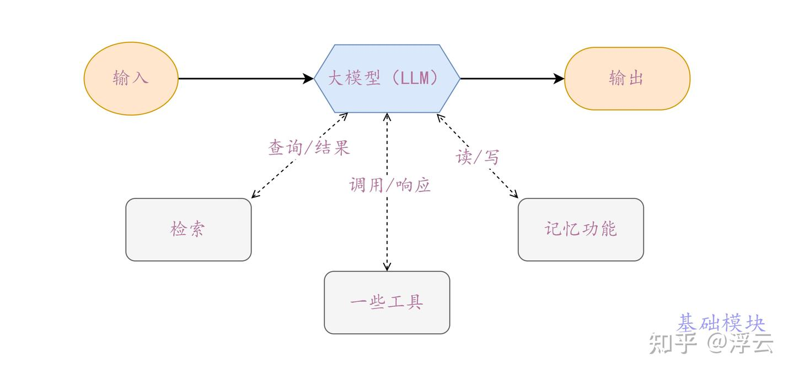
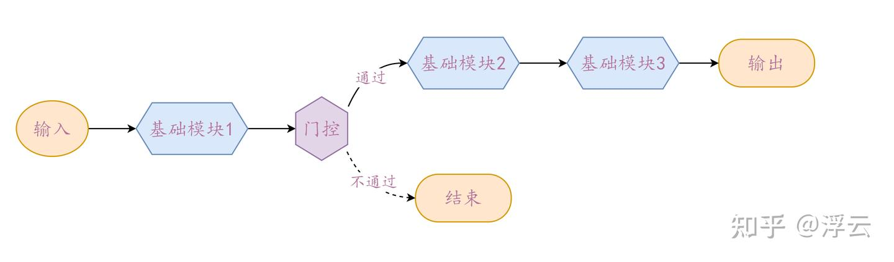
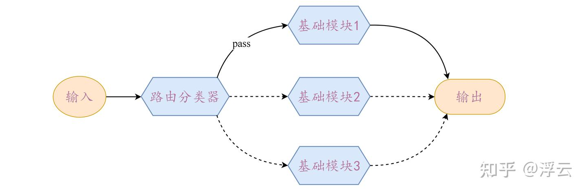
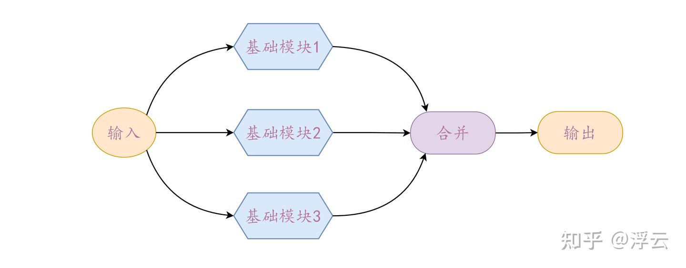
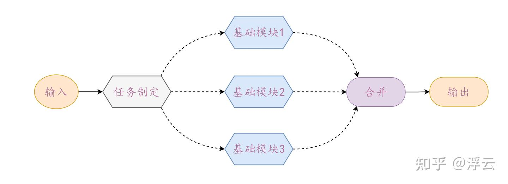
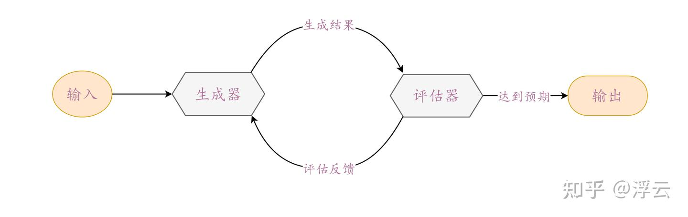
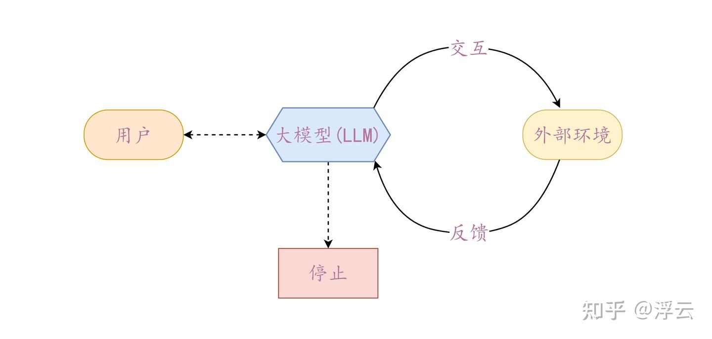

> 作者：浮云　|　赞同 2　|　评论 0　|　[原文](https://zhuanlan.zhihu.com/p/29188080657)

随着Manus的在各大媒体争相报道，Agent这一词也出现在大众视野，那么到底是什么是Agent？

我们要明白，大模型除了基本的聊天对话以外，还可通过构造代理（Agent）及工作流(Workflows)的方式打造一系列解决实际问题的应用，以充分发挥大模型的潜力，本文的目的就在于讲解代理与工作流的概念，提供一个构建两者的基本思路。

### 1 什么是代理及工作流

代理是指 Deepseek、ChatGPT 等大模型能够自我构建解决一个特定任务的流程，以及自我决定在此过程中使用哪些工具。与之类似的还有一个名为工作流（workflows）的系统，工作流是指通过预先设计好的流程与工具来解决某个任务。

两者的区别在于：代理可以自我动态调整，如设定一个任务让其完成，它能够自我决定整个工作流程，决定调用哪些工具，在出错时还能够自我修正，保证最终的任务能够顺利完成，更为灵活。而工作流则需人为提前设定任务完成路线，按部就班的完成每一个环节，不具备代理的动态调整能力。

下面我将从构建模块、再到构建工作流，最后构建代理来逐步讲解，在此过程中系统的复杂程度逐渐加深。

### 2 基础模块

代理及工作流系统的核心模块就是大模型（LLM），在此基础上大模型可通过配备检索功能（如在本地数据库中进行检索来回答问题）、一些工具（如访问访问互联网进行内容搜索）以及记忆（记住之前的对话）等功能，来增加大模型的能力。如下图所示：

目前的大模型很智能，它能够主动利用这些功能，生成特定数据库的查询语句，然后将结果返回给大模型、调用合适的工具然后将响应返回，或者读取为用户生成内容的历史记录来保持上下文回答的一致性，避免用户需要重复输入相同的话语。

### 3 工作流

工作流有许多种类型，但每种工作流都是由基础模块所搭建的，下面我将分别讲解工作流的每一种类型。

### 3.1 提示链类型

提示链类型的工作流较为简单，其形式为：解决一个任务需要多次调用大模型，且每次调用大模型后的得到的输出，充当下一次调用大模型时的输入，如下图所示：

基础模块内部结构为单独的大模型或者大模型配备某种功能。我们可以在这流程中任何中间步骤添加检查（设置一个门控开关），来检查某个中间输出是否为预想值，确保任务流程正确。

当任务可以被分为几个小任务时，比如你需要生成营销文案，先要生成大纲，检查大纲是否满足你的要求，然后根据大纲生成文案，就可使用该类型的工作流。

### 3.2 路由类型

如下图所示：

路由分类器首先对输入进行分类，根据问题种类来决定后续使用哪个基础模块来进行处理，能够保证对于不同类型的问题都有一个专业的解决方案。

这种类型的工作流适用于处理多类型的复杂任务，当输入某个类型任务时，由路由分类器来决定使用专业模块来处理。路由分类器就好比主管，当接到任务后，先判断这个任务适合哪个专业团队来解决，然后再交给其进行处理，避免专业不对口的情况出现。

例如将用户的问题分为简单和复杂两类，然后再分别交给费用低和费用高的大模型进行处理，以此来优化应用的成本与响应速度。

### 3.3 并行化类型

顾名思义，该类型的工作流会由几个基础模块同时处理，再合并成一个输出，如图：

该类型的工作流适用于两种情况，但都是将任务分解为几个小任务交给不同的基础模块进行处理。

-   第一种：分解处理。例如模型防护机制的实现：用户输入问题后，交予一个基础模块来回答，同时交予另一个模块来判断该问题是否违禁，最后合并决定是否需要提交回答。

-   第二种：投票处理，例如代码的审查：输入一段代码后，由几个基础模块来分别聚焦代码不同方面的问题，最后进行汇总。

### 3.4 动态分配类型

在该工作流中，输入问题后，先由一个大模型根据问题制定解决方案，再将其分配给后面的基础模块来执行，并整合它们的结果，如图：

动态分配类型结构与上面的并行化类型相似，但区别在于动态分配类型工作流具备灵活性。

并行化类型工作流处理的问题是特定的，具有固定的解决方案；而动态分配类型工作流，需要先根据不同的输入问题来制定对应的解决方案后，再选取一些基础模块来处理，也就是说可以根据问题来动态调整解决方案，可处理多种任务。

并行化类型可以视为动态分配类型的一个特殊情况——指定一个特定问题。

例如对于一个搜索应用，需要根据问题来决定搜集哪些信息，以及去哪里搜集，然后再执行。

### 3.5 迭代优化类型

在迭代工优化类型工作流中，由一个大模型生成结果，另一个大模型来评估结果是否达到预期，同时给予反馈。如图：

这类工作流非常使用于结果需要多次优化迭代的情况，就像我们写一篇文章，需要反复修改，来达到预期的呈现效果，最后再发表这样一个过程。在实际应用中，可以用这类工作流来构建一个搜索器，生成器用于产生每次的搜索结果，评估器根据已有的信息来评定是否需要再扩大搜索范围，以此来搜集到足够的信息。

### 4 代理

代理的工作是从接收用户的指令或与用户交流开始的。一旦任务明确了，代理就会自己规划和执行，但如果它需要更多信息或者不确定该怎么处理，就会再和用户沟通。

在执行任务时，代理会不断从环境中获取实际信息，比如工具的使用结果或代码的运行情况，用来检查自己的进度。这很重要，因为这样它才知道自己做得对不对。

如果遇到需要特别注意的地方或者遇到困难，代理就会停下来，等用户给它反馈。一般而言，在完成任务后代理会自动停止，但也会设置一些终止条件，比如最多执行多少次，这样可以更好地控制整个过程，避免陷入无限循环之中。如图：

代理适用于一些开放性问题，这些问题的步骤数量难以预测甚至无法预测，且无法预先设定固定的执行路径。同时这也意味着更高的运行成本，以及错误累积的潜在风险，因此开发一个代理需要先评估一下必要性和可行性。

### 5 总结

通过上述对代理与工作流的详细讲解，我们可以看到，大模型的强大能力不仅仅局限于简单的聊天对话，而是可以通过构建代理和工作流，实现复杂任务的自动化解决。

无论是通过提示链、路由、并行化、动态分配还是迭代优化的方式，工作流都能为特定问题提供高效的解决方案。而代理则更进一步，凭借其动态调整和自主决策的能力，能够应对更为复杂和开放性的任务。

在实际应用中，选择合适的工具和架构需要综合考虑任务的性质、复杂程度以及资源成本。工作流适合结构化和流程化的任务，而代理则更适合开放性和动态性强的场景。我们在构建这些系统时，需要权衡灵活性、效率和成本之间的关系，同时也要注意潜在的风险和挑战。

希望以上内容对你构建大模型应用有所启发。

引至[Building Effective AI Agents | Anthropic](https://www.anthropic.com/engineering/building-effective-agents)
