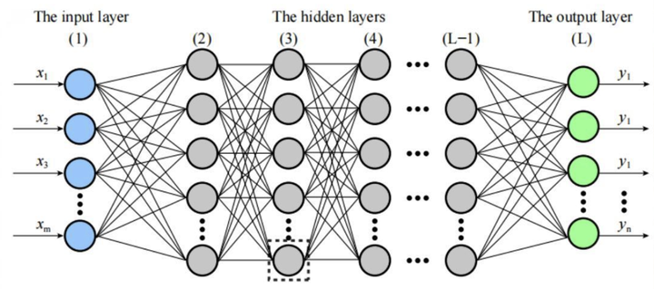

> 作者：果冻虾仁　|　赞同 321　|　评论 10　|　[原文](https://www.zhihu.com/question/1934742507746464833/answer/1993172797049046337)

不是，哥们，真把Transformer全当黑盒啊…虽然深度学习里面不可解释的东西不少，但是Attention的计算多少是有具象化的含义的，所以我们也不能只是死记硬背数学公式。不然你想想这三大件为什么叫Q（Query）、K（Key）、V（Value）而不是A、B、C呢？

## Attention机制就是一个简化的IR系统！

首先要知道的是，这里的KV，和我们在后台开发领域看到的KV真的是相同的含义。比如在搜广推后台服务里面KV结构再熟悉场景不过了，不管是像Redis这样的远程KV，还是通过文件热加载到内存里面的词典，都是KV。Redis里面的Key和Value，代表的是“词典”这种类型的数据结构，而且Redis名字里面的`di`就是`Dictionary`（词典）的缩写，python的dict，C++的map也是类似含义。Key是查询的键，Value就是键对应的值。

再具象化一点，词典这种数据结构，类比到工程领域，也可以叫做索引。

而Query是来源于信息检索（IR）领域的词。搜索引擎是最常见的信息检索系统，我们每天输入的搜索词，在IR和搜索引擎里就被叫做query。而信息检索的过程就是通过**query**从**索引**里面查询到和query相关的doc。咦，索引，你看我们是不是对应上了。不过IR里面的索引是倒排索引，而我们这里的索引没那么复杂，是最简单、最纯粹的索引。所以一言以蔽之：

**Attention机制就是一个简化的IR系统！**

## **矩阵乘法的含义**

在Attention机制中涉及到两次矩阵乘法。我们先来探讨一下矩阵乘法的含义。请注意，矩阵乘法只是加速多项式运算的工程方法，它的本初的含义才是理解的关键。

### 加权求和

那么对于矩阵乘法，我们在哪里比较常见呢？首先就是DNN里面每个层，会先做矩阵乘法，再过激活函数。



图片来自网络

DNN的图一般都省略了的激活函数，看每两层之间密密麻麻的线一般叫做“全连接”，表示的下一层的每个节点都和上一层的每个节点有关，公式如下:

$y_j = \sum_{i=1}^{M} w_{ij} x_i + b_j$

这里的 $x_i$ 表示的是上一层 $x$ 的第 $i$ 个节点， $y_j$ 表示的是下一层 $y$ 的第 $j$ 个节点。 $w_{ij}$是这两层之间任意两节点的的权重， $b_j$ 是 $y_j$ 这个节点的常量偏置。

求和符号可能导致体感不强，我们展开来看，假设 $x$ 有M个节点，相当于：

$y_j = w_{1j} x_1 + w_{2j} x_2 + \cdots + w_{Mj} x_M + b_j$

然后 $y_j$ 只是 $y$ 层的一个节点，如果它有N个节点的时候，这一层的计算就是：

$\begin{align} y_1 &= w_{11} x_1 + w_{21} x_2 + \cdots + w_{M1} x_M + b_1 \\ y_2 &= w_{12} x_1 + w_{22} x_2 + \cdots + w_{M2} x_M + b_2 \\&\vdots\\ y_N &= w_{1N} x_1 + w_{2N} x_2 + \cdots + w_{MN} x_M + b_N \end{align}$

这里一共是做了`M*N`次的两两乘法运算。最朴素的编程实现需要两层for循环。但是得益于SIMD或GPU对向量化运算的支持，`M*N`次的两两乘法运算可以变成一次两两矩阵乘法运算，从而加速运算，减少耗时。

通过这个例子就可以引出矩阵乘法第一个本初的应用：**加权求和**。矩阵乘法只是在简化这个运算。

### 求相似度

上面的例子里面相乘的两个矩阵，一个矩阵是上一层的节点值，另外一个矩阵是权重。这两个矩阵在概念上是不同质的，如果是同质的两个矩阵相乘，有其他含义吗？

当然有含义。在同一个向量空间中，有两个矩阵 $\text{x}$ 和 $\text{y}$ ，表示两组向量，其中一组包含M个向量，另外一组包含N个向量。两个矩阵相乘，就是M个向量和N个向量之间两两求内积，它的结果表示两两向量之间的相似度。这个相似度是内积相似度。

$\text{similarity}(\mathbf{x}, \mathbf{y}) = \mathbf{x}^T \mathbf{y} = \sum_{i=1}^{n} x_i y_i = x_1 y_1 + x_2 y_2 + \cdots + x_n y_n$

还有另外一种归一化后的相似度是用内积相似度再除以两个向量模长的乘积，这被称为余弦（cosine）相似度:

$\text{cosine similarity}(\mathbf{x}, \mathbf{y}) = \frac{\mathbf{x}^T \mathbf{y}}{\|\mathbf{x}\|\|\mathbf{y}\|} = \frac{\sum_{i=1}^{n} x_i y_i}{\sqrt{\sum_{i=1}^{n} x_i^2} \sqrt{\sum_{i=1}^{n} y_i^2}}$

不过本文不会用到余弦相似度，关注内积相似度即可。

如果 $\text{x}$ 矩阵自己和自己（的逆置矩阵）相乘，表示的就是M个向量内，两两之间的相似度了。**请注意这句话，它已经有点摸到Attention中Q和K矩阵相乘的门道了，虽不中，亦不远矣。**

## **Attention拆解**

Attention公式是：

$\text{Attention}(Q, K, V) = \text{softmax}\left( \frac{QK^{T}}{\sqrt{d_k}} \right) V$

拆解成4次运算是：

$\begin{align} S &= QK^T \quad \text{(相似度矩阵)} \\ S' &= \frac{S}{\sqrt{d_k}} \quad \text{(缩放)} \\ A &= \text{softmax}(S') \quad \text{(注意力权重)} \\ \text{Attention}(Q,K,V) &= AV \quad \text{(加权求和)} \end{align} $

其实这里面最本质的就是第一个公式和第四个公式，这是两次矩阵乘法，而中间的缩放和softmax都是实践中的Know-How，不影响本质。这里不展开，本文不关注。

$Q$ 和 $K$ ，是一个句子切成的一组token对应的两个的矩阵，它们的行（token数）和列（维度数，也即 $d_k$ ）都相同。把矩阵还原回向量集合，$Q$ 和 $K$ 里面的向量分别用 $q$ 和 $k$ 表示。每个token都被加工成两个向量，即 $q_i$ 和 $k_i$ 。两个矩阵相乘后，得到了每个token的 $q$ 向量和每个token的 $k$ 向量之间的“相似度”。**OK，这里就用到了上一节提到矩阵乘法第二个本初应用：求相似度**。

为什么这里不直接用一个向量呢？注意这里的相似度我打了引号，因为毕竟Attention做的任务是多种多样的，这里的“相似度”可能理解成“**注意力关注度**”会更好一点。比如：

-   在翻译任务中，源语言某个词的 $q$ 往往与目标语言对应词的 $k$ 关注度最高（Decoder阶段）
-   在问答任务中，问题token的 $q$ 会与答案相关token的 $k$ 关注度更高（Decoder阶段）

这里异化成了 $q$ 和 $k$ 两个向量，相当于刻画了一个“任务”（不准确，仅方便具象化理解）， $q$ 是提炼了一个句子的意图或者目的，用来查询（query）， $k$ 可以当成是“类目”、“主题”、“属性”（不准确，仅方便具象化理解）。在MHA下，其实一个token有多组$q$ 和 $k$，也就是有多个“任务”。也可以继续类比IR和搜索引擎，如果一个词是苹果，那么它表示的到底是水果还是手机呢？所以单纯从token本身是无法区分的，需要通过整个句子来理解。所以相当于给一个句子的每个token，建立了一套索引系统，执行query查询任务，计算出查询和每个“类目”之间的相关度。

而这个相关度，在下面的使用过程中，其实就是一种权重！

对于矩阵 $V$ 里面，也拆解成每个token对应的向量 $v$ ，表示是“类目”（key）对应的具体内容（value）。注意这里的 $k$ 和 $v$ 并不需要显式的建立关联。即不需要像python dict执行这种操作：

```
kv = {}
kv["a"] = "abcd"
kv["b"] = "efg"
```

$k$ 和 $v$ 是通过下标 $i$ 间接关联的。

用前面的查询与类目之间的权重矩阵再和类目下的内容矩阵相乘，就得到了最终这个查询关心的内容组合，每个内容做不同的贡献（权重决定）。**OK，这里就用到了上一节提到矩阵乘法第一个本初应用：加权求和了。**

放到Transformer语境里，有多次Attention操作，Encoder中是Self Attention。在Encoder的Attention结束以后，会做Add&Norm、FFN等逻辑，这些也可以当成是一种实践中的Know-How，最终目的是把输入的自然语言文本编码了一套在整个自然语言（全vocab下的token）生效囊括多种”任务“的向量空间下的索引系统！所以Encoder的输出是在给Decoder贡献新的 $K$ 和 $V$ ，然后Decoder按照它的方式算出 $q$ ，通过自回归地方式，每轮预测下一个token，Decoder的结果是从Encoder这个表示整个自然语言的空间中，最终给vocab中每个token计算出来概率，然后选取概率最大的token，作为结果，或者通过采样算法增加多样性选择其他token。在下一轮把上一轮输出的token，追加到已经输出的token序列以后，对应的 $q$ 也会变化，然后循环往复，直到达到设置的最大token数，或者得到了表示终止标记（EOS）的token。

## 总结

好了，本文当然不能穷尽Transformer架构的全部内容，并且Transformer为什么这么好用，里面也确实有不能完全解释的部分。但是对于Attention中的Q、K、V其实作者的设计思路显而易见。就是从类似IR的系统提取的灵感，本质在做求相似度和加权求和的事情。
