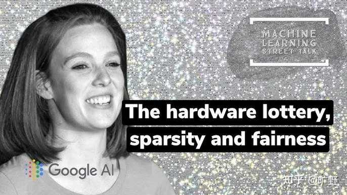

> 作者：旷野　|　赞同 413　|　评论 21　|　[原文](https://www.zhihu.com/question/2046917078884553707/answer/2049836763917587348)

**Transformer真正牛逼的是它聪明到了几乎没有自己的主见。它把架构能省的先验全省了，把所有脏活累活都甩给数据和算力，俗称大力飞砖，然后事实证明它赢了。**

大家一般聊起Transformer之所以牛，必然就会提到self-attention，能建模长距离依赖。但如果只是能看远，那LSTM加个attention早在 2015 年就该活了，凭什么轮到2017年那篇 \*Attention Is All You Need\*迎来AI时代爆炸。

我觉得理解 Transformer你必须先理解它所打败的这俩架构，也就是RNN和LSTM。

RNN处理序列的方式本质上是排队。第100个词要算出来必须先把前面 99 个词一个一个按顺序过完，因为每一步的隐藏状态都依赖上一步。这个架构其实有个很大的短板就是我们在让有上万个计算核心的GPU一个时间步一个时间步地串行算，绝大部分算力在RNN架构上没用到。

Transformer的颠覆就在它把**序列里的依赖关系**和**序列的计算顺序**彻底解耦了。self-attention一次性地把序列里所有位置两两之间的关系全算出来，是一个巨大的矩阵乘法。矩阵乘法又是 GPU 最擅长的。于是一个原本被顺序锁死的任务，变成了一个可以铺满整张显卡、还能横跨成百上千张卡去并行的任务。

所以我的观点是**Transformer首先它是一个对硬件友好的架构，其次才是一个对语言友好的架构。**

它恰好在 GPU 算力开始指数级膨胀、数据开始管够的那个历史节点，提供了一个能把这些资源吃干抹净的结构。Google Deepmind前成员的Sara Hooker有个说法叫**硬件彩票**，就说一个想法能不能成，很大程度上取决于它撞没撞上当时主流硬件的脾气。Transformer显然就是那张中奖彩票。

## 如果从架构上来看，注意力到底在干嘛

我称之为一次可微分的查字典。

机制本身其实没那么玄。

每个 token 进来，会被投影出三个向量：

Query（我想找什么）、Key（我能被什么找到）、Value（我手里有什么）。

然后拿我的 Query 去和序列里所有人的 Key 做点积，点积大就说明对味儿，相关性高。这一排相关性分数过一个 softmax 归一化成权重，最后按权重把所有人的 Value 加权求和。这就是这个 token 这一层的新表示。

可以把它理解成一次**软性的、内容驱动的查表**。传统哈希表是精确匹配，key 对上了才取值；attention 是模糊匹配，按相似度把所有 value 都揉一点过来。

关键在于**内容驱动**这四个字。一个词关注谁，不取决于它在第几个位置，而取决于它的语义内容。代词”它”能自己学会去关注前面那个名词，靠的不是位置规则，是 Q 和 K 在训练中长出来的语义匹配能力。

再进一步，为什么要多头？就是因为一种相似度衡量方式太单薄了。多头相当于让模型同时用好几套不同的找法。一套头盯着语法主谓关系，另一套头盯着指代，再一套看远处的话题词。各看各的，最后拼起来。

2025 年有篇工作把 SDPA 解释成 Entropic Optimal Transport，这个就从第一性原理证明了**softmax attention 的前向传播，其实精确等价于在解一个熵正则化的最优传输问题**。每个 query 发出一单位的注意力质量，在保持最大熵，也就是尽量不偏心、贴近均匀分布的前提下，把这份质量按相似度分配出去。

[https://arxiv.org/abs/2508.08369](https://arxiv.org/abs/2508.08369)

这个就是在说 attention 不是突然想出来的一个启发式公式，它背后其实是个很有数学品味的优化问题。这事顺带还解释了一个很反直觉的结论就是精确的 attention 在数学上**注定**是平方复杂度，因为 softmax 那个全局归一化逼着你必须看完一整行所有的 query-key 相似度才能算对。如果想偷懒搞次平方的精确attention，门儿都没有。这个坑后面还要回来填。

---

回看Transformer之前的那些架构

CNN 这种，骨子里刻着一个强假设就是图像具有平移不变性，局部像素更相关。RNN 刻着另一个假设是·近的东西更重要，信息按时间衰减。这些其实都是归纳偏置，是人类把对世界的理解硬塞进结构里的产物。

Transformer和这些相比你可以发现它几乎是个无主见的架构。去掉位置编码之后，它甚至分不清词的先后顺序，因为对排列是等变的，它对数据本身几乎不做任何结构性假设。理论上它假设的是一张全连接图，任何 token 都可以和任何 token 发生关系。

在小数据上，这是个致命弱点。因为没有先验帮你兜底，就得用海量数据把该学的规律全学一遍，所以 Transformer 是出了名的数据饕餮，在数据管够、算力管够的时候，这个弱先验反而成了杀器，因为它不被任何人为假设束缚，**该学什么偏置，它自己从数据里长出来。**

这其实正好踩在Rich Sutton那篇苦涩的教训的命门上。

纵观 AI 几十年历史，那些靠人类往里塞聪明先验的方法，长期看几乎总是输给那些结构尽量通用、剩下的交给计算和数据的方法。**Transformer就是这条教训活生生的化身**。它改变深度学习最深的地方在它推动整个领域完成了一次范式切换，从我们绞尽脑汁设计巧妙的归纳偏置转向我们设计可扩展的通用底座，然后把规模拉满，大力飞砖。

scaling law之所以能被发现、能被信仰，前提就是有这么一个肯随规模一路涨上去、不轻易撞天花板的架构。

先有 Transformer 这块能无限堆料的地基，才有后面大力出奇迹的所有故事。

而且它顺手还把一堆学科墙给推了。文本、图像、语音、蛋白质结构、时间序列……以前各搞各的，各有各的祖传架构，现在的套路高度统一，管你是什么，把输入切成 token，上面叠 attention。

**一套打通几乎所有模态的架构，这种统一性本身就是一种深刻。**

所以才说他是出现在了一个合适的时代，能够让他一飞冲天。Transformer的毛病其实也一点都不少。

比如什么平方复杂度，Transformer还是无状态的，每生成一个新 token，原则上要把前面所有 token 重新看一遍，它没有 RNN 那种把历史压缩进一个固定大小状态里的能力。

而且因为它天生分不清顺序，位置信息全靠位置编码这种外挂补。于是就有了 RoPE、ALiBi一代代打补丁。可一旦推理时序列长度超过训练时见过的范围，长度外推经常直接崩，这块至今其实都不算真正解决。

它擅长联想,不擅长算。Transformer 在精确检索、联想记忆上其实很强，这恰恰是 Mamba 这类状态空间模型的短板。但你要它做严格的多步算法推理、组合泛化，它经常是在近似和模式匹配，而不是真的在执行一个可靠的算法。著名的逆转诅咒，模型学会”A 是 B却推不出B 是 A，就是这种局限的一个很好的体现。

这就引出最近很火的一个话题就是Mamba 和状态空间模型SSM是不是要把 Transformer给革命了？

SSM给出的确实是一份很诱人的合同，线性复杂度，推理时常数显存，不要 KV cache，处理超长序列那是真香。但它把全部历史压进一个固定大小的状态里，代价就是精确检索、少样本能力和复杂推理普遍弱于同级别的 Transformer。所以你看到的现实走向，不是谁取代谁，而是 Jamba 这种混血儿——拿 SSM 干高效的长程信息混合，拿 attention 干需要精确召回的那部分活儿，各取所长。

即使到了现在，其实Transformer 依然是主角。SSM 正在不断地发展，但还远远没到干翻Transformer的地步。

所以Transformer改变深度学习的真正分量，我认为可以浓缩成一句有点拗口的话：**它用一个近乎没有结构假设、又能无限并行的计算底座，把智能这件事从靠人设计彻底推向了靠规模涌现。**

它肯定不是最聪明的那个架构，甚至从某种意义上说它是最懒的，懒得替你做假设，懒得替你定规则，把判断权统统下放给数据。可偏偏是这份懒，撞上了算力和数据同时井喷的时代，催生了我们今天看到的一切。

它的优点和缺点，其实是一体两面的。因为不做假设，所以又通用又能扩展；也因为不做假设，所以又吃数据又烧算力还甩不掉平方复杂度。

公式会过时，但通用底座 + 规模这个范式，短期内还看不到要退场的意思。

---

如果觉得文章有帮助，欢迎点赞关注一波~

我是旷野，带你探索无尽技术！
