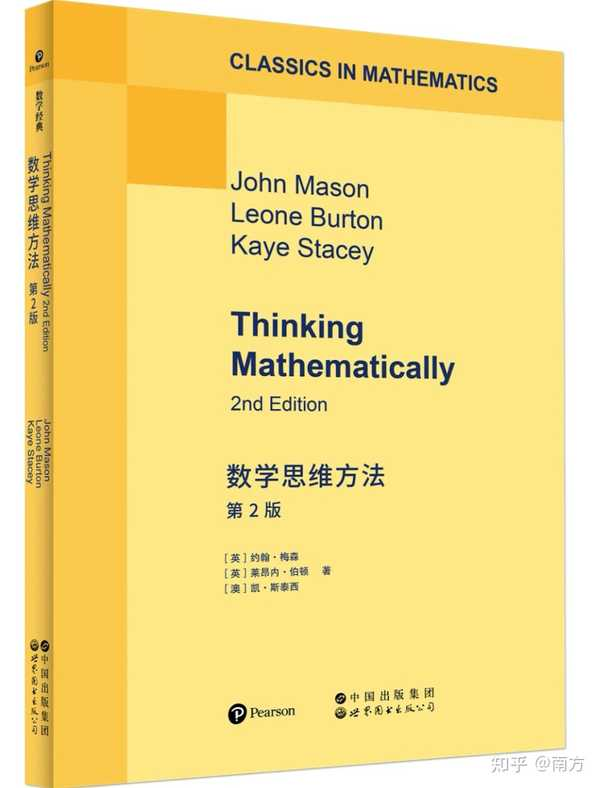
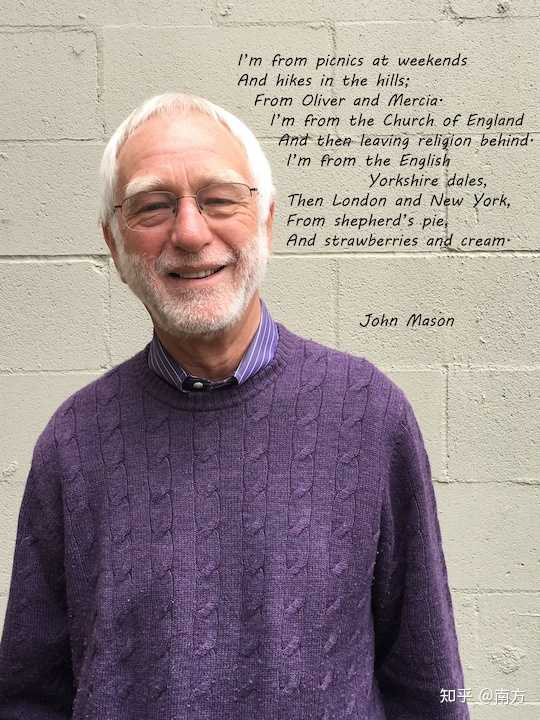
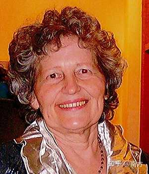

> 作者：南方　|　赞同 0　|　评论 21　|　[原文](https://www.zhihu.com/pin/2076237574495119141)

一本价值被低估的书——《Thinking Mathematically》，作者是John Mason、Leone Burton和Kaye Stacey，三位在数学教育圈子里浸淫多年的老手。书不厚，翻开第一页就知道它跟市面上那些“教你速算”的路子完全不同。它不谈技巧，不押题型，不给你画重点，而是拉着你问一个很别扭的问题：你刚才在思考那道题的时候，你的大脑到底干了什么？

对，它问的是“思考”本身。这问题听起来像脑筋急转弯，但你要真的较真起来，会发现大多数人根本答不上来。我们面对数学题的状态，更像是一种应激反应：看见数字就往上凑，看见“总共”就想加，看见“剩余”就想减，像只被强光晃了眼的兔子，慌不择路地乱蹦。书里把这种状态描述得很贴切——你不是在解题，你是在碰运气。

这本书最大的脾气，就是反复逼你注意三件事：我在做什么？我为什么这么做？这么干到底有没有用？这三个问题简单到让人发笑，可你一旦在解题卡壳时真的拿来问自己，多半会愣住。因为我们平时刷题，十个里面有九个是不过脑子的，像在浓雾里开车，只盯着眼前那一米的路。书里管这叫“无意识的数学行为”。听着像骂人，但你细想，是不是这么回事？

我拿我遇到难题的情形试了试这三个问题。第一问就把我问住了：我到底在做什么？我发现自己其实什么都没做，只是盯着题目发愣，等着某个公式从天而降。第二问更尴尬，我为什么那么做？因为我只记得这一种做法，而且记得不全。第三问——有用吗？显然没用，但我不死心，又用同样的方法重做了一遍，结果还是卡在同一个地方。这件事让我挺震撼的：我平时总怪自己粗心、不努力，却从没想过，我连自己在干什么都不知道。这种感觉就像你反复用同一把钥匙去捅一扇打不开的门，却从没停下来看看门锁的构造。

还有一个概念我觉得挺受用，作者管它叫“特殊化”和“一般化”。说白了就是：先别急着套公式，找几个最舒服、最好算的数字丢进去试试，像小孩踩水坑一样随便踩，踩完了回头看看自己留下的那些脚印有没有共同点。公式不再是从天而降的圣旨，而是你从泥地里一步一步趟出来的那条小路。这么干在考场上未必最快，但好处是，就算你哪天把公式忘得干干净净，你还有本事再走一遍。这种底气，是背一百道例题换不来的。

你可能会说，考试又不等人，哪有时间这么慢慢试？这话不假。但书里玩的本来就不是应试那套游戏。它赌的是另一件事：一旦你尝过从泥地里自己趟出路来的滋味，再回到考场上，你的嗅觉会完全不一样。那些以前像天书一样的题目，会渐渐露出一点熟悉的气息——因为你见过它们没穿公式外套的样子。当然，你要是明天就进考场了，我建议你今晚还是老老实实刷题。但如果你还有三个月、半年，甚至更长的时间可以浪费，那这本书是个值得浪费的对象。说到底，慢慢来反而比较快，这句话在数学这儿，可能真是少数灵验的鸡汤。

说实话，这本书读起来不算轻松。它初版有些年头了，行文带着老派英国学术书那种不慌不忙的劲儿，有的段落你得来回读三遍才咂摸出味道。可转念一想，这不就是数学本来的质地吗？那种需要你停一停、在页边空白处画个箭头、把手机扣过去、老老实实想一会儿的阅读，本身就是书里说的思考训练。你要是只想地铁上刷五分钟就“秒懂数学”，那这本书肯定让你失望。但如果你愿意每天拿出十五分钟，跟着书里的问题像做脑力伸展操一样慢慢拉，不出一个月，你可能会发现自己面对生活里别的麻烦时，也会不由自主地问一句：这事儿我能不能先找个最简单的例子试试？

当然，我也不是要把这本书吹成包治百病的灵丹。它救不了你的微积分考试，也教不会你线性代数。它做的事情更底层，也更顽固：它想在你脑子里装一个监控摄像头，让你看清楚自己思考时的路径，哪儿走岔了，哪儿在兜圈子，哪儿其实可以抄条近路。这个能力一旦长出来，数学只是第一块试金石。

我后来想，我们这代人很多对数学的恨，可能从一开始就恨错了对象。就像你从来没有拿到过那台机器的说明书，上来就被要求操作，按错了就挨罚，时间长了自然见到机器就手抖。这本书干的事情，不过是把那本失踪已久的说明书，从一堆故纸堆里翻出来，掸掸灰，递到你手上。它不保证你从此爱上数学，但它至少能让你明白：你当年不是笨，你只是不知道门往哪边开。

所以如果你还有点不甘心，想跟那个被数学吓了很多年的自己和解一下，不妨拿支笔，翻开这本书，在第一章随便哪个空白处，写几个字——哪怕就写“我看不懂”。没关系。只要你开始注意自己是怎么“不懂”的，那扇门就已经被你推开一条缝了。

[#数学](https://www.zhihu.com/topic/19554091) [#数学思维](https://www.zhihu.com/topic/20518435) [#数学学习](https://www.zhihu.com/topic/19953930) [#数学基础](https://www.zhihu.com/topic/21322940) [#数学思维的新方法（书籍）](https://www.zhihu.com/topic/20127397) [#国外教材](https://www.zhihu.com/topic/19809943)

