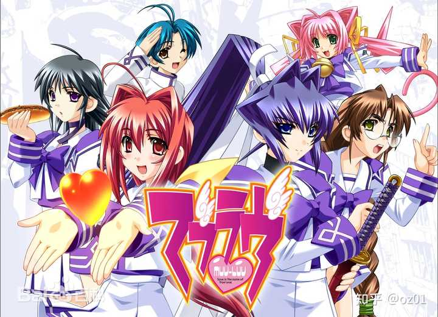
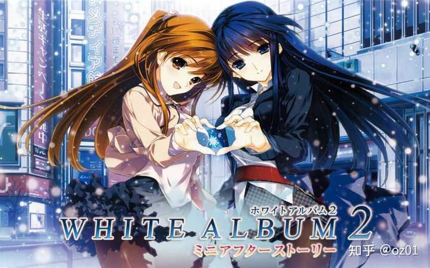
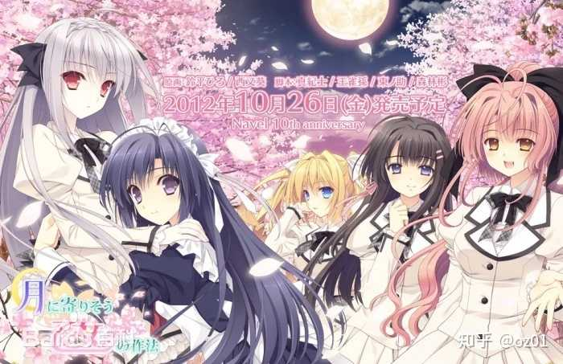
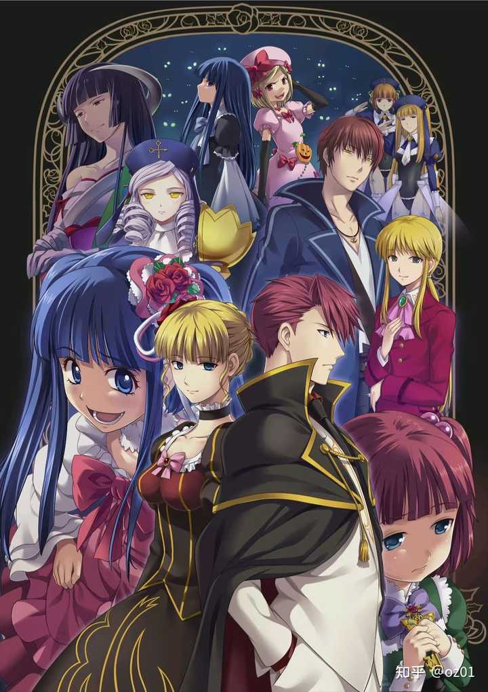
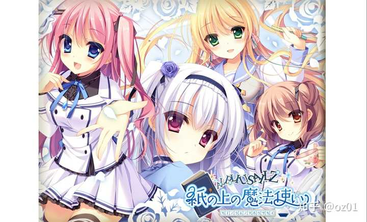

> 作者：oz01　|　赞同 227　|　评论 43　|　[原文](https://www.zhihu.com/question/56822660/answer/66622165820)

“十二魔器”“十二神器”前面还有个定语：坑新

也就是说这24个游戏是专门坑新人博得老gal玩家嘲笑的榜单。

最近几年我发现有很多未成年女性玩家接触12神魔器，她们都以为12神魔器只是夹杂奇怪内容的优秀文学作品……说实话这就过分了，向未成年人传播这玩意都应该判刑，更别说事实上12神魔器里面充斥了大量望文生义的玩意，最典型的例子：昆虫检查

这游戏我估计整个知乎就只有我有正版，非常无聊，没错我说的是这游戏非常无聊，剧本几乎就是没有，内容不够刺激这才是最要命的，作为拔作都不合格，这个系列本身就是走超低成本的路子，原本知名度极低，正常来说其绘师“千叶产地”应该比这个游戏知名度高的多，千叶老师很擅长画不可名状又很工口的怪物，在人外题材方面经常有比较稳定的发挥，但是昆虫检查里没有他最擅长的部分，令人非常失望，尤其剧情方面，也是非常稳定的完全没有。你说我为啥买正版，因为我买了一整套千叶老师相关的实体商品，总共只花了5000日元，里面就有这玩意，以及这个系列的几个很无聊的游戏。

冲绳xx岛：与其说报复社会不如说报复拔作玩家的钱包，这都报复钱包了你还指望它有什么内容？入选原因绝对是因为标题。

女装山脉：废萌，就算奔着捅皮炎子也不要碰这个，催眠级别的无聊，入选原因绝对是因为标题。

媚肉之香：剧本水平在拔作里尚可，剧情合理性还是很值得吐槽，但是，入选原因绝对还是因为标题。

euphoria：这个倒是还可以，猎奇系的，名气不小，不过你要说它剧本水平有多高那还是算了吧。入选原因就是为了让新玩家看到恶心的内容受到心理伤害。

3days/11eyes：剧情佳作，算是正常战斗系gal的范围，如果fate初代血腥度是10，那么这俩游戏大概20，所以晕血就不要碰了。

素晴日：在正常的gal排行榜里都非常靠前，但是题材很怪异，就算不考虑工口方面，也不推荐未成年人接触，人生经历不够的话只会觉得这游戏很催眠。

君与彼女与彼女之恋：水平不错的猎奇系gal，水平你要说多高的话我觉得也未必，不过至少不是坑人的游戏。

妹调教日记：剧情灌水级别的拔作，不要浪费时间。

沙耶之歌：知名度很高的猎奇gal，毕竟是互联网不发达时代的游戏，那时候大多数人对克苏鲁神话不熟悉，现在来看可能会觉得有些既视感，不过我看到不少未成年女性玩家吐槽里面一些细节……拜托，不要把这玩意当正经文学去看待，它没这个高度。

谁杀死了知更鸟：没碰过，普遍评价较高，和上面这些游戏比起来这游戏算是比较正经的。

触祭之都：剧情是灌水级别的拔作，入选原因绝对是有人只看了cg发现有几个吓人的就塞进来了，正常你玩不到通关就该被催眠了。

肢体を洗う：有些猎奇的拔作，作为拔作还可以，剧情并不是很有趣，上古游戏，现在的电脑要运行可能不太容易。

蟲愛でる少女：入选原因绝对是因为有人只看了cg发现有几个吓人的就塞进来了，剧情其实不错。

和怪物谈恋爱吧：坑你没商量的玩意，游戏开发者的精神状态绝对是很正常的，因为这游戏开发的目的就是为了恶搞，但是推荐这个的人那是绝对的就是要恶心人。

我觉得就算是玩gal，也要树立正确的价值观，要知道什么样的gal是值得玩的，什么样的gal不要浪费时间，下面推荐几个真正优秀的gal：

Muv-luv Alternative：

战争系剧情，我认为任何人玩gal，必须要从这个游戏开始，你要是觉得画风不好看放弃了、因为唯一的猎奇内容被吓到了，觉得太直男味太无聊了，那么不推荐你入坑gal，因为绝大多数gal都是画风、猎奇、直男味三个雷点至少占一个，这都是小问题，绝大多数gal开头有几个小时极度无聊，几乎是gal通病，Muv-luv Alternative好歹开头没那么无聊。此游戏有前作，但是不接触前作也无所谓的。

白色相簿2：

言情系剧情大概算是顶点了吧，吊打一众言情电视剧的水平，这个要是玩不下去，那么大多数gal可能你都接受不了。注意动画版其实之翻拍了序，90%的内容都在游戏里。

近月少女的礼仪系列：

校园系废萌，有人说不算废萌，算不算都无所谓了，不过朝日是真的萌，总之萌系gal里这个系列大概是最优秀的，是不是有更优秀的我不知道，反正这个系列是知名度最高的，资源也最容易找到。

海猫鸣泣之时

前几个小时极度无聊，新玩家很难不弃坑，剧情水平是整个二次元圈第一梯队，然后这游戏有很多争议，因为最开始它是一章节一章节发布的，最早大家都以为是推理剧，结果中途就变得非常奇怪，最后就不说了避免剧透，不过剧本水平是毋庸置疑的。

纸上魔法使：

看着很像废萌，前几个小时也很像废萌，但是galgame吧常青树绝非浪得虚名。

Baldr Sky Dive1+2：

机甲战斗类游戏，和muv luv不同，你大概需要一个游戏手柄。
